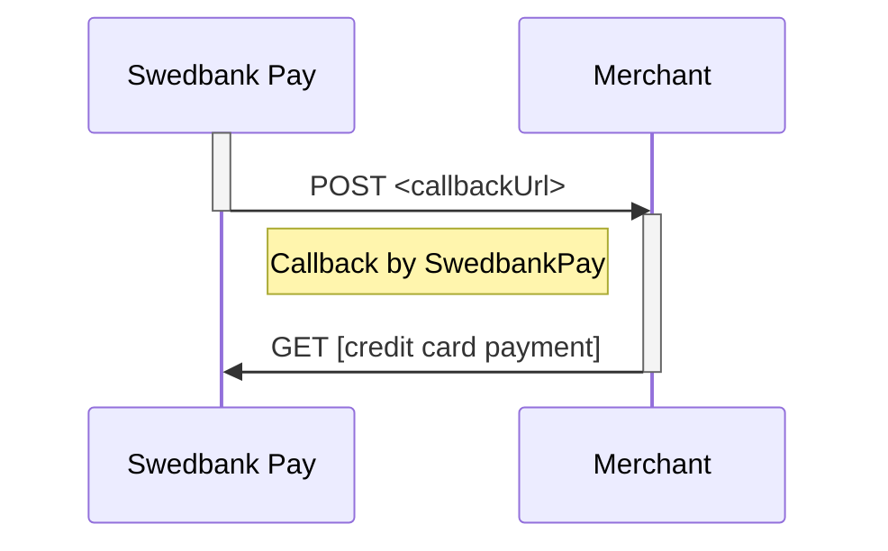

# developer.swedbankpay.com

[![Swedbank Pay Developer Portal][opengraph-image]][dev-portal]

[![Test][gh-actions-badge]][gh-actions]
![Last Master Commit][last-commit-badge]

This is the repository for [Swedbank Pay Developer Portal][swp-dp]. It is run as a
[Jekyll][jekyll] website on [GitHub Pages][gh-pages].

## Contributing

Bug reports and pull requests are welcome on [GitHub][github]. This project is
intended to be a safe, welcoming space for collaboration, and contributors
are expected to adhere to the [Contributor Covenant][ccov] code of conduct as
well as [Swedbank Pay Open Source Development Guidelines][dev-guidelines].

If you would like to perform development on the Developer Portal source code,
you have two alternatives: to edit files directly through the GitHub website
or to fork or clone the repository. These alternatives are described below.

### Edit On GitHub

It's possible to edit existing pages directly on GitHub. The easiest way to go
about doing that is finding the page you want to edit on
[developer.swedbankpay.com][dev-portal] and clicking the GitHub icon in the
upper right corner. It will take you to the corresponding Markdown file inside
this repository, which you can then [edit through the GitHub website][gh-edit].

### Fork or Clone

If you want to add new pages or do larger changes, working on the repository
locally in an editor and previewing the result in a web browser is better. To
do that, you will have to fork or clone the repository.

If you **don't have write-access** to this repository, you need to [fork][fork]
it and then [create a pull request from the fork][fork-pr] in order to
contribute.

If you **have write-access** to this repository (you know who you are), you
should [clone][clone] it and submit pull requests from branches you push
directly within this repository itself.

After forking or cloning the repository, there's a few things you should set
up locally before you can start coding, so please read on.

#### Git Hooks

After forking or cloning the repository, you need to set up the necessary
Git hooks that ensure adherence to our development process.

Open a terminal in the root of the project repository and run the following:

```sh
git config core.hooksPath .githooks
```

This will set up a few checks to ensure your branch name and commit messages
follow our standards.

#### Spin It Up

Once the Git hooks are set up, you have two options for how to spin up the
developer portal locally; [docker][docker], or [manual install][manual-install].
The Docker installation is recommended for its simplicity.

##### Docker

1.  Install [docker][docker-install] for your operating system.
2.  Open up a terminal and `cd` into the directory in which you cloned (your
    possible fork of) this repository.
3.  Run `docker-compose up`.
4.  After pulling the required Docker image and building the site, it should be
    accessible on `http://localhost:4000`*.

*Ignore the fact that `Server address: http://0.0.0.0:4000` is written to the
console; Jekyll is not aware of that it is executed within a Docker container.

##### Manual Install

1.  Jekyll is written in [Ruby][ruby], so you'll need to download and install
    that. If you're installing on Windows, choose setup with DevKit.
2.  To install the [Ruby Gems][gems] this web site requires, you first need to
    install [Bundler][bundler].
3.  Install [Graphviz][graphviz], this will require Java.
4.  Once Ruby, Bundler, and Graphviz is in place, type `bundle install` inside
    the root folder of this repository.
5.  Run `bundle exec jekyll serve` to start the website.
6.  Open `http://localhost:4000` in a browser.

##### Visual Studio Code Plugins

We recommend [Visual Studio Code][vs-code] as an editor when developing on the
developer portal. To ensure quality, structure and consistency between different
developers and writers, we use a few Visual Studio Code plugins that you should
install and configure:

*   [markdownlint][vsc-md-lint], to lint Markdown files according to our defined
    set of rules.
*   [Markdown Preview Enhanced][vsc-md-preview], to render Markdown to HTML in a
    preview window.
*   [Mermaid Markdown Syntax Highlighting][vsc-md-mermaid], to give syntax
    highlighting to [Mermaid][mermaid] diagrams in Markdown files.
*   [Markdown All in One][vsc-md-all-in-one], to enable a plethora of Markdown
    features, most importantly formatting of Markdown tables with Visual Studio
    Code's built-in format functionality.
*   [Rewrap][vsc-rewrap], to make line-breaking text at 80 characters easier.
*   [Pretty js/json][vsc-pretty-json] to format selected JSON snippets in code
    examples.
*   [Liquid][vsc-liquid] for syntax highlighting of [Liquid][liquid] code.

Also in Visual Studio Code, [set up a ruler at 80 characters][vsc-ruler]
by adding `"editor.rulers": [80]` to its configuration.

## Good to know

Following is a small guide to good to know features and conventions for writing
and contributing to the documentation.

### Use constants

We have a list of expanding constants that are available on all pages.
It can be found in [the config file][config-yml].
These are found under `defaults.values:` and should be used where fitting.

1.  `paymentId`: this is used to replace the `GUID` of the payment ID in request
    and response examples.
2.  `transactionId`: this is used to replace the `GUID` of the transaction ID in
    request and response examples.
3.  `paymentOrderId`:this is used to replace the `GUID` of the paymentOrder ID in
    request and response examples.
4.  `merchantId`:this is used to replace the `GUID` of the merchant ID in request
    and response examples.
5.  `paymentToken`: This is used to replace the payment token `GUID` for request
    and response examples.
6.  `apiHost`: This constant is used as a replacement for the API host name in requests and
    responses.
7.  `apiUrl`: This constant is used as a replacement for the API URL in request and
    response examples.
8.  `frontEndUrl`: This constant is used as a replacement for frontend URLs in request
    and response examples.

Using these constants makes our documentation more resilient to change and makes
it somewhat easier to read.
Having only variables defined a singular place makes it possible to change
environments and such in the future if a thing is wanted.

All constants are available trough the `page` variable.
Example:

```http
GET /psp/paymentorders/{{ page.payment_order_id }}/ HTTP/1.1
Host: {{ page.api_host }}
```

### Use includes

In the folder `_includes` you'll find all ready to be used includes made in the
project so far.
These are made to be as reusable as possible with names being as explicit for
its usage as possible.

Example showing how to use a simple include:

```markdown

```

Some includes can also take variables, if they do this is defined at the
beginning of the file using the following syntax.

```markdown

```

This assigns `"authorization"` to the variable `transaction` by default if it
isn't passed in via the include.

```markdown

```

Read more about passing arguments and how includes work [here][liquid-includes].

### Mermaid

Having diagrams easy to read in Markdown as well as rendered in HTML makes
maintaining it easier.
Using [mermaid-js][mermaid-github] to generate sequence diagrams is easy using
our build system or the [Mermaid Live Editor][mermaid-live-editor].



### Conventions

*   **Indentation** is set to 4 spaces across all code examples, regardless of
    language. Please ensure that you format everything accordingly.
*   When fictuous **domain names** are used in code examples, only
    `example.com`, `example.net` or `example.org` should be used.
    `test-dummy.net` and similar "funny" domain names are strongly discouraged.
*   When describing operations performed towards a URL, reference the name
    (`rel`) of the operation instead of stating the URL explicitly, in order to
    avoid the encouragement of client-side URL building.

## License

This website is available as open source under the terms of the
[MIT License][license].

[bundler]: https://bundler.io/
[ccov]: http://contributor-covenant.org
[clone]: https://help.github.com/articles/cloning-a-repository/
[config-yml]: _config.yml
[dev-guidelines]: https://developer.swedbankpay.com/resources/development-guidelines
[dev-portal]: https://developer.swedbankpay.com/
[docker-install]: https://www.docker.com/
[docker]: #docker
[fork-pr]: https://docs.github.com/en/github/collaborating-with-issues-and-pull-requests/creating-a-pull-request-from-a-fork
[fork]: https://docs.github.com/en/github/getting-started-with-github/fork-a-repo
[gems]: https://rubygems.org/
[gh-actions-badge]: https://github.com/SwedbankPay/developer.swedbankpay.com/workflows/Test/badge.svg
[gh-actions]: https://github.com/SwedbankPay/developer.swedbankpay.com/actions
[gh-edit]: https://docs.github.com/en/github/managing-files-in-a-repository/editing-files-in-your-repository
[gh-pages]: https://pages.github.com/
[github]: https://github.com/SwedbankPay/developer.swedbankpay.com/
[graphviz]: https://graphviz.org/download/
[jekyll]: https://jekyllrb.com/
[last-commit-badge]: https://img.shields.io/github/last-commit/SwedbankPay/developer.swedbankpay.com/master
[license]: https://opensource.org/licenses/MIT
[liquid-includes]: https://jekyllrb.com/docs/includes/
[liquid]: https://jekyllrb.com/docs/liquid/
[manual-install]: #manual-install
[mermaid-github]: https://github.com/mermaid-js/mermaid
[mermaid-live-editor]: https://mermaidjs.github.io/mermaid-live-editor
[mermaid]: https://mermaid-js.github.io/mermaid/
[opengraph-image]: https://repository-images.githubusercontent.com/210605116/56fb0c00-53e9-11ea-9c5f-7fb8685cce87
[ruby]: https://www.ruby-lang.org/en/
[swp-dp]: https://developer.swedbankpay.com
[vs-code]: https://code.visualstudio.com/
[vsc-liquid]: https://marketplace.visualstudio.com/items?itemName=sissel.shopify-liquid
[vsc-md-all-in-one]: https://marketplace.visualstudio.com/items?itemName=yzhang.markdown-all-in-one
[vsc-md-lint]: https://marketplace.visualstudio.com/items?itemName=DavidAnson.vscode-markdownlint
[vsc-md-mermaid]: https://marketplace.visualstudio.com/items?itemName=bpruitt-goddard.mermaid-markdown-syntax-highlighting
[vsc-md-preview]: https://marketplace.visualstudio.com/items?itemName=shd101wyy.markdown-preview-enhanced
[vsc-pretty-json]: https://marketplace.visualstudio.com/items?itemName=supperchong.pretty-json
[vsc-rewrap]: https://marketplace.visualstudio.com/items?itemName=stkb.rewrap
[vsc-ruler]: https://stackoverflow.com/a/29972073/61818
