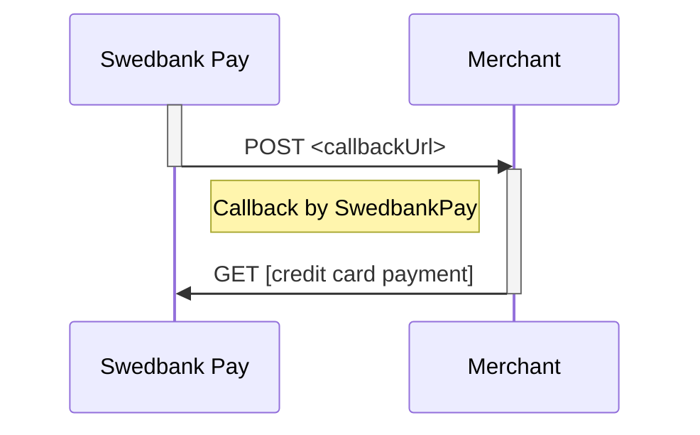

# developer.swedbankpay.com

[![Swedbank Pay Developer Portal][dev-portal-image]][dev-portal]

[![GitHub Actions Status][gh-actions-badge]][gh-actions]
![Last Master Commit][last-commit-badge]

This is the repository for [Swedbank Pay Developer Portal][swp-dp]. It is run as a
[Jekyll][jekyll] website on [GitHub Pages][gh-pages].

## Contributing

Bug reports and pull requests are welcome on [GitHub][github]. This project is
intended to be a safe, welcoming space for collaboration, and contributors
are expected to adhere to the [Contributor Covenant][ccov] code of conduct as
well as [Swedbank Pay Open Source Development Guidelines][dev-guidelines].

## Usage

To view this website, browse to [developer.swedbankpay.com][swp-dp]. If you'd
like to host it locally on your computer, you need to do the following:

1. [Clone this repository][cloning].
2. Jekyll is written in [Ruby][ruby], so you'll need to download and install
   that. If you're installing on Windows, choose setup with DevKit.
3. To install the [Ruby Gems][gems] this web site requires, you first need to
   install [Bundler][bundler].
4. Once Ruby and Bundler is in place, type `bundle install` inside the root
   folder of this repository.
5. Run `bundle exec jekyll serve` to start the website.
6. Open `http://localhost:4000` in a browser.
7. In Visual Studio Code, install the following plugins:
   * `davidanson.vscode-markdownlint`, to lint Markdown files according to our
     defined set of rules.
   * `shd101wyy.markdown-preview-enhanced`, to render Markdown to HTML in a
     preview window.
   * `bpruitt-goddard.mermaid-markdown-syntax-highlighting`, to give syntax
     highlighting to Mermaid diagrams in Markdown files.
   * `yzhang.markdown-all-in-one`, to enable a plethora of Markdown features,
     most importantly formatting of Markdown tables with VS Code's built-in
     format functionality.
   * `stkb.rewrap`, to make line-breaking text at 80 characters easier.
   * `supperchong.pretty-json` to format selected JSON snippets in code
     examples.
8. Also in Visual Studio Code, [set up a ruler at 80 characters][vsc-ruler]
   by adding `"editor.rulers": [80]` to its configuration.

## Good to know

Following is a small guide to good to know features and conventions for writing
and contributing to the documentation.

### Use constants

We have a list of expanding constants that are available on all pages.
It can be found in [the config file][config-yml].
These are found under `defaults.values:` and should be used where fitting.

1. `paymentId`: this is used to replace the `GUID` of the payment ID in request
   and response examples.
2. `transactionId`: this is used to replace the `GUID` of the transaction ID in
   request and response examples.
3. `paymentOrderId`:this is used to replace the `GUID` of the paymentOrder ID in
   request and response examples.
4. `merchantId`:this is used to replace the `GUID` of the merchant ID in request
   and response examples.
5. `paymentToken`: This is used to replace the payment token `GUID` for request
   and response examples.
6. `apiHost`: This constant is used as a replacement for the API host name in requests and
   responses.
7. `apiUrl`: This constant is used as a replacement for the API URL in request and
   response examples.
8. `frontEndUrl`: This constant is used as a replacement for frontend URLs in request
   and response examples.

Using these constants makes our documentation more resilient to change and makes
it somewhat easier to read.
Having only variables defined a singular place makes it possible to change
environments and such in the future if a thing is wanted.

All constants are available trough the `page` variable.
Example:

```http
GET /psp/paymentorders/{{ page.paymentOrderId }}/ HTTP/1.1
Host: {{ page.apiHost }}
```

### Use includes

In the folder `_includes` you'll find all ready to be used includes made in the
project so far.
These are made to be as reusable as possible with names being as explicit for
its usage as possible.

Example showing how to use a simple include:

```markdown

```

Some includes can also take variables, if they do this is defined at the
beginning of the file using the following syntax.

```markdown

```

This assigns `"paymentOrder"` to the variable `instrument` by default if it
isn't passed in via the include.

```markdown

```

Read more about passing arguments and how includes work [here][liquid-includes].

### Mermaid

Having diagrams easy to read in Markdown as well as rendered in HTML makes
maintaining it easier.
Using [mermaid-js][mermaid-github] to generate sequence diagrams is easy using
our build system or the [Mermaid Live Editor][mermaid-live-editor].



### Conventions

* **Indentation** is set to 4 spaces across all code examples, regardless of
  language. Please ensure that you format everything accordingly.
* When fictuous **domain names** are used in code examples, only `example.com`,
  `example.net` or `example.org` should be used. `test-dummy.net` and similar
  "funny" domain names are strongly discouraged.
* When describing operations performed towards a URL, reference the name (`rel`)
  of the operation instead of stating the URL explicitly, in order to avoid the
  encouragement of client-side URL building.

## License

This website is available as open source under the terms of the
[MIT License][license].

[bundler]: https://bundler.io/
[ccov]: http://contributor-covenant.org
[cloning]: https://help.github.com/articles/cloning-a-repository/
[config-yml]: _config.yml
[dev-guidelines]: https://developer.swedbankpay.com/resources/development-guidelines
[dev-portal-image]: ./assets/img/swedbank-pay-developer-portal.png
[dev-portal]: https://developer.swedbankpay.com/
[gems]: https://rubygems.org/
[gh-actions-badge]: https://github.com/SwedbankPay/developer.swedbankpay.com/workflows/jekyll-build/badge.svg
[gh-actions]: https://github.com/SwedbankPay/developer.swedbankpay.com/actions
[gh-pages]: https://pages.github.com/
[github]: https://github.com/SwedbankPay/developer.swedbankpay.com/
[jekyll]: https://jekyllrb.com/
[last-commit-badge]: https://img.shields.io/github/last-commit/SwedbankPay/developer.swedbankpay.com/master
[license]: https://opensource.org/licenses/MIT
[liquid-includes]: https://jekyllrb.com/docs/includes/
[mermaid-github]: https://github.com/mermaid-js/mermaid
[mermaid-live-editor]: https://mermaidjs.github.io/mermaid-live-editor
[ruby]: https://www.ruby-lang.org/en/
[swp-dp]: https://developer.swedbankpay.com
[vsc-ruler]: https://stackoverflow.com/a/29972073/61818
