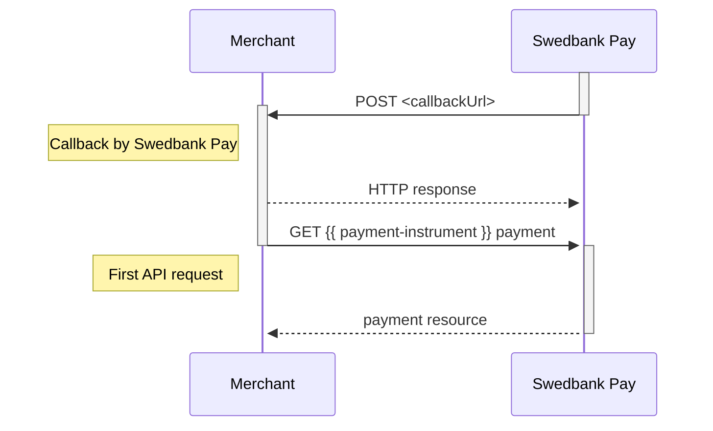




## Callback

When a change or update from the back-end system are made on a payment or
transaction, Swedbank Pay will perform a callback to inform the payee (merchant)
about this update.

* Setting a `callbackUrl` in the HTTP `POST` API is optional, but highly
  recommended. If a payer closes the browser window, a network error or
  something else happens that prevents the payer from being redirect from
  Swedbank Pay back to the merchant website, the callback is what ensures that
  you receive information about what happened with the payment.
* When a change or update from the back-end system are made on a payment or
  transaction, Swedbank Pay will perform an asynchronous server-to-server
  callback to inform the payee (merchant) about this update.
* Swedbank Pay will make an HTTP `POST` to the `callbackUrl` that was specified
  when the payee (merchant) created the payment.
* When the `callbackUrl` receives such a callback, an `HTTP` `GET` request must
  be made on the payment or on the transaction. The retrieved payment or
  transaction resource will give you the necessary information about the recent
  change/update.
* The callback will be retried if it fails. Below are the retry timings, in
  seconds from the initial transaction time:
  * 30 seconds
  * 60 seconds
  * 360 seconds
  * 432 seconds
  * 864 seconds
  * 1265 seconds
* The callback is sent from the following IP address: `82.115.146.1`
* A callback should return a `200 OK` response.


{:.code-header}
**Payment Order Callback**

```js
{
    "paymentOrder": {
        "id": "/psp/paymentorders/{{ page.paymentOrderId }}",
        "instrument": "{{ payment-instrument }}"
    },
    "payment": {
        "id": "/psp/{{ payment-instrument }}/payments/{{ page.paymentId }}",
        "number": 222222222
    },
    "transaction": {
        "id": "/psp/{{ payment-instrument }}/payments/{{ page.paymentId }}/<transaction type>/{{ page.transactionId }}",
        "number": 333333333
    }
}
```


{:.code-header}
**Payment Instrument Callback**

```js
{
    "payment": {
        "id": "/psp/{{ payment-instrument }}/payments/{{ page.paymentId }}",
        "number": 222222222
    },
    "transaction": {
        "id": "/psp/{{ payment-instrument }}/payments/{{ page.paymentId }}/<transaction type>/{{ page.transactionId }}",
        "number": 333333333
    }
}
```



{:.table .table-striped}
| Parameter            | Description                                                |
| :------------------- | :--------------------------------------------------------- |
| `<transaction type>` | `authorizations`, `captures`, `cancellations`, `reversals` |

The sequence diagram below shows the HTTP `POST` you will receive from Swedbank
Pay, and the two `GET` requests that you make to get the updated status.


