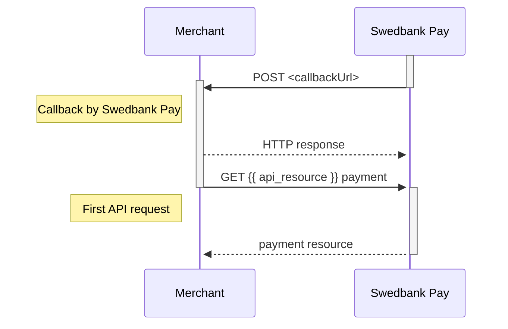



## Callback



When a change or update from the back-end system are made on a payment or
transaction, Swedbank Pay will perform a callback to inform the payee (merchant)
about this update.

Providing a `callbackUrl` in `POST` requests is **mandatory**. Below we provide
three example scenarios of why this is important:

1.  If the payer closes the payment window, the merchant will never know what
    happened to the payment if `callbackUrl` is not implemented.
2.  If the payer stops up in a payment app such as Vipps or Swish, the payer
    will never come back to the merchant. This means that the merchant won't
    know what happened to the payment unless `callbackUrl` is implemented.
3.  If a payer experiences a network error or something else happens that
    prevents the payer from being redirected from Swedbank Pay back to the
    merchant website, the `callbackUrl` is what ensures that you receive the
    information about what happened with the payment.

*   When a change or update from the back-end system are made on a payment or
    transaction, Swedbank Pay will perform an asynchronous server-to-server
    callback to inform the payee (merchant) about this update.
*   It is important to know that the callback is asynchronous, and not
    real-time. As we can’t guarantee when you get the callback, there could be a
    delay between when the payer is returned back to the merchant and when the
    callback arrives. If the merchant chooses to wait for the callback, the
    payer might be left at the merchant’s page until the response comes.
*   Swedbank Pay will make an HTTP `POST` to the `callbackUrl` that was
    specified when the payee (merchant) created the payment.
*   When the `callbackUrl` receives such a callback, an HTTP `GET` request
    must be made on the payment or on the transaction. The retrieved payment or
    transaction resource will give you the necessary information about the
    recent change/update.
*   As it isn't scaled to be a primary source of updates, no given response time
    can be guaranteed, and a callback might fail. It will be retried if that
    should happen. Below are the retry timings, in seconds from the initial
    transaction time:
    *   30 seconds
    *   60 seconds
    *   360 seconds
    *   432 seconds
    *   864 seconds
    *   1265 seconds
*   The callback is sent from the following IP address: `82.115.146.1`
*   A callback should return a `200 OK` response.

To understand the nature of the callback, the type of transaction, its status,
etc., you need to perform a `GET` request on the received URI and inspect the
response. The transaction type or any other information can not and should not
be inferred from the URI. See [URI usage][uri-usage] for more information.


{:.code-view-header}
**Payment Order Callback**

```json
{
    "paymentorder": {
        "id": "/psp/{{ api_resource }}/{{ page.payment_id }}",
        "instrument": "{{ api_resource }}"
    },
    "payment": {
        "id": "/psp/{{ api_resource }}/payments/{{ page.payment_id }}",
        "number": 222222222
    },
    "transaction": {
        "id": "/psp/{{ api_resource }}/payments/{{ page.payment_id }}/authorizations/{{ page.transaction_id }}",
        "number": 333333333
    }
}
```


{:.code-view-header}
**Payment Instrument Callback**

```json
{
    "payment": {
        "id": "/psp/{{ api_resource }}/payments/{{ page.payment_id }}",
        "number": 222222222
    },
    "transaction": {
        "id": "/psp/{{ api_resource }}/payments/{{ page.payment_id }}/authorizations/{{ page.transaction_id }}",
        "number": 333333333
    }
}
```



When performing an HTTP `GET` request towards the URI found in the
`transaction.id` field of the callback, the response is going to look
something like the abbreviated example provided below.



The sequence diagram below shows the HTTP `POST` you will receive from Swedbank
Pay, and the two `GET` requests that you make to get the updated status.



[uri-usage]: /introduction#uri-usage
