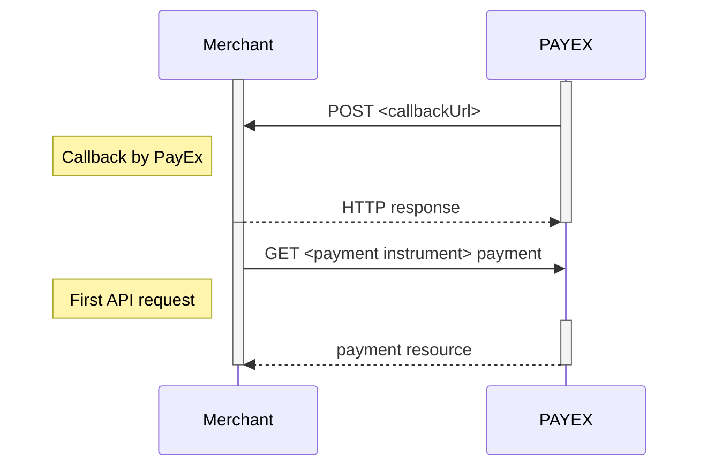

## Callback

When a change or update from the back-end system are made on a payment or
transaction, PayEx will perform a callback to inform the payee (merchant)
about this update.

* Setting a `callbackUrl` in the HTTP `POST` API is optional,
  but highly recommended. If a payer closes the browser window,
  a network error or something else happens that prevents the payer from
  being redirect from PayEx back to the merchant website, the callback is
  what ensures that you receive information about what happened with the payment.
* When a change or update from the back-end system are made on a payment or
  transaction, PayEx will perform a callback to inform the payee
  (merchant) about this update.
* PayEx will make an HTTP `POST` to the `callbackUrl` that was specified when
  the payee (merchant) created the payment.
* When the `callbackUrl` receives such a callback, an `HTTP` `GET` request
  must be made on the payment or on the transaction.
  The retrieved payment or transaction resource will give you the necessary
  information about the recent change/update.
* The callback will be retried if it fails.
  Below are the retry timings, in milliseconds
  from the initial transaction time:
  * 30000 ms
  * 60000 ms
  * 360000 ms
  * 432000 ms
  * 864000 ms
  * 1265464 ms
* The callback is sent from the following IP address: `82.115.146.1`

{:.code-header}
**Payment Instrument Callback**

```js
{
   "payment": {
       "id": "/psp/<payment instrument>/payments/<payment-id>",
       "number": 222222222
    },
   "transaction": {
       "id": "/psp/<payment instrument>/payments/<payment-id>/<transaction type>/<transaction-id>",
       "number": 333333333
    }
}
```

{:.code-header}
**Payment Order Callback**

```js
{
    "paymentOrder":{
        "id": "/psp/paymentorders/<paymentorder-id>",
        "instrument": "<payment instrument>"
    },
    "payment":{
        "id": "/psp/<payment instrument>/payments/<payment-id>",
        "number": 222222222
    },
    "transaction":{
        "id": "/psp/<payment instrument>/payments/<payment-id>/<transaction type>/<transaction-id>",
        "number": 333333333
    }
}
```

{:.table .table-striped}
| **Parameter** | **Description**
| `Payment Instrument` | `CreditCard`, `Invoice`, `Swish`, `Vipps`, `DirectDebit`, `MobilePay`
| `Transaction Type` | Authorizations, Captures, Cancellations, Reversals

The sequence diagram below shows the `HTTP` `POST` you will receive from PayEx,
and the two `GET` requests that you make to get the updated status.


