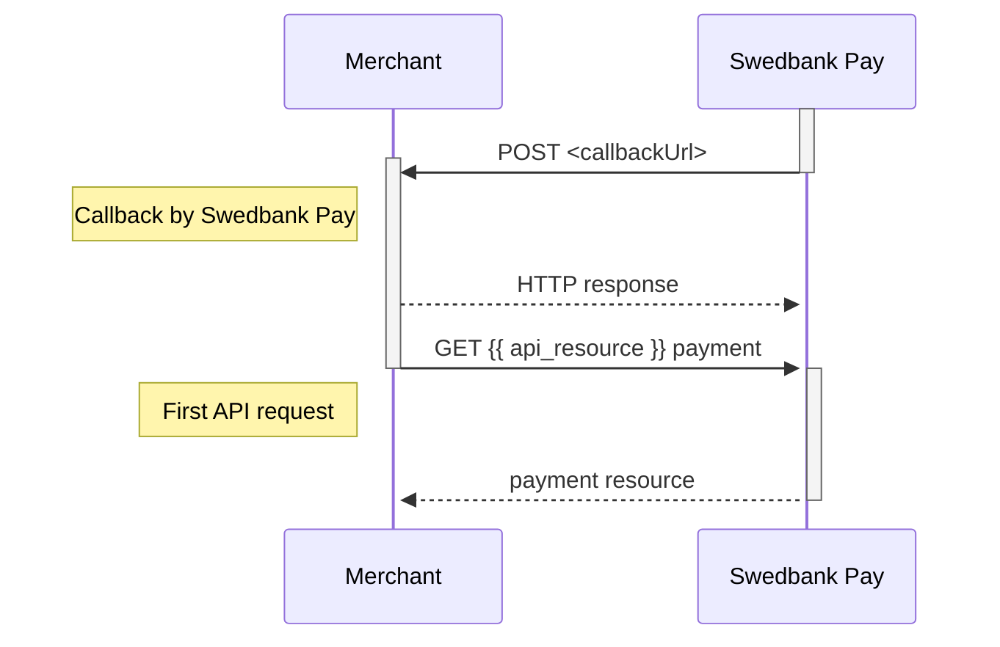




## Callback

When a change or update from the back-end system are made on a payment or
transaction, Swedbank Pay will perform a callback to inform the payee (merchant)
about this update.

Providing a `callbackUrl` in `POST` requests is **mandatory**. Below we provide
three example scenarios of why this is important:

1.  If the payer closes the payment window, the merchant will never know what
    happened to the payment if `callbackUrl` is not implemented.
2.  If the payer stops up in a payment app such as Vipps or Swish, the payer
    will never come back to the merchant. This means that the merchant won't know what
    happened to the payment unless `callbackUrl` is implemented.
3.  If a payer experiences a network error or something else happens that
    prevents the payer from being redirected from Swedbank Pay back to the
    merchant website, the `callbackUrl` is what ensures that you receive the
    information about what happened with the payment.

*   When a change or update from the back-end system are made on a payment or
    transaction, Swedbank Pay will perform an asynchronous server-to-server
    callback to inform the payee (merchant) about this update.
*   Swedbank Pay will make an HTTP `POST` to the `callbackUrl` that was specified
    when the payee (merchant) created the payment.
*   When the `callbackUrl` receives such a callback, an `HTTP` `GET` request must
    be made on the payment or on the transaction. The retrieved payment or
    transaction resource will give you the necessary information about the recent
    change/update.
*   The callback will be retried if it fails. Below are the retry timings, in
    seconds from the initial transaction time:
    *   30 seconds
    *   60 seconds
    *   360 seconds
    *   432 seconds
    *   864 seconds
    *   1265 seconds
*   The callback is sent from the following IP address: `82.115.146.1`
*   A callback should return a `200 OK` response.


{:.code-header}
**Payment Order Callback**

```js
{
    "paymentOrder": {
        "id": "/psp/paymentorders/{{ page.payment_order_id }}",
        "instrument": "{{ api_resource }}"
    },
    "payment": {
        "id": "/psp/{{ api_resource }}/payments/{{ page.payment_id }}",
        "number": 222222222
    },
    "transaction": {
        "id": "/psp/{{ api_resource }}/payments/{{ page.payment_id }}/<transaction type>/{{ page.transaction_id }}",
        "number": 333333333
    }
}
```


{:.code-header}
**Payment Instrument Callback**

```js
{
    "payment": {
        "id": "/psp/{{ api_resource }}/payments/{{ page.payment_id }}",
        "number": 222222222
    },
    "transaction": {
        "id": "/psp/{{ api_resource }}/payments/{{ page.payment_id }}/<transaction type>/{{ page.transaction_id }}",
        "number": 333333333
    }
}
```



{:.table .table-striped}
| Parameter            | Description                                                |
| :------------------- | :--------------------------------------------------------- |
| `<transaction type>` | `authorizations`, `captures`, `cancellations`, `reversals` |

The sequence diagram below shows the HTTP `POST` you will receive from Swedbank
Pay, and the two `GET` requests that you make to get the updated status.


