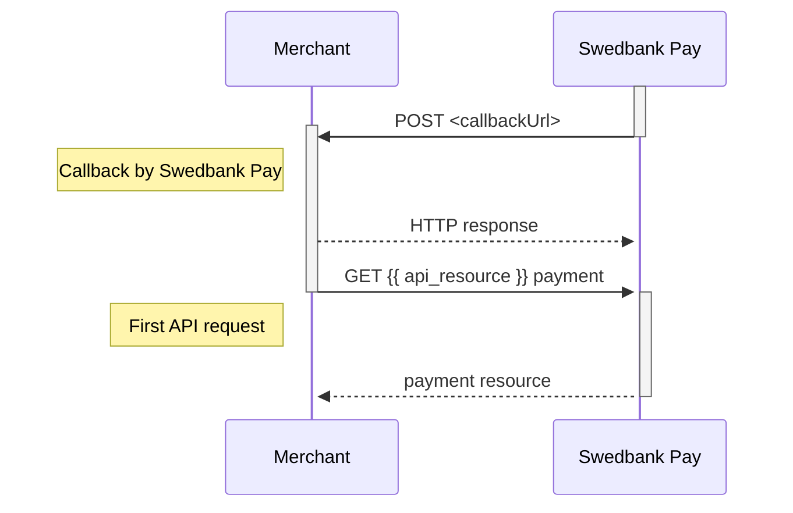





When a change or update from the back-end system are made on a payment or
transaction, Swedbank Pay will perform a callback to inform the payee (merchant)
about this update.

## Why Is The Callback Important?

Providing a `callbackUrl` in `POST` requests is **mandatory**. Below we provide
three example scenarios of why this is important:

1.  If the payer closes the payment window, the merchant will never know what
    happened to the payment if `callbackUrl` is not implemented.
2.  If the payer stops up in a payment app such as Vipps or Swish, the payer
    will never come back to the merchant. This means that the merchant won't
    know what happened to the payment unless `callbackUrl` is implemented.
3.  If a payer experiences a network error or something else happens that
    prevents the payer from being redirected from Swedbank Pay back to the
    merchant website, the `callbackUrl` is what ensures that you receive the
    information about what happened with the payment.

## Technical Information

*   When a change or update from the back-end system is made on a payment or
    transaction, Swedbank Pay will perform an asynchronous server-to-server
    callback to inform the payee (merchant) about this update.
*   It is important to know that the callback is asynchronous, and not
    real-time. As we can’t guarantee when you get the callback, there could be a
    delay between when the payer is returned back to the merchant and when the
    callback arrives. If the merchant chooses to wait for the callback, the
    payer might be left at the merchant’s page until the response comes.
*   Swedbank Pay will make an HTTP `POST` to the `callbackUrl` that was
    specified when the payee (merchant) created the payment.
*   When the `callbackUrl` receives such a callback, an HTTP `GET` request
    must be made on the payment or on the transaction. The retrieved payment or
    transaction resource will give you the necessary information about the
    recent change/update.
*   For unscheduled and recur transactions, no callback will be given for card
    transactions, only Trustly.
*   As it isn't scaled to be a primary source of updates, no given response time
    can be guaranteed, and a callback might fail. It will be retried if that
    should happen. Below are the retry timings, in seconds from the initial
    transaction time:
    *   30 seconds
    *   60 seconds
    *   360 seconds
    *   432 seconds
    *   864 seconds
    *   1265 seconds
*   A callback should return a `200 OK` response.

To understand the nature of the callback, the type of transaction, its status,
etc., you need to perform a `GET` request on the received URL and inspect the
response. The transaction type or any other information can not and should not
be inferred from the URL. See [URL usage][url-usage] for more information.

For `paymentOrder` implementations (Online Payments, Checkout v2 and Payment
Menu v1), it is critical that you do **not** use the `paymentId` or
`transactionId` when performing a `GET` to retrieve the payment's status. Use
the `paymentOrderId`.

### Callback IP Addresses

The callbacks are currently sent from either `51.107.183.58` or `91.132.170.1`
in both the test and production environment.



#### FAQ – Change of IP Addresses for Callbacks


{: .p .pl-3 .pr-3  }

We will be updating the IP addresses from which callbacks for e-commerce
payments are sent. This change will affect the external integration for both
test and production environments.

{: .p .pl-3 .pr-3  }
The current IP addresses are `91.132.170.1` and `51.107.183.58`. The new IP range
will be `20.91.170.120 – 127`, with the prefix (`20.91.170.120/29`).




*   Update your firewall rules to allow incoming traffic from the new IP
  addresses.

*   Ensure these changes are made by March 12th, 2025, to avoid potential
disruptions in the callback functionality.



*   Date: March 12, 2025

*   Time: 12:00 CET – 13:00 CET

*   Grace period: See further details below.



{: .p .pl-3 .pr-3  }
We need to update and deploy new outbound IP addresses from our Azure Cloud
environment. To ensure uninterrupted communication between our system and your
systems, all merchants and partners must update their firewalls with the new IP
range and prefix.

{: .p .pl-3 .pr-3  }
This applies to all merchants, regardless of integration method. No technical
code changes are required, but firewall adjustments must be made in your
infrastructure, typically handled by your IT or infrastructure providers.



{: .p .pl-3 .pr-3  }
By migrating callbacks to the Azure Cloud, we are enhancing our ability to scale
and manage traffic dynamically.

{: .p .pl-3 .pr-3  }
This means:

*   Improved operational stability – We can handle more concurrent callback
requests without performance degradation.

*   Faster recovery from technical issues or incidents – We can automatically
redirect traffic in case of disruptions.

*   Better monitoring and proactive issue resolution – We now have more tools to
detect and address issues in real-time.



{: .p .pl-3 .pr-3  }
We understand that some merchants may not complete the update before March 12.
Therefore, we will continue to run callbacks from the current solution during a
grace period.

{: .p .pl-3 .pr-3  }
However, it is important to migrate as soon as possible, as we will gradually
phase out the old solution to reduce system maintenance and complexity.

{: .p .pl-3 .pr-3  }
We will:

*   Closely monitor traffic to ensure stable callbacks from the Azure Cloud.

*   Actively monitor merchants and partners to ensure a smooth transition.



{: .p .pl-3 .pr-3  }
We recommend that merchants allow both the old and new IP addresses during the
transition period. This ensures stable callback functionality, even if network
issues arise during the migration.



{: .p .pl-3 .pr-3  }
Merchants must implement IP blocking (IP allowlisting). FQDN (domain name
blocking) is not supported in this case, as we use fixed IP addresses.



{: .p .pl-3 .pr-3  }
If you have any questions or need support during implementation, please contact
your TOM/TAM or our support team.



## Callback Example



{
    "paymentOrder": {
        "id": "/psp/{{ api_resource }}/{{ page.payment_id }}",
        "instrument": "{{ api_resource }}"
    },
    "payment": {
        "id": "/psp/creditcard/payments/{{ page.payment_id }}",
        "number": 222222222
    },
    "transaction": {
        "id": "/psp/creditcard/payments/{{ page.payment_id }}/authorizations/{{ page.transaction_id }}",
        "number": 333333333
    }
}



  

    
Field

    
Type

  

  <!-- LEVEL 0: paymentOrder -->
  

    

      <i aria-hidden="true" class="chev swepay-icon-plus-add small"></i>
      <code>object</code>
    

    

The payment order object.

    <!-- LEVEL 1: children of paymentOrder -->
    

      

        

          <i aria-hidden="true" class="chev swepay-icon-plus-add small"></i>
          <code>string</code>
        

        



      

      

        

          <i aria-hidden="true" class="chev swepay-icon-plus-add small"></i>
          <code>string</code>
        

        

The payment method used in the payment.

      

    

  

  <!-- LEVEL 0: payment -->
  

    

      <i aria-hidden="true" class="chev swepay-icon-plus-add small"></i>
      <code>object</code>
    

    

The payment object.

    <!-- LEVEL 1: children of payment -->
    

      

        

          <i aria-hidden="true" class="chev swepay-icon-plus-add small"></i>
          <code>string</code>
        

        

The attempt number which triggered the callback.

      

    

  

  <!-- LEVEL 0: transaction -->
  

    

      <i aria-hidden="true" class="chev swepay-icon-plus-add small"></i>
      <code>object</code>
    

    

The transaction object.

  



{
    "payment": {
        "id": "/psp/{{ api_resource }}/payments/{{ page.payment_id }}",
        "number": 222222222
    },
    "transaction": {
        "id": "/psp/{{ api_resource }}/payments/{{ page.payment_id }}/authorizations/{{ page.transaction_id }}",
        "number": 333333333
    }
}



  

    
Field

    
Type

  

  <!-- LEVEL 0: payment -->
  

    

      <i aria-hidden="true" class="chev swepay-icon-plus-add small"></i>
      <code>object</code>
    

    

The payment object.

    <!-- LEVEL 1: children of payment -->
    

      

        

          <i aria-hidden="true" class="chev swepay-icon-plus-add small"></i>
          <code>string</code>
        

        



      

      

        

          <i aria-hidden="true" class="chev swepay-icon-plus-add small"></i>
          <code>string</code>
        

        

The attempt number which triggered the callback.

      

    

  

  <!-- LEVEL 0: transaction -->
  

    

      <i aria-hidden="true" class="chev swepay-icon-plus-add small"></i>
      <code>object</code>
    

    

The transaction object.

  



## GET Response

When performing an HTTP `GET` request towards the URL found in the
`transaction.id` field of the callback, the response is going to include the
abbreviated example provided below.



## Sequence Diagram

The sequence diagram below shows the HTTP `POST` you will receive from Swedbank
Pay, and the two `GET` requests that you make to get the updated status.

[url-usage]: /checkout-v3/get-started/fundamental-principles#url-usage
