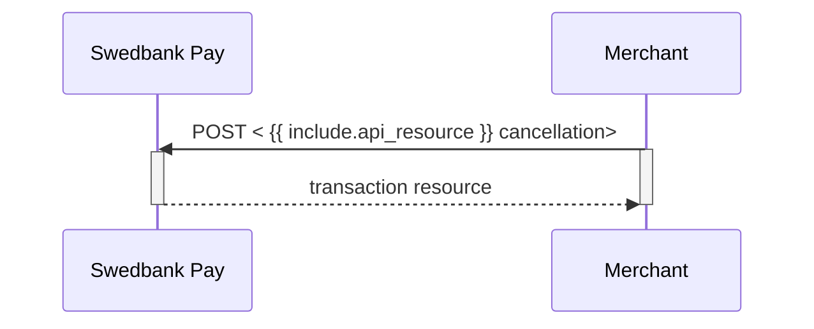

## Cancel

The `cancellations` resource lists the cancellation transactions on a
specific payment.

## Create Cancel Transaction



Perform the `cancel` operation to cancel a previously created payment.
You can only cancel a payment - or part of payment - not yet captured.



Perform the `create-cancel` operation to cancel a previously created payment.
You can only cancel a payment - or part of payment - not yet captured.



## Cancel Request

{:.code-view-header}
**Request**

```http
POST /psp/{{ include.api_resource }}/payments/{{ page.payment_id }}/cancellations HTTP/1.1
Host: {{ page.api_host }}
Authorization: Bearer <AccessToken>
Content-Type: application/json

{
    "transaction": {
        "description": "Test Cancellation",
        "payeeReference": "ABC123"
    }
}
```


{:.table .table-striped .mb-5}
| ︎ | Field                    | Type         | Description                                                                           |
| :--------------- | :----------------------- | :----------- | :------------------------------------------------------------------------------------ |
| ︎ | `transaction`            | `string`     | The transaction object contains information about this cancellation.                  |
| ︎ | └➔&nbsp;`description`    | `string`     | A textual description of the reason for the cancellation.                             |
| ︎ | └➔&nbsp;`payeeReference` | `string` |  |



## Cancel Response



### Cancel Sequence Diagram

Cancel can only be done on a authorized transaction.
If you do cancel after doing a part-capture you will cancel the different
between the capture amount and the authorization amount.


