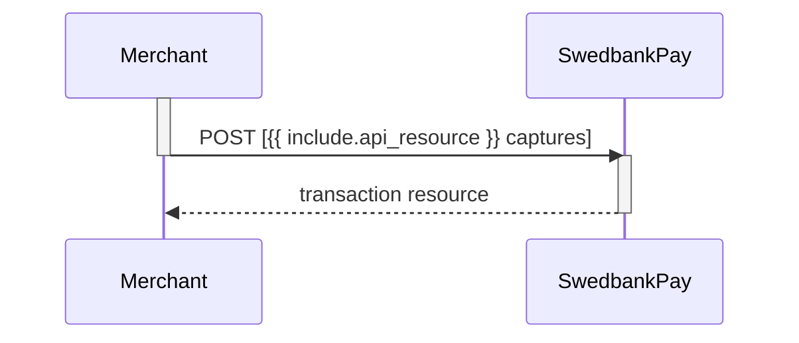

## Capture

The capture transaction is where you ensure that the funds are charged from
the payer. This step usually takes place when the product has exchanged
possession. You must first do a `GET` request on the payment to find the
`create-capture` operation.

Please note that you have a maximum of 5 **consecutive** failed attempts at a
capture. The payment will be locked after this, and you need to contact us for
another attempt.

## Create Capture Transaction

To create a `capture` transaction to withdraw money from the payer's card, you
need to perform the `create-capture` operation.

## Capture Request

POST /psp/{{ include.api_resource }}/payments/{{ page.payment_id }}/captures HTTP/1.1
Host: {{ page.api_host }}
Authorization: Bearer <AccessToken>
Content-Type: application/json

{
    "transaction": {
        "amount": 1500,
        "vatAmount": 250,
        "description": "Test Capture",
        "payeeReference": "ABC123"
    }
}



  

    
Field

    
Type

    
Required

  

  <!-- LEVEL 0: transaction -->
  

    

      <code>transaction</code><i aria-hidden="true" class="chev swepay-icon-plus-add"></i>
      <code>object</code>
      
    

    



    <!-- LEVEL 1: children of transaction -->
    

      

        

          <i aria-hidden="true" class="chev swepay-icon-plus-add"></i>
          <code>integer</code>
          
        

        

          

            Amount is entered in the lowest monetary units of the selected currency.
            E.g. <code>10000</code> = 100.00 NOK, <code>5000</code> = 50.00 SEK.
          

        

      

      

        

          <i aria-hidden="true" class="chev swepay-icon-plus-add"></i>
          <code>integer</code>
          
        

        

          

            Amount is entered in the lowest monetary units of the selected currency.
            E.g. <code>10000</code> = 100.00 NOK, <code>5000</code> = 50.00 SEK.
          

        

      

      

        

          <i aria-hidden="true" class="chev swepay-icon-plus-add"></i>
          <code>string</code>
          
        

        

          
A textual description of the capture transaction.

        

      

      

        

          <i aria-hidden="true" class="chev swepay-icon-plus-add"></i>
          <code>string(30)</code>
          
        

        

          


        

      

    

  

## Capture Response

HTTP/1.1 200 OK
Content-Type: application/json

{
    "payment": "/psp/{{ include.api_resource }}/payments/{{ page.payment_id }}",
    "capture": {
        "id": "/psp/{{ include.api_resource }}/payments/{{ page.payment_id }}/captures/{{ page.transaction_id }}",
        "transaction": {
            "id": "/psp/{{ include.api_resource }}/payments/{{ page.payment_id }}/transactions/{{ page.transaction_id }}",
            "created": "2016-09-14T01:01:01.01Z",
            "updated": "2016-09-14T01:01:01.03Z",
            "type": "Capture",
            "state": "Completed",
            "number": 1234567890,
            "amount": 1500,
            "vatAmount": 250,
            "description": "Test Capture",
            "payeeReference": "ABC123",
            "isOperational": false,
            "operations": []
        }
    }
}



  

    
Property

    
Type

  

  <!-- LEVEL 0: payment -->
  

    

      <i aria-hidden="true" class="chev swepay-icon-plus-add"></i>
      <code>string</code>
    

    

The relative URL of the payment this <code>capture</code> transaction belongs to.

  

  <!-- LEVEL 0: capture -->
  

    

      <i aria-hidden="true" class="chev swepay-icon-plus-add"></i>
      <code>object</code>
    

    

The <code>capture</code> resource contains information about the <code>capture</code> transaction made against a card payment.

    <!-- LEVEL 1: children of capture -->
    

      

        

          <i aria-hidden="true" class="chev swepay-icon-plus-add"></i>
          <code>string</code>
        

        

The relative URL of the created <code>capture</code> transaction.

      

      

        

          <i aria-hidden="true" class="chev swepay-icon-plus-add"></i>
          <code>object</code>
        

        



        <!-- LEVEL 2: children of transaction -->
        

          

            

              <i aria-hidden="true" class="chev swepay-icon-plus-add"></i>
              <code>string</code>
            

            

The relative URL of the current <code>transaction</code> resource.

          

          

            

              <i aria-hidden="true" class="chev swepay-icon-plus-add"></i>
              <code>date(string)</code>
            

            

The <a href="https://en.wikipedia.org/wiki/ISO_8601">ISO 8601</a> date and time when the transaction was created.

          

          

            

              <i aria-hidden="true" class="chev swepay-icon-plus-add"></i>
              <code>date(string)</code>
            

            

The <a href="https://en.wikipedia.org/wiki/ISO_8601">ISO 8601</a> date and time when the transaction was updated.

          

          

            

              <i aria-hidden="true" class="chev swepay-icon-plus-add"></i>
              <code>string</code>
            

            

Indicates the transaction type.

          

          

            

              <i aria-hidden="true" class="chev swepay-icon-plus-add"></i>
              <code>string</code>
            

            



          

          

            

              <i aria-hidden="true" class="chev swepay-icon-plus-add"></i>
              <code>integer</code>
            

            



          

          

            

              <i aria-hidden="true" class="chev swepay-icon-plus-add"></i>
              <code>integer</code>
            

            

              

                Amount is entered in the lowest monetary units of the selected currency.
                E.g. <code>10000</code> = 100.00 NOK, <code>5000</code> = 50.00 SEK.
              

            

          

          

            

              <i aria-hidden="true" class="chev swepay-icon-plus-add"></i>
              <code>integer</code>
            

            

              

                If the amount given includes VAT, this may be displayed for the user in the payment page (redirect only).
                Set to <code>0</code> (zero) if this is not relevant.
              

            

          

          

            

              <i aria-hidden="true" class="chev swepay-icon-plus-add"></i>
              <code>string</code>
            

            

              
A human readable description of maximum 40 characters of the transaction.

            

          

          

            

              <i aria-hidden="true" class="chev swepay-icon-plus-add"></i>
              <code>string(30)</code>
            

            



          

          

            

              <i aria-hidden="true" class="chev swepay-icon-plus-add"></i>
              <code>string</code>
            

            

The human readable explanation of why the payment failed.

          

          

            

              <i aria-hidden="true" class="chev swepay-icon-plus-add"></i>
              <code>boolean</code>
            

            

<code>true</code> if the transaction is operational; otherwise <code>false</code>.

          

          

            

              <i aria-hidden="true" class="chev swepay-icon-plus-add"></i>
              <code>array</code>
            

            



          

        

      

    

  

## List Capture Transactions

The `captures` resource list the capture transactions (one or more) on a
specific payment.

GET /psp/{{ include.api_resource }}/payments/{{ page.payment_id }}/captures HTTP/1.1
Host: {{ page.api_host }}
Authorization: Bearer <AccessToken>
Content-Type: application/json





## Capture Sequence Diagram

`Capture` can only be done on an authorized transaction. It is possible to do a
partial capture where you only capture a part of the authorized amount. You can
do more captures on the same payment up to the total authorization amount later.

