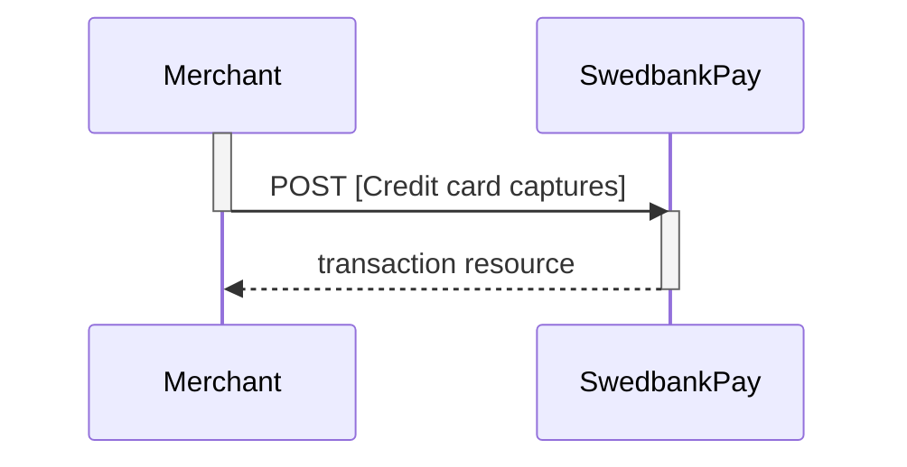

## Capture

The capture transaction is where you ensure that the funds are charged from
the payer. This step usually takes place when the product has exchanged
possession. You must first do a `GET` request on the payment to find the
`create-capture` operation.

### Create capture transaction

To create a `capture` transaction to withdraw money from the payer's card, you
need to perform the `create-capture` operation.

{:.code-view-header}
**Request**

```http
POST /psp/creditcard/payments/{{ page.payment_id }}/captures HTTP/1.1
Host: {{ page.api_host }}
Authorization: Bearer <AccessToken>
Content-Type: application/json

{
    "transaction": {
        "amount": 1500,
        "vatAmount": 250,
        "description": "Test Capture",
        "payeeReference": "ABC123"
    }
}
```

{:.table .table-striped}
|     Required     | Field                    | Type          | Description                                                                                                   |
| :--------------: | :----------------------- | :------------ | :------------------------------------------------------------------------------------------------------------ |
|  | `transaction`            | `object`      | The object representation of the generic [transaction resource][transaction-resource].                        |
|  | └➔&nbsp;`amount`         | `integer`     | Amount Entered in the lowest momentary units of the selected currency. E.g. 10000 100.00 NOK, 5000 50.00 SEK. |
|  | └➔&nbsp;`vatAmount`      | `integer`     | Amount Entered in the lowest momentary units of the selected currency. E.g. 10000 100.00 NOK, 5000 50.00 SEK. |
|  | └➔&nbsp;`description`    | `string`      | A textual description of the capture transaction.                                                             |
|  | └➔&nbsp;`payeeReference` | `string(30*)` |                                |

{:.code-view-header}
**Response**

```http
HTTP/1.1 200 OK
Content-Type: application/json

{
    "payment": "/psp/creditcard/payments/{{ page.payment_id }}",
    "capture": {
        "id": "/psp/creditcard/payments/{{ page.payment_id }}/captures/{{ page.transaction_id }}",
        "transaction": {
            "id": "/psp/creditcard/payments/{{ page.payment_id }}/transactions/{{ page.transaction_id }}",
            "created": "2016-09-14T01:01:01.01Z",
            "updated": "2016-09-14T01:01:01.03Z",
            "type": "Capture",
            "state": "Completed",
            "number": 1234567890,
            "amount": 1500,
            "vatAmount": 250,
            "description": "Test Capture",
            "payeeReference": "ABC123",
            "isOperational": false,
            "operations": []
        }
    }
}
```

{:.table .table-striped}
| Property                  | Type      | Description                                                                                                                                                                                                  |
| :------------------------ | :-------- | :----------------------------------------------------------------------------------------------------------------------------------------------------------------------------------------------------------- |
| `payment`                 | `string`  | The relative URI of the payment this `capture` transaction belongs to.                                                                                                                                       |
| `capture`                 | `object`  | The `capture` resource contains information about the `capture` transaction made against a card payment.                                                                                                     |
| └➔&nbsp;`id`              | `string`  | The relative URI of the created `capture` transaction.                                                                                                                                                       |
| └➔&nbsp;`transaction`     | `object`  | The object representation of the generic [`transaction resource`][transaction-resource].                                                                                                                     |
| └─➔&nbsp;`id`             | `string`  | The relative URI of the current  `transaction`  resource.                                                                                                                                                    |
| └─➔&nbsp;`created`        | `string`  | The ISO-8601 date and time of when the transaction was created.                                                                                                                                              |
| └─➔&nbsp;`updated`        | `string`  | The ISO-8601 date and time of when the transaction was updated.                                                                                                                                              |
| └─➔&nbsp;`type`           | `string`  | Indicates the transaction type.                                                                                                                                                                              |
| └─➔&nbsp;`state`          | `string`  |  |
| └─➔&nbsp;`number`         | `string`  | The transaction  number , useful when there's need to reference the transaction in human communication. Not usable for programmatic identification of the transaction, where id should be used instead. |
| └─➔&nbsp;`amount`         | `integer` | Amount is entered in the lowest momentary units of the selected currency. E.g. 10000 = 100.00 NOK, 5000 = 50.00 SEK.                                                                                         |
| └─➔&nbsp;`vatAmount`      | `integer` | If the amount given includes VAT, this may be displayed for the user in the payment page (redirect only). Set to 0 (zero) if this is not relevant.                                                           |
| └─➔&nbsp;`description`    | `string`  | A human readable description of maximum 40 characters of the transaction                                                                                                                                     |
| └─➔&nbsp;`payeeReference` | `string`  |                                                                                                                               |
| └─➔&nbsp;`failedReason`   | `string`  | The human readable explanation of why the payment failed.                                                                                                                                                    |
| └─➔&nbsp;`isOperational`  | `boolean` | `true`  if the transaction is operational; otherwise  `false` .                                                                                                                                              |
| └─➔&nbsp;`operations`     | `array`   | The array of [operations][operations] that are possible to perform on the transaction in its current state.                                                                                                  |

The `captures` resource list the capture transactions (one or more) on a
specific payment.

{:.code-view-header}
**Request**

```http
GET /psp/creditcard/payments/{{ page.payment_id }}/captures HTTP/1.1
Host: {{ page.api_host }}
Authorization: Bearer <AccessToken>
Content-Type: application/json
```



### Capture Sequence

`Capture` can only be done on an authorized transaction. It is possible to do a
partial capture where you only capture a part of the authorized amount. You can
do more captures on the same payment up to the total authorization amount later.



[operations]: /payment-instruments/card/features/core#operations
[transaction-resource]: /payment-instruments/card/features/technical-reference/transactions
