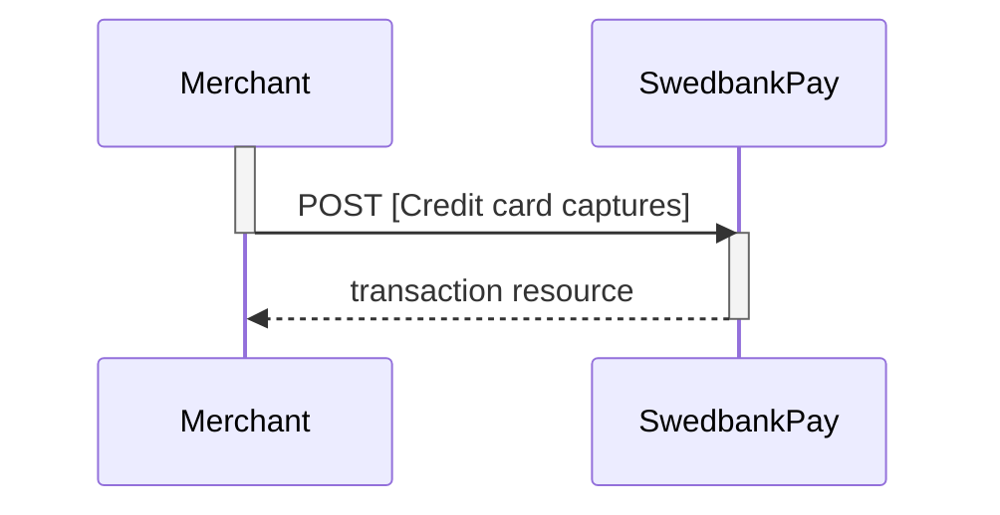

## Capture

The capture transaction is where you ensure that the funds are charged from
the payer. This step usually takes place when the product has exchanged
possession. You must first do a `GET` request on the payment to find the
`create-capture` operation.

### Create Capture Transaction

To create a `capture` transaction to withdraw money from the payer's card, you
need to perform the `create-capture` operation.

## Capture Request

POST /psp/creditcard/payments/{{ page.payment_id }}/captures HTTP/1.1
Host: {{ page.api_host }}
Authorization: Bearer <AccessToken>
Content-Type: application/json

{
    "transaction": {
        "amount": 1500,
        "vatAmount": 250,
        "description": "Test Capture",
        "payeeReference": "ABC123"
    }
}



{:.table .table-striped}
|     Required     | Field                    | Type          | Description                                                                                                   |
| :--------------: | :----------------------- | :------------ | :------------------------------------------------------------------------------------------------------------ |
|  | `transaction`            | `object`      |                         |
|  |          | `integer`     | Amount Entered in the lowest momentary units of the selected currency. E.g. 10000 100.00 NOK, 5000 50.00 SEK. |
|  |       | `integer`     | Amount Entered in the lowest momentary units of the selected currency. E.g. 10000 100.00 NOK, 5000 50.00 SEK. |
|  |     | `string`      | A textual description of the capture transaction.                                                             |
|  |  | `string` |                                |

## Capture Response

HTTP/1.1 200 OK
Content-Type: application/json

{
    "payment": "/psp/creditcard/payments/{{ page.payment_id }}",
    "capture": {
        "id": "/psp/creditcard/payments/{{ page.payment_id }}/captures/{{ page.transaction_id }}",
        "transaction": {
            "id": "/psp/creditcard/payments/{{ page.payment_id }}/transactions/{{ page.transaction_id }}",
            "created": "2016-09-14T01:01:01.01Z",
            "updated": "2016-09-14T01:01:01.03Z",
            "type": "Capture",
            "state": "Completed",
            "number": 1234567890,
            "amount": 1500,
            "vatAmount": 250,
            "description": "Test Capture",
            "payeeReference": "ABC123",
            "isOperational": false,
            "operations": []
        }
    }
}




{:.table .table-striped .mb-5}
| Property                  | Type      | Description                                                                                                                                                                                                  |
| :------------------------ | :-------- | :----------------------------------------------------------------------------------------------------------------------------------------------------------------------------------------------------------- |
|                  | `string`  | The relative URL of the payment this `capture` transaction belongs to.                                                                                                                                       |
|                  | `object`  | The `capture` resource contains information about the `capture` transaction made against a card payment.                                                                                                     |
|               | `string`  | The relative URL of the created `capture` transaction.                                                                                                                                                       |
|      | `object`  |                                                                                                                      |
|              | `string`  | The relative URL of the current  `transaction`  resource.                                                                                                                                                    |
|         | `string`  | The ISO-8601 date and time of when the transaction was created.                                                                                                                                              |
|         | `string`  | The ISO-8601 date and time of when the transaction was updated.                                                                                                                                              |
|            | `string`  | Indicates the transaction type.                                                                                                                                                                              |
|           | `string`  |  |
|          | `integer` |  |
|          | `integer` | Amount is entered in the lowest momentary units of the selected currency. E.g. 10000 = 100.00 NOK, 5000 = 50.00 SEK.                                                                                         |
|       | `integer` | If the amount given includes VAT, this may be displayed for the user in the payment page (redirect only). Set to 0 (zero) if this is not relevant.                                                           |
|     | `string`  | A human readable description of maximum 40 characters of the transaction                                                                                                                                     |
|  | `string`  |                                                                                                                               |
|    | `string`  | The human readable explanation of why the payment failed.                                                                                                                                                    |
|   | `boolean` | `true`  if the transaction is operational; otherwise  `false` .                                                                                                                                              |
|      | `array`   |                                                                                                   |



## List Capture Transactions

The `captures` resource list the capture transactions (one or more) on a
specific payment.

GET /psp/creditcard/payments/{{ page.payment_id }}/captures HTTP/1.1
Host: {{ page.api_host }}
Authorization: Bearer <AccessToken>
Content-Type: application/json





## Capture Sequence Diagram

`Capture` can only be done on an authorized transaction. It is possible to do a
partial capture where you only capture a part of the authorized amount. You can
do more captures on the same payment up to the total authorization amount later.

