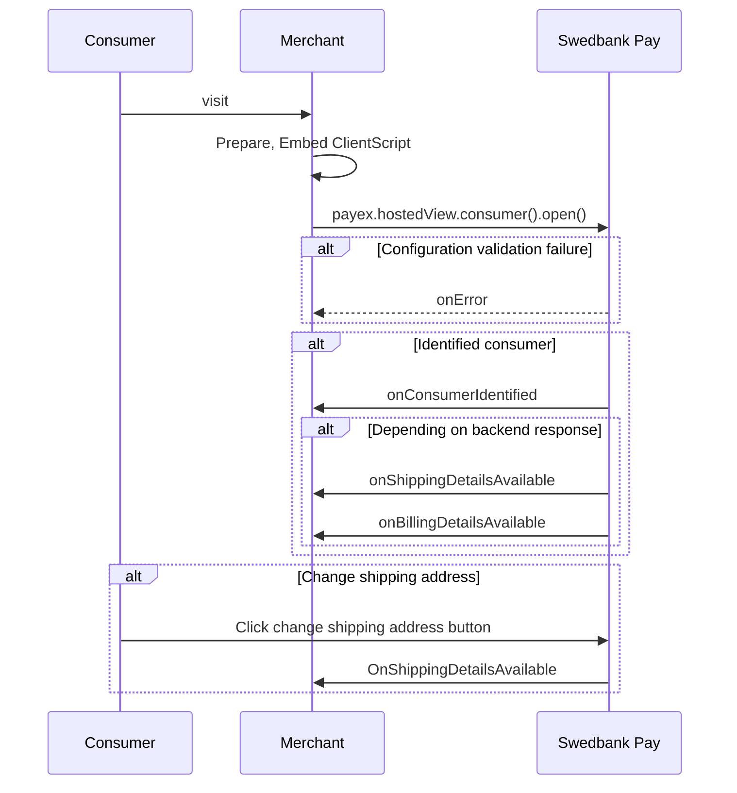



## Checkin Events

The Checkin Seamless View can inform about events that occur during Checkin
through JavaScript event callbacks which can be implemented in the
`configuration` object passed to the `payex.hostedView.consumer(configuration)`
object.

## `onConsumerIdentified`

This event triggers when a consumer has performed Checkin and is identified,
if the Payment Menu is not loaded and in the DOM. The `onConsumerIdentified`
event is raised with the following event argument object:

{
  "actionType": "OnConsumerIdentified",
  "consumerProfileRef": "{{ page.payment_token }}"
}



## `onShippingDetailsAvailable`

Triggered when a consumer has been identified or shipping address has been
updated.


{
  "actionType": "OnShippingDetailsAvailable",
  "url": "/psp/consumers/{{ page.payment_token }}/shipping-details"
}



## `onBillingDetailsAvailable`

Triggered when a consumer has been identified.

{
  "actionType": "OnBillingDetailsAvailable",
  "url":"/psp/consumers/{{ page.payment_token }}/billing-details"
}


