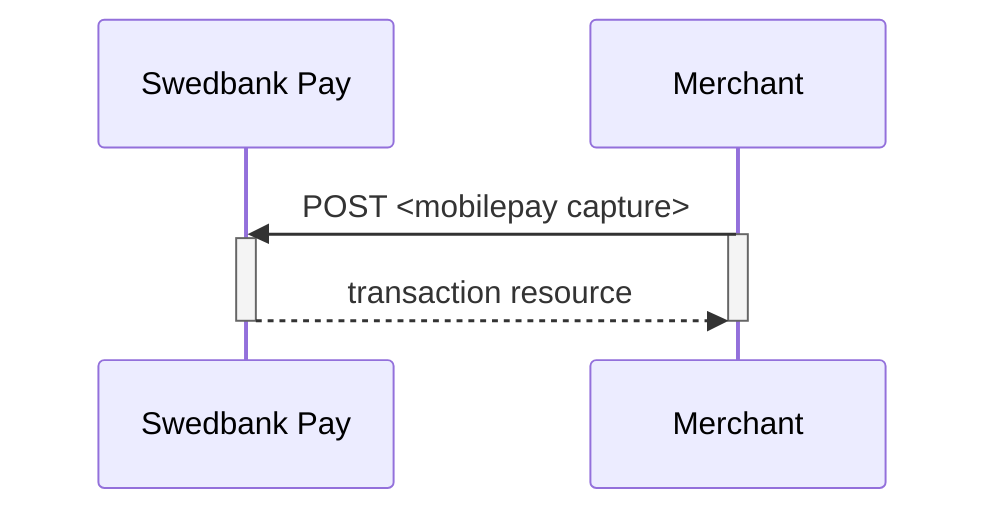

## Capture



## Create Capture Transaction

A `capture` transaction to withdraw money from the payer's MobilePay can be
created after a completed authorization by performing the `create-capture`
operation.

## Capture Request

POST /psp/mobilepay/payments/{{ page.payment_id }}/captures HTTP/1.1
Host: {{ page.api_host }}
Authorization: Bearer <AccessToken>
Content-Type: application/json

{
    "transaction": {
        "amount": 1000,
        "vatAmount": 250,
        "payeeReference": 1234,
        "description" : "description for transaction"
    }
}



{:.table .table-striped}
|     Required     | Field                    | Type         | Description                                                                           |
| :--------------: | :----------------------- | :----------- | :------------------------------------------------------------------------------------ |
| ︎ | `transaction`            | `object`     | Object representing the capture transaction.                                          |
| ︎ |          | `integer`    |                                              |
| ︎ |       | `integer`    |                                           |
| ︎ |     | `string`     | A textual description of the capture transaction.                                     |
| ︎ |  | `string` |  |

## Capture Response



## Capture Sequence Diagram

`Capture` can only be done on an authorized transaction. It is possible to do a
partial capture where you only capture a smaller amount than the authorization
amount. You can do more captures on the same payment later, up to the total
authorization amount.

