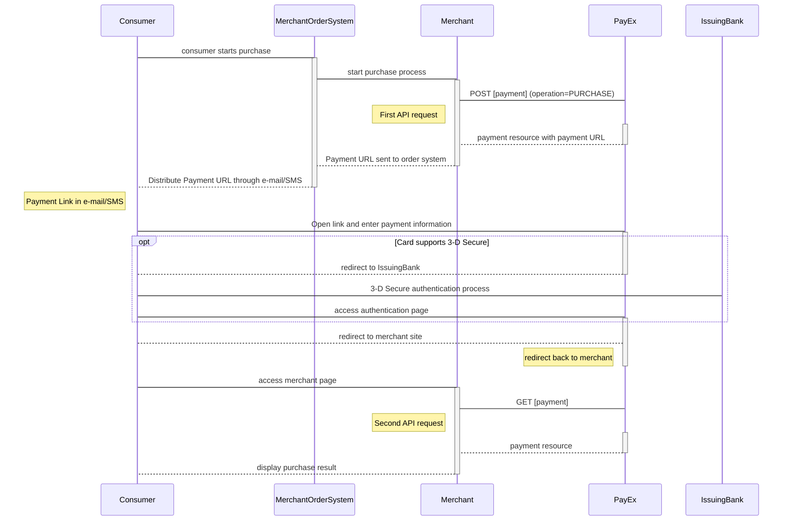
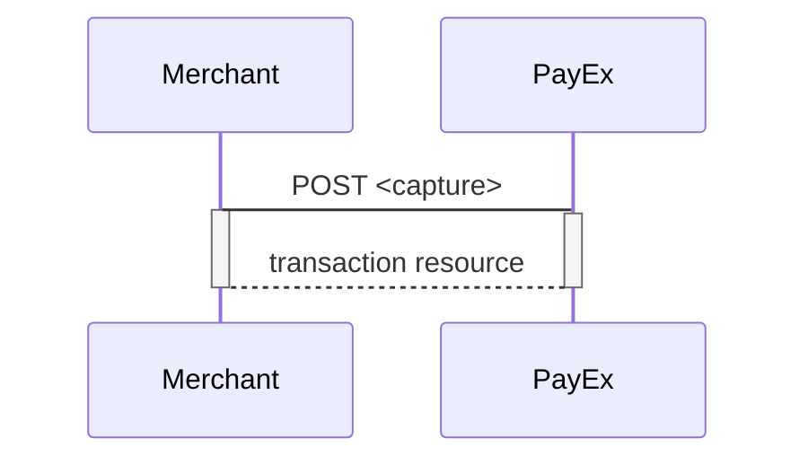
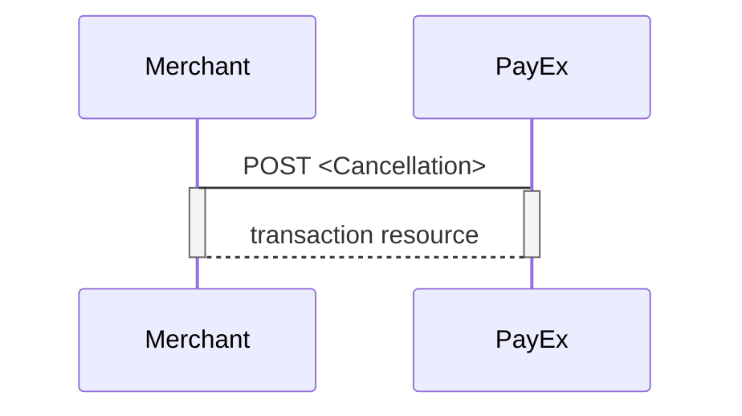
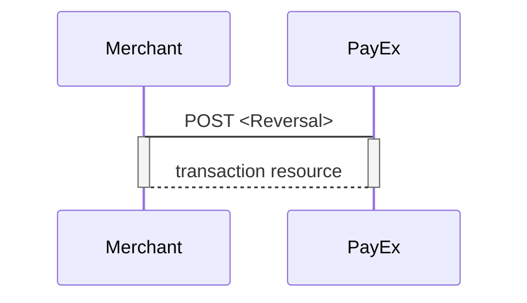

## Payment Link



### Introduction

* The Payment Link can be implemented for payment methods listed below, using the Redirect platform and hosted payment pages.  
  * [Credit card][payment-instruments-card-payment-pages]
  * [MobilePay][payment-instruments-mobilepay-payment-pages]
  * [Swish][swish]
  * [Vipps][vipps]
* When the consumer/end-user starts the purchase process in your merchant or webshop site, you need to make a `POST` request towards PayEx with your *Purchase* information. You receive a Payment Link (same as redirect URL) in response.
* You have to distribute the Payment Link to the customer through your order system, using channels like e-mail or SMS.
  * NOTE: When sending information in e-mail/SMS, it is strongly recommended that you add information about your terms and conditions, including purchase information and price. **See recommendations in the next paragraph.**
* When the consumer clicks on the Payment Link, the PayEx payment page will open, letting the consumer enter the payment details (varying depending on payment instrument) in a secure PayEx hosted environment. When paying with credit card and if required, PayEx will handle 3D-secure authentication
* After completion, PayEx will redirect the browser back to your merchant/webshop site.
* If [`CallbackURL`][technical-reference-callbackurl] is set the merchant system will receive a callback from PayEx, enabling you to make a `GET` request towards PayEx with the `paymentID` received in the first step, which will return the purchase result.

### Recommendations regarding Payment Link in E-mail/SMS

When you as a merchant sends an e-mail or SMS to the consumer about the Payment Link, it is recommended to include contextual information that help the consumer understand what will happen when clicking on the Payment Link. We recommend that you include following information:

* The name of the merchant/shop that initiates the payment
* An understandable product description, describing what kind of service the consumer will pay for.
* Some order-id (or similar) that exists in the merchant order system.
* The price and currency.
* Details about shipping method and expected delivery (if physical goods will be sent  to the consumer).
* Directions to (a link to a page) the merchant's terms and conditions (such as return policy) and information of how the consumer can contact the merchant.
* Details informing the consumer that he or she accepts the Terms&Conditions when clicking on the Payment Link.

### Recommendations about receipt 

We recommend that you send an e-mail or SMS confirmation with a receipt to the consumer when the payment has been fulfilled.

### API requests 

The API-requests depend on the payment method you are using when implementing the Payment Link scenario, see [purchase flow][purchase-flow] One-phase payment metods will not implement `capture`, `cancellation` or `reversal`. The options you can choose from when creating a payment with key `operation` set to Value `Purchase` are listed below. The general REST based API model is described in the [technical reference][technical-reference].

### Screenshots 

When clicking the payment link, the consumer will be directed to a payment page, similar to the examples below, where payment information can be entered.

![Paymentlink screenshot][test_purchase]

### Options

All valid options when posting in a payment with operation `Purchase`, are described in each payment method's respective API reference. Please see the general sequence diagrams for more information about payments in one-phase (e.g. [Swish][swish] and credit card with autocapture) and two-phase (e.g. [Credit card][credit-card], [MobilePay][mobile-pay], [Vipps][vipps]).

#### Authorization

* PreAuthorization (Credit card):
  * If you specify that the _intent_ of the _purchase_ is `PreAuthorize` it's almost the same as an authorization, **except that no money will be reserved** from the consumers credit card, [before you make a finalize on this transaction (using the PATCH on the Autorization)][technical-reference-finalize].

* Authorize (two-phase):
  * When using two-phase flows you reserve the amount with an authorization, you will have to specify that the _intent_ of the _purchase_ is `Authorize`. The amount will be reserved but not charged. You will later (i.e. when you are ready to ship the purchased products) have to make a `Capture` or `Cancel` request.

#### Capture

* Autocapture (one-phase credit card):
  * If you want the credit card to be charged right away, you will have to specify that the _intent_ of the purchase is `Autocapture`. The credit card will be charged and you don't need to do any more financial operations to this purchase.

#### General

* When implementing the Payment Link scenario, it is optional to set a [`CallbackURL`][technical-reference-callbackurl] in the `POST` request. If callbackURL is set PayEx will send a postback request to this URL when the consumer as fulfilled the payment. [See the Callback API description here][technical-reference-callback].

### Purchase flow 

The sequence diagrams display the high level process of the purchase, from generating a Payment Link to receving a Callback. This in a generalized flow as well as a specific 3D-secure enabled credit card scenario.  

**Please note that the the callback may come either before, after or in the same moment as the consumer are being redirected to the status page at the merchant site when the purchase is fulfilled.**

When dealing with credit card payments, 3D-Secure authentication of the cardholder is an essential topic. There are three alternative outcome of a credit card payment:

* 3D-Secure enabled - by default, 3D-secure should be enabled, and PayEx will check if the card is enrolled with 3D-secure. This depends on the issuer of the card. If the card is not enrolled with 3D-Secure, no authentication of the cardholder is done.
* Card supports 3D-Secure - if the card is enrolled with 3D-Secure, PayEx will redirect the cardholder to the autentication mechanism that is decided by the issuing bank. Normally this will be done using BankID or Mobile BankID.

#### Options after posting a payment

* If the payment enable a two-phase flow (`Authorize`), you will need to implement the `Capture` and `Cancel` requests.
* It is possible to "abort" the validity of the Payment Link by making a `PATCH` on the payment. [See the PATCH payment description][abort].
* For reversals, you will need to implement the `Reversal` request.
* If you did a PreAuthorization, you will have to send a Finalize to the transaction using [PATCH on the Authorization][payment-instruments-card-payment-pages].
* When implementing the Payment Link scenario, it is optional to set a CallbackURL in the `POST` request. If CallbackURL is set PayEx will send a postback request to this URL when the consumer as fulfilled the payment. [See the Callback API description here][technical-reference-callback].

#### Capture Sequence

Capture can only be perfomed on a payment with a successfully authorized transaction. It is possible to do a part-capture where you only capture a smaller amount than the authorized amount. You can later do more captures on the same payment up to the total authorization amount..

#### Cancel Sequence

Cancel can only be done on a authorized transaction. If you do cancel after doing a part-capture you will cancel the difference between the captured amount and the authorized amount.

#### Reversal Sequence

Reversal can only be done on a payment where there are some captured amount not yet reversed.

[test_purchase]: /assets/img/checkout/test_purchase.png
[payment-pages-redirect-implementation]: #
[payment-instruments-card-payment-pages]: #
[payment-instruments-mobilepay-payment-pages]: #
[technical-reference-finalize]: #
[swish]: /payments/swish
[vipps]: /payments/vipps
[credit-card]: /payments/credit-card
[mobile-pay]: /payments/mobile-pay
[technical-reference-callback]: #
[technical-reference-callbackurl]: #
[technical-reference]: #
[purchase-flow]: #
[abort]: #