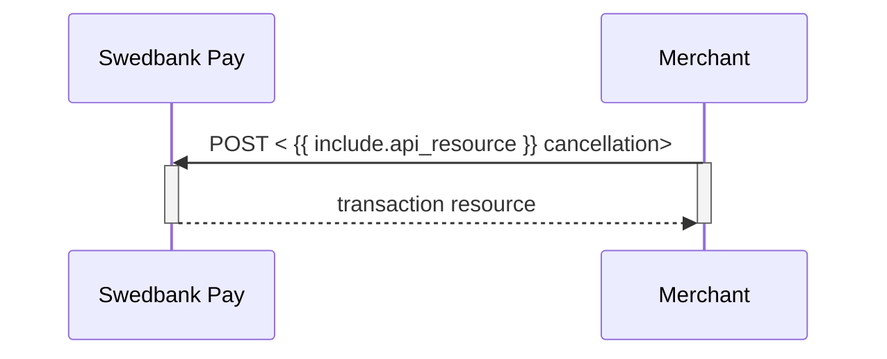





## Cancel v3.1

The `cancellations` resource lists the cancellation transactions on a
specific payment.

## Create Cancel Transaction



To cancel a previously created payment, you must perform the `cancel` operation
against the accompanying `href` returned in the `operations` list. You can only
cancel a payment - or part of a payment - which has not been captured yet. There
must be funds left that are only authorized. If you cancel before any capture
has been done, no captures can be performed later.



To cancel a previously created payment, you must perform the
`create-paymentorder-cancel` operation against the accompanying `href` returned
in the `operations` list. You can only cancel a payment - or part of a payment -
which has not been captured yet. If you cancel before any capture has been done,
no captures can be performed later.



## Cancel Request v3.1

POST /psp/paymentorders/{{ page.payment_order_id }}/cancellations HTTP/1.1
Host: {{ page.api_host }}
Authorization: Bearer <AccessToken>
Content-Type: application/json;version=3.1

{
    "transaction": {
        "description": "Test Cancellation",
        "payeeReference": "ABC123"
    }
}





  

    
Field

    
Type

    
Required

  

  <!-- Level 0 (root) -->
  

    

      <i aria-hidden="true" class="chev swepay-icon-plus-add"></i>
      <code>object</code>
      
    

    

The transaction object.

    <!-- Children of transaction (level 1) -->
    

      

        

          <i aria-hidden="true" class="chev swepay-icon-plus-add"></i>
          <code>string</code>
          
        

        

A textual description of why the transaction is cancelled.

      

      

        

          <i aria-hidden="true" class="chev swepay-icon-plus-add"></i>
          <code>string(30)</code>
          
        

        

{{ payee_reference_md | markdownify }}

      

    
<!-- /.api-children -->
  
<!-- /.level-0 -->

<!-- /.api-compact -->

## Cancel Response v3.1

If the cancel request succeeds, the response should be similar to the
example below:

HTTP/1.1 200 OK
Content-Type: application/json; charset=utf-8; version=3.1
api-supported-versions: 3.1

{
  "paymentOrder": {
    "id": "/psp/paymentorders/8be318c1-1caa-4db1-e2c6-08d7bf41224d",
    "created": "2020-03-03T07:19:27.5636519Z",
    "updated": "2020-03-03T07:21:00.5605905Z",
    "operation": "Purchase",
    "status": "Cancelled",
    "currency": "SEK",
    "amount": 1500,
    "vatAmount": 375,
    "description": "Test Purchase",
    "initiatingSystemUserAgent": "<should be set by the system calling POST:/psp/paymentorders>",
    "language": "sv-SE",
    "availableInstruments": [ "CreditCard", "Invoice-PayExFinancingSe", "Invoice-PayMonthlyInvoiceSe", "Swish", "CreditAccount", "Trustly" ],
    "implementation": "PaymentsOnly",
    "integration": "HostedView|Redirect",
    "instrumentMode": true,
    "guestMode": true,
    "orderItems": {
      "id": "/psp/paymentorders/8be318c1-1caa-4db1-e2c6-08d7bf41224d/orderitems"
    },
    "urls": {
      "id": "/psp/paymentorders/8be318c1-1caa-4db1-e2c6-08d7bf41224d/urls"
    },
    "payeeInfo": {
      "id": "/psp/paymentorders/8be318c1-1caa-4db1-e2c6-08d7bf41224d/payeeInfo"
    },
    "payer": {
      "id": "/psp/paymentorders/8be318c1-1caa-4db1-e2c6-08d7bf41224d/payers"
    },
    "history": {
      "id": "/psp/paymentorders/8be318c1-1caa-4db1-e2c6-08d7bf41224d/history"
    },
    "failed": {
      "id": "/psp/paymentorders/8be318c1-1caa-4db1-e2c6-08d7bf41224d/failed"
    },
    "aborted": {
      "id": "/psp/paymentorders/8be318c1-1caa-4db1-e2c6-08d7bf41224d/aborted"
    },
    "paid": {
      "id": "/psp/paymentorders/8be318c1-1caa-4db1-e2c6-08d7bf41224d/paid"
    },
    "cancelled": {
      "id": "/psp/paymentorders/8be318c1-1caa-4db1-e2c6-08d7bf41224d/cancelled"
    },
    "financialTransactions": {
      "id": "/psp/paymentorders/8be318c1-1caa-4db1-e2c6-08d7bf41224d/financialtransactions"
    },
    "failedAttempts": {
      "id": "/psp/paymentorders/8be318c1-1caa-4db1-e2c6-08d7bf41224d/failedattempts"
    },
    "postPurchaseFailedAttempts": {
      "id": "/psp/paymentorders/8be318c1-1caa-4db1-e2c6-08d7bf41224d/postpurchasefailedattempts"
    },
    "metadata": {
      "id": "/psp/paymentorders/8be318c1-1caa-4db1-e2c6-08d7bf41224d/metadata"
    }
  },
  "operations": [
  ]
}












  

    
Field

    
Type

  

  <!-- Level 0 (root) -->
  

    

      <i aria-hidden="true" class="chev swepay-icon-plus-add"></i>
      <code>string</code>
    

    

The relative URL of the payment order this capture transaction belongs to.

    <!-- Children of paymentOrder (level 1) -->
    

      <!-- id -->
      

        

          <i aria-hidden="true" class="chev swepay-icon-plus-add"></i>
          <code>string</code>
        

        

The relative URL of the created capture transaction.

      

      <!-- created -->
      

        

          <i aria-hidden="true" class="chev swepay-icon-plus-add"></i>
          <code>string</code>
        

        

The ISO-8601 date and time of when the transaction was created.

      

      <!-- updated -->
      

        

          <i aria-hidden="true" class="chev swepay-icon-plus-add"></i>
          <code>string</code>
        

        

The ISO-8601 date and time of when the transaction was updated.

      

      <!-- operation -->
      

        

          <i aria-hidden="true" class="chev swepay-icon-plus-add"></i>
          <code>string</code>
        

        

{{ operation_md | markdownify }}

      

      <!-- status -->
      

        

          <i aria-hidden="true" class="chev swepay-icon-plus-add"></i>
          <code>string</code>
        

        

{{ status_md | markdownify }}

      

      <!-- currency -->
      

        

          <i aria-hidden="true" class="chev swepay-icon-plus-add"></i>
          <code>string</code>
        

        

The currency of the payment order.

      

      <!-- amount -->
      

        

          <i aria-hidden="true" class="chev swepay-icon-plus-add"></i>
          <code>integer</code>
        

        

{{ amount_md | markdownify }}

      

      <!-- vatAmount -->
      

        

          <i aria-hidden="true" class="chev swepay-icon-plus-add"></i>
          <code>integer</code>
        

        

{{ vat_amount_md | markdownify }}

      

      <!-- remainingCaptureAmount -->
      

        

          <i aria-hidden="true" class="chev swepay-icon-plus-add"></i>
          <code>integer</code>
        

        

The remaining authorized amount that is still possible to capture.

      

      <!-- remainingCancellationAmount -->
      

        

          <i aria-hidden="true" class="chev swepay-icon-plus-add"></i>
          <code>integer</code>
        

        

The remaining authorized amount that is still possible to cancel.

      

      <!-- remainingReversalAmount -->
      

        

          <i aria-hidden="true" class="chev swepay-icon-plus-add"></i>
          <code>integer</code>
        

        

The remaining captured amount that is still available for reversal.

      

      <!-- description -->
      

        

          <i aria-hidden="true" class="chev swepay-icon-plus-add"></i>
          <code>string</code>
        

        

{{ description_md | markdownify }}

      

      <!-- initiatingSystemUserAgent -->
      

        

          <i aria-hidden="true" class="chev swepay-icon-plus-add"></i>
          <code>string</code>
        

        

{{ initiating_system_user_agent_md | markdownify }}

      

      <!-- language -->
      

        

          <i aria-hidden="true" class="chev swepay-icon-plus-add"></i>
          <code>string</code>
        

        

{{ language_md | markdownify }}

      

      <!-- availableInstruments -->
      

        

          <i aria-hidden="true" class="chev swepay-icon-plus-add"></i>
          <code>array</code>
        

        

A list of payment methods available for this payment.

      

      <!-- implementation -->
      

        

          <i aria-hidden="true" class="chev swepay-icon-plus-add"></i>
          <code>string</code>
        

        

The merchant's Online Payments implementation type. <code>Enterprise</code> or <code>PaymentsOnly</code>. We ask that you don't build logic around this field's response. It is mainly for information purposes, as the implementation types might be subject to name changes. If this should happen, updated information will be available in this table.

      

      <!-- integration -->
      

        

          <i aria-hidden="true" class="chev swepay-icon-plus-add"></i>
          <code>string</code>
        

        

The merchant's Online Payments integration type. <code>HostedView</code> (Seamless View) or <code>Redirect</code>…

      

      <!-- instrumentMode -->
      

        

          <i aria-hidden="true" class="chev swepay-icon-plus-add"></i>
          <code>bool</code>
        

        

Set to <code>true</code> or <code>false</code>. Indicates if the payment is initialized with only one payment method available.

      

      <!-- guestMode -->
      

        

          <i aria-hidden="true" class="chev swepay-icon-plus-add"></i>
          <code>bool</code>
        

        

Set to <code>true</code> or <code>false</code>. Indicates if the payer chose to pay as a guest or not…

      

      <!-- ID sub-resources -->
      

        

          <i aria-hidden="true" class="chev swepay-icon-plus-add"></i>
          <code>id</code>
        

        

The URL to the <code>orderItems</code> resource where information about the order items can be retrieved.

      

      

        

          <i aria-hidden="true" class="chev swepay-icon-plus-add"></i>
          <code>id</code>
        

        

The URL to the <code>urls</code> resource where all URLs related to the payment order can be retrieved.

      

      

        

          <i aria-hidden="true" class="chev swepay-icon-plus-add"></i>
          <code>id</code>
        

        

The URL to the <code>payeeInfo</code> resource…

      

      

        

          <i aria-hidden="true" class="chev swepay-icon-plus-add"></i>
          <code>id</code>
        

        

The URL to the <a href="{{ features_url }}/technical-reference/resource-sub-models#payer"><code>payer</code> resource</a>…

      

      

        

          <i aria-hidden="true" class="chev swepay-icon-plus-add"></i>
          <code>id</code>
        

        

The URL to the <code>history</code> resource…

      

      

        

          <i aria-hidden="true" class="chev swepay-icon-plus-add"></i>
          <code>id</code>
        

        

The URL to the <code>failed</code> resource…

      

      

        

          <i aria-hidden="true" class="chev swepay-icon-plus-add"></i>
          <code>id</code>
        

        

The URL to the <code>aborted</code> resource…

      

      

        

          <i aria-hidden="true" class="chev swepay-icon-plus-add"></i>
          <code>id</code>
        

        

The URL to the <code>paid</code> resource…

      

      

        

          <i aria-hidden="true" class="chev swepay-icon-plus-add"></i>
          <code>id</code>
        

        

The URL to the <code>cancelled</code> resource…

      

      

        

          <i aria-hidden="true" class="chev swepay-icon-plus-add"></i>
          <code>id</code>
        

        

The URL to the <code>financialTransactions</code> resource…

      

      

        

          <i aria-hidden="true" class="chev swepay-icon-plus-add"></i>
          <code>id</code>
        

        

The URL to the <code>failedAttempts</code> resource…

      

      

        

          <i aria-hidden="true" class="chev swepay-icon-plus-add"></i>
          <code>id</code>
        

        

The URL to the <code>postPurchaseFailedAttempts</code> resource…

      

      

        

          <i aria-hidden="true" class="chev swepay-icon-plus-add"></i>
          <code>id</code>
        

        

The URL to the <code>metadata</code> resource where information about the metadata can be retrieved.

      

      <!-- operations as child (level 1) -->
      

        

          <i aria-hidden="true" class="chev swepay-icon-plus-add"></i>
          <code>array</code>
        

        

{{ operations_md | markdownify }} <a href="{{ features_url }}/technical-reference/operations">See Operations for details</a>.

      

    

  

## Cancel Sequence Diagram

Cancel can only be done on an authorized transaction. As a cancellation does not
have an amount associated with it, it will release the entire reserved amount.
If your intention is to make detailed handling, such as only capturing a partial
amount of the transaction, you must start with the capture of the desired amount
before performing a cancel for the remaining reserved funds.

