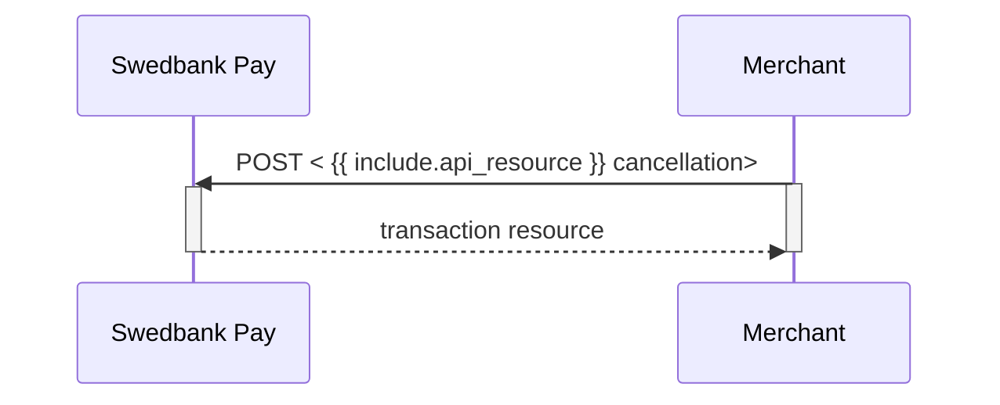




## Cancel

The `cancellations` resource lists the cancellation transactions on a
specific payment.

## Create Cancel Transaction

To cancel a previously created payment, you must perform the `cancel` operation
against the accompanying `href` returned in the `operations` list. You can only
cancel a payment - or part of a payment - which has not been captured yet. There
must be funds left that are only authorized. If you cancel before any capture
has been done, no captures can be performed later.

## Cancel Request (All Versions)

POST /psp/paymentorders/{{ page.payment_order_id }}/cancellations HTTP/1.1
Host: {{ page.api_host }}
Authorization: Bearer <AccessToken>
Content-Type: application/json;version=3.x/2.0      // Version optional for 3.0 and 2.0

{
    "transaction": {
        "description": "Test Cancellation",
        "payeeReference": "ABC123"
    }
}



{:.table .table-striped}
|     Required     | Field                    | Type         | Description                                                                                    |
| :--------------: | :----------------------- | :----------- | :--------------------------------------------------------------------------------------------- |
|  | `transaction`            | `object`     | The transaction object.                                                                        |
|  |     | `string`     | A textual description of why the transaction is cancelled.                                     |
|  |  | `string(30)` |  |

## Cancel Response

If the cancel request succeeds, the response should be similar to the
example below:

HTTP/1.1 200 OK
Content-Type: application/json; charset=utf-8; version=3.0/2.0
api-supported-versions: 3.0/2.0

{
    "payment": "/psp/creditcard/payments/{{ page.payment_id }}",
    "cancellation": {
        "id": "/psp/creditcard/payments/{{ page.payment_id }}/cancellations/{{ page.transaction_id }}",
        "transaction": {
            "id": "/psp/creditcard/payments/{{ page.payment_id }}/transactions/{{ page.transaction_id }}",
            "created": "2022-01-31T09:49:13.7567756Z",
            "updated": "2022-01-31T09:49:14.7374165Z",
            "type": "Cancellation",
            "state": "Completed",
            "number": 71100732065,
            "amount": 1500,
            "vatAmount": 375,
            "description": "Test Cancellation",
            "payeeReference": "AB123"
        }
    }
}




{:.table .table-striped .mb-5}
| Property                  | Type      | Description                                                                                                                                                                                                  |
| :------------------------ | :-------- | :----------------------------------------------------------------------------------------------------------------------------------------------------------------------------------------------------------- |
|                  | `string`  | The relative URL of the payment this cancellation transaction belongs to.                                                                                                                                    |
|             | `object`  | The cancellation object, containing information about the cancellation transaction.                                                                                                                          |
|               | `string`  | The relative URL of the cancellation transaction.                                                                                                                                                            |
|      | `object`  |                                                                                                                                 |
|              | `string`  | The relative URL of the current `transaction` resource.                                                                                                                                                      |
|         | `string`  | The ISO-8601 date and time of when the transaction was created.                                                                                                                                              |
|         | `string`  | The ISO-8601 date and time of when the transaction was updated.                                                                                                                                              |
|            | `string`  | Indicates the transaction type.                                                                                                                                                                              |
|           | `string`  | `Initialized`, `Completed` or `Failed`. Indicates the state of the transaction.                                                                                                                              |
|          | `integer` |  |
|          | `integer` |                                                                                                                                                                     |
|       | `integer` |                                                                                                                                                                  |
|     | `string`  | A human readable description of maximum 40 characters of the transaction.                                                                                                                                    |
|  | `string(30)`  |                                                                                          |



## Cancel Response v3.1

If the cancel request succeeds, the response should be similar to the
example below:

HTTP/1.1 200 OK
Content-Type: application/json; charset=utf-8; version=3.1
api-supported-versions: 3.1

{
  "paymentOrder": {
    "id": "/psp/paymentorders/8be318c1-1caa-4db1-e2c6-08d7bf41224d",
    "created": "2020-03-03T07:19:27.5636519Z",
    "updated": "2020-03-03T07:21:00.5605905Z",
    "operation": "Purchase",
    "status": "Cancelled",
    "currency": "SEK",
    "amount": 1500,
    "vatAmount": 375,
    "description": "Test Purchase",
    "initiatingSystemUserAgent": "<should be set by the system calling POST:/psp/paymentorders>",
    "language": "sv-SE",
    "availableInstruments": [ "CreditCard", "Invoice-PayExFinancingSe", "Invoice-PayMonthlyInvoiceSe", "Swish", "CreditAccount", "Trustly" ],
    "implementation": "PaymentsOnly",
    "integration": "HostedView|Redirect",
    "instrumentMode": true,
    "guestMode": true,
    "orderItems": {
      "id": "/psp/paymentorders/8be318c1-1caa-4db1-e2c6-08d7bf41224d/orderitems"
    },
    "urls": {
      "id": "/psp/paymentorders/8be318c1-1caa-4db1-e2c6-08d7bf41224d/urls"
    },
    "payeeInfo": {
      "id": "/psp/paymentorders/8be318c1-1caa-4db1-e2c6-08d7bf41224d/payeeInfo"
    },
    "payer": {
      "id": "/psp/paymentorders/8be318c1-1caa-4db1-e2c6-08d7bf41224d/payers"
    },
    "history": {
      "id": "/psp/paymentorders/8be318c1-1caa-4db1-e2c6-08d7bf41224d/history"
    },
    "failed": {
      "id": "/psp/paymentorders/8be318c1-1caa-4db1-e2c6-08d7bf41224d/failed"
    },
    "aborted": {
      "id": "/psp/paymentorders/8be318c1-1caa-4db1-e2c6-08d7bf41224d/aborted"
    },
    "paid": {
      "id": "/psp/paymentorders/8be318c1-1caa-4db1-e2c6-08d7bf41224d/paid"
    },
    "cancelled": {
      "id": "/psp/paymentorders/8be318c1-1caa-4db1-e2c6-08d7bf41224d/cancelled"
    },
    "financialTransactions": {
      "id": "/psp/paymentorders/8be318c1-1caa-4db1-e2c6-08d7bf41224d/financialtransactions"
    },
    "failedAttempts": {
      "id": "/psp/paymentorders/8be318c1-1caa-4db1-e2c6-08d7bf41224d/failedattempts"
    },
    "postPurchaseFailedAttempts": {
      "id": "/psp/paymentorders/8be318c1-1caa-4db1-e2c6-08d7bf41224d/postpurchasefailedattempts"
    },
    "metadata": {
      "id": "/psp/paymentorders/8be318c1-1caa-4db1-e2c6-08d7bf41224d/metadata"
    }
  },
  "operations": [
  ]
}




{:.table .table-striped .mb-5}
| Property                    | Type         | Description                                                                                                                                                                                                       |
| :-------------------------- | :----------- | :---------------------------------------------------------------------------------------------------------------------------------------------------------------------------------------------------------------- |
|                    | `string`     | The relative URL of the payment order this capture transaction belongs to.                                                                                                                                              |
|                 | `string`     | The relative URL of the created capture transaction.                                                                                                                                                              |
|           | `string`     | The ISO-8601 date and time of when the transaction was created.                                                                                                                                                   |
|           | `string`     | The ISO-8601 date and time of when the transaction was updated.                                                                                                                                                   |
|             | `string`     |             |
|             | `string`     |             |
|             | `string`     | The currency of the payment order.            |
|            | `integer`    |                                                                                                                                                                          |
|         | `integer`    |                                                                                                                                                                       |
|       | `integer`    | The remaining authorized amount that is still possible to capture.                                                                                                                                                                             |
|       | `integer`    | The remaining authorized amount that is still possible to cancel.                                                                                                                                                                             |
|       | `integer`    | The remaining captured amount that is still available for reversal.                                                                                                                                                                             |
|       | `string`     |                                                                                                                                    |
|       | `string`     |                                                                                                                                                           |
|        | `string`     |                                                                                                                                                   |
|        | `string`     | A list of payment methods available for this payment.                                                                                                                                                   |
|        | `string`     | The merchant's Online Payments implementation type. `Enterprise` or `PaymentsOnly`. We ask that you don't build logic around this field's response. It is mainly for information purposes, as the implementation types might be subject to name changes. If this should happen, updated information will be available in this table.                                                                                                   |
|        | `string`     | The merchant's Online Payments integration type. `HostedView` (Seamless View) or `Redirect`. This field will not be populated until the payer has opened the payment UI, and the client script has identified if Swedbank Pay or another URI is hosting the container with the payment iframe. We ask that you don't build logic around this field's response. It is mainly for information purposes. as the integration types might be subject to name changes, If this should happen, updated information will be available in this table.                           |
|        | `bool`     | Set to `true` or `false`. Indicates if the payment is initialized with only one payment method available.                                                                                    |
|        | `bool`     | Set to `true` or `false`. Indicates if the payer chose to pay as a guest or not. When using the Payments Only implementation, this is triggered by not including a `payerReference` in the original `paymentOrder` request.                                                                                                                                                |
|      | `id`     | The URL to the `orderItems` resource where information about the order items can be retrieved.                                                                                                                            |
|            | `id`     | The URL to the `urls` resource where all URLs related to the payment order can be retrieved.                                                                                                                              |
|       | `id`     | The URL to the `payeeInfo` resource where information related to the payee can be retrieved.                                                                                                            |
|          | `id`     | The URL to the [`payer` resource]({{ features_url }}/technical-reference/resource-sub-models#payer) where information about the payer can be retrieved.                                                                                                                 |
|      | `id`     | The URL to the `history` resource where information about the payment's history can be retrieved.                                                                                                                            |
|      | `id`     | The URL to the `failed` resource where information about the failed transactions can be retrieved.                                                                                                                            |
|      | `id`     | The URL to the `aborted` resource where information about the aborted transactions can be retrieved.                                                                                                                            |
|      | `id`     | The URL to the `paid` resource where information about the paid transactions can be retrieved.                                                                                                                            |
|      | `id`     | The URL to the `cancelled` resource where information about the cancelled transactions can be retrieved.                                                                                                                            |
|      | `id`     | The URL to the `financialTransactions` resource where information about the financial transactions can be retrieved.                                                                                                                            |
|      | `id`     | The URL to the `failedAttempts` resource where information about the failed attempts can be retrieved.                                                                                                                            |
|      | `id`     | The URL to the `postPurchaseFailedAttempts` resource where information about the failed capture, cancel or reversal attempts can be retrieved.                                                                                                                            |
|      | `id`     | The URL to the `metadata` resource where information about the metadata can be retrieved.                                                                                                                            |
|      | `array`      |  [See Operations for details]({{ features_url }}/technical-reference/operations).                                                                                              |



## Cancel Sequence Diagram

Cancel can only be done on an authorized transaction. As a cancellation does not
have an amount associated with it, it will release the entire reserved amount.
If your intention is to make detailed handling, such as only capturing a partial
amount of the transaction, you must start with the capture of the desired amount
before performing a cancel for the remaining reserved funds.

