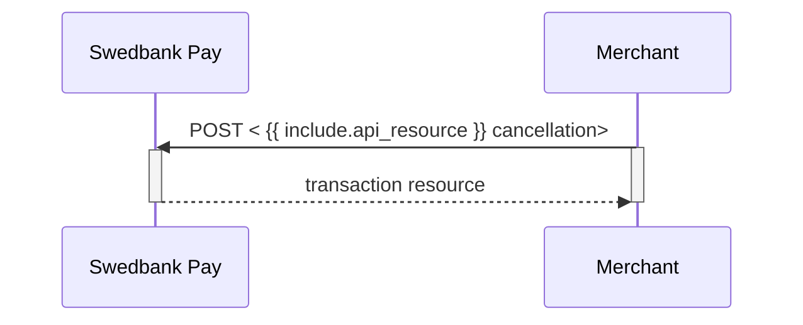

<!-- Captures for tables -->












<!-- Captures for tables -->





## Cancel

The `cancellations` resource lists the cancellation transactions on a
specific payment.

## Create Cancel Transaction

To cancel a previously created payment, you must perform the `cancel` operation
against the accompanying `href` returned in the `operations` list. You can only
cancel a payment - or part of a payment - which has not been captured yet. There
must be funds left that are only authorized. If you cancel before any capture
has been done, no captures can be performed later.

## Cancel Request (All Versions)

POST /psp/paymentorders/{{ page.payment_order_id }}/cancellations HTTP/1.1
Host: {{ page.api_host }}
Authorization: Bearer <AccessToken>
Content-Type: application/json;version=3.x/2.0      // Version optional for 3.0 and 2.0

{
    "transaction": {
        "description": "Test Cancellation",
        "payeeReference": "ABC123"
    }
}



  

    
Field

    
Type

    
Required

  

  

    

      <i aria-hidden="true" class="chev swepay-icon-plus-add"></i>
      <code>object</code>
      
    

    

      
The transaction object.

    

    

      

        

          <i aria-hidden="true" class="chev swepay-icon-plus-add"></i>
          <code>string</code>
          
        

        

          
A textual description of why the transaction is cancelled.

        

      

      

        

          <i aria-hidden="true" class="chev swepay-icon-plus-add"></i>
          <code>string(30)</code>
          
        

        

          
{{ payee_reference_desc | markdownify }}

        

      

    

  

## Cancel Response

If the cancel request succeeds, the response should be similar to the
example below:

HTTP/1.1 200 OK
Content-Type: application/json; charset=utf-8; version=3.0/2.0
api-supported-versions: 3.0/2.0

{
    "payment": "/psp/creditcard/payments/{{ page.payment_id }}",
    "cancellation": {
        "id": "/psp/creditcard/payments/{{ page.payment_id }}/cancellations/{{ page.transaction_id }}",
        "transaction": {
            "id": "/psp/creditcard/payments/{{ page.payment_id }}/transactions/{{ page.transaction_id }}",
            "created": "2022-01-31T09:49:13.7567756Z",
            "updated": "2022-01-31T09:49:14.7374165Z",
            "type": "Cancellation",
            "state": "Completed",
            "number": 71100732065,
            "amount": 1500,
            "vatAmount": 375,
            "description": "Test Cancellation",
            "payeeReference": "AB123"
        }
    }
}



  

    
Field

    
Type

  

  <!-- payment (root 0) -->
  

    

      <i aria-hidden="true" class="chev swepay-icon-plus-add"></i>
      <code>string</code>
    

    

The relative URL of the payment this cancellation transaction belongs to.

  

  <!-- cancellation (root 0) -->
  

    

      <i aria-hidden="true" class="chev swepay-icon-plus-add"></i>
      <code>object</code>
    

    

The cancellation object, containing information about the cancellation transaction.

    <!-- Children of cancellation (level 1) -->
    

      <!-- cancellation.id -->
      

        

          <i aria-hidden="true" class="chev swepay-icon-plus-add"></i>
          <code>string</code>
        

        

The relative URL of the cancellation transaction.

      

      <!-- cancellation.transaction -->
      

        

          <i aria-hidden="true" class="chev swepay-icon-plus-add"></i>
          <code>object</code>
        

        

{{ transaction_md | markdownify }}

        <!-- Children of transaction (level 2) -->
        

          

            

              <i aria-hidden="true" class="chev swepay-icon-plus-add"></i>
              <code>string</code>
            

            

The relative URL of the current <code>transaction</code> resource.

          

          

            

              <i aria-hidden="true" class="chev swepay-icon-plus-add"></i>
              <code>date(string)</code>
            

            

The ISO 8601 date and time of when the transaction was created. Written in the format YYYY-MM-DDTHH:MM:SSZ, where Z indicates UTC.

          

          

            

              <i aria-hidden="true" class="chev swepay-icon-plus-add"></i>
              <code>date(string)</code>
            

            

The ISO 8601 date and time of when the transaction was updated. Written in the format YYYY-MM-DDTHH:MM:SSZ, where Z indicates UTC.

          

          

            

              <i aria-hidden="true" class="chev swepay-icon-plus-add"></i>
              <code>string</code>
            

            

Indicates the transaction type.

          

          

            

              <i aria-hidden="true" class="chev swepay-icon-plus-add"></i>
              <code>string</code>
            

            

<code>Initialized</code>, <code>Completed</code> or <code>Failed</code>. Indicates the state of the transaction.

          

          

            

              <i aria-hidden="true" class="chev swepay-icon-plus-add"></i>
              <code>integer</code>
            

            

{{ number_md | markdownify }}

          

          

            

              <i aria-hidden="true" class="chev swepay-icon-plus-add"></i>
              <code>integer</code>
            

            

{{ amount_md | markdownify }}

          

          

            

              <i aria-hidden="true" class="chev swepay-icon-plus-add"></i>
              <code>integer</code>
            

            

{{ vat_amount_md | markdownify }}

          

          

            

              <i aria-hidden="true" class="chev swepay-icon-plus-add"></i>
              <code>string</code>
            

            

A human readable description of maximum 40 characters of the transaction.

          

          

            

              <i aria-hidden="true" class="chev swepay-icon-plus-add"></i>
              <code>string(30)</code>
            

            

{{ payee_reference_md | markdownify }}

          

        

      

    

  

## Cancel Response v3.1

If the cancel request succeeds, the response should be similar to the
example below:

HTTP/1.1 200 OK
Content-Type: application/json; charset=utf-8; version=3.1
api-supported-versions: 3.1

{
  "paymentOrder": {
    "id": "/psp/paymentorders/8be318c1-1caa-4db1-e2c6-08d7bf41224d",
    "created": "2020-03-03T07:19:27.5636519Z",
    "updated": "2020-03-03T07:21:00.5605905Z",
    "operation": "Purchase",
    "status": "Cancelled",
    "currency": "SEK",
    "amount": 1500,
    "vatAmount": 375,
    "description": "Test Purchase",
    "initiatingSystemUserAgent": "<should be set by the system calling POST:/psp/paymentorders>",
    "language": "sv-SE",
    "availableInstruments": [ "CreditCard", "Invoice-PayExFinancingSe", "Invoice-PayMonthlyInvoiceSe", "Swish", "CreditAccount", "Trustly" ],
    "implementation": "PaymentsOnly",
    "integration": "HostedView|Redirect",
    "instrumentMode": true,
    "guestMode": true,
    "orderItems": {
      "id": "/psp/paymentorders/8be318c1-1caa-4db1-e2c6-08d7bf41224d/orderitems"
    },
    "urls": {
      "id": "/psp/paymentorders/8be318c1-1caa-4db1-e2c6-08d7bf41224d/urls"
    },
    "payeeInfo": {
      "id": "/psp/paymentorders/8be318c1-1caa-4db1-e2c6-08d7bf41224d/payeeInfo"
    },
    "payer": {
      "id": "/psp/paymentorders/8be318c1-1caa-4db1-e2c6-08d7bf41224d/payers"
    },
    "history": {
      "id": "/psp/paymentorders/8be318c1-1caa-4db1-e2c6-08d7bf41224d/history"
    },
    "failed": {
      "id": "/psp/paymentorders/8be318c1-1caa-4db1-e2c6-08d7bf41224d/failed"
    },
    "aborted": {
      "id": "/psp/paymentorders/8be318c1-1caa-4db1-e2c6-08d7bf41224d/aborted"
    },
    "paid": {
      "id": "/psp/paymentorders/8be318c1-1caa-4db1-e2c6-08d7bf41224d/paid"
    },
    "cancelled": {
      "id": "/psp/paymentorders/8be318c1-1caa-4db1-e2c6-08d7bf41224d/cancelled"
    },
    "financialTransactions": {
      "id": "/psp/paymentorders/8be318c1-1caa-4db1-e2c6-08d7bf41224d/financialtransactions"
    },
    "failedAttempts": {
      "id": "/psp/paymentorders/8be318c1-1caa-4db1-e2c6-08d7bf41224d/failedattempts"
    },
    "postPurchaseFailedAttempts": {
      "id": "/psp/paymentorders/8be318c1-1caa-4db1-e2c6-08d7bf41224d/postpurchasefailedattempts"
    },
    "metadata": {
      "id": "/psp/paymentorders/8be318c1-1caa-4db1-e2c6-08d7bf41224d/metadata"
    }
  },
  "operations": [
  ]
}



  

    
Field

    
Type

  

  <!-- paymentOrder (root level 0) -->
  

    

      <i aria-hidden="true" class="chev swepay-icon-plus-add"></i>
      <code>string</code>
    

    

The relative URL of the payment order this capture transaction belongs to.

    <!-- Children of paymentOrder (level 1) -->
    

      

        

          <i aria-hidden="true" class="chev swepay-icon-plus-add"></i>
          <code>string</code>
        

        

The relative URL of the created capture transaction.

      

      

        

          <i aria-hidden="true" class="chev swepay-icon-plus-add"></i>
          <code>date(string)</code>
        

        

The ISO 8601 date and time of when the transaction was created. Written in the format YYYY-MM-DDTHH:MM:SSZ, where Z indicates UTC.

      

      

        

          <i aria-hidden="true" class="chev swepay-icon-plus-add"></i>
          <code>date(string)</code>
        

        

The ISO 8601 date and time of when the transaction was updated. Written in the format YYYY-MM-DDTHH:MM:SSZ, where Z indicates UTC.

      

      

        

          <i aria-hidden="true" class="chev swepay-icon-plus-add"></i>
          <code>string</code>
        

        

{{ operation_md | markdownify }}

      

      

        

          <i aria-hidden="true" class="chev swepay-icon-plus-add"></i>
          <code>string</code>
        

        

{{ status_md | markdownify }}

      

      

        

          <i aria-hidden="true" class="chev swepay-icon-plus-add"></i>
          <code>enum(string)</code>
        

        

The currency of the payment order in the ISO 4217 format (e.g. <code>DKK</code>, <code>EUR</code>, <code>NOK</code> or <code>SEK</code>). Some payment methods are only available with selected currencies.

      

      

        

          <i aria-hidden="true" class="chev swepay-icon-plus-add"></i>
          <code>integer</code>
        

        

{{ amount_md | markdownify }}

      

      

        

          <i aria-hidden="true" class="chev swepay-icon-plus-add"></i>
          <code>integer</code>
        

        

{{ vat_amount_md | markdownify }}

      

      

        

          <i aria-hidden="true" class="chev swepay-icon-plus-add"></i>
          <code>integer</code>
        

        

The remaining authorized amount that is still possible to capture.

      

      

        

          <i aria-hidden="true" class="chev swepay-icon-plus-add"></i>
          <code>integer</code>
        

        

The remaining authorized amount that is still possible to cancel.

      

      

        

          <i aria-hidden="true" class="chev swepay-icon-plus-add"></i>
          <code>integer</code>
        

        

The remaining captured amount that is still available for reversal.

      

      

        

          <i aria-hidden="true" class="chev swepay-icon-plus-add"></i>
          <code>string</code>
        

        

{{ description_md | markdownify }}

      

      

        

          <i aria-hidden="true" class="chev swepay-icon-plus-add"></i>
          <code>string</code>
        

        

{{ initiating_system_user_agent_md | markdownify }}

      

      

        

          <i aria-hidden="true" class="chev swepay-icon-plus-add"></i>
          <code>enum(string)</code>
        

        

{{ language_md | markdownify }}

      

      

        

          <i aria-hidden="true" class="chev swepay-icon-plus-add"></i>
          <code>array</code>
        

        

A list of payment methods available for this payment.

      

      

        

          <i aria-hidden="true" class="chev swepay-icon-plus-add"></i>
          <code>string</code>
        

        

The merchant's Online Payments implementation type. <code>Enterprise</code> or <code>PaymentsOnly</code>. We ask that you don't build logic around this field's response. It is mainly for information purposes, as the implementation types might be subject to name changes. If this should happen, updated information will be available in this table.

      

      

        

          <i aria-hidden="true" class="chev swepay-icon-plus-add"></i>
          <code>string</code>
        

        

The merchant's Online Payments integration type. <code>HostedView</code> (Seamless View) or <code>Redirect</code>. This field will not be populated until the payer has opened the payment UI, and the client script has identified if Swedbank Pay or another URI is hosting the container with the payment iframe. We ask that you don't build logic around this field's response. It is mainly for information purposes. as the integration types might be subject to name changes, If this should happen, updated information will be available in this table.

      

      

        

          <i aria-hidden="true" class="chev swepay-icon-plus-add"></i>
          <code>bool</code>
        

        

Set to <code>true</code> or <code>false</code>. Indicates if the payment is initialized with only one payment method available.

      

      

        

          <i aria-hidden="true" class="chev swepay-icon-plus-add"></i>
          <code>bool</code>
        

        

Set to <code>true</code> or <code>false</code>. Indicates if the payer chose to pay as a guest or not. When using the Payments Only implementation, this is triggered by not including a <code>payerReference</code> in the original <code>paymentOrder</code> request.

      

      <!-- ID sub-resources -->
      

        

          <i aria-hidden="true" class="chev swepay-icon-plus-add"></i>
          <code>id</code>
        

        

The URL to the <code>orderItems</code> resource where information about the order items can be retrieved.

      

      

        

          <i aria-hidden="true" class="chev swepay-icon-plus-add"></i>
          <code>id</code>
        

        

The URL to the <code>urls</code> resource where all URLs related to the payment order can be retrieved.

      

      

        

          <i aria-hidden="true" class="chev swepay-icon-plus-add"></i>
          <code>id</code>
        

        

The URL to the <code>payeeInfo</code> resource where information related to the payee can be retrieved.

      

      

        

          <i aria-hidden="true" class="chev swepay-icon-plus-add"></i>
          <code>id</code>
        

        

The URL to the <a href="{{ techref_url }}/technical-reference/resource-sub-models#payer"><code>payer</code> resource</a> where information about the payer can be retrieved.

      

      

        

          <i aria-hidden="true" class="chev swepay-icon-plus-add"></i>
          <code>id</code>
        

        

The URL to the <code>history</code> resource where information about the payment's history can be retrieved.

      

      

        

          <i aria-hidden="true" class="chev swepay-icon-plus-add"></i>
          <code>id</code>
        

        

The URL to the <code>failed</code> resource where information about the failed transactions can be retrieved.

      

      

        

          <i aria-hidden="true" class="chev swepay-icon-plus-add"></i>
          <code>id</code>
        

        

The URL to the <code>aborted</code> resource where information about the aborted transactions can be retrieved.

      

      

        

          <i aria-hidden="true" class="chev swepay-icon-plus-add"></i>
          <code>id</code>
        

        

The URL to the <code>paid</code> resource where information about the paid transactions can be retrieved.

      

      

        

          <i aria-hidden="true" class="chev swepay-icon-plus-add"></i>
          <code>id</code>
        

        

The URL to the <code>cancelled</code> resource where information about the cancelled transactions can be retrieved.

      

      

        

          <i aria-hidden="true" class="chev swepay-icon-plus-add"></i>
          <code>id</code>
        

        

The URL to the <code>financialTransactions</code> resource where information about the financial transactions can be retrieved.

      

      

        

          <i aria-hidden="true" class="chev swepay-icon-plus-add"></i>
          <code>id</code>
        

        

The URL to the <code>failedAttempts</code> resource where information about the failed attempts can be retrieved.

      

      

        

          <i aria-hidden="true" class="chev swepay-icon-plus-add"></i>
          <code>id</code>
        

        

The URL to the <code>postPurchaseFailedAttempts</code> resource where information about the failed capture, cancel or reversal attempts can be retrieved.

      

      

        

          <i aria-hidden="true" class="chev swepay-icon-plus-add"></i>
          <code>id</code>
        

        

The URL to the <code>metadata</code> resource where information about the metadata can be retrieved.

      

    
<!-- /.api-children (paymentOrder) -->
  

  <!-- operations (sibling to paymentOrder at level 0) -->
  

    

      <i aria-hidden="true" class="chev swepay-icon-plus-add"></i>
      <code>array</code>
    

    

{{ operations_md | markdownify }} <a href="{{ techref_url }}/technical-reference/operations">See Operations for details</a>.

  

## Cancel Sequence Diagram

Cancel can only be done on an authorized transaction. As a cancellation does not
have an amount associated with it, it will release the entire reserved amount.
If your intention is to make detailed handling, such as only capturing a partial
amount of the transaction, you must start with the capture of the desired amount
before performing a cancel for the remaining reserved funds.

