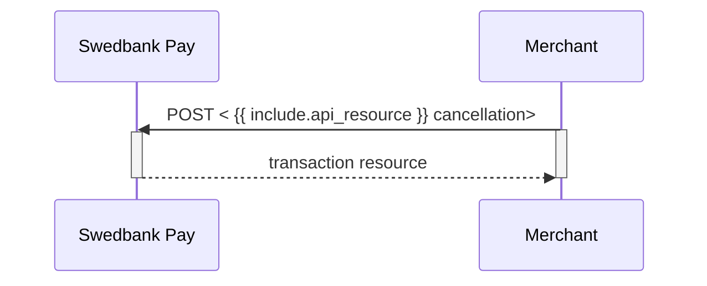




## Cancel

The `cancellations` resource lists the cancellation transactions on a
specific payment.

## Create Cancel Transaction



To cancel a previously created payment, you must perform the `cancel` operation
against the accompanying `href` returned in the `operations` list. You can only
cancel a payment - or part of a payment - which has not been captured yet.



To cancel a previously created payment, you must perform the
`create-paymentorder-cancel` operation against the accompanying `href` returned
in the `operations` list. You can only cancel a payment - or part of a payment -
which has not been captured yet.



## Cancel Request

{:.code-view-header}
**Request**

```http
POST /psp/paymentorders/{{ page.payment_order_id }}/cancellations HTTP/1.1
Host: {{ page.api_host }}
Authorization: Bearer <AccessToken>
Content-Type: application/json

{
    "transaction": {
        "description": "Test Cancellation"
        "payeeReference": "ABC123"
    }
}
```

{:.table .table-striped}
|     Required     | Field                    | Type         | Description                                                                                    |
| :--------------: | :----------------------- | :----------- | :--------------------------------------------------------------------------------------------- |
|  | `transaction`            | `object`     | The transaction object.                                                                        |
|  | └➔&nbsp;`description`    | `string`     | A textual description of why the transaction is cancelled.                                     |
|  | └➔&nbsp;`payeeReference` | `string(30)` |  |

## Cancel Response

If the cancel request succeeds, the response should be similar to the example
below:

{:.code-view-header}
**Response**

```http
HTTP/1.1 200 OK
Content-Type: application/json

{
    "payment": "/psp/paymentorders/payments/{{ page.payment_id }}",
    "cancellation": {
        "id": "/psp/paymentorders/payments/{{ page.payment_id }}/cancellations/{{ page.transaction_id }}",
        "transaction": {
            "id": "/psp/paymentorders/payments/{{ page.payment_id }}/transactions/{{ page.transaction_id }}",
            "created": "2022-01-31T09:49:13.7567756Z",
            "updated": "2022-01-31T09:49:14.7374165Z",
            "type": "Cancellation",
            "state": "Completed",
            "number": 71100732065,
            "amount": 1500,
            "vatAmount": 375,
            "description": "Test Cancellation",
            "payeeReference": "AB123"
        }
    }
}
```

{:.table .table-striped}
| Property                  | Type      | Description                                                                                                                                                                                                  |
| :------------------------ | :-------- | :----------------------------------------------------------------------------------------------------------------------------------------------------------------------------------------------------------- |
| `payment`                 | `string`  | The relative URL of the payment this cancellation transaction belongs to.                                                                                                                                    |
| `cancellation`            | `object`  | The cancellation object, containing information about the cancellation transaction.                                                                                                                          |
| └➔&nbsp;`id`              | `string`  | The relative URL of the cancellation transaction.                                                                                                                                                            |
| └➔&nbsp;`transaction`     | `object`  | The transaction object, containing information about the current transaction.                                                                                                                                |
| └─➔&nbsp;`id`             | `string`  | The relative URL of the current `transaction` resource.                                                                                                                                                      |
| └─➔&nbsp;`created`        | `string`  | The ISO-8601 date and time of when the transaction was created.                                                                                                                                              |
| └─➔&nbsp;`updated`        | `string`  | The ISO-8601 date and time of when the transaction was updated.                                                                                                                                              |
| └─➔&nbsp;`type`           | `string`  | Indicates the transaction type.                                                                                                                                                                              |
| └─➔&nbsp;`state`          | `string`  | `Initialized`, `Completed` or `Failed`. Indicates the state of the transaction.                                                                                                                              |
| └─➔&nbsp;`number`         | `string`  | The transaction `number`, useful when there's need to reference the transaction in human communication. Not usable for programmatic identification of the transaction, for that `id` should be used instead. |
| └─➔&nbsp;`amount`         | `integer` |                                                                                                                                                                     |
| └─➔&nbsp;`vatAmount`      | `integer` |                                                                                                                                                                  |
| └─➔&nbsp;`description`    | `string`  | A human readable description of maximum 40 characters of the transaction.                                                                                                                                    |
| └─➔&nbsp;`payeeReference` | `string`  |                                                                                          |

### Cancel Sequence Diagram

Cancel can only be done on a authorized transaction. If you perform a cancel
after doing a partial capture, you will cancel the remaining authorized amount.



[payee-reference]: {{ features_url }}/technical-reference/payee-reference
