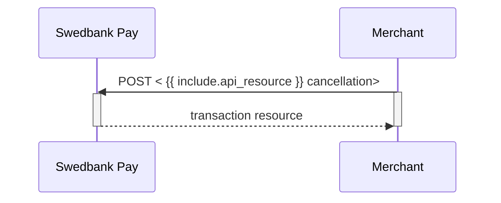




## Cancel

The `cancellations` resource lists the cancellation transactions on a
specific payment.

## Create Cancel Transaction



To cancel a previously created payment, you must perform the `cancel` operation
against the accompanying `href` returned in the `operations` list. You can only
cancel a payment - or part of a payment - which has not been captured yet. There
must be funds left that are only authorized. If you cancel before any capture
has been done, no captures can be performed later.



To cancel a previously created payment, you must perform the
`create-paymentorder-cancel` operation against the accompanying `href` returned
in the `operations` list. You can only cancel a payment - or part of a payment -
which has not been captured yet. If you cancel before any capture has been done,
no captures can be performed later.



## Cancel Request

POST /psp/paymentorders/{{ page.payment_order_id }}/cancellations HTTP/1.1
Host: {{ page.api_host }}
Authorization: Bearer <AccessToken>
Content-Type: application/json;version=3.0/2.0      // Version optional

{
    "transaction": {
        "description": "Test Cancellation",
        "payeeReference": "ABC123"
    }
}





  

    
Field

    
Type

    
Required

  

  <!-- Level 0 (root) -->
  

    

      <i aria-hidden="true" class="chev swepay-icon-plus-add"></i>
      <code>object</code>
      
    

    

The transaction object.

    <!-- Children of transaction (level 1) -->
    

      

        

          <i aria-hidden="true" class="chev swepay-icon-plus-add"></i>
          <code>string</code>
          
        

        

A textual description of why the transaction is cancelled.

      

      

        

          <i aria-hidden="true" class="chev swepay-icon-plus-add"></i>
          <code>string(30)</code>
          
        

        

{{ payee_reference_md | markdownify }}

      

    
<!-- /.api-children -->
  
<!-- /.level-0 -->

<!-- /.api-compact -->

## Cancel Response

If the cancel request succeeds, the response should be similar to the
example below:

HTTP/1.1 200 OK
Content-Type: application/json; charset=utf-8; version=3.0/2.0
api-supported-versions: 3.0/2.0

{
    "payment": "/psp/creditcard/payments/{{ page.payment_id }}",
    "cancellation": {
        "id": "/psp/creditcard/payments/{{ page.payment_id }}/cancellations/{{ page.transaction_id }}",
        "transaction": {
            "id": "/psp/creditcard/payments/{{ page.payment_id }}/transactions/{{ page.transaction_id }}",
            "created": "2022-01-31T09:49:13.7567756Z",
            "updated": "2022-01-31T09:49:14.7374165Z",
            "type": "Cancellation",
            "state": "Completed",
            "number": 71100732065,
            "amount": 1500,
            "vatAmount": 375,
            "description": "Test Cancellation",
            "payeeReference": "AB123"
        }
    }
}









  

    
Field

    
Type

  

  <!-- payment (root 0) -->
  

    

      <i aria-hidden="true" class="chev swepay-icon-plus-add"></i>
      <code>string</code>
    

    

The relative URL of the payment this cancellation transaction belongs to.

  

  <!-- cancellation (root 0) -->
  

    

      <i aria-hidden="true" class="chev swepay-icon-plus-add"></i>
      <code>object</code>
    

    

The cancellation object, containing information about the cancellation transaction.

    <!-- Children of cancellation (level 1) -->
    

      <!-- cancellation.id -->
      

        

          <i aria-hidden="true" class="chev swepay-icon-plus-add"></i>
          <code>string</code>
        

        

The relative URL of the cancellation transaction.

      

      <!-- cancellation.transaction -->
      

        

          <i aria-hidden="true" class="chev swepay-icon-plus-add"></i>
          <code>object</code>
        

        

{{ transaction_md | markdownify }}

        <!-- Children of transaction (level 2) -->
        

          

            

              <i aria-hidden="true" class="chev swepay-icon-plus-add"></i>
              <code>string</code>
            

            

The relative URL of the current <code>transaction</code> resource.

          

          

            

              <i aria-hidden="true" class="chev swepay-icon-plus-add"></i>
              <code>date(string)</code>
            

            

The <a href="https://en.wikipedia.org/wiki/ISO_8601">ISO 8601</a> date and time when the transaction was created.

          

          

            

              <i aria-hidden="true" class="chev swepay-icon-plus-add"></i>
              <code>date(string)</code>
            

            

The <a href="https://en.wikipedia.org/wiki/ISO_8601">ISO 8601</a> date and time when the transaction was updated.

          

          

            

              <i aria-hidden="true" class="chev swepay-icon-plus-add"></i>
              <code>string</code>
            

            

Indicates the transaction type.

          

          

            

              <i aria-hidden="true" class="chev swepay-icon-plus-add"></i>
              <code>string</code>
            

            

<code>Initialized</code>, <code>Completed</code> or <code>Failed</code>. Indicates the state of the transaction.

          

          

            

              <i aria-hidden="true" class="chev swepay-icon-plus-add"></i>
              <code>integer</code>
            

            

{{ number_md | markdownify }}

          

          

            

              <i aria-hidden="true" class="chev swepay-icon-plus-add"></i>
              <code>integer</code>
            

            

{{ amount_md | markdownify }}

          

          

            

              <i aria-hidden="true" class="chev swepay-icon-plus-add"></i>
              <code>integer</code>
            

            

{{ vat_amount_md | markdownify }}

          

          

            

              <i aria-hidden="true" class="chev swepay-icon-plus-add"></i>
              <code>string</code>
            

            

A human readable description of maximum 40 characters of the transaction.

          

          

            

              <i aria-hidden="true" class="chev swepay-icon-plus-add"></i>
              <code>string(30)</code>
            

            

{{ payee_reference_md | markdownify }}

          

        

      

    

  

## Cancel Sequence Diagram

Cancel can only be done on an authorized transaction. As a cancellation does not
have an amount associated with it, it will release the entire reserved amount.
If your intention is to make detailed handling, such as only capturing a partial
amount of the transaction, you must start with the capture of the desired amount
before performing a cancel for the remaining reserved funds.

