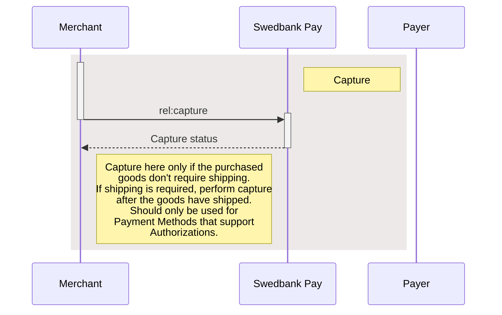





## Capture

Captures are only possible when a payment has a successful `Authorization`
transaction, naturally excluding one-phase payment methods like Swish and
Trustly. They will be marked as a `Sale` transaction. Two-phase payment methods
like card and Vipps however, require a `Capture` to be completed.

Please note that you have a maximum of 5 **consecutive** failed attempts at a
capture. The payment will be locked after the fifth, and you need to contact us
for further attempts.

In addition to full captures, it is possible to do partial captures of the
authorized amount. You can do more captures on the same payment later, up to the
total authorized amount. A useful tool for when you have to split orders into
several shipments.

First off, you must request the order information from the server to get the
request link. With this, you can request the capture with the amount to capture,
and get the status back.

## Create Capture Transaction

To capture the authorized payment, you need to perform a `capture` against the
accompanying `href` returned in the `operations` list. See the abbreviated
request and response below:

## Capture Request

POST /psp/paymentorders/{{ page.payment_order_id }}/captures HTTP/1.1
Host: {{ page.api_host }}
Authorization: Bearer <AccessToken>
Content-Type: application/json;version=3.0/2.0      // Version optional

{
    "transaction": {
        "description": "Capturing the authorized payment",
        "amount": 1500,
        "vatAmount": 375,
        "payeeReference": "AB832",
        "receiptReference": "AB831",
        "orderItems": [
            {
                "reference": "P1",
                "name": "Product1",
                "type": "PRODUCT",
                "class": "ProductGroup1",
                "itemUrl": "https://example.com/products/123",
                "imageUrl": "https://example.com/product123.jpg",
                "description": "Product 1 description",
                "discountDescription": "Volume discount",
                "quantity": 4,
                "quantityUnit": "pcs",
                "unitPrice": 300,
                "discountPrice": 200,
                "vatPercent": 2500,
                "amount": 1000,
                "vatAmount": 250
            },
            {
                "reference": "P2",
                "name": "Product2",
                "type": "PRODUCT",
                "class": "ProductGroup1",
                "description": "Product 2 description",
                "quantity": 1,
                "quantityUnit": "pcs",
                "unitPrice": 500,
                "vatPercent": 2500,
                "amount": 500,
                "vatAmount": 125
            }
        ]
    }
}




{:.table .table-striped .mb-5}
|     Required     | Field                          | Type         | Description                                                                                                                                                                                                                                                                           |
| :--------------: | :----------------------------- | :----------- | :------------------------------------------------------------------------------------------------------------------------------------------------------------------------------------------------------------------------------------------------------------------------------------ |
|  | `transaction`                  | `object`     | The transaction object.                                                                                                                                                                                                                                                               |
|  |           | `string`     | The description of the capture transaction.                                                                                                                                                                                                                                           |
|  |                | `integer`    |                                                                                                                                                                                                                                              |
|  |             | `integer`    |                                                                                                                                                                                                                                           |
|  |        | `string` |                                                                                                                                                                   |
|                  |      | `string(30)` |                                                                                                                                                                |
|  |            | `array`      |                                                                                                                                                                                                                                          |
|  |            | `string`     | A reference that identifies the order item.                                                                                                                                                                                                                                           |
|  |                 | `string`     | The name of the order item.                                                                                                                                                                                                                                                           |
|  |                 | `enum`       | `PRODUCT`, `SERVICE`, `SHIPPING_FEE`, `PAYMENT_FEE`, `DISCOUNT`, `VALUE_CODE` or `OTHER`. The type of the order item.                                                                                                                                                                 |
|  |                | `string`     | The classification of the order item. Can be used for assigning the order item to a specific product category, such as `MobilePhone`. Note that `class` cannot contain spaces and must follow the regex pattern `[\w-]*`. Swedbank Pay may use this field for statistics. |
|                  |              | `string`     | The URL to a page that can display the purchased item, product or similar.                                                                                                                                                                                                            |
|        ︎︎︎         |             | `string`     | The URL to an image of the order item.                                                                                                                                                                                                                                                |
|                  |          | `string`     | The human readable description of the order item.                                                                                                                                                                                                                                     |
|                  |  | `string`     | The human readable description of the possible discount.                                                                                                                                                                                                                              |
|  |             | `number`    | The 4 decimal precision quantity of order items being purchased.                                                                                                                                                                                                                      |
|  |         | `string`     | The unit of the quantity, such as `pcs`, `grams`, or similar. This is used for your own book keeping.                                                                                                                                                        |
|  |            | `integer`    | The price per unit of order item, including VAT.                                                                                                                                                                                                                                      |
|                  |        | `integer`    | If the order item is purchased at a discounted price. This field should contain that price, including VAT.                                                                                                                                                                            |
|  |           | `integer`    | The percent value of the VAT multiplied by 100, so `25%` becomes `2500`.                                                                                                                                                                                                              |
|  |               | `integer`    | The total amount including VAT to be paid for the specified quantity of this order item, in the lowest monetary unit of the currency. E.g. `10000` equals `100.00 SEK` and `5000` equals `50.00 SEK`.                                                                                 |
|  |            | `integer`    | The total amount of VAT to be paid for the specified quantity of this order item, in the lowest monetary unit of the currency. E.g. `10000` equals `100.00 SEK` and `5000` equals `50.00 SEK`.                                                                                        |
|  |            | `string`     | A reference that identifies the order item.                                                                                                                                                                                                                                           |
|  |                 | `string`     | The name of the order item.                                                                                                                                                                                                                                                           |
|  |                 | `enum`       | `PRODUCT`, `SERVICE`, `SHIPPING_FEE`, `PAYMENT_FEE`, `DISCOUNT`, `VALUE_CODE` or `OTHER`. The type of the order item.                                                                                                                                                                 |
|  |                | `string`     | The classification of the order item. Can be used for assigning the order item to a specific product category, such as `MobilePhone`. Note that `class` cannot contain spaces and must follow the regex pattern `[\w-]*`. Swedbank Pay may use this field for statistics. |
|        ︎︎︎         |              | `string`     | The URL to a page that can display the purchased item, such as a product page                                                                                                                                                                                                         |
|        ︎︎︎         |             | `string`     | The URL to an image of the order item.                                                                                                                                                                                                                                                |
|        ︎︎︎         |          | `string`     | The human readable description of the order item.                                                                                                                                                                                                                                     |
|        ︎︎︎         |  | `string`     | The human readable description of the possible discount.                                                                                                                                                                                                                              |
|  |             | `number`    | The 4 decimal precision quantity of order items being purchased.                                                                                                                                                                                                                      |
|  |         | `string`     | The unit of the quantity, such as `pcs`, `grams`, or similar.                                                                                                                                                                                                                         |
|  |            | `integer`    | The price per unit of order item, including VAT.                                                                                                                                                                                                                                      |
|        ︎︎︎         |        | `integer`    | If the order item is purchased at a discounted price. This field should contain that price, including VAT.                                                                                                                                                                            |
|  |           | `integer`    | The percent value of the VAT multiplied by 100, so `25%` becomes `2500`.                                                                                                                                                                                                              |
|  |               | `integer`    | The total amount including VAT to be paid for the specified quantity of this order item, in the lowest monetary unit of the currency. E.g. `10000` equals `100.00 NOK` and `500`0 equals `50.00 NOK`.                                                                                 |
|  |            | `integer`    | The total amount of VAT to be paid for the specified quantity of this order item, in the lowest monetary unit of the currency. E.g. `10000` equals `100.00 NOK` and `500`0 equals `50.00 NOK`.                                                                                        |



## Capture Response

If the capture request succeeds, this should be the response:

HTTP/1.1 200 OK
Content-Type: application/json; charset=utf-8; version=3.0/2.0
api-supported-versions: 3.0/2.0

{
    "payment": "/psp/creditcard/payments/{{ page.payment_id }}",
    "capture": {
        "id": "/psp/creditcard/payments/{{ page.payment_id }}/captures/{{ page.transaction_id }}",
        "transaction": {
            "id": "/psp/creditcard/payments/{{ page.payment_id }}/transactions/{{ page.transaction_id }}",
            "created": "2020-06-22T10:56:56.2927632Z",
            "updated": "2020-06-22T10:56:56.4035291Z",
            "type": "Capture",
            "state": "Completed",
            "amount": 1500,
            "vatAmount": 375,
            "description": "Capturing the authorized payment",
            "payeeReference": "AB832",
            "receiptReference": "AB831"
        }
    }
}




{:.table .table-striped .mb-5}
| Property                    | Type         | Description                                                                                                                                                                                                       |
| :-------------------------- | :----------- | :---------------------------------------------------------------------------------------------------------------------------------------------------------------------------------------------------------------- |
|                    | `string`     | The relative URL of the payment this capture transaction belongs to.                                                                                                                                              |
|                    | `object`     | The capture object, containing the information about the capture transaction.                                                                                                                                     |
|                 | `string`     | The relative URL of the created capture transaction.                                                                                                                                                              |
|        | `object`     |                                                                                                                                      |
|                | `string`     | The relative URL of the current `transaction` resource.                                                                                                                                                           |
|           | `string`     | The ISO-8601 date and time of when the transaction was created.                                                                                                                                                   |
|           | `string`     | The ISO-8601 date and time of when the transaction was updated.                                                                                                                                                   |
|              | `string`     | Indicates the transaction type.                                                                                                                                                                                   |
|             | `string`     |             |
|            | `integer`    |       |
|            | `integer`    |                                                                                                                                                                          |
|         | `integer`    |                                                                                                                                                                       |
|       | `string`     |                                                                                                                                    |
|    | `string(30)`     |                                                                                               |
|  | `string(30)` | A unique reference from the merchant system. It is set per operation to ensure an exactly-once delivery of a transactional operation.  It is used to supplement `payeeReference` as an additional receipt number. |



## Capture Request v3.1

POST /psp/paymentorders/{{ page.payment_order_id }}/captures HTTP/1.1
Host: {{ page.api_host }}
Authorization: Bearer <AccessToken>
Content-Type: application/json;version=3.1

{
    "transaction": {
        "description": "Capturing the authorized payment",
        "amount": 1500,
        "vatAmount": 375,
        "payeeReference": "AB832",
        "receiptReference": "AB831"
    }
}




{:.table .table-striped .mb-5}
|     Required     | Field                          | Type         | Description                                                                                                                                                                                                                                                                           |
| :--------------: | :----------------------------- | :----------- | :------------------------------------------------------------------------------------------------------------------------------------------------------------------------------------------------------------------------------------------------------------------------------------ |
|  | `transaction`                  | `object`     | The transaction object.                                                                                                                                                                                                                                                               |
|  |           | `string`     | The description of the capture transaction.                                                                                                                                                                                                                                           |
|  |                | `integer`    |                                                                                                                                                                                                                                              |
|  |             | `integer`    |                                                                                                                                                                                                                                           |
|  |        | `string` |                                                                                                                                                                   |
|                  |      | `string(30)` |                                                                                                                                                                |
|  |            | `array`      |                                                                                                                                                                                                                                          |
|  |            | `string`     | A reference that identifies the order item.                                                                                                                                                                                                                                           |
|  |                 | `string`     | The name of the order item.                                                                                                                                                                                                                                                           |
|  |                 | `enum`       | `PRODUCT`, `SERVICE`, `SHIPPING_FEE`, `PAYMENT_FEE`, `DISCOUNT`, `VALUE_CODE` or `OTHER`. The type of the order item.                                                                                                                                                                 |
|  |                | `string`     | The classification of the order item. Can be used for assigning the order item to a specific product category, such as `MobilePhone`. Note that `class` cannot contain spaces and must follow the regex pattern `[\w-]*`. Swedbank Pay may use this field for statistics. |
|                  |              | `string`     | The URL to a page that can display the purchased item, product or similar.                                                                                                                                                                                                            |
|        ︎︎︎         |             | `string`     | The URL to an image of the order item.                                                                                                                                                                                                                                                |
|                  |          | `string`     | The human readable description of the order item.                                                                                                                                                                                                                                     |
|                  |  | `string`     | The human readable description of the possible discount.                                                                                                                                                                                                                              |
|  |             | `number`    | The 4 decimal precision quantity of order items being purchased.                                                                                                                                                                                                                      |
|  |         | `string`     | The unit of the quantity, such as `pcs`, `grams`, or similar. This is used for your own book keeping.                                                                                                                                                        |
|  |            | `integer`    | The price per unit of order item, including VAT.                                                                                                                                                                                                                                      |
|                  |        | `integer`    | If the order item is purchased at a discounted price. This field should contain that price, including VAT.                                                                                                                                                                            |
|  |           | `integer`    | The percent value of the VAT multiplied by 100, so `25%` becomes `2500`.                                                                                                                                                                                                              |
|  |               | `integer`    | The total amount including VAT to be paid for the specified quantity of this order item, in the lowest monetary unit of the currency. E.g. `10000` equals `100.00 SEK` and `5000` equals `50.00 SEK`.                                                                                 |
|  |            | `integer`    | The total amount of VAT to be paid for the specified quantity of this order item, in the lowest monetary unit of the currency. E.g. `10000` equals `100.00 SEK` and `5000` equals `50.00 SEK`.                                                                                        |
|  |            | `string`     | A reference that identifies the order item.                                                                                                                                                                                                                                           |
|  |                 | `string`     | The name of the order item.                                                                                                                                                                                                                                                           |
|  |                 | `enum`       | `PRODUCT`, `SERVICE`, `SHIPPING_FEE`, `PAYMENT_FEE`, `DISCOUNT`, `VALUE_CODE` or `OTHER`. The type of the order item.                                                                                                                                                                 |
|  |                | `string`     | The classification of the order item. Can be used for assigning the order item to a specific product category, such as `MobilePhone`. Note that `class` cannot contain spaces and must follow the regex pattern `[\w-]*`. Swedbank Pay may use this field for statistics. |
|        ︎︎︎         |              | `string`     | The URL to a page that can display the purchased item, such as a product page                                                                                                                                                                                                         |
|        ︎︎︎         |             | `string`     | The URL to an image of the order item.                                                                                                                                                                                                                                                |
|        ︎︎︎         |          | `string`     | The human readable description of the order item.                                                                                                                                                                                                                                     |
|        ︎︎︎         |  | `string`     | The human readable description of the possible discount.                                                                                                                                                                                                                              |
|  |             | `number`    | The 4 decimal precision quantity of order items being purchased.                                                                                                                                                                                                                      |
|  |         | `string`     | The unit of the quantity, such as `pcs`, `grams`, or similar.                                                                                                                                                                                                                         |
|  |            | `integer`    | The price per unit of order item, including VAT.                                                                                                                                                                                                                                      |
|        ︎︎︎         |        | `integer`    | If the order item is purchased at a discounted price. This field should contain that price, including VAT.                                                                                                                                                                            |
|  |           | `integer`    | The percent value of the VAT multiplied by 100, so `25%` becomes `2500`.                                                                                                                                                                                                              |
|  |               | `integer`    | The total amount including VAT to be paid for the specified quantity of this order item, in the lowest monetary unit of the currency. E.g. `10000` equals `100.00 NOK` and `500`0 equals `50.00 NOK`.                                                                                 |
|  |            | `integer`    | The total amount of VAT to be paid for the specified quantity of this order item, in the lowest monetary unit of the currency. E.g. `10000` equals `100.00 NOK` and `500`0 equals `50.00 NOK`.                                                                                        |



## Capture Response v3.1

If the capture request succeeds, this should be the response:

HTTP/1.1 200 OK
Content-Type: application/json; charset=utf-8; version=3.1
api-supported-versions: 3.1

{
  "paymentOrder": {
    "id": "/psp/paymentorders/8be318c1-1caa-4db1-e2c6-08d7bf41224d",
    "created": "2020-03-03T07:19:27.5636519Z",
    "updated": "2020-03-03T07:21:00.5605905Z",
    "operation": "Purchase",
    "status": "Paid",
    "currency": "SEK",
    "amount": 1500,
    "vatAmount": 375,
    "remainingCaptureAmount": 0, // Only present after a partial capture
    "remainingCancellationAmount": 0, // Only present after a partial capture
    "remainingReversalAmount": 1500,
    "description": "Test Purchase",
    "initiatingSystemUserAgent": "<should be set by the system calling POST:/psp/paymentorders>",
    "language": "sv-SE",
    "availableInstruments": [ "CreditCard", "Invoice-PayExFinancingSe", "Invoice-PayMonthlyInvoiceSe", "Swish", "CreditAccount", "Trustly" ],
    "implementation": "PaymentsOnly",
    "integration": "HostedView|Redirect",
    "instrumentMode": false,
    "guestMode": true,
    "orderItems": {
      "id": "/psp/paymentorders/8be318c1-1caa-4db1-e2c6-08d7bf41224d/orderitems"
    },
    "urls": {
      "id": "/psp/paymentorders/8be318c1-1caa-4db1-e2c6-08d7bf41224d/urls"
    },
    "payeeInfo": {
      "id": "/psp/paymentorders/8be318c1-1caa-4db1-e2c6-08d7bf41224d/payeeInfo"
    },
    "payer": {
      "id": "/psp/paymentorders/8be318c1-1caa-4db1-e2c6-08d7bf41224d/payers"
    },
    "history": {
      "id": "/psp/paymentorders/8be318c1-1caa-4db1-e2c6-08d7bf41224d/history"
    },
    "failed": {
      "id": "/psp/paymentorders/8be318c1-1caa-4db1-e2c6-08d7bf41224d/failed"
    },
    "aborted": {
      "id": "/psp/paymentorders/8be318c1-1caa-4db1-e2c6-08d7bf41224d/aborted"
    },
    "paid": {
      "id": "/psp/paymentorders/8be318c1-1caa-4db1-e2c6-08d7bf41224d/paid"
    },
    "cancelled": {
      "id": "/psp/paymentorders/8be318c1-1caa-4db1-e2c6-08d7bf41224d/cancelled"
    },
    "financialTransactions": {
      "id": "/psp/paymentorders/8be318c1-1caa-4db1-e2c6-08d7bf41224d/financialtransactions"
    },
    "failedAttempts": {
      "id": "/psp/paymentorders/8be318c1-1caa-4db1-e2c6-08d7bf41224d/failedattempts"
    },
    "postPurchaseFailedAttempts": {
      "id": "/psp/paymentorders/8be318c1-1caa-4db1-e2c6-08d7bf41224d/postpurchasefailedattempts"
    },
    "metadata": {
      "id": "/psp/paymentorders/8be318c1-1caa-4db1-e2c6-08d7bf41224d/metadata"
    }
  },
  "operations": [
    {
      "href": "https://api.payex.com/psp/paymentorders/222a50ca-b268-4b32-16fa-08d6d3b73224/reversals",
      "rel": "reversal",
      "method": "POST",
      "contentType": "application/json"
    },
  ]
}




{:.table .table-striped .mb-5}
| Property                    | Type         | Description                                                                                                                                                                                                       |
| :-------------------------- | :----------- | :---------------------------------------------------------------------------------------------------------------------------------------------------------------------------------------------------------------- |
|                    | `string`     | The relative URL of the payment order this capture transaction belongs to.                                                                                                                                              |
|                 | `string`     | The relative URL of the created capture transaction.                                                                                                                                                              |
|           | `string`     | The ISO-8601 date and time of when the transaction was created.                                                                                                                                                   |
|           | `string`     | The ISO-8601 date and time of when the transaction was updated.                                                                                                                                                   |
|             | `string`     |             |
|             | `string`     |             |
|             | `string`     | The currency of the payment order.            |
|            | `integer`    |                                                                                                                                                                          |
|         | `integer`    |                                                                                                                                                                       |
|       | `integer`    | The remaining authorized amount that is still possible to capture.                                                                                                                                                                             |
|       | `integer`    | The remaining authorized amount that is still possible to cancel.                                                                                                                                                                             |
|       | `integer`    | The remaining captured amount that is still available for reversal.                                                                                                                                                                             |
|       | `string`     |                                                                                                                                    |
|       | `string`     |                                                                                                                                                           |
|        | `string`     |                                                                                                                                                   |
|        | `string`     | A list of payment methods available for this payment.                                                                                                                                                   |
|        | `string`     | The merchant's Digital Payments implementation type. `Enterprise` or `PaymentsOnly`. We ask that you don't build logic around this field's response. It is mainly for information purposes, as the implementation types might be subject to name changes. If this should happen, updated information will be available in this table.                                                                                                   |
|        | `string`     | The merchant's Digital Payments integration type. `HostedView` (Seamless View) or `Redirect`. This field will not be populated until the payer has opened the payment UI, and the client script has identified if Swedbank Pay or another URI is hosting the container with the payment iframe. We ask that you don't build logic around this field's response. It is mainly for information purposes. as the integration types might be subject to name changes, If this should happen, updated information will be available in this table.                           |
|        | `bool`     | Set to `true` or `false`. Indicates if the payment is initialized with only one payment method available.                                                                                    |
|        | `bool`     | Set to `true` or `false`. Indicates if the payer chose to pay as a guest or not. When using the Payments Only implementation, this is triggered by not including a `payerReference` in the original `paymentOrder` request.                                                                                                                                                |
|      | `id`     | The URL to the `orderItems` resource where information about the order items can be retrieved.                                                                                                                            |
|            | `id`     | The URL to the `urls` resource where all URLs related to the payment order can be retrieved.                                                                                                                              |
|       | `id`     | The URL to the `payeeInfo` resource where information related to the payee can be retrieved.                                                                                                          |
|          | `id`     | The URL to the [`payer` resource]({{ features_url }}/technical-reference/resource-sub-models#payer) where information about the payer can be retrieved.                                                                                                                 |
|      | `id`     | The URL to the `history` resource where information about the payment's history can be retrieved.                                                                                                                            |
|      | `id`     | The URL to the `failed` resource where information about the failed transactions can be retrieved.                                                                                                                            |
|      | `id`     | The URL to the `aborted` resource where information about the aborted transactions can be retrieved.                                                                                                                            |
|      | `id`     | The URL to the `paid` resource where information about the paid transactions can be retrieved.                                                                                                                            |
|      | `id`     | The URL to the `cancelled` resource where information about the cancelled transactions can be retrieved.                                                                                                                            |
|      | `id`     | The URL to the `financialTransactions` resource where information about the financial transactions can be retrieved.                                                                                                                            |
|      | `id`     | The URL to the `failedAttempts` resource where information about the failed attempts can be retrieved.                                                                                                                            |
|      | `id`     | The URL to the `postPurchaseFailedAttempts` resource where information about the failed capture, cancel or reversal attempts can be retrieved.                                                                                                                            |
|      | `id`     | The URL to the `metadata` resource where information about the metadata can be retrieved.                                                                                                                            |
|      | `array`      |  [See Operations for details]({{ features_url }}/technical-reference/operations).                                                                                              |



## Capture Sequence Diagram

