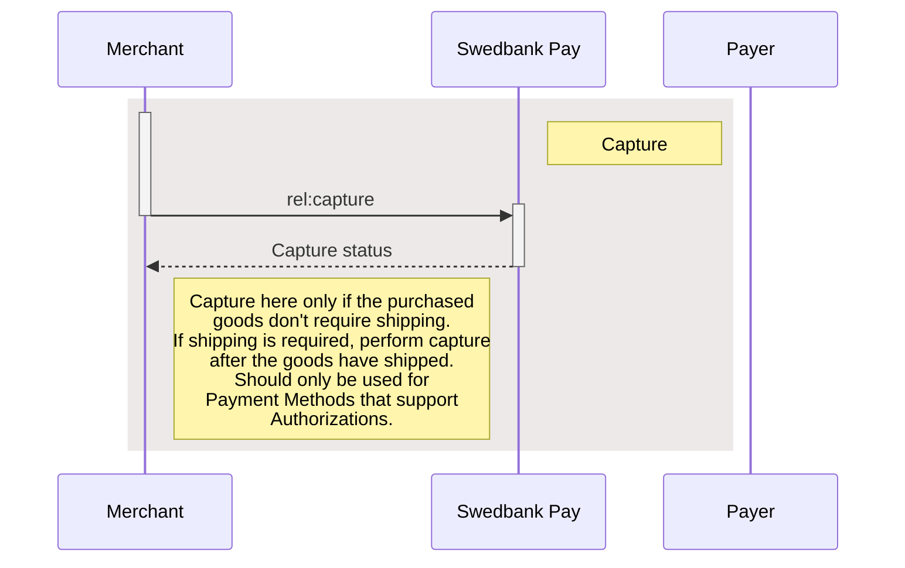






## Capture

Captures are only possible when a payment has a successful `Authorization`
transaction, naturally excluding one-phase payment methods like Swish and
Trustly. They will be marked as a `Sale` transaction. Two-phase payment methods
like card and Vipps however, require a `Capture` to be completed.

Please note that you have a maximum of 5 **consecutive** failed attempts at a
capture. The payment will be locked after the fifth, and you need to contact us
for further attempts.

In addition to full captures, it is possible to do partial captures of the
authorized amount. You can do more captures on the same payment later, up to the
total authorized amount. A useful tool for when you have to split orders into
several shipments.

First off, you must request the order information from the server to get the
request link. With this, you can request the capture with the amount to capture,
and get the status back.

## Create Capture Transaction

To capture the authorized payment, you need to perform a `capture` against the
accompanying `href` returned in the `operations` list. See the abbreviated
request and response below:

## Capture Request

POST /psp/paymentorders/{{ page.payment_order_id }}/captures HTTP/1.1
Host: {{ page.api_host }}
Authorization: Bearer <AccessToken>
Content-Type: application/json;version=3.0/2.0      // Version optional

{
    "transaction": {
        "description": "Capturing the authorized payment",
        "amount": 1500,
        "vatAmount": 375,
        "payeeReference": "AB832",
        "receiptReference": "AB831",
        "orderItems": [
            {
                "reference": "P1",
                "name": "Product1",
                "type": "PRODUCT",
                "class": "ProductGroup1",
                "itemUrl": "https://example.com/products/123",
                "imageUrl": "https://example.com/product123.jpg",
                "description": "Product 1 description",
                "discountDescription": "Volume discount",
                "quantity": 4,
                "quantityUnit": "pcs",
                "unitPrice": 300,
                "discountPrice": 200,
                "vatPercent": 2500,
                "amount": 1000,
                "vatAmount": 250
            },
            {
                "reference": "P2",
                "name": "Product2",
                "type": "PRODUCT",
                "class": "ProductGroup1",
                "description": "Product 2 description",
                "quantity": 1,
                "quantityUnit": "pcs",
                "unitPrice": 500,
                "vatPercent": 2500,
                "amount": 500,
                "vatAmount": 125
            }
        ]
    }
}









  

    
Field

    
Type

    
Required

  

  <!-- transaction (root; level 0) -->
  

    

      <i aria-hidden="true" class="chev swepay-icon-plus-add"></i>
      <code>object</code>
      
    

    

The transaction object.

    <!-- Children of transaction (level 1) -->
    

      <!-- description -->
      

        

          <i aria-hidden="true" class="chev swepay-icon-plus-add"></i>
          <code>string</code>
          
        

        

The description of the capture transaction.

      

      <!-- amount -->
      

        

          <i aria-hidden="true" class="chev swepay-icon-plus-add"></i>
          <code>integer</code>
          
        

        

{{ amount_md | markdownify }}

      

      <!-- vatAmount -->
      

        

          <i aria-hidden="true" class="chev swepay-icon-plus-add"></i>
          <code>integer</code>
          
        

        

{{ vat_amount_md | markdownify }}

      

      <!-- payeeReference -->
      

        

          <i aria-hidden="true" class="chev swepay-icon-plus-add"></i>
          <code>string(30)</code>
          
        

        

{{ payee_reference_md | markdownify }}

      

      <!-- receiptReference (optional) -->
      

        

          <i aria-hidden="true" class="chev swepay-icon-plus-add"></i>
          <code>string(30)</code>
        

        

{{ receipt_reference_md | markdownify }}

      

      <!-- orderItems (array container) -->
      

        

          <i aria-hidden="true" class="chev swepay-icon-plus-add"></i>
          <code>array</code>
          
        

        

{{ order_items_md | markdownify }}

        <!-- Children of each order item (level 2) -->
        

          <!-- reference -->
          

            

              <i aria-hidden="true" class="chev swepay-icon-plus-add"></i>
              <code>string</code>
              
            

            

A reference that identifies the order item.

          

          <!-- name -->
          

            

              <i aria-hidden="true" class="chev swepay-icon-plus-add"></i>
              <code>string</code>
              
            

            

The name of the order item.

          

          <!-- type -->
          

            

              <i aria-hidden="true" class="chev swepay-icon-plus-add"></i>
              <code>enum</code>
              
            

            

<code>PRODUCT</code>, <code>SERVICE</code>, <code>SHIPPING_FEE</code>, <code>PAYMENT_FEE</code>, <code>DISCOUNT</code>, <code>VALUE_CODE</code> or <code>OTHER</code>. The type of the order item.

          

          <!-- class -->
          

            

              <i aria-hidden="true" class="chev swepay-icon-plus-add"></i>
              <code>string</code>
              
            

            

The classification of the order item. Can be used for assigning the order item to a specific product category, such as <code>MobilePhone</code>. Note that <code>class</code> cannot contain spaces and must follow the regex pattern <code>[\w-]*</code>. Swedbank Pay may use this field for statistics.

          

          <!-- itemUrl (optional) -->
          

            

              <i aria-hidden="true" class="chev swepay-icon-plus-add"></i>
              <code>string</code>
            

            

The URL to a page that can display the purchased item, product or similar.

          

          <!-- imageUrl (optional) -->
          

            

              <i aria-hidden="true" class="chev swepay-icon-plus-add"></i>
              <code>string</code>
            

            

The URL to an image of the order item.

          

          <!-- description (item-level, optional) -->
          

            

              <i aria-hidden="true" class="chev swepay-icon-plus-add"></i>
              <code>string</code>
            

            

The human readable description of the order item.

          

          <!-- discountDescription (optional) -->
          

            

              <i aria-hidden="true" class="chev swepay-icon-plus-add"></i>
              <code>string</code>
            

            

The human readable description of the possible discount.

          

          <!-- quantity -->
          

            

              <i aria-hidden="true" class="chev swepay-icon-plus-add"></i>
              <code>number</code>
              
            

            

The 4 decimal precision quantity of order items being purchased.

          

          <!-- quantityUnit -->
          

            

              <i aria-hidden="true" class="chev swepay-icon-plus-add"></i>
              <code>string</code>
              
            

            

The unit of the quantity, such as <code>pcs</code>, <code>grams</code>, or similar. This is used for your own book keeping.

          

          <!-- unitPrice -->
          

            

              <i aria-hidden="true" class="chev swepay-icon-plus-add"></i>
              <code>integer</code>
              
            

            

The price per unit of order item, including VAT.

          

          <!-- discountPrice (optional) -->
          

            

              <i aria-hidden="true" class="chev swepay-icon-plus-add"></i>
              <code>integer</code>
            

            

If the order item is purchased at a discounted price. This field should contain that price, including VAT.

          

          <!-- vatPercent -->
          

            

              <i aria-hidden="true" class="chev swepay-icon-plus-add"></i>
              <code>integer</code>
              
            

            

The percent value of the VAT multiplied by 100, so <code>25%</code> becomes <code>2500</code>.

          

          <!-- amount (SEK example) -->
          

            

              <i aria-hidden="true" class="chev swepay-icon-plus-add"></i>
              <code>integer</code>
              
            

            

The total amount including VAT to be paid for the specified quantity of this order item, in the lowest monetary unit of the currency. E.g. <code>10000</code> equals <code>100.00 SEK</code> and <code>5000</code> equals <code>50.00 SEK</code>.

          

          <!-- vatAmount (SEK example) -->
          

            

              <i aria-hidden="true" class="chev swepay-icon-plus-add"></i>
              <code>integer</code>
              
            

            

The total amount of VAT to be paid for the specified quantity of this order item, in the lowest monetary unit of the currency. E.g. <code>10000</code> equals <code>100.00 SEK</code> and <code>5000</code> equals <code>50.00 SEK</code>.

          

          <!-- duplicate block as in source (NOK examples) -->
          

            

              <i aria-hidden="true" class="chev swepay-icon-plus-add"></i>
              <code>string</code>
              
            

            

A reference that identifies the order item.

          

          

            

              <i aria-hidden="true" class="chev swepay-icon-plus-add"></i>
              <code>string</code>
              
            

            

The name of the order item.

          

          

            

              <i aria-hidden="true" class="chev swepay-icon-plus-add"></i>
              <code>enum</code>
              
            

            

<code>PRODUCT</code>, <code>SERVICE</code>, <code>SHIPPING_FEE</code>, <code>PAYMENT_FEE</code>, <code>DISCOUNT</code>, <code>VALUE_CODE</code> or <code>OTHER</code>. The type of the order item.

          

          

            

              <i aria-hidden="true" class="chev swepay-icon-plus-add"></i>
              <code>string</code>
              
            

            

The classification of the order item. Can be used for assigning the order item to a specific product category, such as a product page

          

          

            

              <i aria-hidden="true" class="chev swepay-icon-plus-add"></i>
              <code>string</code>
            

            

The URL to a page that can display the purchased item, such as a product page

          

          

            

              <i aria-hidden="true" class="chev swepay-icon-plus-add"></i>
              <code>string</code>
            

            

The URL to an image of the order item.

          

          

            

              <i aria-hidden="true" class="chev swepay-icon-plus-add"></i>
              <code>string</code>
            

            

The human readable description of the order item.

          

          

            

              <i aria-hidden="true" class="chev swepay-icon-plus-add"></i>
              <code>string</code>
            

            

The human readable description of the possible discount.

          

          

            

              <i aria-hidden="true" class="chev swepay-icon-plus-add"></i>
              <code>number</code>
              
            

            

The 4 decimal precision quantity of order items being purchased.

          

          

            

              <i aria-hidden="true" class="chev swepay-icon-plus-add"></i>
              <code>string</code>
              
            

            

The unit of the quantity, such as <code>pcs</code>, <code>grams</code>, or similar.

          

          

            

              <i aria-hidden="true" class="chev swepay-icon-plus-add"></i>
              <code>integer</code>
              
            

            

The price per unit of order item, including VAT.

          

          

            

              <i aria-hidden="true" class="chev swepay-icon-plus-add"></i>
              <code>integer</code>
            

            

If the order item is purchased at a discounted price. This field should contain that price, including VAT.

          

          

            

              <i aria-hidden="true" class="chev swepay-icon-plus-add"></i>
              <code>integer</code>
              
            

            

The percent value of the VAT multiplied by 100, so <code>25%</code> becomes <code>2500</code>.

          

          <!-- amount (NOK example with source text preserved) -->
          

            

              <i aria-hidden="true" class="chev swepay-icon-plus-add"></i>
              <code>integer</code>
              
            

            

The total amount including VAT to be paid for the specified quantity of this order item, in the lowest monetary unit of the currency. E.g. <code>10000</code> equals <code>100.00 NOK</code> and <code>500`0</code> equals <code>50.00 NOK</code>.

          

          <!-- vatAmount (NOK example with source text preserved) -->
          

            

              <i aria-hidden="true" class="chev swepay-icon-plus-add"></i>
              <code>integer</code>
              
            

            

The total amount of VAT to be paid for the specified quantity of this order item, in the lowest monetary unit of the currency. E.g. <code>10000</code> equals <code>100.00 NOK</code> and <code>500`0</code> equals <code>50.00 NOK</code>.

          

        
<!-- /.api-children (order item) -->
      

    
<!-- /.api-children (transaction) -->
  
<!-- /.level-0 -->

<!-- /.api-compact -->

## Capture Response

If the capture request succeeds, this should be the response:

HTTP/1.1 200 OK
Content-Type: application/json; charset=utf-8; version=3.0/2.0
api-supported-versions: 3.0/2.0

{
    "payment": "/psp/creditcard/payments/{{ page.payment_id }}",
    "capture": {
        "id": "/psp/creditcard/payments/{{ page.payment_id }}/captures/{{ page.transaction_id }}",
        "transaction": {
            "id": "/psp/creditcard/payments/{{ page.payment_id }}/transactions/{{ page.transaction_id }}",
            "created": "2020-06-22T10:56:56.2927632Z",
            "updated": "2020-06-22T10:56:56.4035291Z",
            "type": "Capture",
            "state": "Completed",
            "amount": 1500,
            "vatAmount": 375,
            "description": "Capturing the authorized payment",
            "payeeReference": "AB832",
            "receiptReference": "AB831"
        }
    }
}











  

    
Field

    
Type

  

  <!-- payment (root level 0) -->
  

    

      <i aria-hidden="true" class="chev swepay-icon-plus-add"></i>
      <code>string</code>
    

    

The relative URL of the payment this capture transaction belongs to.

  

  <!-- capture (root level 0) -->
  

    

      <i aria-hidden="true" class="chev swepay-icon-plus-add"></i>
      <code>object</code>
    

    

The capture object, containing the information about the capture transaction.

    <!-- Children of capture (level 1) -->
    

      <!-- id -->
      

        

          <i aria-hidden="true" class="chev swepay-icon-plus-add"></i>
          <code>string</code>
        

        

The relative URL of the created capture transaction.

      

      <!-- transaction -->
      

        

          <i aria-hidden="true" class="chev swepay-icon-plus-add"></i>
          <code>object</code>
        

        

{{ transaction_md | markdownify }}

        <!-- Children of transaction (level 2) -->
        

          

            

              <i aria-hidden="true" class="chev swepay-icon-plus-add"></i>
              <code>string</code>
            

            

The relative URL of the current <code>transaction</code> resource.

          

          

            

              <i aria-hidden="true" class="chev swepay-icon-plus-add"></i>
              <code>string</code>
            

            

The ISO-8601 date and time of when the transaction was created.

          

          

            

              <i aria-hidden="true" class="chev swepay-icon-plus-add"></i>
              <code>string</code>
            

            

The ISO-8601 date and time of when the transaction was updated.

          

          

            

              <i aria-hidden="true" class="chev swepay-icon-plus-add"></i>
              <code>string</code>
            

            

Indicates the transaction type.

          

          

            

              <i aria-hidden="true" class="chev swepay-icon-plus-add"></i>
              <code>string</code>
            

            

{{ state_md | markdownify }}

          

          

            

              <i aria-hidden="true" class="chev swepay-icon-plus-add"></i>
              <code>integer</code>
            

            

{{ number_md | markdownify }}

          

          

            

              <i aria-hidden="true" class="chev swepay-icon-plus-add"></i>
              <code>integer</code>
            

            

{{ amount_md | markdownify }}

          

          

            

              <i aria-hidden="true" class="chev swepay-icon-plus-add"></i>
              <code>integer</code>
            

            

{{ vat_amount_md | markdownify }}

          

          

            

              <i aria-hidden="true" class="chev swepay-icon-plus-add"></i>
              <code>string</code>
            

            

{{ description_md | markdownify }}

          

          

            

              <i aria-hidden="true" class="chev swepay-icon-plus-add"></i>
              <code>string(30)</code>
            

            

{{ payee_reference_md | markdownify }}

          

          

            

              <i aria-hidden="true" class="chev swepay-icon-plus-add"></i>
              <code>string(30)</code>
            

            

A unique reference from the merchant system. It is set per operation to ensure an exactly-once delivery of a transactional operation. It is used to supplement <code>payeeReference</code> as an additional receipt number.

          

        
<!-- /.api-children (transaction) -->
      

    
<!-- /.api-children (capture) -->
  

## Capture Request v3.1

POST /psp/paymentorders/{{ page.payment_order_id }}/captures HTTP/1.1
Host: {{ page.api_host }}
Authorization: Bearer <AccessToken>
Content-Type: application/json;version=3.1

{
    "transaction": {
        "description": "Capturing the authorized payment",
        "amount": 1500,
        "vatAmount": 375,
        "payeeReference": "AB832",
        "receiptReference": "AB831"
    }
}









  

    
Field

    
Type

    
Required

  

  <!-- transaction (root; level 0) -->
  

    

      <i aria-hidden="true" class="chev swepay-icon-plus-add"></i>
      <code>object</code>
      
    

    

The transaction object.

    <!-- Children of transaction (level 1) -->
    

      <!-- description (req) -->
      

        

          <i aria-hidden="true" class="chev swepay-icon-plus-add"></i>
          <code>string</code>
          
        

        

The description of the capture transaction.

      

      <!-- amount (req) -->
      

        

          <i aria-hidden="true" class="chev swepay-icon-plus-add"></i>
          <code>integer</code>
          
        

        

{{ amount_md | markdownify }}

      

      <!-- vatAmount (req) -->
      

        

          <i aria-hidden="true" class="chev swepay-icon-plus-add"></i>
          <code>integer</code>
          
        

        

{{ vat_amount_md | markdownify }}

      

      <!-- payeeReference (req) -->
      

        

          <i aria-hidden="true" class="chev swepay-icon-plus-add"></i>
          <code>string(30)</code>
          
        

        

{{ payee_reference_md | markdownify }}

      

      <!-- receiptReference (optional) -->
      

        

          <i aria-hidden="true" class="chev swepay-icon-plus-add"></i>
          <code>string(30)</code>
        

        

{{ receipt_reference_md | markdownify }}

      

      <!-- orderItems (array container; req) -->
      

        

          <i aria-hidden="true" class="chev swepay-icon-plus-add"></i>
          <code>array</code>
          
        

        

{{ order_items_md | markdownify }}

        <!-- Children of each order item (level 2) -->
        

          <!-- reference (req) -->
          

            

              <i aria-hidden="true" class="chev swepay-icon-plus-add"></i>
              <code>string</code>
              
            

            

A reference that identifies the order item.

          

          <!-- name (req) -->
          

            

              <i aria-hidden="true" class="chev swepay-icon-plus-add"></i>
              <code>string</code>
              
            

            

The name of the order item.

          

          <!-- type (req) -->
          

            

              <i aria-hidden="true" class="chev swepay-icon-plus-add"></i>
              <code>enum</code>
              
            

            

<code>PRODUCT</code>, <code>SERVICE</code>, <code>SHIPPING_FEE</code>, <code>PAYMENT_FEE</code>, <code>DISCOUNT</code>, <code>VALUE_CODE</code> or <code>OTHER</code>. The type of the order item.

          

          <!-- class (req) -->
          

            

              <i aria-hidden="true" class="chev swepay-icon-plus-add"></i>
              <code>string</code>
              
            

            

The classification of the order item. Can be used for assigning the order item to a specific product category, such as <code>MobilePhone</code>. Note that <code>class</code> cannot contain spaces and must follow the regex pattern <code>[\w-]*</code>. Swedbank Pay may use this field for statistics.

          

          <!-- itemUrl (optional) -->
          

            

              <i aria-hidden="true" class="chev swepay-icon-plus-add"></i>
              <code>string</code>
            

            

The URL to a page that can display the purchased item, product or similar.

          

          <!-- imageUrl (optional) -->
          

            

              <i aria-hidden="true" class="chev swepay-icon-plus-add"></i>
              <code>string</code>
            

            

The URL to an image of the order item.

          

          <!-- description (optional, item-level) -->
          

            

              <i aria-hidden="true" class="chev swepay-icon-plus-add"></i>
              <code>string</code>
            

            

The human readable description of the order item.

          

          <!-- discountDescription (optional) -->
          

            

              <i aria-hidden="true" class="chev swepay-icon-plus-add"></i>
              <code>string</code>
            

            

The human readable description of the possible discount.

          

          <!-- quantity (req) -->
          

            

              <i aria-hidden="true" class="chev swepay-icon-plus-add"></i>
              <code>number</code>
              
            

            

The 4 decimal precision quantity of order items being purchased.

          

          <!-- quantityUnit (req) -->
          

            

              <i aria-hidden="true" class="chev swepay-icon-plus-add"></i>
              <code>string</code>
              
            

            

The unit of the quantity, such as <code>pcs</code>, <code>grams</code>, or similar. This is used for your own book keeping.

          

          <!-- unitPrice (req) -->
          

            

              <i aria-hidden="true" class="chev swepay-icon-plus-add"></i>
              <code>integer</code>
              
            

            

The price per unit of order item, including VAT.

          

          <!-- discountPrice (optional) -->
          

            

              <i aria-hidden="true" class="chev swepay-icon-plus-add"></i>
              <code>integer</code>
            

            

If the order item is purchased at a discounted price. This field should contain that price, including VAT.

          

          <!-- vatPercent (req) -->
          

            

              <i aria-hidden="true" class="chev swepay-icon-plus-add"></i>
              <code>integer</code>
              
            

            

The percent value of the VAT multiplied by 100, so <code>25%</code> becomes <code>2500</code>.

          

          <!-- amount (req; SEK example) -->
          

            

              <i aria-hidden="true" class="chev swepay-icon-plus-add"></i>
              <code>integer</code>
              
            

            

The total amount including VAT to be paid for the specified quantity of this order item, in the lowest monetary unit of the currency. E.g. <code>10000</code> equals <code>100.00 SEK</code> and <code>5000</code> equals <code>50.00 SEK</code>.

          

          <!-- vatAmount (req; SEK example) -->
          

            

              <i aria-hidden="true" class="chev swepay-icon-plus-add"></i>
              <code>integer</code>
              
            

            

The total amount of VAT to be paid for the specified quantity of this order item, in the lowest monetary unit of the currency. E.g. <code>10000</code> equals <code>100.00 SEK</code> and <code>5000</code> equals <code>50.00 SEK</code>.

          

          <!-- duplicated block from source (NOK examples preserved) -->

          

            

              <i aria-hidden="true" class="chev swepay-icon-plus-add"></i>
              <code>string</code>
              
            

            

A reference that identifies the order item.

          

          

            

              <i aria-hidden="true" class="chev swepay-icon-plus-add"></i>
              <code>string</code>
              
            

            

The name of the order item.

          

          

            

              <i aria-hidden="true" class="chev swepay-icon-plus-add"></i>
              <code>enum</code>
              
            

            

<code>PRODUCT</code>, <code>SERVICE</code>, <code>SHIPPING_FEE</code>, <code>PAYMENT_FEE</code>, <code>DISCOUNT</code>, <code>VALUE_CODE</code> or <code>OTHER</code>. The type of the order item.

          

          

            

              <i aria-hidden="true" class="chev swepay-icon-plus-add"></i>
              <code>string</code>
              
            

            

The classification of the order item. Can be used for assigning the order item to a specific product category, such as a product page

          

          

            

              <i aria-hidden="true" class="chev swepay-icon-plus-add"></i>
              <code>string</code>
            

            

The URL to a page that can display the purchased item, such as a product page

          

          

            

              <i aria-hidden="true" class="chev swepay-icon-plus-add"></i>
              <code>string</code>
            

            

The URL to an image of the order item.

          

          

            

              <i aria-hidden="true" class="chev swepay-icon-plus-add"></i>
              <code>string</code>
            

            

The human readable description of the order item.

          

          

            

              <i aria-hidden="true" class="chev swepay-icon-plus-add"></i>
              <code>string</code>
            

            

The human readable description of the possible discount.

          

          

            

              <i aria-hidden="true" class="chev swepay-icon-plus-add"></i>
              <code>number</code>
              
            

            

The 4 decimal precision quantity of order items being purchased.

          

          

            

              <i aria-hidden="true" class="chev swepay-icon-plus-add"></i>
              <code>string</code>
              
            

            

The unit of the quantity, such as <code>pcs</code>, <code>grams</code>, or similar.

          

          

            

              <i aria-hidden="true" class="chev swepay-icon-plus-add"></i>
              <code>integer</code>
              
            

            

The price per unit of order item, including VAT.

          

          

            

              <i aria-hidden="true" class="chev swepay-icon-plus-add"></i>
              <code>integer</code>
            

            

If the order item is purchased at a discounted price. This field should contain that price, including VAT.

          

          

            

              <i aria-hidden="true" class="chev swepay-icon-plus-add"></i>
              <code>integer</code>
              
            

            

The percent value of the VAT multiplied by 100, so <code>25%</code> becomes <code>2500</code>.

          

          <!-- amount (NOK example; source typo preserved) -->
          

            

              <i aria-hidden="true" class="chev swepay-icon-plus-add"></i>
              <code>integer</code>
              
            

            

The total amount including VAT to be paid for the specified quantity of this order item, in the lowest monetary unit of the currency. E.g. <code>10000</code> equals <code>100.00 NOK</code> and <code>500`0</code> equals <code>50.00 NOK</code>.

          

          <!-- vatAmount (NOK example; source typo preserved) -->
          

            

              <i aria-hidden="true" class="chev swepay-icon-plus-add"></i>
              <code>integer</code>
              
            

            

The total amount of VAT to be paid for the specified quantity of this order item, in the lowest monetary unit of the currency. E.g. <code>10000</code> equals <code>100.00 NOK</code> and <code>500`0</code> equals <code>50.00 NOK</code>.

          

        
<!-- /.api-children (orderItems item) -->
      

    
<!-- /.api-children (transaction) -->
  

## Capture Response v3.1

If the capture request succeeds, this should be the response:

HTTP/1.1 200 OK
Content-Type: application/json; charset=utf-8; version=3.1
api-supported-versions: 3.1

{
  "paymentOrder": {
    "id": "/psp/paymentorders/8be318c1-1caa-4db1-e2c6-08d7bf41224d",
    "created": "2020-03-03T07:19:27.5636519Z",
    "updated": "2020-03-03T07:21:00.5605905Z",
    "operation": "Purchase",
    "status": "Paid",
    "currency": "SEK",
    "amount": 1500,
    "vatAmount": 375,
    "remainingCaptureAmount": 0, // Only present after a partial capture
    "remainingCancellationAmount": 0, // Only present after a partial capture
    "remainingReversalAmount": 1500,
    "description": "Test Purchase",
    "initiatingSystemUserAgent": "<should be set by the system calling POST:/psp/paymentorders>",
    "language": "sv-SE",
    "availableInstruments": [ "CreditCard", "Invoice-PayExFinancingSe", "Invoice-PayMonthlyInvoiceSe", "Swish", "CreditAccount", "Trustly" ],
    "implementation": "PaymentsOnly",
    "integration": "HostedView|Redirect",
    "instrumentMode": false,
    "guestMode": true,
    "orderItems": {
      "id": "/psp/paymentorders/8be318c1-1caa-4db1-e2c6-08d7bf41224d/orderitems"
    },
    "urls": {
      "id": "/psp/paymentorders/8be318c1-1caa-4db1-e2c6-08d7bf41224d/urls"
    },
    "payeeInfo": {
      "id": "/psp/paymentorders/8be318c1-1caa-4db1-e2c6-08d7bf41224d/payeeInfo"
    },
    "payer": {
      "id": "/psp/paymentorders/8be318c1-1caa-4db1-e2c6-08d7bf41224d/payers"
    },
    "history": {
      "id": "/psp/paymentorders/8be318c1-1caa-4db1-e2c6-08d7bf41224d/history"
    },
    "failed": {
      "id": "/psp/paymentorders/8be318c1-1caa-4db1-e2c6-08d7bf41224d/failed"
    },
    "aborted": {
      "id": "/psp/paymentorders/8be318c1-1caa-4db1-e2c6-08d7bf41224d/aborted"
    },
    "paid": {
      "id": "/psp/paymentorders/8be318c1-1caa-4db1-e2c6-08d7bf41224d/paid"
    },
    "cancelled": {
      "id": "/psp/paymentorders/8be318c1-1caa-4db1-e2c6-08d7bf41224d/cancelled"
    },
    "financialTransactions": {
      "id": "/psp/paymentorders/8be318c1-1caa-4db1-e2c6-08d7bf41224d/financialtransactions"
    },
    "failedAttempts": {
      "id": "/psp/paymentorders/8be318c1-1caa-4db1-e2c6-08d7bf41224d/failedattempts"
    },
    "postPurchaseFailedAttempts": {
      "id": "/psp/paymentorders/8be318c1-1caa-4db1-e2c6-08d7bf41224d/postpurchasefailedattempts"
    },
    "metadata": {
      "id": "/psp/paymentorders/8be318c1-1caa-4db1-e2c6-08d7bf41224d/metadata"
    }
  },
  "operations": [
    {
      "href": "https://api.payex.com/psp/paymentorders/222a50ca-b268-4b32-16fa-08d6d3b73224/reversals",
      "rel": "reversal",
      "method": "POST",
      "contentType": "application/json"
    },
  ]
}












  

    
Field

    
Type

  

  <!-- Level 0 (root) -->
  

    

      <i aria-hidden="true" class="chev swepay-icon-plus-add"></i>
      <code>string</code>
    

    

The relative URL of the payment order this capture transaction belongs to.

    <!-- Children of paymentOrder (Level 1) -->
    

      

        

          <i aria-hidden="true" class="chev swepay-icon-plus-add"></i>
          <code>string</code>
        

        

The relative URL of the created capture transaction.

      

      

        

          <i aria-hidden="true" class="chev swepay-icon-plus-add"></i>
          <code>string</code>
        

        

The ISO-8601 date and time of when the transaction was created.

      

      

        

          <i aria-hidden="true" class="chev swepay-icon-plus-add"></i>
          <code>string</code>
        

        

The ISO-8601 date and time of when the transaction was updated.

      

      

        

          <i aria-hidden="true" class="chev swepay-icon-plus-add"></i>
          <code>string</code>
        

        

{{ operation_md | markdownify }}

      

      

        

          <i aria-hidden="true" class="chev swepay-icon-plus-add"></i>
          <code>string</code>
        

        

{{ status_md | markdownify }}

      

      

        

          <i aria-hidden="true" class="chev swepay-icon-plus-add"></i>
          <code>string</code>
        

        

The currency of the payment order.

      

      

        

          <i aria-hidden="true" class="chev swepay-icon-plus-add"></i>
          <code>integer</code>
        

        

{{ amount_md | markdownify }}

      

      

        

          <i aria-hidden="true" class="chev swepay-icon-plus-add"></i>
          <code>integer</code>
        

        

{{ vat_amount_md | markdownify }}

      

      

        

          <i aria-hidden="true" class="chev swepay-icon-plus-add"></i>
          <code>integer</code>
        

        

The remaining authorized amount that is still possible to capture.

      

      

        

          <i aria-hidden="true" class="chev swepay-icon-plus-add"></i>
          <code>integer</code>
        

        

The remaining authorized amount that is still possible to cancel.

      

      

        

          <i aria-hidden="true" class="chev swepay-icon-plus-add"></i>
          <code>integer</code>
        

        

The remaining captured amount that is still available for reversal.

      

      

        

          <i aria-hidden="true" class="chev swepay-icon-plus-add"></i>
          <code>string</code>
        

        

{{ description_md | markdownify }}

      

      

        

          <i aria-hidden="true" class="chev swepay-icon-plus-add"></i>
          <code>string</code>
        

        

{{ initiating_system_user_agent_md | markdownify }}

      

      

        

          <i aria-hidden="true" class="chev swepay-icon-plus-add"></i>
          <code>string</code>
        

        

{{ language_md | markdownify }}

      

      <!-- normalized to array -->
      

        

          <i aria-hidden="true" class="chev swepay-icon-plus-add"></i>
          <code>array</code>
        

        

A list of payment methods available for this payment.

      

      

        

          <i aria-hidden="true" class="chev swepay-icon-plus-add"></i>
          <code>string</code>
        

        

The merchant's Online Payments implementation type. <code>Enterprise</code> or <code>PaymentsOnly</code>. We ask that you don't build logic around this field's response. It is mainly for information purposes, as the implementation types might be subject to name changes. If this should happen, updated information will be available in this table.

      

      

        

          <i aria-hidden="true" class="chev swepay-icon-plus-add"></i>
          <code>string</code>
        

        

The merchant's Online Payments integration type. <code>HostedView</code> (Seamless View) or <code>Redirect</code>. This field will not be populated until the payer has opened the payment UI, and the client script has identified if Swedbank Pay or another URI is hosting the container with the payment iframe. We ask that you don't build logic around this field's response. It is mainly for information purposes. as the integration types might be subject to name changes, If this should happen, updated information will be available in this table.

      

      

        

          <i aria-hidden="true" class="chev swepay-icon-plus-add"></i>
          <code>bool</code>
        

        

Set to <code>true</code> or <code>false</code>. Indicates if the payment is initialized with only one payment method available.

      

      

        

          <i aria-hidden="true" class="chev swepay-icon-plus-add"></i>
          <code>bool</code>
        

        

Set to <code>true</code> or <code>false</code>. Indicates if the payer chose to pay as a guest or not. When using the Payments Only implementation, this is triggered by not including a <code>payerReference</code> in the original <code>paymentOrder</code> request.

      

      <!-- Sub-resources: type corrected to object -->
      

        

          <i aria-hidden="true" class="chev swepay-icon-plus-add"></i>
          <code>object</code>
        

        

The URL to the <code>orderItems</code> resource where information about the order items can be retrieved.

      

      

        

          <i aria-hidden="true" class="chev swepay-icon-plus-add"></i>
          <code>object</code>
        

        

The URL to the <code>urls</code> resource where all URLs related to the payment order can be retrieved.

      

      

        

          <i aria-hidden="true" class="chev swepay-icon-plus-add"></i>
          <code>object</code>
        

        

The URL to the <code>payeeInfo</code> resource where information related to the payee can be retrieved.

      

      

        

          <i aria-hidden="true" class="chev swepay-icon-plus-add"></i>
          <code>object</code>
        

        

The URL to the <a href="{{ features_url }}/technical-reference/resource-sub-models#payer"><code>payer</code> resource</a> where information about the payer can be retrieved.

      

      

        

          <i aria-hidden="true" class="chev swepay-icon-plus-add"></i>
          <code>object</code>
        

        

The URL to the <code>history</code> resource where information about the payment's history can be retrieved.

      

      

        

          <i aria-hidden="true" class="chev swepay-icon-plus-add"></i>
          <code>object</code>
        

        

The URL to the <code>failed</code> resource where information about the failed transactions can be retrieved.

      

      

        

          <i aria-hidden="true" class="chev swepay-icon-plus-add"></i>
          <code>object</code>
        

        

The URL to the <code>aborted</code> resource where information about the aborted transactions can be retrieved.

      

      

        

          <i aria-hidden="true" class="chev swepay-icon-plus-add"></i>
          <code>object</code>
        

        

The URL to the <code>paid</code> resource where information about the paid transactions can be retrieved.

      

      

        

          <i aria-hidden="true" class="chev swepay-icon-plus-add"></i>
          <code>object</code>
        

        

The URL to the <code>cancelled</code> resource where information about the cancelled transactions can be retrieved.

      

      

        

          <i aria-hidden="true" class="chev swepay-icon-plus-add"></i>
          <code>object</code>
        

        

The URL to the <code>financialTransactions</code> resource where information about the financial transactions can be retrieved.

      

      

        

          <i aria-hidden="true" class="chev swepay-icon-plus-add"></i>
          <code>object</code>
        

        

The URL to the <code>failedAttempts</code> resource where information about the failed attempts can be retrieved.

      

      

        

          <i aria-hidden="true" class="chev swepay-icon-plus-add"></i>
          <code>object</code>
        

        

The URL to the <code>postPurchaseFailedAttempts</code> resource where information about the failed capture, cancel or reversal attempts can be retrieved.

      

      

        

          <i aria-hidden="true" class="chev swepay-icon-plus-add"></i>
          <code>object</code>
        

        

The URL to the <code>metadata</code> resource where information about the metadata can be retrieved.

      

    

  

  <!-- operations (sibling at level 0) -->
  

    

      <i aria-hidden="true" class="chev swepay-icon-plus-add"></i>
      <code>array</code>
    

    

{{ operations_md | markdownify }} <a href="{{ features_url }}/technical-reference/operations">See Operations for details</a>.

  

## Capture Sequence Diagram

