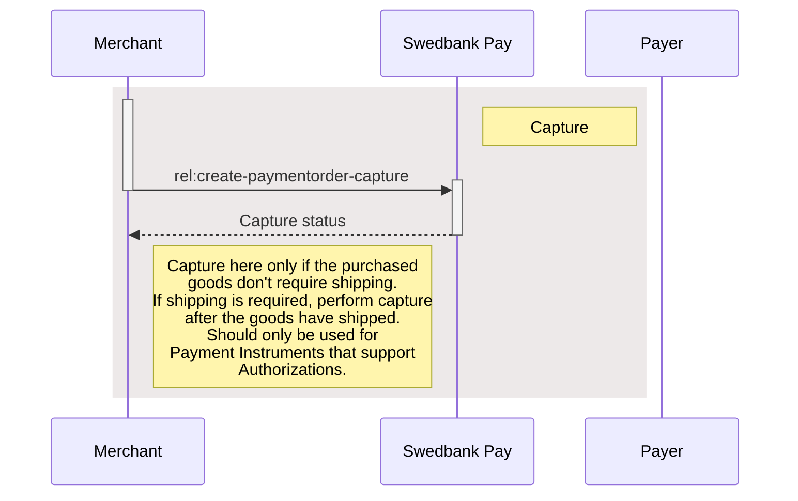







## Step 5: Capture



## Capture



Captures are only possible when a payment has a successful authorize
transaction, naturally excluding one-phase payment instruments like
[Swish][swish] and [Trustly][trustly]. Two-phase payment instruments like
[Card][card] and [Vipps][vipps] however, require a `Capture` to be completed.

In addition to full captures, it is possible to do partial captures of a part of
the authorized amount. You can do other captures on the same payment later, up
to the total authorized amount. Useful for when you have to split orders into
several shipments, for instance.

First off, you must request the order information from the server to get the
request link. With this, you can request the capture with the amount to capture,
and get the status back.



To capture the authorized payment, we need to perform
`create-paymentorder-capture` against the accompanying `href` returned in the
`operations` list. See the abbreviated request and response below:



To capture the authorized payment, we need to perform `capture` against the
accompanying `href` returned in the `operations` list. See the abbreviated
request and response below:



## Capture Request

{:.code-view-header}
**Request**

```http
POST /psp/paymentorders/{{ page.payment_order_id }}/captures HTTP/1.1
Host: {{ page.api_host }}
Authorization: Bearer <AccessToken>
Content-Type: application/json

{
    "transaction": {
        "description": "Capturing the authorized payment",
        "amount": 1500,
        "vatAmount": 375,
        "payeeReference": "AB832",
        "receiptReference": "AB831"
    }
}
```

## Capture Response

If the capture request succeeds, this should be the response:

{:.code-view-header}
**Response**

```http
HTTP/1.1 200 OK
Content-Type: application/json

{
    "payment": "/psp/{{ api_resource }}/payments/{{ page.payment_id }}",
    "capture": {
        "id": "/psp/{{ api_resource }}/payments/{{ page.payment_id }}/captures/{{ page.transaction_id }}",
        "transaction": {
            "id": "/psp/{{ api_resource }}/payments/{{ page.payment_id }}/transactions/{{ page.transaction_id }}",
            "created": "2020-06-22T10:56:56.2927632Z",
            "updated": "2020-06-22T10:56:56.4035291Z",
            "type": "Capture",
            "state": "Completed",
            "amount": 1500,
            "vatAmount": 375,
            "description": "Capturing the authorized payment",
            "payeeReference": "AB832",
            "receiptReference": "AB831"
        }
    }
}
```

## Capture Sequence Diagram










<!--lint disable final-definition -->

[card]: /payment-instruments/card
[vipps]: /payment-instruments/vipps
[swish]: /payment-instruments/swish/
[trustly]: /payment-instruments/trustly/
