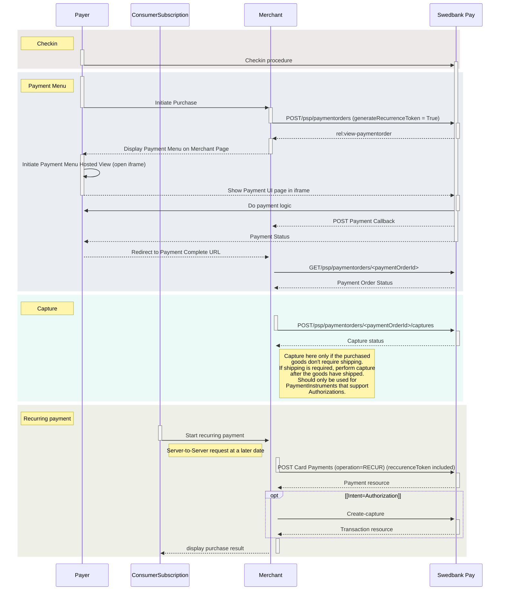
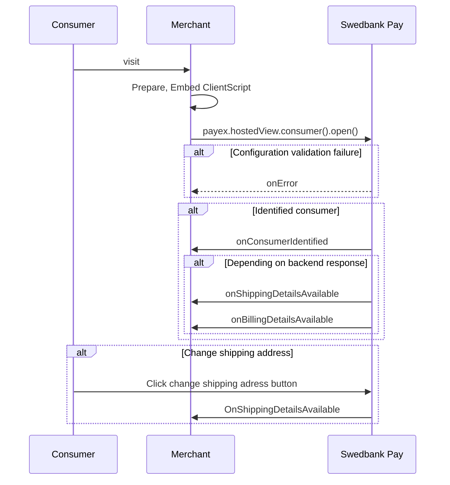




## Payment Orders

In order to initialize the Payment Menu, you need to create a Payment Order.
The `paymentorders` resource and how you interact with it is described below.



### Creating a payment order

To create a payment order, you perform a `POST` request towards the
`paymentorders` resource:





#### Response

The response given when creating a payment order is equivalent to a `GET`
request towards the `paymentorders` resource, as displayed above.

### URLs

When creating a Payment Order, the `urls` field of the `paymentOrder`
contains the related URIs, including where the consumer gets redirected when
going forward with or cancelling a payment session, as well as the callback URI
that is used to inform the payee (merchant) of changes or updates made to
underlying payments or transaction.

{:.table .table-striped}
|     Required      | Field               | Type     | Description                                                                                                                                                                                                                                                                                              |
| :---------------: | :------------------ | :------- | :------------------------------------------------------------------------------------------------------------------------------------------------------------------------------------------------------------------------------------------------------------------------------------------------------- |
|  ︎︎︎︎︎ | `hostUrls`          | `array`  | The array of URIs valid for embedding of Swedbank Pay Hosted Views.                                                                                                                                                                                                                                      |
|   | `completeUrl`       | `string` | The URL that Swedbank Pay will redirect back to when the payer has completed his or her interactions with the payment. This does not indicate a successful payment, only that it has reached a final (complete) state. A `GET` request needs to be performed on the payment order to inspect it further. |
|   | `termsOfServiceUrl` | `string` |                                                                                                                                                                                                                                                      |
|                   | `cancelUrl`         | `string` | The URI to redirect the payer to if the payment is canceled, either by the payer or by the merchant trough an `abort` request of the `payment` or `paymentorder`.                                                                                                                                        |
|                   | `paymentUrl`        | `string` | The URI that Swedbank Pay will redirect back to when the payment menu needs to be loaded, to inspect and act on the current status of the payment.                                                                                                                                                       |
|                   | `callbackUrl`       | `string` | The URI to the API endpoint receiving `POST` requests on transaction activity related to the payment order.                                                                                                                                                                                              |
|                   | `logoUrl`           | `string` | The URI to the logo that will be displayed on redirect pages. **HTTPS is a requirement**.                                                                                                                                                                                                                |

#### Payment Url



#### URLs Resource

It is possible to perform a `GET` request on the `urls` resource to retrieve its
contents.

{:.code-header}
Request

```http
GET /psp/paymentorders/{{ page.payment_order_id }}/urls/ HTTP/1.1
Host: {{ page.api_host }}
Authorization: Bearer <AccessToken>
Content-Type: application/json
```

{:.code-header}
Response

```http
HTTP/1.1 200 OK
Content-Type: application/json

{
    "paymentorder": "/psp/payments/{{ page.payment_order_id }}",
    "urls": {
        "id": "/psp/payments/{{ page.payment_order_id }}/urls",
        "hostUrls": [ "https://example.com", "https://example.net" ],
        "completeUrl": "https://example.com/payment-complete",
        "cancelUrl": "https://example.com/payment-canceled",
        "paymentUrl": "https://example.com/perform-payment",
        "callbackUrl": "http://api.example.com/payment-callback",
        "logoUrl": "http://merchant.com/path/to/logo.png",
        "termsOfServiceUrl": "http://merchant.com/path/to/tems"
    }
}
```

{:.table .table-striped}
| Field                       | Type     | Description                                                                                                                                                                                                                                                                                              |
| :-------------------------- | :------- | :------------------------------------------------------------------------------------------------------------------------------------------------------------------------------------------------------------------------------------------------------------------------------------------------------- |
| `paymentorder`              | `string` |                                                                                                                                                                                                                                                 |
| `urls`                      | `object` | The URLs object.                                                                                                                                                                                                                                                                                         |
| └➔&nbsp;`id`                | `string` |                                                                                                                                                                                                                                                     |
| └➔&nbsp;`hostsUrl`          | `string` | An array of the whitelisted URIs that are allowed as parents to a Hosted View, typically the URI of the web shop or similar that will embed a Hosted View within it.                                                                                                                                     |
| └➔&nbsp;`completeUrl`       | `string` | The URL that Swedbank Pay will redirect back to when the payer has completed his or her interactions with the payment. This does not indicate a successful payment, only that it has reached a final (complete) state. A `GET` request needs to be performed on the payment order to inspect it further. |
| └➔&nbsp;`cancelUrl`         | `string` | The URI to redirect the payer to if the payment is canceled, either by the payer or by the merchant trough an `abort` request of the `payment` or `paymentorder`.                                                                                                                                        |
| └➔&nbsp;`paymentUrl`        | `string` | The URI that Swedbank Pay will redirect back to when the payment menu needs to be loaded, to inspect and act on the current status of the payment.                                                                                                                                                       |
| └➔&nbsp;`callbackUrl`       | `string` | The URI that Swedbank Pay will perform an HTTP `POST` against every time a transaction is created on the payment. See [callback][callback-reference] for details.                                                                                                                                        |
| └➔&nbsp;`logoUrl`           | `string` | The URI that will be used for showing the customer logo. Must be a picture with at most 50px height and 400px width.                                                                                                                                                                                     |
| └➔&nbsp;`termsOfServiceUrl` | `string` |                                                                                                                                                                                                                                                      |

### Order Items

The `orderItems` field of the `paymentOrder` is an array containing the items being purchased with the order. Used to print on invoices if the payer chooses to pay with invoice, among other things. `orderItems` is required in all requests. It should be specified on both payment order creation as well as on [Capture][payment-order-capture].

{:.table .table-striped}
|     Required     | Field                 | Type      | Description                                                                                                                                                                                                                                                                           |
| :--------------: | :-------------------- | :-------- | :------------------------------------------------------------------------------------------------------------------------------------------------------------------------------------------------------------------------------------------------------------------------------------ |
|  | `reference`           | `string`  | A reference that identifies the order item.                                                                                                                                                                                                                                           |
|  | `name`                | `string`  | The name of the order item.                                                                                                                                                                                                                                                           |
|  | `type`                | `enum`    | `PRODUCT`, `SERVICE`, `SHIPPING_FEE`, `DISCOUNT`, `VALUE_CODE`, or `OTHER`. The type of the order item.                                                                                                                                                                               |
|  | `class`               | `string`  | The classification of the order item. Can be used for assigning the order item to a specific product category, such as `MobilePhone`. Note that `class` cannot contain spaces and must follow the regex pattern `[\w]* (a-zA-Z0-9_)`. Swedbank Pay may use this field for statistics. |
|                  | `itemUrl`             | `string`  | The URL to a page that can display the purchased item, such as a product page                                                                                                                                                                                                         |
|                  | `imageUrl`            | `string`  | The URL to an image of the order item.                                                                                                                                                                                                                                                |
|                  | `description`         | `string`  | The human readable description of the order item.                                                                                                                                                                                                                                     |
|                  | `discountDescription` | `string`  | The human readable description of the possible discount.                                                                                                                                                                                                                              |
|  | `quantity`            | `decimal` | The 4 decimal precision quantity of order items being purchased.                                                                                                                                                                                                                      |
|  | `quantityUnit`        | `string`  | The unit of the quantity, such as `pcs`, `grams`, or similar.                                                                                                                                                                                                                         |
|  | `unitPrice`           | `integer` | The price per unit of order item, including VAT.                                                                                                                                                                                                                                      |
|                  | `discountPrice`       | `integer` | If the order item is purchased at a discounted price. This field should contain that price, including VAT.                                                                                                                                                                            |
|  | `vatPercent`          | `integer` | The percent value of the VAT multiplied by 100, so `25%` becomes `2500`.                                                                                                                                                                                                              |
|  | `amount`              | `integer` |                                                                                                                                                                                                                                              |
|  | `vatAmount`           | `integer` |                                                                                                                                                                                                                                           |

### Items

The `items` field of the `paymentOrder` is an array containing items that will affect how the payment is performed.

{:.table .table-striped}
| Required | Field                          | Type      | Description                                                                                                                                           |
| :------: | :----------------------------- | :-------- | :---------------------------------------------------------------------------------------------------------------------------------------------------- |
|          | `creditCard`                   | `object`  | The credit card object.                                                                                                                               |
|          | └➔&nbsp;`rejectDebitCards`     | `bool`    | `true` if debit cards should be declined; otherwise `false` per default. Default value is set by Swedbank Pay and can be changed at your request.     |
|          | └➔&nbsp;`rejectDebitCards`     | `bool`    | `true` if debit cards should be declined; otherwise `false` per default. Default value is set by Swedbank Pay and can be changed at your request.     |
|          | └➔&nbsp;`rejectCreditCards`    | `bool`    | `true` if credit cards should be declined; otherwise `false` per default. Default value is set by Swedbank Pay and can be changed at your request.    |
|          | └➔&nbsp;`rejectConsumerCards`  | `bool`    | `true` if consumer cards should be declined; otherwise `false` per default. Default value is set by Swedbank Pay and can be changed at your request.  |
|          | └➔&nbsp;`rejectCorporateCards` | `bool`    | `true` if corporate cards should be declined; otherwise `false` per default. Default value is set by Swedbank Pay and can be changed at your request. |
|          | `invoice`                      | `object`  | The invoice object.                                                                                                                                   |
|          | └➔&nbsp;`feeAmount`            | `integer` | The fee amount in the lowest monetary unit to apply if the consumer chooses to pay with invoice.                                                      |
|          | `swish`                        | `object`  | The swish object.                                                                                                                                     |
|          | └➔&nbsp;`enableEcomOnly`       | `bool`    | `true` to only enable Swish on ecommerce transactions.                                                                                                |

The `paymentOrders` resource utilize several sub-resources, relating to
underlying [payments][payment-orders-resource-payments],
[the current payment active][current-payment],
[payers][payment-orders-resource-payers] and [urls][urls].
Common sub-resources like [payeeinfo][payee-reference], that are
structurally identical for both payments and payments orders, are described in
the [Payment Resources][payment-resource] section.

## Operations

When a payment order resource is created and during its lifetime, it will have
a set of operations that can be performed on it.
The state of the payment order resource, what the access token is authorized
to do, the chosen payment instrument and its transactional states, etc.
determine the available operations before the initial purchase.
A list of possible operations and their explanation is given below.

{:.code-header}
**Operations**

```js
{
    "paymentOrder": {
        "id": "/psp/paymentorders/{{ page.payment_order_id }}",
    }
    "operations": [
        {
            "method": "PATCH",
            "href": "{{ page.api_url }}/psp/paymentorders/{{ page.payment_order_id }}",
            "rel": "update-paymentorder-abort",
            "contentType": "application/json"
        },
        {
            "method": "PATCH",
            "href": "{{ page.api_url }}/psp/paymentorders/{{ page.payment_order_id }}",
            "rel": "update-paymentorder-updateorder",
            "contentType": "application/json"
        },
        {
            "method": "GET",
            "href": "{{ page.front_end_url }}/paymentmenu/{{ page.payment_token }}",
            "rel": "redirect-paymentorder",
            "contentType": "text/html"
        },
        {
            "method": "GET",
            "href": "{{ page.front_end_url }}/paymentmenu/core/scripts/client/px.paymentmenu.client.js?token={{ page.payment_token }}&culture=nb-NO",
            "rel": "view-paymentorder",
            "contentType": "application/javascript"
        },
        {
            "method": "POST",
            "href": "{{ page.api_url }}/psp/paymentorders/{{ page.payment_order_id }}/captures",
            "rel": "create-paymentorder-capture",
            "contentType": "application/json"
        },
        {
            "method": "POST",
            "href": "{{ page.api_url }}/psp/paymentorders/{{ page.payment_order_id }}/cancellations",
            "rel": "create-paymentorder-cancel",
            "contentType": "application/json"
        },
        {
            "method": "POST",
            "href": "{{ page.api_url }}/psp/paymentorders/{{ page.payment_order_id }}/reversals",
            "rel": "create-paymentorder-reversal",
            "contentType": "application/json"
        },
        {
            "method": "GET",
            "href": "{{ page.api_url }}/psp/paymentorders/{{ page.payment_order_id }}/paid",
            "rel": "paid-paymentorder",
            "contentType": "application/json"
        },
        {
            "method": "GET",
            "href": "{{ page.api_url }}/psp/paymentorders/{{ page.payment_order_id }}/failed",
            "rel": "failed-paymentorder",
            "contentType": "application/problem+json"
        }
    ]
}
```

{:.table .table-striped}
| Field         | Type     | Description                                                                        |
| :------------ | :------- | :--------------------------------------------------------------------------------- |
| `href`        | `string` | The target URI to perform the operation against.                                   |
| `rel`         | `string` | The name of the relation the operation has to the current resource.                |
| `method`      | `string` | `GET`, `PATCH`, `POST`, etc. The HTTP method to use when performing the operation. |
| `contentType` | `string` | The HTTP content type of the resource referenced in the `href` field.              |

The operations should be performed as described in each response and not as
described here in the documentation. Always use the `href` and `method` as
specified in the response by finding the appropriate operation based on its
`rel` value. The only thing that should be hard coded in the client is the value
of the `rel` and the request that will be sent in the HTTP body of the request
for the given operation.

{:.table .table-striped}
| Operation                         | Description                                                                                                                                                                                                                                                                    |
| :-------------------------------- | :----------------------------------------------------------------------------------------------------------------------------------------------------------------------------------------------------------------------------------------------------------------------------- |
| `update-paymentorder-abort`       | [Aborts][abort] the payment order before any financial transactions are performed.                                                                                                                                                                                             |
| `update-paymentorder-updateorder` | Updates the order with a change in the `amount` and/or `vatAmount`.                                                                                                                                                                                                            |
| `redirect-paymentorder`           | Contains the URI that is used to redirect the consumer to the Swedbank Pay Payments containing the Payment Menu.                                                                                                                                                               |
| `view-paymentorder`               | Contains the JavaScript `href` that is used to embed the Payment Menu UI directly on the webshop/merchant site.                                                                                                                                                                |
| `create-paymentorder-capture`     | The second part of a two-phase transaction where the authorized amount is sent from the payer to the payee. It is possible to do a part-capture on a subset of the authorized amount. Several captures on the same payment are possible, up to the total authorization amount. |
| `create-paymentorder-cancel`      | Used to cancel authorized and not yet captured transactions. If a cancellation is performed after doing a part-capture, it will only affect the not yet captured authorization amount.                                                                                         |
| `create-paymentorder-reversal`    | Used to reverse a payment. It is only possible to reverse a payment that has been captured and not yet reversed.                                                                                                                                                               |
| `paid-paymentorder`               | Returns the information about a paymentorder that has the status `paid`.                                                                                                                                                                                                       |
| `failed-paymentorder`             | Returns the information about a paymentorder that has the status `failed`.                                                                                                                                                                                                     |



### View Payment Order

The `view-paymentorder` operation contains the URI of the JavaScript that needs to be set as a `script` element's `src` attribute, either client-side through JavaScript or server-side in HTML as shown below.

```html
<!DOCTYPE html>
<html>
    <head>
        <title>Swedbank Pay Checkout is Awesome!</title>
    </head>
    <body>
        <div id="checkout"></div>
        <script src="{{ page.front_end_url }}/paymentmenu/core/scripts/client/px.paymentmenu.client.js?token={{ page.payment_token }}&culture=nb-NO"></script>
        <script language="javascript">
            payex.hostedView.paymentMenu({
                container: 'checkout',
                culture: 'nb-NO',
                onPaymentCompleted: function(paymentCompletedEvent) {
                    console.log(paymentCompletedEvent);
                },
                onPaymentFailed: function(paymentFailedEvent) {
                    console.log(paymentFailedEvent);
                },
                onPaymentCreated: function(paymentCreatedEvent) {
                    console.log(paymentCreatedEvent);
                },
                onPaymentToS: function(paymentToSEvent) {
                    console.log(paymentToSEvent);
                },
                onPaymentMenuInstrumentSelected: function(paymentMenuInstrumentSelectedEvent) {
                    console.log(paymentMenuInstrumentSelectedEvent);
                },
                onError: function(error) {
                    console.error(error);
                },
            }).open();
        </script>
    </body>
</html>
```

### Update Order

The `UpdateOrder` operation is used when there is a change in the amount, vat
amount or there are added or removed order items in the payment order. 



If the page is refreshed by a full page reload, `refresh()` is not necessary. 

In case the shopping cart is changed in another browser tab, that should also lead to an 
`UpdateOrder`. On `window.onfocus` in the tab that had Payment Menu initialized,
`refresh()` should be invoked so the correct amount is authorized.

{:.code-header}
**Request**

```http
PATCH /psp/paymentorders/{{ page.payment_order_id }} HTTP/1.1
Authorization: Bearer <AccessToken>
Content-Type: application/json

{
    "paymentorder": {
        "operation": "UpdateOrder",
        "amount": 1500,
        "vatAmount": 375,
        "orderItems": [
            {
                "reference": "P1",
                "name": "Product1",
                "type": "PRODUCT",
                "class": "ProductGroup1",
                "itemUrl": "https://example.com/shop/products/1234",
                "imageUrl": "https://example.com/products/product1.jpg",
                "description": "Product description",
                "discountDescription": "Volume discount",
                "quantity": 351.3514,
                "quantityUnit": "pcs",
                "unitPrice": 300,
                "discountPrice": 200,
                "vatPercent": 2500,
                "amount": 1000,
                "vatAmount": 250
            },
            {
                "reference": "P2",
                "name": "Product2",
                "type": "PRODUCT",
                "class": "ProductGroup1",
                "description": "Product description",
                "quantity": 9876.1531,
                "quantityUnit": "pcs",
                "unitPrice": 500,
                "vatPercent": 2500,
                "amount": 500,
                "vatAmount": 125
            }
        ]
    }
}
```

{:.table .table-striped}
|     Required     | Field                             | Type         | Description                                                                                                                                                                                                                                                                                                                                                                                                   |
| :--------------: | :-------------------------------- | :----------- | :------------------------------------------------------------------------------------------------------------------------------------------------------------------------------------------------------------------------------------------------------------------------------------------------------------------------------------------------------------------------------------------------------------ |
|  | `paymentorder`                    | `object`     | The payment order object.                                                                                                                                                                                                                                                                                                                                                                                     |
|  | └➔&nbsp;`operation`               | `string`     | The operation that the payment order is supposed to perform.                                                                                                                                                                                                                                                                                                                                                  |
|  | └➔&nbsp;`amount`                  | `integer`    |                                                                                                                                                                                                                                                                                                                                                                      |
|  | └➔&nbsp;`vatAmount`               | `integer`    |                                                                                                                                                                                                                                                                                                                                                                   |
|  | └➔&nbsp;`description`             | `string`     | The description of the payment order.                                                                                                                                                                                                                                                                                                                                                                         |
|  | └➔&nbsp;`orderItems`              | `array`      |                                                                                                                                                                                                                                                                                                                                                                  |
|  | └─➔&nbsp;`reference`           | `string`     | A reference that identifies the order item.                                                                                                                                                                                                                                           |
|  | └─➔&nbsp;`name`                | `string`     | The name of the order item.                                                                                                                                                                                                                                                           |
|  | └─➔&nbsp;`type`                | `enum`       | `PRODUCT`, `SERVICE`, `SHIPPING_FEE`, `PAYMENT_FEE`, `DISCOUNT`, `VALUE_CODE` or `OTHER`. The type of the order item.                                                                                                                                                                 |
|  | └─➔&nbsp;`class`               | `string`     | The classification of the order item. Can be used for assigning the order item to a specific product category, such as `MobilePhone`. Note that `class` cannot contain spaces and must follow the regex pattern `[\w]* (a-zA-Z0-9_)`. Swedbank Pay may use this field for statistics. |
|  | └─➔&nbsp;`itemUrl`             | `string`     | The URL to a page that can display the purchased item, product or similar.                                                                                                                                                                                                      |
|  | └─➔&nbsp;`imageUrl`            | `string`     | The URL to an image of the order item.                                                                                                                                                                                                                                          |
|  | └─➔&nbsp;`description`         | `string`     | The human readable description of the order item.                                                                                                                                                                                                                               |
|  | └─➔&nbsp;`discountDescription` | `string`     | The human readable description of the possible discount.                                                                                                                                                                                                                        |
|  | └─➔&nbsp;`quantity`            | `integer`    | The 4 decimal precision quantity of order items being purchased.                                                                                                                                                                                                                      |
|  | └─➔&nbsp;`quantityUnit`        | `string`     | The unit of the quantity, such as `pcs`, `grams`, or similar. This is a free-text field and is used for your own book keeping.                                                                                                                                                        |
|  | └─➔&nbsp;`unitPrice`           | `integer`    | The price per unit of order item, including VAT.                                                                                                                                                                                                                                      |
|  | └─➔&nbsp;`discountPrice`       | `integer`    | If the order item is purchased at a discounted price. This field should contain that price, including VAT.                                                                                                                                                                     
|  | └─➔&nbsp;`vatPercent`          | `integer`    | The percent value of the VAT multiplied by 100, so `25%` becomes `2500`.                                                                                                                                                                                                              |
|  | └─➔&nbsp;`amount`              | `integer`    | The total amount including VAT to be paid for the specified quantity of this order item, in the lowest monetary unit of the currency. E.g. `10000` equals `100.00 NOK` and `500`0 equals `50.00 NOK`.                                                                                 |
|  | └─➔&nbsp;`vatAmount`           | `integer`    | The total amount of VAT to be paid for the specified quantity of this order item, in the lowest monetary unit of the currency. E.g. `10000` equals `100.00 NOK` and `500`0 equals `50.00 NOK`.                                                                                        |

{:.code-header}
**Response**

```http
HTTP/1.1 200 OK
Content-Type: application/json

{
    "paymentorder": {
        "id": "/psp/paymentorders/{{ page.payment_order_id }}",
        "created": "2018-09-14T13:21:29.3182115Z",
        "updated": "2018-09-14T13:21:57.6627579Z",
        "operation": "Purchase",
        "state": "Ready",
        "currency": "SEK",
        "amount": 1500,
        "vatAmount": 0,
        "remainingCaptureAmount": 1500,
        "remainingCancellationAmount": 1500,
        "remainingReversalAmount": 0,
        "description": "Test Purchase",
        "initiatingSystemUserAgent": "PostmanRuntime/3.0.1",
        "userAgent": "Mozilla/5.0...",
        "language": "nb-NO",
        "urls" : { "id": "/psp/paymentorders/{{ page.payment_order_id }}/urls" },
        "payeeInfo" : { "id": "/psp/paymentorders/{{ page.payment_order_id }}/payeeinfo" },
        "settings": { "id": "/psp/paymentorders/{{ page.payment_order_id }}/settings" },
        "payers": { "id": "/psp/paymentorders/{{ page.payment_order_id }}/payers" },
        "orderItems" : { "id": "/psp/paymentorders/{{ page.payment_order_id }}/orderItems" },
        "metadata": { "id": "/psp/paymentorders/{{ page.payment_order_id }}/metadata" },
        "payments": { "id": "/psp/paymentorders/{{ page.payment_order_id }}/payments" },
        "currentPayment": { "id": "/psp/paymentorders/{{ page.payment_order_id }}/currentpayment" }
    },
    "operations": [
        {
            "method": "PATCH",
            "href": "https://api.stage.payex.com/psp/paymentorders/7f27f445-cefe-4a48-d405-08d8143ed22b",
            "rel": "update-paymentorder-updateorder",
            "contentType": "application/json"
        },
        {
            "method": "PATCH",
            "href": "{{ page.api_url }}/psp/paymentorders/{{ page.payment_order_id }}",
            "rel": "update-paymentorder-abort",
            "contentType": "application/json"
        },
        {
            "method": "PATCH",
            "href": "{{ page.api_url }}/psp/paymentorders/{{ page.payment_order_id }}",
            "rel": "update-paymentorder-expandinstrument",
            "contentType": "application/json"
        },
        {
            "method": "GET",
            "href": "{{ page.front_end_url }}/paymentmenu/{{ page.payment_token }}",
            "rel": "redirect-paymentorder",
            "contentType": "text/html"
        },
        {
            "method": "GET",
            "href": "{{ page.front_end_url }}/paymentmenu/core/scripts/client/px.paymentmenu.client.js?token={{ page.payment_token }}&culture=nb-NO",
            "rel": "view-paymentorder",
            "contentType": "application/javascript"
        }
    ]
}
```

{:.table .table-striped}
| Field                             | Type         | Description                                                                                                                                                                                                                                                                                                                                                |
| :-------------------------------- | :----------- | :--------------------------------------------------------------------------------------------------------------------------------------------------------------------------------------------------------------------------------------------------------------------------------------------------------------------------------------------------------- |
| `payment`                         | `object`     | The `payment` object contains information about the specific payment.                                                                                                                                                                                                                                                                                      |
| └➔&nbsp;`id`                      | `string`     |                                                                                                                                                                                                                                                                                                                       |
| └➔&nbsp;`number`                  | `integer`    | The payment  number , useful when there's need to reference the payment in human communication. Not usable for programmatic identification of the payment, for that  id  should be used instead.                                                                                                                                                           |
| └➔&nbsp;`created`                 | `string`     | The ISO-8601 date of when the payment was created.                                                                                                                                                                                                                                                                                                         |
| └➔&nbsp;`updated`                 | `string`     | The ISO-8601 date of when the payment was updated.                                                                                                                                                                                                                                                                                                         |
| └➔&nbsp;`state`                   | `string`     | `Ready`, `Pending`, `Failed` or `Aborted`. Indicates the state of the payment, not the state of any transactions performed on the payment. To find the state of the payment's transactions (such as a successful authorization), see the `transactions` resource or the different specialized type-specific resources such as `authorizations` or `sales`. |
| └➔&nbsp;`prices`                  | `object`     | The `prices` resource lists the prices related to a specific payment.                                                                                                                                                                                                                                                                                      |
| └─➔&nbsp;`id`                     | `string`     |                                                                                                                                                                                                                                                                                                     |
| └➔&nbsp;`amount`                  | `integer`    |                                                                                                                                                                                                                                                                                                                   |
| └➔&nbsp;`remainingCaptureAmount`  | `integer`    | The available amount to capture.                                                                                                                                                                                                                                                                                                                           |
| └➔&nbsp;`remainingCancelAmount`   | `integer`    | The available amount to cancel.                                                                                                                                                                                                                                                                                                                            |
| └➔&nbsp;`remainingReversalAmount` | `integer`    | The available amount to reverse.                                                                                                                                                                                                                                                                                                                           |
| └➔&nbsp;`description`             | `string(40)` |                                                                                                                                                                                                                                                                                    |
| └➔&nbsp;`payerReference`          | `string`     | The reference to the payer (consumer/end-user) from the merchant system, like e-mail address, mobile number, customer number etc.                                                                                                                                                                                                                          |
| └➔&nbsp;`userAgent`               | `string`     | The [user agent][user-agent-definition] string of the consumer's browser.                                                                                                                                                                                                                                                                                  |
| └➔&nbsp;`language`                | `string`     |                                                                                                                                                                                                                                                                                                                              |
| └➔&nbsp;`urls`                    | `string`     | The URI to the  urls  resource where all URIs related to the payment can be retrieved.                                                                                                                                                                                                                                                                     |
| └➔&nbsp;`payeeInfo`               | `string`     | The URI to the  payeeinfo  resource where the information about the payee of the payment can be retrieved.                                                                                                                                                                                                                                                 |
| `operations`                      | `array`      | The array of possible operations to perform                                                                                                                                                                                                                                                                                                                |
| └─➔&nbsp;`method`                 | `string`     | The HTTP method to use when performing the operation.                                                                                                                                                                                                                                                                                                      |
| └─➔&nbsp;`href`                   | `string`     | The target URI to perform the operation against.                                                                                                                                                                                                                                                                                                           |
| └─➔&nbsp;`rel`                    | `string`     | The name of the relation the operation has to the current resource.                                                                                                                                                                                                                                                                                        |

The response given when changing a payment order is equivalent to a `GET`
request towards the `paymentorders` resource,
[as displayed above][payment-orders-resource]. Even though the fields are the
same, the `UpdateOrder` request will overwrite the fields thart were sent in 
the initial `Purchase` request.

### Abort

To abort a payment order, perform the `update-paymentorder-abort` operation that
is returned in the payment order response. You need to include the following
in the request body:

{:.code-header}
**Request**

```http
PATCH /psp/paymentorders/{{ page.payment_order_id }} HTTP/1.1
Host: {{ page.api_host }}
Authorization: Bearer <AccessToken>
Content-Type: application/json

{
  "paymentorder": {
    "operation": "Abort",
    "abortReason": "CancelledByConsumer"
  }
}
```

{:.code-header}
**Response**

```http
HTTP/1.1 200 OK
Content-Type: application/json

{
    "paymentorder": {
        "id": "/psp/paymentorders/{{ page.payment_order_id }}",
        "created": "2018-09-14T13:21:29.3182115Z",
        "updated": "2018-09-14T13:21:57.6627579Z",
        "operation": "Purchase",
        "state": "Ready",
        "currency": "SEK",
        "amount": 1500,
        "vatAmount": 0,
        "remainingCaptureAmount": 1500,
        "remainingCancellationAmount": 1500,
        "remainingReversalAmount": 0,
        "description": "Test Purchase",
        "initiatingSystemUserAgent": "PostmanRuntime/3.0.1",
        "userAgent": "Mozilla/5.0...",
        "language": "nb-NO",
        "urls" : { "id": "/psp/paymentorders/{{ page.payment_order_id }}/urls" },
        "payeeInfo" : { "id": "/psp/paymentorders/{{ page.payment_order_id }}/payeeinfo" },
        "settings": { "id": "/psp/paymentorders/{{ page.payment_order_id }}/settings" },
        "payers": { "id": "/psp/paymentorders/{{ page.payment_order_id }}/payers" },
        "orderItems" : { "id": "/psp/paymentorders/{{ page.payment_order_id }}/orderItems" },
        "metadata": { "id": "/psp/paymentorders/{{ page.payment_order_id }}/metadata" },
        "payments": { "id": "/psp/paymentorders/{{ page.payment_order_id }}/payments" },
        "currentPayment": { "id": "/psp/paymentorders/{{ page.payment_order_id }}/currentpayment" }
    },
    "operations": [
        {
            "method": "PATCH",
            "href": "{{ page.api_url }}/psp/paymentorders/{{ page.payment_order_id }}",
            "rel": "update-paymentorder-abort",
            "contentType": "application/json"
        },
        {
            "method": "GET",
            "href": "{{ page.front_end_url }}/paymentmenu/{{ page.payment_token }}",
            "rel": "redirect-paymentorder",
            "contentType": "text/html"
        },
        {
            "method": "GET",
            "href": "{{ page.front_end_url }}/paymentmenu/core/scripts/client/px.paymentmenu.client.js?token={{ page.payment_token }}&culture=nb-NO",
            "rel": "view-paymentorder",
            "contentType": "application/javascript"
        }
    ]
}
```

The response given when aborting a payment order is equivalent to a `GET`
request towards the `paymentorders` resource, as displayed above.
with its `state` set to `Aborted`.

### Cancel



#### Reversal



### Transactions



#### Transaction



## Recurring Payments

If you want to enable subsequent recurring – server-to-server – payments, you
need to create a **recurrence token**. This token will be utilized after the
initial payment order. **Recurring payments must be activated on the contract
with Swedbank Pay in order to work.**

### Recurrence Token

*   When initiating a `Purchase` payment order, you need to make sure that the
  field `generateRecurrenceToken` is set to `true`. This recurrence token
  will stored in the [authorization transaction][transaction]
  sub-resource on the underlying payment resource.
*   When initiating a `Verify` payment order, a recurrence token will be generated
  automatically. This recurrence token is stored in the
  [verification][verification-transaction]  sub-resource on the underlying
  payment resource.

You can view the current payment resource, containg the recurrence token and
other payment instrument properties, by [expanding the sub-resource][expanding]
[`currentpayment`][current-payment] when doing a `GET` request on the
`paymentorders` resource.

{:.code-header}
**Request**

```http
GET /psp/paymentorders/{{ page.payment_order_id }}?$expand=currentpayment HTTP/1.1
Host: {{ page.api_host }}
```

### Creating Recurring Payments

When you have a `recurrenceToken` token safely tucked away, you can use this
token in a subsequent `Recur` payment order. This will be a server-to-server
affair, as we have tied all necessary payment instrument details related to the
recurrence token during the initial payment order.

{:.code-header}
**Request**

```http
POST /psp/paymentorders HTTP/1.1
Host: {{ page.api_host }}
Authorization: Bearer <AccessToken>
Content-Type: application/json

{
  "paymentorder": {
    "operation": "Recur",
    "recurrenceToken": "{{ page.payment_order_id }}",
    "currency": "SEK",
    "amount": 1000,
    "vatAmount": 250,
    "description": "Test Purchase",
    "userAgent": "Mozilla/5.0...",
    "language": "sv-SE",
    "urls": {
      "callbackUrl": "https://example.com/callback"
    },
    "payeeInfo": {
      "payeeId": "{{ page.merchant_id }}"
      "payeeReference": "CD1234",
      "payeeName": "Merchant1",
      "productCategory": "A123",
      "orderReference": "or-12456",
      "subsite": "Subsite1"
    },
    "orderItems": [
      {
        "reference": "P1",
        "name": "Product1",
        "type": "PRODUCT",
        "class": "ProductGroup1",
        "itemUrl": "https://example.com/shop/id=123",
        "imageUrl": "https://example.com/product1.jpg",
        "description": "Product 1 description",
        "discountDescription": "Volume discount",
        "quantity": 4,
        "quantityUnit": "pcs",
        "unitPrice": 300,
        "discountPrice": 200,
        "vatPercent": 2500,
        "amount": 1000,
        "vatAmount": 250
      }
    ],
    "metadata": {
      "key1": "value1",
      "key2": 2,
      "key3": 3.1,
      "key4": false
    }
  }
}
```

### Purchase Flow



## Purchase Payments

The `Purchase` operation is used in all common purchase scenarios.

{:.code-header}
**Purchase**

```js
{
    "paymentorder": {
        "operation": "Purchase"
    {
}
```

## Verify Payments

The `Verify` operation lets you post verifications to confirm the validity of
**credit card information**, without reserving or charging any amount. This
option is mainly used to initiate a recurring payment scenario where the card
will be charged at a later date. The request body is equivalent to a `Purchase`
order with credit card as the selected item.
A [recurrence token][payment-orders-resource] will be generated automatically,
rendering the parameter `generateRecurrenceToken` unnecessary for this
operation.

{:.code-header}
**Verify**

```js
{
    "paymentorder": {
        "operation": "Verify"
    {
}
```

## Payments Resource

A payment order is able to hold more than one payment object, _even though a
successful payment order only harbour one successful payment_. This is necessary
as the consumer might select and initiate a payment option that is not followed
through successfully. I.e. if the consumer cancels an invoice payment, a cancel
transaction will still be tied to that particular invoice payment resource. This
payment resource will continue to exist, even if the consumer successfully
should finish the purchase with a credit card payment instead.

{:.code-header}
**Request**

```http
GET /psp/paymentorders/{{ page.payment_order_id }}/payments HTTP/1.1
Host: {{ page.api_host }}
Authorization: Bearer <AccessToken>
Content-Type: application/json

{
    "paymentorder": "/psp/paymentorders/{{ page.payment_order_id }}",
    "payments": {
        "id": "/psp/paymentorders/{{ page.payment_order_id }}/payments",
        "paymentList" : [
            {
                "id": "/psp/creditcard/payments/{{ page.transaction_id }}",
                "instrument" : "CreditCard",
                "created": "2016-09-14T13:21:29.3182115Z"
            },
            {
                "id": "/psp/invoice/payments/{{ page.payment_id }}",
                "instrument" : "Invoice",
                "created": "2016-09-14T13:21:29.3182115Z"
            }
        ]
    }
}
```

{:.table .table-striped}
| Field                 | Type     | Description                                                 |
| :-------------------- | :------- | :---------------------------------------------------------- |
| `paymentorder`        | `object` | The payment order object.                                   |
| `payments`            | `object` | The `payments` object.                                      |
| └➔&nbsp;`id`          | `string` |    |
| └➔&nbsp;`paymentList` | `array`  | The array of `payment` objects.                             |
| └─➔&nbsp;`id`         | `string` |                        |
| └─➔&nbsp;`instrument` | `string` | The name of the payment instrument.                         |
| └─➔&nbsp;`created`    | `string` | The ISO-8601 date and time of when the payment was created. |

### Current Payment Resource

The `currentpayment` resource displays the payment that are active within the
payment order container.

{:.code-header}
**Request**

```http
GET /psp/paymentorders/{{ page.payment_order_id }}/currentpayment HTTP/1.1
Host: {{ page.api_host }}
Authorization: Bearer <AccessToken>
Content-Type: application/json
```

{:.code-header}
**Response**

```http
HTTP/1.1 200 OK
Content-Type: application/json

{
    "paymentorder": "/psp/paymentorders/{{ page.payment_order_id }}",
    "menuElementName": "paymentorders",
    "payment": {
        "recurrenceToken": "{{ page.payment_order_id }}",
        "id": "/psp/paymentorders/payments/{{ page.payment_order_id }}",
        "number": 1234567890,
        "instrument": "CreditCard",
        "created": "2016-09-14T13:21:29.3182115Z",
        "updated": "2016-09-14T13:21:57.6627579Z",
        "operation": "Purchase",
        "intent": "Authorization",
        "state": "Ready",
        "currency": "NOK",
        "amount": 1500,
        "remainingCaptureAmount": 1500,
        "remainingCancellationAmount": 1500,
        "remainingReversalAmount": 0,
        "description": "Test Purchase",
        "payerReference": "AB1234",
        "userAgent": "Mozilla/5.0...",
        "language": "nb-NO",
        "prices": { "id": "/psp/paymentorders/payments/{{ page.payment_order_id }}/prices" },
        "transactions": { "id": "/psp/paymentorders/payments/{{ page.payment_order_id }}/transactions" },
        "authorizations": { "id": "/psp/paymentorderspayments/{{ page.payment_order_id }}/authorizations" },
        "captures": { "id": "/psp/paymentorders/payments/{{ page.payment_order_id }}/captures" },
        "cancellations": { "id": "/psp/paymentorders/payments/{{ page.payment_order_id }}/cancellations" },
        "reversals": { "id": "/psp/paymentorders/payments/{{ page.payment_order_id }}/reversals" },
        "verifications": { "id": "/psp/paymentorders/payments/{{ page.payment_order_id }}/verifications" },
        "urls" : { "id": "/psp/paymentorderspayments/{{ page.payment_order_id }}/urls" },
        "payeeInfo" : { "id": "/psp/paymentorders/payments/{{ page.payment_order_id }}/payeeInfo" },
        "metadata" : { "id": "/psp/paymentorders/payments/{{ page.payment_order_id }}/metadata" },
        "settings": { "id": "/psp/paymentorders/payments/{{ page.payment_order_id }}/settings" }
    },
    "operations": []
}
```

{:.table .table-striped}
| Field                              | Type         | Description                                                                                                                                                                                      |
| :--------------------------------- | :----------- | :----------------------------------------------------------------------------------------------------------------------------------------------------------------------------------------------- |
| `paymentorder`                     | `string`     |                                                                                                              |
| `menuElementName`                  | `string`     | `creditcard`, `invoice`, etc. The name of the selected menu element.                                                                                                                             |
| `payment`                          | `object`     | The payment object.                                                                                                                                                                              |
| └➔&nbsp;`recurrenceToken`          | `string`     | The created recurrenceToken, if `operation: Verify` or `generateRecurrenceToken: true` was used.                                                                                                 |
| └➔&nbsp;`id`                       | `string`     |                                                                                                                                                             |
| └➔&nbsp;`number`                   | `integer`    | The payment `number`, useful when there's need to reference the payment in human communication. Not usable for programmatic identification of the payment, for that `id` should be used instead. |
| └➔&nbsp;`instrument`               | `string`     | The payment instrument used.                                                                                                                                                                     |
| └➔&nbsp;`created`                  | `string`     | The ISO-8601 date of when the payment was created.                                                                                                                                               |
| └➔&nbsp;`updated`                  | `string`     | The ISO-8601 date of when the payment was updated.                                                                                                                                               |
| └➔&nbsp;`operation`                | `string`     | `Purchase`, `payout`, `Verify` or `recur.`The type of the initiated payment.                                                                                                                     |
| └➔&nbsp;`intent`                   | `string`     | The intent of the payment.                                                                                                                                                                       |
| └➔&nbsp;`state`                    | `string`     | `Ready`, `Pending`, `Failed` or `Aborted`. Indicates the state of the payment. This field is only for status display purposes.                                                                   |
| └➔&nbsp;`currency`                 | `string`     | The currency of the payment.                                                                                                                                                                     |
| └➔&nbsp;`prices`                   | `object`     | The prices object.                                                                                                                                                                               |
| └─➔&nbsp;`amount`                  | `integer`    |                                                                                                                                                         |
| └─➔&nbsp;`remainingCaptureAmount`  | `integer`    | The available amount to capture.                                                                                                                                                                 |
| └─➔&nbsp;`remainingCancelAmount`   | `integer`    | The available amount to cancel.                                                                                                                                                                  |
| └─➔&nbsp;`remainingReversalAmount` | `integer`    | The available amount to reverse.                                                                                                                                                                 |
| └➔&nbsp;`description`              | `string(40)` |                                                                                                                   |
| └➔&nbsp;`payerReference`           | `string`     | The reference to the consumer from the merchant system, like mobile number, customer number etc.                                                                                                 |
| └➔&nbsp;`userAgent`                | `string`     | The [user agent][user-agent] string of the consumer's browser.                                                                                                                                   |
| └➔&nbsp;`language`                 | `string`     |                                                                                                                          |



### Payer Resource

The `payer` resource contains payer information related to the payment order.
The information is retrieved via a consumer profile token
(`consumerProfileRef`), from the [Consumers resource][payee-reference]
during login/checkin.

{:.code-header}
**Request**

```http
GET /psp/paymentorders/{{ page.payment_order_id }}/payers/ HTTP/1.1
Host: {{ page.api_host }}
Authorization: Bearer <AccessToken>
Content-Type: application/json
```

{:.code-header}
**Response**

```http
HTTP/1.1 200 OK
Content-Type: application/json

{
    "paymentorder": "/psp/paymentorders/{{ page.payment_order_id }}",
    "payer" : {
        "id": "/psp/paymentorders/{{ page.payment_order_id }}/payer",
        "reference": "reference to payer",
        "email": "email",
        "msisdn": "msisdn",
        "shippingAddress": {
            "addressee": "firstName + lastName",
            "coAddress": "coAddress",
            "streetAddress": "streetAddress",
            "zipCode": "zipCode",
            "city": "city",
            "countryCode": "countryCode"
        }
    }
}
```

{:.table .table-striped}
| Field                     | Type     | Description                                                                        |
| :------------------------ | :------- | :--------------------------------------------------------------------------------- |
| `paymentorder`            | `string` |  |
| `payer`                   | `object` | The payer object.                                                                  |
| └➔&nbsp;`id`              | `string` |                              |
| └➔&nbsp;`email`           | `string` | Payer's registered email address.                                                  |
| └➔&nbsp;`msisdn`          | `string` | Payer's registered mobile phone number.                                            |
| └➔&nbsp;`shippingAddress` | `object` | The shipping address object related to the `payer`.                                |
| └─➔&nbsp;`addresse`       | `object` | The shipping address object related to the `payer`.                                |
| └─➔&nbsp;`coAddress`      | `string` | Payer' s c/o address, if applicable.                                               |
| └─➔&nbsp;`streetAddress`  | `string` | Payer's street address                                                             |
| └─➔&nbsp;`zipCode`        | `string` | Payer's zip code                                                                   |
| └─➔&nbsp;`city`           | `string` | Payer's city of residence                                                          |
| └─➔&nbsp;`countryCode`    | `string` | Country Code for country of residence.                                             |

## Enable or Disable Payment Menu

It is possible to disable the payment menu when only one instrument exist by
setting the `disablePaymentMenu` field to `true`. The default value is
`false`, exemplified below.

{:.code-header}
**Request**

```js
{
    "paymentorder": {
        "disablePaymentMenu": false
    {
}
```

{:.text-center}
![example disablePaymentMenu = false][image_enabled_payment_menu]{:width="450" :height="850"}

Setting `disablePaymentMenu` field to `true` removes all other payment
instruments but the one that is available.
This feature is only valuable to set to `true` if you have only one payment
instrument available. By setting it to `true` will remove the frame around the
menu and show only the instrument.

{:.code-header}
**Request**

```js
{
    "paymentorder": {
        "disablePaymentMenu": true
    {
}
```

{:.text-center}
![example disablePaymentMenu = true][image_disabled_payment_menu]{:width="463"
:height="553"}







## Checkin Events

The Checkin Seamless View can inform about events that occur during Checkin
through JavaScript event callbacks which can be implemented in the
`configuration` object passed to the `payex.hostedView.consumer(configuration)`
object.



### `onConsumerIdentified`

This event triggers when a consumer has performed Checkin and is identified,
if the Payment Menu is not loaded and in the DOM.
The `onConsumerIdentified` event is raised with the following event argument
object:

{:.code-header}
**`onConsumerIdentified` event object**

```js
{
  "actionType": "OnConsumerIdentified",
  "consumerProfileRef": "{{ page.payment_token }}"
}
```

### `onShippingDetailsAvailable`

Triggered when a consumer has been identified or shipping address has been
updated.


{:.code-header}
**`onShippingDetailsAvailable` event object**

```js
{
  "actionType": "OnBillingDetailsAvailable",
  "url": "/psp/consumers/{{ page.payment_token }}/shipping-details"
}
```

### `onBillingDetailsAvailable`

Triggered when a consumer has been identified

{:.code-header}
**`onBillingDetailsAvailable` event object**

```js
{
  "actionType": "OnBillingDetailsAvailable",
  "url":"/psp/consumers/{{ page.payment_token }}/billing-details"
}
```


### `onError`

Triggered on terminal errors, and when the configuration fails validation.




## Problems

When performing operations against the API, it will respond with a problem
message that contain details of the error type if the request could not be
successfully performed.
Regardless of why the error occurred, the problem message will follow the same
structure as specified in the
[Problem Details for HTTP APIs][http-api-problems]] specification.

The structure of a problem message will look like this:

```js
{
    "type": "https://api.payex.com/psp/errordetail/paymentorders/inputerror",
    "title": "There was an input error",
    "detail": "Please correct the errors and retry the request",
    "instance": "{{ page.transaction_id }}",
    "status": 400,
    "action": "RetryNewData",
    "problems": [{
        "name": "CreditCardParameters.Issuer",
        "description": "minimum one issuer must be enabled "
    }]
}
```

{:.table .table-striped}
| Field                    | Type      | Description                                                                                                                                                                                                                                         |
| :----------------------- | :-------- | :-------------------------------------------------------------------------------------------------------------------------------------------------------------------------------------------------------------------------------------------------- |
| `type`                   | `string`  | The URI that identifies the error type. This is the **only field usable for programmatic identification** of the type of error! When dereferenced, it might lead you to a human readable description of the error and how it can be recovered from. |
| `title`                  | `string`  | The title contains a human readable description of the error.                                                                                                                                                                                       |
| `detail`                 | `string`  | A detailed, human readable description of the error.                                                                                                                                                                                                |
| `instance`               | `string`  | The identifier of the error instance. This might be of use to Swedbank Pay support personnel in order to find the exact error and the context it occurred in.                                                                                       |
| `status`                 | `integer` | The HTTP status code that the problem was served with.                                                                                                                                                                                              |
| `action`                 | `string`  | The `action` indicates how the error can be recovered from.                                                                                                                                                                                         |
| `problems`               | `array`   | The array of problem detail objects.                                                                                                                                                                                                                |
| └➔&nbsp;`[].name`        | `string`  | The name of the field, header, object, entity or likewise that was erroneous.                                                                                                                                                                       |
| └➔&nbsp;`[].description` | `string`  | The description of what was wrong with the field, header, object, entity or likewise identified by `name`.                                                                                                                                          |











## Updating Payment Menu

When the contents of the shopping cart changes or anything else that affects
the amount occurs, the `paymentorder` must be updated and the Payment Menu
must be `refresh`ed.





[abort]: #operations
[callback-reference]: /payment-menu/other-features#callback
[current-payment]: #current-payment-resource
[expanding]: /home/technical-information#expansion
[http-api-problems]: https://tools.ietf.org/html/rfc7807
[image_disabled_payment_menu]: /assets/img/checkout/test-purchase.png
[image_enabled_payment_menu]: /assets/img/checkout/guest-payment-menu-450x850.png
[payee-reference]: /payment-menu/other-features#payee-reference
[payment-order-capture]: /payment-menu/capture
[payment-orders-resource-payers]: #payer-resource
[payment-orders-resource-payments]: #current-payment-resource
[payment-orders-resource]: /payment-menu/other-features#payment-orders
[payment-resource-urls]: #urls-resource
[payment-resource]: #payments-resource
[transaction]: #transaction
[urls]: #urls-resource
[user-agent]: https://en.wikipedia.org/wiki/User_agent
[verification-transaction]: #verify-payments
