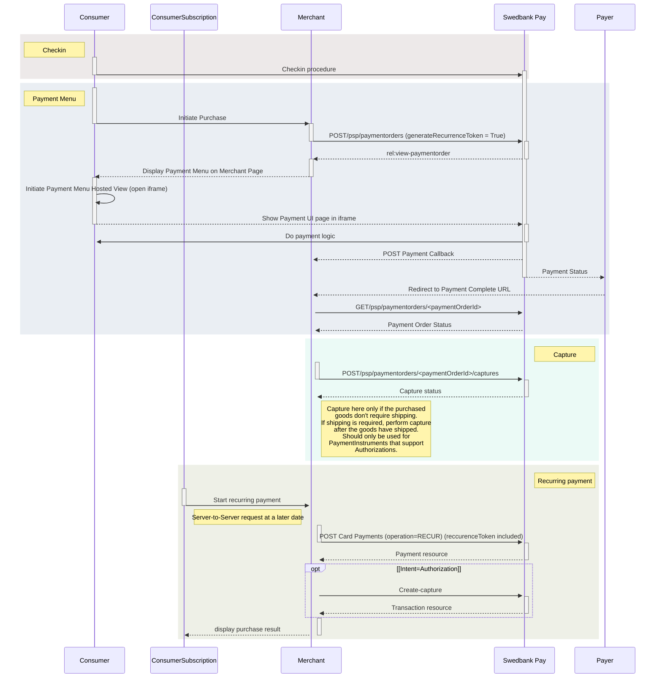

## Payment Orders

In order to initialize the Payment Menu, you need to create a Payment Order.
The `paymentorders` resource and how you interact with it is described below.



### Creating a payment order

To create a payment order, you perform a `POST` request towards the
`paymentorders` resource:





### URLs

When creating a Payment Order, the `urls` field of the `paymentOrder`
contains the related URIs, including where the payer is redirected when
going forward with or cancelling a payment session, as well as the callback URI
that is used to inform the payee (merchant) of changes or updates made to
underlying payments or transaction.

{:.table .table-striped}
|     Required      | Field               | Type     | Description                                                                                                                                                                                                                                                                                              |
| :---------------: | :------------------ | :------- | :------------------------------------------------------------------------------------------------------------------------------------------------------------------------------------------------------------------------------------------------------------------------------------------------------- |
|  ︎︎︎︎︎ | `hostUrls`          | `array`  | The array of URIs valid for embedding of Swedbank Pay Hosted Views.                                                                                                                                                                                                                                      |
|   | `completeUrl`       | `string` | The URL that Swedbank Pay will redirect back to when the payer has completed his or her interactions with the payment. This does not indicate a successful payment, only that it has reached a final (complete) state. A `GET` request needs to be performed on the payment order to inspect it further. See [`completeUrl`](#completeurl) for details.  |
|   | `termsOfServiceUrl` | `string` |                                                                                                                                                                                                                                                      |
|                   | `cancelUrl`         | `string` | The URI to redirect the payer to if the payment is canceled, either by the payer or by the merchant trough an `abort` request of the `payment` or `paymentorder`.                                                                                                                                        |
|                   | `paymentUrl`        | `string` | The URI that Swedbank Pay will redirect back to when the payment menu needs to be loaded, to inspect and act on the current status of the payment. See [`paymentUrl`](#payment-url) for details.                                                                                                                                                       |
|                   | `callbackUrl`       | `string` | The URI to the API endpoint receiving `POST` requests on transaction activity related to the payment order.                                                                                                                                                                                              |
|                   | `logoUrl`           | `string` |                                                                                                                                                                                                                |



#### URLs Resource

It is possible to perform a `GET` request on the `urls` resource to retrieve its
contents.

{:.code-view-header}
Request

```http
GET /psp/paymentorders/{{ page.payment_order_id }}/urls/ HTTP/1.1
Host: {{ page.api_host }}
Authorization: Bearer <AccessToken>
Content-Type: application/json
```

{:.code-view-header}
Response

```http
HTTP/1.1 200 OK
Content-Type: application/json

{
    "paymentorder": "/psp/paymentorders/{{ page.payment_order_id }}",
    "urls": {
        "id": "/psp/payments/{{ page.payment_order_id }}/urls",
        "hostUrls": [ "https://example.com", "https://example.net" ],
        "completeUrl": "https://example.com/payment-complete",
        "cancelUrl": "https://example.com/payment-canceled",
        "paymentUrl": "https://example.com/perform-payment",
        "callbackUrl": "http://api.example.com/payment-callback",
        "logoUrl": "http://merchant.com/path/to/logo.png",
        "termsOfServiceUrl": "http://merchant.com/path/to/tems"
    }
}
```

{:.table .table-striped}
| Field                       | Type     | Description                                                                                                                                                                                                                                                                                              |
| :-------------------------- | :------- | :------------------------------------------------------------------------------------------------------------------------------------------------------------------------------------------------------------------------------------------------------------------------------------------------------- |
| `paymentorder`              | `string` |                                                                                                                                                                                                                                                 |
| `urls`                      | `object` | The URLs object.                                                                                                                                                                                                                                                                                         |
| └➔&nbsp;`id`                | `string` |                                                                                                                                                                                                                                                     |
| └➔&nbsp;`hostsUrl`          | `string` | An array of the whitelisted URIs that are allowed as parents to a Hosted View, typically the URI of the web shop or similar that will embed a Hosted View within it.                                                                                                                                     |
| └➔&nbsp;`completeUrl`       | `string` | The URL that Swedbank Pay will redirect back to when the payer has completed his or her interactions with the payment. This does not indicate a successful payment, only that it has reached a final (complete) state. A `GET` request needs to be performed on the payment order to inspect it further. See [`completeUrl`](#completeurl) for details. |
| └➔&nbsp;`cancelUrl`         | `string` | The URI to redirect the payer to if the payment is canceled, either by the payer or by the merchant trough an `abort` request of the `payment` or `paymentorder`.                                                                                                                                        |
| └➔&nbsp;`paymentUrl`        | `string` | The URI that Swedbank Pay will redirect back to when the payment menu needs to be loaded, to inspect and act on the current status of the payment. See [`paymentUrl`](#payment-url) for details.                                                                                                          |
| └➔&nbsp;`callbackUrl`       | `string` | The URI that Swedbank Pay will perform an HTTP `POST` against every time a transaction is created on the payment. See [callback](#callback)) for details.                                                                                                                                                |
| └➔&nbsp;`logoUrl`           | `string` |                                                                                                                                                                                      |
| └➔&nbsp;`termsOfServiceUrl` | `string` |                                                                                                                                                                                                                                                      |

### Order Items

The `orderItems` field of the `paymentOrder` is an array containing the items being purchased with the order. Used to print on invoices if the payer chooses to pay with invoice, among other things. `orderItems` is required in all requests. It should be specified on both payment order creation as well as on [Capture][payment-order-capture].

{:.table .table-striped}
|     Required     | Field                 | Type      | Description                                                                                                                                                                                                                                                                           |
| :--------------: | :-------------------- | :-------- | :------------------------------------------------------------------------------------------------------------------------------------------------------------------------------------------------------------------------------------------------------------------------------------ |
|  | `reference`           | `string`  | A reference that identifies the order item.                                                                                                                                                                                                                                           |
|  | `name`                | `string`  | The name of the order item.                                                                                                                                                                                                                                                           |
|  | `type`                | `enum`    | `PRODUCT`, `SERVICE`, `SHIPPING_FEE`, `DISCOUNT`, `VALUE_CODE`, or `OTHER`. The type of the order item.                                                                                                                                                                               |
|  | `class`               | `string`  | The classification of the order item. Can be used for assigning the order item to a specific product category, such as `MobilePhone`. Note that `class` cannot contain spaces and must follow the regex pattern `[\w-]*`. Swedbank Pay may use this field for statistics. |
|                  | `itemUrl`             | `string`  | The URL to a page that can display the purchased item, such as a product page                                                                                                                                                                                                         |
|                  | `imageUrl`            | `string`  | The URL to an image of the order item.                                                                                                                                                                                                                                                |
|                  | `description`         | `string`  | The human readable description of the order item.                                                                                                                                                                                                                                     |
|                  | `discountDescription` | `string`  | The human readable description of the possible discount.                                                                                                                                                                                                                              |
|  | `quantity`            | `decimal` | The 4 decimal precision quantity of order items being purchased.                                                                                                                                                                                                                      |
|  | `quantityUnit`        | `string`  | The unit of the quantity, such as `pcs`, `grams`, or similar.                                                                                                                                                                                                                         |
|  | `unitPrice`           | `integer` | The price per unit of order item, including VAT.                                                                                                                                                                                                                                      |
|                  | `discountPrice`       | `integer` | If the order item is purchased at a discounted price. This field should contain that price, including VAT.                                                                                                                                                                            |
|  | `vatPercent`          | `integer` | The percent value of the VAT multiplied by 100, so `25%` becomes `2500`.                                                                                                                                                                                                              |
|  | `amount`              | `integer` |                                                                                                                                                                                                                                              |
|  | `vatAmount`           | `integer` |                                                                                                                                                                                                                                           |

### Items

The `items` field of the `paymentOrder` is an array containing items that will affect how the payment is performed.

{:.table .table-striped}
| Required | Field                          | Type      | Description                                                                                                                                           |
| :------: | :----------------------------- | :-------- | :---------------------------------------------------------------------------------------------------------------------------------------------------- |
|          | `creditCard`                   | `object`  | The credit card object.                                                                                                                               |
|          | └➔&nbsp;`rejectDebitCards`     | `bool`    | `true` if debit cards should be declined; otherwise `false` per default. Default value is set by Swedbank Pay and can be changed at your request.     |
|          | └➔&nbsp;`rejectDebitCards`     | `bool`    | `true` if debit cards should be declined; otherwise `false` per default. Default value is set by Swedbank Pay and can be changed at your request.     |
|          | └➔&nbsp;`rejectCreditCards`    | `bool`    | `true` if credit cards should be declined; otherwise `false` per default. Default value is set by Swedbank Pay and can be changed at your request.    |
|          | └➔&nbsp;`rejectConsumerCards`  | `bool`    | `true` if consumer cards should be declined; otherwise `false` per default. Default value is set by Swedbank Pay and can be changed at your request.  |
|          | └➔&nbsp;`rejectCorporateCards` | `bool`    | `true` if corporate cards should be declined; otherwise `false` per default. Default value is set by Swedbank Pay and can be changed at your request. |
|          | `invoice`                      | `object`  | The invoice object.                                                                                                                                   |
|          | └➔&nbsp;`feeAmount`            | `integer` | The fee amount in the lowest monetary unit to apply if the payer chooses to pay with invoice.                                                      |
|          | `swish`                        | `object`  | The swish object.                                                                                                                                     |
|          | └➔&nbsp;`enableEcomOnly`       | `bool`    | `true` to only enable Swish on ecommerce transactions.                                                                                                |

The `paymentOrders` resource utilize several sub-resources, relating to
underlying [payments][payment-orders-resource-payments],
[the current payment active][current-payment],
[payers][payment-orders-resource-payers] and [urls][urls].
Common sub-resources like [payeeinfo][payee-reference], that are
structurally identical for both payments and payments orders, are described in
the [Payment Resources][payment-resource] section.



## Instrument Mode

In "Instrument Mode" the Payment Menu will display only one specific payment
instrument instead of all configured on your merchant account. The Payment Order
resource works just like it otherwise would, allowing you to remain largely
indifferent to the payment instrument in use.

If you do not want to use Swedbank Pay Payment Menu or do have multiple payment
providers on your site we strongly recommend that you implement the "Instrument
Mode" functionality. To use this feature you will need to add the `instrument`
field to the request. This will make the  Swedbank Pay Payment Menu only render
a single payment instrument. So even if Swedbank Pay is set up to provide more
than one instrument you will be able to let it only show one at a time.

It is important to use this feature if you want to build your own payment menu.
In this case you should use the `instrument` field to enforce which payment
instrument to show. If you have an agreement with Swedbank Pay for both Card and
Swish/Vipps processing, and the payer chooses either of these instruments, you
should add the `instrument` parameter with the specific payment instrument. If
the payer later changes their mind and chooses the other instrument, you can
make a call to Swedbank Pay to change the instrument on the active payment. This
is important because we do not allow creating multiple payments with the same
`orderReference`. To ensure that you can still use the same `orderReference`,
you should only make one payment for each purchase and change the `instrument`
to reflect what the payer has chosen in your menu.

The Payment Menu is switched to "Instrument Mode" by providing the request field
`instrument` as described in the abbreviated example below.

{:.code-view-header}
**Request**

```http
POST /psp/paymentorders HTTP/1.1
Host: {{ page.api_host }}
Authorization: Bearer <AccessToken>
Content-Type: application/json

{
    "paymentorder": {
        "operation": "Purchase",
        "currency": "SEK",
        "amount": 1500,
        "vatAmount": 375,
        "description": "Test Purchase",
        "userAgent": "Mozilla/5.0...",
        "language": "sv-SE",
        "instrument": "CreditCard"
        "generateRecurrenceToken": true,
        "generatePaymentToken": true,
        "urls": {
            "hostUrls": [ "https://example.com", "https://example.net" ],
        }
    }
}
```

{:.code-view-header}
**Response**

```http
POST /psp/paymentorders HTTP/1.1
Host: {{ page.api_host }}
Authorization: Bearer <AccessToken>
Content-Type: application/json

{
    "paymentorder": {
        "id": "/psp/paymentorders/{{ page.payment_order_id }}",
        "instrument": "CreditCard"
        "paymentToken" : "{{ page.payment_token }}",
        "created": "2020-06-22T10:56:56.2927632Z",
        "updated": "2020-06-22T10:56:56.4035291Z",
        "operation": "Purchase",
        "state": "Ready",
        "currency": "SEK",
        "amount": 1500,
        "vatAmount": 375,
        "orderItems": {
            "id": "/psp/paymentorders/{{ page.payment_order_id }}/orderitems"
        }
    }
}
```

It is possible to switch instrument after the `paymentOrder` has been created.
You can do this with the following `PATCH` request, using Swish as an example.

```http
PATCH /psp/{{ api_resource }}/paymentorders/{{ page.payment_id }} HTTP/1.1
Host: {{ page.api_host }}
Authorization: Bearer <AccessToken>
Content-Type: application/json

{
  "paymentorder": {
    "operation": "SetInstrument",
    "instrument": "Swish"
  }
}
```

The valid instruments for the `paymentOrder` can be retrieved from the
`availableInstruments` parameter in the `paymentOrder` response. Using a
merchant set up with contracts for `Creditcard`, `Swish` and `Invoice`,
`availableInstruments` will look like this:

```
        "availableInstruments": [
            "CreditCard",
            "Invoice-PayExFinancingSe",
            "Swish"
        ],
```


## Payer Aware Payment Menu

To maximize the experience of your payers, you should implement the Payer
Aware Payment Menu by identifying each payer with a unique identifier. It is
important that you enforce a good SCA (Strong Consumer Authentication) strategy
when authenticating the payer. The payer identifier must then be sent with
the creation of the payment order to Swedbank Pay. This will enable Swedbank Pay
to render a unique payment menu experience for each payer. It will also
increase the chance for a frictionless payment.

By identifying your payers, they are able to store payment information for
future payments by setting the `generatePaymentToken` value to `true`. This will
enable the Swedbank Pay Payment Menu to show stored payment instrument details
for future purchases. The payer is, by default, asked if they want to store
their payment details, so even with `generatePaymentToken` set to `true`, it is
still up to the payer if they want the details stored or not.



### BYO Payment Menu

Payment Menu is versatile and can be configured in such a way that it functions
like a single payment instrument. In such configuration, it is easy to Bring
Your Own Payment Menu, i.e. building a customized payment menu in our own user
interface.

#### Add Stored Payment Instrument Details

When building a custom payment menu, features like adding new stored payment
instrument details (i.e. "Add new card") is something that needs to be provided
in your UI.

This can be achieved by forcing the creation of a `paymentToken` by setting
`disableStoredPaymentDetails` to `true` in a Purchase payment (if you want
to withdraw money and create the token in the same operation), or by performing
a [Verify payment](#verify-payments) (without withdrawing any money).

Setting `disableStoredPaymentDetails` to `true` will turn off all stored payment
details for the current purchase. The payer will also not be asked if they
want to store the payment detail that will be part of the purchase. When you use
this feature it is important that you have asked the payer in advance if it
is ok to store their payment details for later use.

Most often you will use the `disableStoredPaymentDetails` feature in combination
with the [Instrument Mode](#instrument-mode) capability. If you build your own
menu and want to show stored payment details, you will need to set the
`disableStoredPaymentDetails` to `true`. It is important that you then store the
`paymentToken` in your system or call Swedbank Pay with the `payerReference` to
get all active payment tokens registered on that payer when building your
menu. See the abbreviated `Purchase` example below.

{:.code-view-header}
**Request**

```http
POST /psp/paymentorders HTTP/1.1
Host: {{ page.api_host }}
Authorization: Bearer <AccessToken>
Content-Type: application/json

{
    "paymentorder": {
        "operation": "Purchase",
        "currency": "SEK",
        "amount": 1500,
        "vatAmount": 375,
        "description": "Test Purchase",
        "userAgent": "Mozilla/5.0...",
        "language": "sv-SE",
        "instrument": "CreditCard"
        "generateRecurrenceToken": true,
        "generatePaymentToken": true,
        "disableStoredPaymentDetails": true,
        "urls": {
            "hostUrls": [ "https://example.com", "https://example.net" ],
            "completeUrl": "https://example.com/payment-completed",
            "cancelUrl": "https://example.com/payment-canceled",
            "paymentUrl": "https://example.com/perform-payment",
            "callbackUrl": "https://api.example.com/payment-callback",
            "termsOfServiceUrl": "https://example.com/termsandconditoons.pdf",
            "logoUrl": "https://example.com/logo.png"
        },
        "payeeInfo": {
            "payeeId": "{{ page.merchant_id }}",
            "payeeReference": "AB832",
            "payeeName": "Merchant1",
            "productCategory": "A123",
            "orderReference": "or-123456",
            "subsite": "MySubsite"
        }
   }
}
```

{:.table .table-striped}
|     Required     | Field                             | Type         | Description                                                                                                                                                                                                                                                                                              |
| :--------------: | :-------------------------------- | :----------- | :------------------------------------------------------------------------------------------------------------------------------------------------------------------------------------------------------------------------------------------------------------------------------------------------------- |
|  | `paymentorder`                    | `object`     | The payment order object.                                                                                                                                                                                                                                                                                |
|  | └➔&nbsp;`operation`               | `string`     | The operation that the payment order is supposed to perform.                                                                                                                                                                                                                                             |
|  | └➔&nbsp;`currency`                | `string`     | The currency of the payment.                                                                                                                                                                                                                                                                             |
|  | └➔&nbsp;`amount`                  | `integer`    |                                                                                                                                                                                                                                                                 |
|  | └➔&nbsp;`vatAmount`               | `integer`    |                                                                                                                                                                                                                                                              |
|  | └➔&nbsp;`description`             | `string`     | The description of the payment order.                                                                                                                                                                                                                                                                     |
|  | └➔&nbsp;`instrument`              | `string`     | The payment instrument used. Selected by using the [Instrument Mode]({{ other_features_url }}#instrument-mode).                                                                                                                                                                                          |                                               |
|  | └➔&nbsp;`generateRecurrenceToken` | `bool`       | Determines whether a recurrence token should be generated. A recurrence token is primarily used to enable future [recurring payments]({{ other_features_url }}#recurring-payments) – with the same token – through server-to-server calls. Default value is `false`.                                     |  |
|  | └➔&nbsp;`generatePaymentToken`    | `bool`       | `true` or `false`. Set this to `true` if you want to create a `paymentToken` to use in future [One Click Payments][one-click-payments].                                                                                                                                                                  |                                               |
|                  | └➔&nbsp;`disableStoredPaymentDetails` | `bool` | Setting to `true` will turn off all stored payment details for the current purchase. When you use this feature it is important that you have asked the payer in advance if it is ok to store their payment details for later use.                                                                                         |
|  | └➔&nbsp;`userAgent`               | `string`     | The user agent of the payer.                                                                                                                                                                                                                                                                             |
|  | └➔&nbsp;`language`                | `string`     | The language of the payer.                                                                                                                                                                                                                                                                               |
|  | └➔&nbsp;`urls`                    | `object`     | The `urls` object, containing the URLs relevant for the payment order.                                                                                                                                                                                                                                   |
|  | └─➔&nbsp;`hostUrls`               | `array`      | The array of URIs valid for embedding of Swedbank Pay Hosted Views.                                                                                                                                                                                                                                      |
|  | └─➔&nbsp;`completeUrl`            | `string`     | The URL that Swedbank Pay will redirect back to when the payer has completed his or her interactions with the payment. This does not indicate a successful payment, only that it has reached a final (complete) state. A `GET` request needs to be performed on the payment order to inspect it further. See [`completeUrl`][completeurl] for details.  |
|                  | └─➔&nbsp;`cancelUrl`              | `string`     | The URI to redirect the payer to if the payment is canceled, either by the payer or by the merchant trough an `abort` request of the `payment` or `paymentorder`.                                                                                                                                        |
|                  | └─➔&nbsp;`paymentUrl`             | `string`     | The URI that Swedbank Pay will redirect back to when the payment menu needs to be loaded, to inspect and act on the current status of the payment. See [`paymentUrl`]({{ other_features_url }}#payment-url) for details.                                                                                                                                                        |
|  | └─➔&nbsp;`callbackUrl`            | `string`     | The URI to the API endpoint receiving `POST` requests on transaction activity related to the payment order.                                                                                                                                                                                              |
|  | └─➔&nbsp;`termsOfServiceUrl`      | `string`     |                                                                                                                                                                                                                                                      |
|  | └─➔&nbsp;`logoUrl`                | `string`     |          |
|  | └➔&nbsp;`payeeInfo`               | `string`     | The `payeeInfo` object, containing information about the payee.                                                                                                                                                                                                                                          |
|  | └─➔&nbsp;`payeeId`                | `string`     | The ID of the payee, usually the merchant ID.                                                                                                                                                                                                                                                            |
|  | └─➔&nbsp;`payeeReference`         | `string(30)` |                                                                                                                                                                              |
|                  | └─➔&nbsp;`payeeName`              | `string`     | The name of the payee, usually the name of the merchant.                                                                                                                                                                                                                                                 |
|                  | └─➔&nbsp;`productCategory`        | `string`     | A product category or number sent in from the payee/merchant. This is not validated by Swedbank Pay, but will be passed through the payment process and may be used in the settlement process.                                                                                                           |
|                  | └─➔&nbsp;`orderReference`         | `string(50)` | The order reference should reflect the order reference found in the merchant's systems.                                                                                                                                                                                                                  |
|                  | └─➔&nbsp;`subsite`                | `String(40)` | The subsite field can be used to perform [split settlement][split-settlement] on the payment. The subsites must be resolved with Swedbank Pay [reconciliation][settlement-and-reconciliation] before being used.                                                                                         |

### GDPR

Remember that you will have the responsibility to enforce GDPR requirements and
let the payer remove active payment tokens when they want. It is up to you
how to implement this functionality on your side but Swedbank Pay has the
API you need to ensure that cleaning up old data is easy. It is possible
to query for all active payment tokens registered on a specific
`payerReference`. Then you can either remove all tokens for that payer or
only a subset of all tokens.



## Operations

When a payment order resource is created and during its lifetime, it will have
a set of operations that can be performed on it.
The state of the payment order resource, what the access token is authorized
to do, the chosen payment instrument and its transactional states, etc.
determine the available operations before the initial purchase.
A list of possible operations and their explanation is given below.



{:.code-view-header}
**Operations**

```jsonc
{
    "paymentorder": {
        "id": "/psp/paymentorders/{{ page.payment_order_id }}",
    },
    "operations": [
        {
            "method": "PATCH",
            "href": "{{ page.api_url }}/psp/paymentorders/{{ page.payment_order_id }}",
            "rel": "update-paymentorder-abort",
            "contentType": "application/json"
        },
        {
            "method": "PATCH",
            "href": "{{ page.api_url }}/psp/paymentorders/{{ page.payment_order_id }}",
            "rel": "update-paymentorder-updateorder",
            "contentType": "application/json"
        },
        {
            "method": "GET",
            "href": "{{ page.front_end_url }}/paymentmenu/{{ page.payment_token }}",
            "rel": "redirect-paymentorder",
            "contentType": "text/html"
        },
        {
            "method": "GET",
            "href": "{{ page.front_end_url }}/paymentmenu/core/scripts/client/px.paymentmenu.client.js?token={{ page.payment_token }}&culture=nb-NO",
            "rel": "view-paymentorder",
            "contentType": "application/javascript"
        },
        {
            "method": "POST",
            "href": "{{ page.api_url }}/psp/paymentorders/{{ page.payment_order_id }}/captures",
            "rel": "create-paymentorder-capture",
            "contentType": "application/json"
        },
        {
            "method": "POST",
            "href": "{{ page.api_url }}/psp/paymentorders/{{ page.payment_order_id }}/cancellations",
            "rel": "create-paymentorder-cancel",
            "contentType": "application/json"
        },
        {
            "method": "POST",
            "href": "{{ page.api_url }}/psp/paymentorders/{{ page.payment_order_id }}/reversals",
            "rel": "create-paymentorder-reversal",
            "contentType": "application/json"
        },
        {
            "method": "GET",
            "href": "{{ page.api_url }}/psp/paymentorders/{{ page.payment_order_id }}/paid",
            "rel": "paid-paymentorder",
            "contentType": "application/json"
        },
        {
            "method": "GET",
            "href": "{{ page.api_url }}/psp/paymentorders/{{ page.payment_order_id }}/failed",
            "rel": "failed-paymentorder",
            "contentType": "application/problem+json"
        },
        {
            // Deprecated operation. Do not use!
            "method": "POST",
            "href": "{{ page.api_url }}/psp/creditcard/{{ page.payment_id }}/captures",
            "rel": "create-capture",
            "contentType": "application/json"
        },
        {
            // Deprecated operation. Do not use!
            "method": "POST",
            "href": "{{ page.api_url }}/psp/creditcard/{{ page.payment_id }}/cancellations",
            "rel": "create-cancel",
            "contentType": "application/json"
        },
        {
            // Deprecated operation. Do not use!
            "method": "POST",
            "href": "{{ page.api_url }}/psp/creditcard/{{ page.payment_id }}/reversals",
            "rel": "create-reversal",
            "contentType": "application/json"
        }
    ]
}
```

{:.table .table-striped}
| Field         | Type     | Description                                                                        |
| :------------ | :------- | :--------------------------------------------------------------------------------- |
| `href`        | `string` | The target URI to perform the operation against.                                   |
| `rel`         | `string` | The name of the relation the operation has to the current resource.                |
| `method`      | `string` | `GET`, `PATCH`, `POST`, etc. The HTTP method to use when performing the operation. |
| `contentType` | `string` | The HTTP content type of the resource referenced in the `href` field.              |

The operations should be performed as described in each response and not as
described here in the documentation. Always use the `href` and `method` as
specified in the response by finding the appropriate operation based on its
`rel` value. The only thing that should be hard coded in the client is the value
of the `rel` and the request that will be sent in the HTTP body of the request
for the given operation.

{:.table .table-striped}
| Operation                         | Description                                                                                                                                                                                                                                                                    |
| :-------------------------------- | :----------------------------------------------------------------------------------------------------------------------------------------------------------------------------------------------------------------------------------------------------------------------------- |
| `update-paymentorder-abort`       | [Aborts][operations] the payment order before any financial transactions are performed.                                                                                                                                                                                        |
| `update-paymentorder-updateorder` | Updates the order with a change in the `amount` and/or `vatAmount`.                                                                                                                                                                                                            |
| `redirect-paymentorder`           | Contains the URI that is used to redirect the payer to the Swedbank Pay Payments containing the Payment Menu.                                                                                                                                                               |
| `view-paymentorder`               | Contains the JavaScript `href` that is used to embed the Payment Menu UI directly on the webshop/merchant site.                                                                                                                                                                |
| `create-paymentorder-capture`     | The second part of a two-phase transaction where the authorized amount is sent from the payer to the payee. It is possible to do a part-capture on a subset of the authorized amount. Several captures on the same payment are possible, up to the total authorization amount. |
| `create-paymentorder-cancel`      | Used to cancel authorized and not yet captured transactions. If a cancellation is performed after doing a part-capture, it will only affect the not yet captured authorization amount.                                                                                         |
| `create-paymentorder-reversal`    | Used to reverse a payment. It is only possible to reverse a payment that has been captured and not yet reversed.                                                                                                                                                               |
| `paid-paymentorder`               | Returns the information about a paymentorder that has the status `paid`.                                                                                                                                                                                                       |
| `failed-paymentorder`             | Returns the information about a paymentorder that has the status `failed`.                                                                                                                                                                                                     |
| `create-capture`                  | **Deprecated operation. Do not use!**                                                                                                                                                                                                                                                     |
| `create-cancel`                   | **Deprecated operation. Do not use!**                                                                                                                                                                                                                                                     |
| `create-cancel`                   | **Deprecated operation. Do not use!**                                                                                                                                                                                                                                                     |





### View Payment Order

The `view-paymentorder` operation contains the URI of the JavaScript that needs to be set as a `script` element's `src` attribute, either client-side through JavaScript or server-side in HTML as shown below.

```html
<!DOCTYPE html>
<html>
    <head>
        <title>Swedbank Pay Checkout is Awesome!</title>
    </head>
    <body>
        <div id="checkout"></div>
        <script src="{{ page.front_end_url }}/paymentmenu/core/scripts/client/px.paymentmenu.client.js?token={{ page.payment_token }}&culture=nb-NO"></script>
        <script language="javascript">
            payex.hostedView.paymentMenu({
                container: 'checkout',
                culture: 'nb-NO',
                onPaymentCompleted: function(paymentCompletedEvent) {
                    console.log(paymentCompletedEvent);
                },
                onPaymentFailed: function(paymentFailedEvent) {
                    console.log(paymentFailedEvent);
                },
                onPaymentCreated: function(paymentCreatedEvent) {
                    console.log(paymentCreatedEvent);
                },
                onPaymentToS: function(paymentToSEvent) {
                    console.log(paymentToSEvent);
                },
                onPaymentMenuInstrumentSelected: function(paymentMenuInstrumentSelectedEvent) {
                    console.log(paymentMenuInstrumentSelectedEvent);
                },
                onError: function(error) {
                    console.error(error);
                },
            }).open();
        </script>
    </body>
</html>
```

### Update Order

The `UpdateOrder` operation is used when there is a change in the amount, vat
amount or there are added or removed order items in the payment order.



In case the shopping cart is changed in another browser tab, that should also lead to an
`UpdateOrder`. On `window.onfocus` in the tab that had Payment Menu initialized,
`refresh()` should be invoked so the correct amount is authorized.

If the page is refreshed by a full page reload, `refresh()` is not necessary.

{:.code-view-header}
**Request**

```http
PATCH /psp/paymentorders/{{ page.payment_order_id }} HTTP/1.1
Authorization: Bearer <AccessToken>
Content-Type: application/json

{
    "paymentorder": {
        "operation": "UpdateOrder",
        "amount": 1500,
        "vatAmount": 375,
        "orderItems": [
            {
                "reference": "P1",
                "name": "Product1",
                "type": "PRODUCT",
                "class": "ProductGroup1",
                "itemUrl": "https://example.com/shop/products/1234",
                "imageUrl": "https://example.com/products/product1.jpg",
                "description": "Product description",
                "discountDescription": "Volume discount",
                "quantity": 351.3514,
                "quantityUnit": "pcs",
                "unitPrice": 300,
                "discountPrice": 200,
                "vatPercent": 2500,
                "amount": 1000,
                "vatAmount": 250
            },
            {
                "reference": "P2",
                "name": "Product2",
                "type": "PRODUCT",
                "class": "ProductGroup1",
                "description": "Product description",
                "quantity": 9876.1531,
                "quantityUnit": "pcs",
                "unitPrice": 500,
                "vatPercent": 2500,
                "amount": 500,
                "vatAmount": 125
            }
        ]
    }
}
```

{:.table .table-striped}
|     Required     | Field                          | Type      | Description                                                                                                                                                                                                                                                                           |
| :--------------: | :----------------------------- | :-------- | :------------------------------------------------------------------------------------------------------------------------------------------------------------------------------------------------------------------------------------------------------------------------------------ |
|  | `paymentorder`                 | `object`  | The payment order object.                                                                                                                                                                                                                                                             |
|  | └➔&nbsp;`operation`            | `string`  | The operation that the payment order is supposed to perform.                                                                                                                                                                                                                          |
|  | └➔&nbsp;`amount`               | `integer` |                                                                                                                                                                                                                                              |
|  | └➔&nbsp;`vatAmount`            | `integer` |                                                                                                                                                                                                                                           |
|  | └➔&nbsp;`description`          | `string`  | The description of the payment order.                                                                                                                                                                                                                                                 |
|  | └➔&nbsp;`orderItems`           | `array`   |                                                                                                                                                                                                                                          |
|  | └─➔&nbsp;`reference`           | `string`  | A reference that identifies the order item.                                                                                                                                                                                                                                           |
|  | └─➔&nbsp;`name`                | `string`  | The name of the order item.                                                                                                                                                                                                                                                           |
|  | └─➔&nbsp;`type`                | `enum`    | `PRODUCT`, `SERVICE`, `SHIPPING_FEE`, `PAYMENT_FEE`, `DISCOUNT`, `VALUE_CODE` or `OTHER`. The type of the order item.                                                                                                                                                                 |
|  | └─➔&nbsp;`class`               | `string`  | The classification of the order item. Can be used for assigning the order item to a specific product category, such as `MobilePhone`. Note that `class` cannot contain spaces and must follow the regex pattern `[\w-]*`. Swedbank Pay may use this field for statistics. |
|  | └─➔&nbsp;`itemUrl`             | `string`  | The URL to a page that can display the purchased item, product or similar.                                                                                                                                                                                                            |
|  | └─➔&nbsp;`imageUrl`            | `string`  | The URL to an image of the order item.                                                                                                                                                                                                                                                |
|  | └─➔&nbsp;`description`         | `string`  | The human readable description of the order item.                                                                                                                                                                                                                                     |
|  | └─➔&nbsp;`discountDescription` | `string`  | The human readable description of the possible discount.                                                                                                                                                                                                                              |
|  | └─➔&nbsp;`quantity`            | `integer` | The 4 decimal precision quantity of order items being purchased.                                                                                                                                                                                                                      |
|  | └─➔&nbsp;`quantityUnit`        | `string`  | The unit of the quantity, such as `pcs`, `grams`, or similar. This is a free-text field and is used for your own book keeping.                                                                                                                                                        |
|  | └─➔&nbsp;`unitPrice`           | `integer` | The price per unit of order item, including VAT.                                                                                                                                                                                                                                      |
|  | └─➔&nbsp;`discountPrice`       | `integer` | If the order item is purchased at a discounted price. This field should contain that price, including VAT.                                                                                                                                                                            |
|  | └─➔&nbsp;`vatPercent`          | `integer` | The percent value of the VAT multiplied by 100, so `25%` becomes `2500`.                                                                                                                                                                                                              |
|  | └─➔&nbsp;`amount`              | `integer` | The total amount including VAT to be paid for the specified quantity of this order item, in the lowest monetary unit of the currency. E.g. `10000` equals `100.00 NOK` and `500`0 equals `50.00 NOK`.                                                                                 |
|  | └─➔&nbsp;`vatAmount`           | `integer` | The total amount of VAT to be paid for the specified quantity of this order item, in the lowest monetary unit of the currency. E.g. `10000` equals `100.00 NOK` and `500`0 equals `50.00 NOK`.                                                                                        |

{:.code-view-header}
**Response**

```http
HTTP/1.1 200 OK
Content-Type: application/json

{
    "paymentorder": {
        "id": "/psp/paymentorders/{{ page.payment_order_id }}",
        "created": "2018-09-14T13:21:29.3182115Z",
        "updated": "2018-09-14T13:21:57.6627579Z",
        "operation": "Purchase",
        "state": "Ready",
        "currency": "SEK",
        "amount": 1500,
        "vatAmount": 0,
        "remainingCaptureAmount": 1500,
        "remainingCancellationAmount": 1500,
        "remainingReversalAmount": 0,
        "description": "Test Purchase",
        "initiatingSystemUserAgent": "PostmanRuntime/3.0.1",
        "userAgent": "Mozilla/5.0...",
        "language": "nb-NO",
        "urls" : { "id": "/psp/paymentorders/{{ page.payment_order_id }}/urls" },
        "payeeInfo" : { "id": "/psp/paymentorders/{{ page.payment_order_id }}/payeeinfo" },
        "settings": { "id": "/psp/paymentorders/{{ page.payment_order_id }}/settings" },
        "payers": { "id": "/psp/paymentorders/{{ page.payment_order_id }}/payers" },
        "orderItems" : { "id": "/psp/paymentorders/{{ page.payment_order_id }}/orderItems" },
        "metadata": { "id": "/psp/paymentorders/{{ page.payment_order_id }}/metadata" },
        "payments": { "id": "/psp/paymentorders/{{ page.payment_order_id }}/payments" },
        "currentPayment": { "id": "/psp/paymentorders/{{ page.payment_order_id }}/currentpayment" }
    },
    "operations": [
        {
            "method": "PATCH",
            "href": "https://api.stage.payex.com/psp/paymentorders/7f27f445-cefe-4a48-d405-08d8143ed22b",
            "rel": "update-paymentorder-updateorder",
            "contentType": "application/json"
        },
        {
            "method": "PATCH",
            "href": "{{ page.api_url }}/psp/paymentorders/{{ page.payment_order_id }}",
            "rel": "update-paymentorder-abort",
            "contentType": "application/json"
        },
        {
            "method": "PATCH",
            "href": "{{ page.api_url }}/psp/paymentorders/{{ page.payment_order_id }}",
            "rel": "update-paymentorder-expandinstrument",
            "contentType": "application/json"
        },
        {
            "method": "GET",
            "href": "{{ page.front_end_url }}/paymentmenu/{{ page.payment_token }}",
            "rel": "redirect-paymentorder",
            "contentType": "text/html"
        },
        {
            "method": "GET",
            "href": "{{ page.front_end_url }}/paymentmenu/core/scripts/client/px.paymentmenu.client.js?token={{ page.payment_token }}&culture=nb-NO",
            "rel": "view-paymentorder",
            "contentType": "application/javascript"
        }
    ]
}
```

{:.table .table-striped}
| Field                             | Type         | Description                                                                                                                                                                                                                                                                                                                                                |
| :-------------------------------- | :----------- | :--------------------------------------------------------------------------------------------------------------------------------------------------------------------------------------------------------------------------------------------------------------------------------------------------------------------------------------------------------- |
| `payment`                         | `object`     | The `payment` object contains information about the specific payment.                                                                                                                                                                                                                                                                                      |
| └➔&nbsp;`id`                      | `string`     |                                                                                                                                                                                                                                                                                                                       |
| └➔&nbsp;`number`                  | `integer`    | The payment  number , useful when there's need to reference the payment in human communication. Not usable for programmatic identification of the payment, for that  id  should be used instead.                                                                                                                                                           |
| └➔&nbsp;`created`                 | `string`     | The ISO-8601 date of when the payment was created.                                                                                                                                                                                                                                                                                                         |
| └➔&nbsp;`updated`                 | `string`     | The ISO-8601 date of when the payment was updated.                                                                                                                                                                                                                                                                                                         |
| └➔&nbsp;`state`                   | `string`     | `Ready`, `Pending`, `Failed` or `Aborted`. Indicates the state of the payment, not the state of any transactions performed on the payment. To find the state of the payment's transactions (such as a successful authorization), see the `transactions` resource or the different specialized type-specific resources such as `authorizations` or `sales`. |
| └➔&nbsp;`prices`                  | `object`     | The `prices` resource lists the prices related to a specific payment.                                                                                                                                                                                                                                                                                      |
| └─➔&nbsp;`id`                     | `string`     |                                                                                                                                                                                                                                                                                                     |
| └➔&nbsp;`amount`                  | `integer`    |                                                                                                                                                                                                                                                                                                                   |
| └➔&nbsp;`remainingCaptureAmount`  | `integer`    | The available amount to capture.                                                                                                                                                                                                                                                                                                                           |
| └➔&nbsp;`remainingCancelAmount`   | `integer`    | The available amount to cancel.                                                                                                                                                                                                                                                                                                                            |
| └➔&nbsp;`remainingReversalAmount` | `integer`    | The available amount to reverse.                                                                                                                                                                                                                                                                                                                           |
| └➔&nbsp;`description`             | `string(40)` |                                                                                                                                                                                                                                                          |
| └➔&nbsp;`payerReference`          | `string`     |                                                                                                                                                                                                                           |
| └➔&nbsp;`userAgent`               | `string`     | The [user agent][user-agent] string of the payer's browser.                                                                                                                                                                                                                                                                                             |
| └➔&nbsp;`language`                | `string`     |                                                                                                                                                                                                                                                                                       |
| └➔&nbsp;`urls`                    | `string`     | The URI to the  urls  resource where all URIs related to the payment can be retrieved.                                                                                                                                                                                                                                                                     |
| └➔&nbsp;`payeeInfo`               | `string`     |                                                                                                                                                                                                                                                  |
| `operations`                      | `array`      | The array of possible operations to perform                                                                                                                                                                                                                                                                                                                |
| └─➔&nbsp;`method`                 | `string`     | The HTTP method to use when performing the operation.                                                                                                                                                                                                                                                                                                      |
| └─➔&nbsp;`href`                   | `string`     | The target URI to perform the operation against.                                                                                                                                                                                                                                                                                                           |
| └─➔&nbsp;`rel`                    | `string`     | The name of the relation the operation has to the current resource.                                                                                                                                                                                                                                                                                        |

The response given when changing a payment order is equivalent to a `GET`
request towards the `paymentorders` resource,
[as displayed above][payment-orders-resource]. Even though the fields are the
same, the `UpdateOrder` request will overwrite the fields thart were sent in
the initial `Purchase` request.

### Abort

To abort a payment order, perform the `update-paymentorder-abort` operation that
is returned in the payment order response. You need to include the following
in the request body:

{:.code-view-header}
**Request**

```http
PATCH /psp/paymentorders/{{ page.payment_order_id }} HTTP/1.1
Host: {{ page.api_host }}
Authorization: Bearer <AccessToken>
Content-Type: application/json

{
  "paymentorder": {
    "operation": "Abort",
    "abortReason": "CancelledByConsumer"
  }
}
```

{:.code-view-header}
**Response**

```http
HTTP/1.1 200 OK
Content-Type: application/json

{
    "paymentorder": {
        "id": "/psp/paymentorders/{{ page.payment_order_id }}",
        "created": "2018-09-14T13:21:29.3182115Z",
        "updated": "2018-09-14T13:21:57.6627579Z",
        "operation": "Purchase",
        "state": "Ready",
        "currency": "SEK",
        "amount": 1500,
        "vatAmount": 0,
        "remainingCaptureAmount": 1500,
        "remainingCancellationAmount": 1500,
        "remainingReversalAmount": 0,
        "description": "Test Purchase",
        "initiatingSystemUserAgent": "PostmanRuntime/3.0.1",
        "userAgent": "Mozilla/5.0...",
        "language": "nb-NO",
        "urls" : { "id": "/psp/paymentorders/{{ page.payment_order_id }}/urls" },
        "payeeInfo" : { "id": "/psp/paymentorders/{{ page.payment_order_id }}/payeeinfo" },
        "settings": { "id": "/psp/paymentorders/{{ page.payment_order_id }}/settings" },
        "payers": { "id": "/psp/paymentorders/{{ page.payment_order_id }}/payers" },
        "orderItems" : { "id": "/psp/paymentorders/{{ page.payment_order_id }}/orderItems" },
        "metadata": { "id": "/psp/paymentorders/{{ page.payment_order_id }}/metadata" },
        "payments": { "id": "/psp/paymentorders/{{ page.payment_order_id }}/payments" },
        "currentPayment": { "id": "/psp/paymentorders/{{ page.payment_order_id }}/currentpayment" }
    },
    "operations": [
        {
            "method": "PATCH",
            "href": "{{ page.api_url }}/psp/paymentorders/{{ page.payment_order_id }}",
            "rel": "update-paymentorder-abort",
            "contentType": "application/json"
        },
        {
            "method": "GET",
            "href": "{{ page.front_end_url }}/paymentmenu/{{ page.payment_token }}",
            "rel": "redirect-paymentorder",
            "contentType": "text/html"
        },
        {
            "method": "GET",
            "href": "{{ page.front_end_url }}/paymentmenu/core/scripts/client/px.paymentmenu.client.js?token={{ page.payment_token }}&culture=nb-NO",
            "rel": "view-paymentorder",
            "contentType": "application/javascript"
        }
    ]
}
```

The response given when aborting a payment order is equivalent to a `GET`
request towards the `paymentorders` resource, as displayed above.
with its `state` set to `Aborted`.

### Cancel



#### Reversal





## Recurring Payments

If you want to enable subsequent recurring – server-to-server – payments, you
need to create a **recurrence token**. This token will be utilized after the
initial payment order. **Recurring payments must be activated on the contract
with Swedbank Pay in order to work.**

### Recurrence Token

*   When initiating a `Purchase` payment order, you need to make sure that the
    field `generateRecurrenceToken` is set to `true`. This recurrence token will
    stored in the [authorization transaction][transaction] sub-resource on the
    underlying payment resource.
*   When initiating a `Verify` payment order, a recurrence token will be
    generated automatically. This recurrence token is stored in the
    [verification](#verify-payments) sub-resource on the underlying
    payment resource.

You can view the current payment resource, containg the recurrence token and
other payment instrument properties, by [expanding the sub-resource][expanding]
[`currentpayment`][current-payment] when doing a `GET` request on the
`paymentorders` resource.

{:.code-view-header}
**Request**

```http
GET /psp/paymentorders/{{ page.payment_order_id }}?$expand=currentpayment HTTP/1.1
Host: {{ page.api_host }}
```

### Creating Recurring Payments

When you have a `recurrenceToken` token safely tucked away, you can use this
token in a subsequent `Recur` payment order. This will be a server-to-server
affair, as we have tied all necessary payment instrument details related to the
recurrence token during the initial payment order.

{:.code-view-header}
**Request**

```http
POST /psp/paymentorders HTTP/1.1
Host: {{ page.api_host }}
Authorization: Bearer <AccessToken>
Content-Type: application/json

{
  "paymentorder": {
    "operation": "Recur",
    "recurrenceToken": "{{ page.payment_order_id }}",
    "currency": "SEK",
    "amount": 1000,
    "vatAmount": 250,
    "description": "Test Purchase",
    "userAgent": "Mozilla/5.0...",
    "language": "sv-SE",
    "urls": {
      "callbackUrl": "https://example.com/callback"
    },
    "payeeInfo": {
      "payeeId": "{{ page.merchant_id }}",
      "payeeReference": "CD1234",
      "payeeName": "Merchant1",
      "productCategory": "A123",
      "orderReference": "or-12456",
      "subsite": "Subsite1"
    },
    "orderItems": [
      {
        "reference": "P1",
        "name": "Product1",
        "type": "PRODUCT",
        "class": "ProductGroup1",
        "itemUrl": "https://example.com/shop/id=123",
        "imageUrl": "https://example.com/product1.jpg",
        "description": "Product 1 description",
        "discountDescription": "Volume discount",
        "quantity": 4,
        "quantityUnit": "pcs",
        "unitPrice": 300,
        "discountPrice": 200,
        "vatPercent": 2500,
        "amount": 1000,
        "vatAmount": 250
      }
    ]
    "metadata": {
        "key1": "value1",
        "key2": 2,
        "key3": 3.1,
        "key4": false
    }
  }
}
```

{:.table .table-striped}
|     Required     | Field                          | Type         | Description                                                                                                                                                                                                                                                                           |
| :--------------: | :----------------------------- | :----------- | :------------------------------------------------------------------------------------------------------------------------------------------------------------------------------------------------------------------------------------------------------------------------------------ |
|  | `paymentorder`                 | `object`     | The payment order object.                                                                                                                                                                                                                                                             |
|  | `operation`                    | `object`     | `Recur`.                                                                                                                                                                                                                                                                              |
|  | └➔&nbsp;`recurrenceToken`      | `string`     | The created recurrenceToken, if `operation: Verify`, `operation: Recur` or `generateRecurrenceToken: true` was used.                                                                                                                                                                  |
|  | └➔&nbsp;`currency`             | `string`     | The currency of the payment order.                                                                                                                                                                                                                                                    |
|  | └➔&nbsp;`amount`               | `integer`    |                                                                                                                                                                                                                                              |
|  | └➔&nbsp;`vatAmount`            | `integer`    |                                                                                                                                                                                                                                           |
|  | └➔&nbsp;`description`          | `string`     |                                                                                                                                                                                      |
|  | └─➔&nbsp;`userAgent`           | `string`     | The [`User-Agent` string][user-agent] of the payer's web browser.                                                                                                                                                                                                                  |
|  | └─➔&nbsp;`language`            | `string`     |                                                                                                                                                                                                               |
|  | └─➔&nbsp;`urls`                | `string`     | The URI to the `urls` resource where all URIs related to the payment order can be retrieved.                                                                                                                                                                                          |
|  | └─➔&nbsp;`callbackUrl`         | `string`     | The URL that Swedbank Pay will perform an HTTP `POST` against every time a transaction is created on the payment. See [callback](#callback) for details.                                                                                                                              |
|  | └➔&nbsp;`payeeInfo`            | `string`     |                                                                                                                                                                                           |
|  | └─➔&nbsp;`payeeId`             | `string`     | This is the unique id that identifies this payee (like merchant) set by Swedbank Pay.                                                                                                                                                                                                 |
|  | └➔&nbsp;`payeeReference`       | `string(30)` |                                                                                                                                                           |
|                  | └➔&nbsp;`receiptReference`     | `string(30)` | A unique reference from the merchant system. It is used to supplement `payeeReference` as an additional receipt number.                                                                                                                                                               |
|  | └─➔&nbsp;`payeeName`           | `string`     | The payee name (like merchant name) that will be displayed when redirected to Swedbank Pay.                                                                                                                                                                               |
|  | └─➔&nbsp;`productCategory`     | `string`     | A product category or number sent in from the payee/merchant. This is not validated by Swedbank Pay, but will be passed through the payment process and may be used in the settlement process.                                                                                        |
|  | └─➔&nbsp;`orderReference`      | `String(50)` | The order reference should reflect the order reference found in the merchant's systems.                                                                                                                                                                                               |
|  | └─➔&nbsp;`subsite`             | `String(40)` | The subsite field can be used to perform [split settlement][split-settlement] on the payment. The subsites must be resolved with Swedbank Pay [reconciliation][settlement-and-reconciliation] before being used.                                                                      |
|  | └➔&nbsp;`orderItems`           | `array`      |                                                                                                                                                                                                                                          |
|  | └─➔&nbsp;`reference`           | `string`     | A reference that identifies the order item.                                                                                                                                                                                                                                           |
|  | └─➔&nbsp;`type`                | `enum`       | `PRODUCT`, `SERVICE`, `SHIPPING_FEE`, `PAYMENT_FEE`, `DISCOUNT`, `VALUE_CODE` or `OTHER`. The type of the order item.                                                                                                                                                                 |
|  | └─➔&nbsp;`class`               | `string`     | The classification of the order item. Can be used for assigning the order item to a specific product category, such as `MobilePhone`. Note that `class` cannot contain spaces and must follow the regex pattern `[\w-]*`. Swedbank Pay may use this field for statistics. |
|                  | └─➔&nbsp;`itemUrl`             | `string`     | The URL to a page that can display the purchased item, product or similar.                                                                                                                                                                                                            |
|        ︎︎︎         | └─➔&nbsp;`imageUrl`            | `string`     | The URL to an image of the order item.                                                                                                                                                                                                                                                |
|                  | └─➔&nbsp;`description`         | `string`     | The human readable description of the order item.                                                                                                                                                                                                                                     |
|                  | └─➔&nbsp;`discountDescription` | `string`     | The human readable description of the possible discount.                                                                                                                                                                                                                              |
|  | └─➔&nbsp;`quantity`            | `integer`    | The 4 decimal precision quantity of order items being purchased.                                                                                                                                                                                                                      |
|  | └─➔&nbsp;`quantityUnit`        | `string`     | The unit of the quantity, such as `pcs`, `grams`, or similar. This is a free-text field and is used for your own book keeping.                                                                                                                                                        |
|  | └─➔&nbsp;`unitPrice`           | `integer`    | The price per unit of order item, including VAT.                                                                                                                                                                                                                                      |
|  | └─➔&nbsp;`discountPrice`       | `integer`    | If the order item is purchased at a discounted price. This field should contain that price, including VAT.                                                                                                                                                                            |
|  | └─➔&nbsp;`vatPercent`          | `integer`    | The percent value of the VAT multiplied by 100, so `25%` becomes `2500`.                                                                                                                                                                                                              |
|  | └─➔&nbsp;`amount`              | `integer`    | The total amount including VAT to be paid for the specified quantity of this order item, in the lowest monetary unit of the currency. E.g. `10000` equals `100.00 SEK` and `5000` equals `50.00 SEK`.                                                                                 |
|  | └─➔&nbsp;`vatAmount`           | `integer`    | The total amount of VAT to be paid for the specified quantity of this order item, in the lowest monetary unit of the currency. E.g. `10000` equals `100.00 SEK` and `5000` equals `50.00 SEK`.                                                                                        |
|                  | └➔&nbsp;`metadata`             | `object`      | 
|



### Purchase Flow



## Purchase Payments

The `Purchase` operation is used in all common purchase scenarios.

{:.code-view-header}
**Purchase**

```json
{
    "paymentorder": {
        "operation": "Purchase"
    {
}
```

## Verify Payments

The `Verify` operation lets you post verifications to confirm the validity of
**credit card information**, without reserving or charging any amount. This
option is mainly used to initiate a recurring payment scenario where the card
will be charged at a later date. The request body is equivalent to a `Purchase`
order with credit card as the selected item.
A [recurrence token][payment-orders-resource] will be generated automatically,
rendering the parameter `generateRecurrenceToken` unnecessary for this
operation.

{:.code-view-header}
**Verify**

```json
{
    "paymentorder": {
        "operation": "Verify"
    {
}
```

{:.code-view-header}
**Request**

```http
POST /psp/{{ api_resource }}/payments HTTP/1.1
Host: {{ page.api_host }}
Authorization: Bearer <AccessToken>
Content-Type: application/json

{
    "paymentorder": {
        "operation": "Verify",
        "currency": "NOK",
        "description": "Test Verification",
        "payerReference": "AB1234",
        "userAgent": "Mozilla/5.0...",
        "language": "nb-NO",
        "generatePaymentToken": true,
        "generateRecurrenceToken": true,
        "urls": {
            "hostUrls": ["https://example.com", "https://example.net"],
            "completeUrl": "https://example.com/payment-completed",
            "cancelUrl": "https://example.com/payment-canceled",
            "logoUrl": "https://example.com/payment-logo.png",
            "termsOfServiceUrl": "https://example.com/payment-terms.html"
        },
        "payeeInfo": {
            "payeeId": "{{ page.merchant_id }}",
            "payeeReference": "CD1234",
            "payeeName": "Merchant1",
            "productCategory": "A123",
            "orderReference": "or-12456",
            "subsite": "MySubsite"
        }
    },
    "creditCard": {
        "rejectCreditCards": false,
        "rejectDebitCards": false,
        "rejectConsumerCards": false,
        "rejectCorporateCards": false
    }
}
```

{:.table .table-striped}
|     Required     | Field                             | Type         | Description                                                                                                                                                                                                                                                                                              |
| :--------------: | :-------------------------------- | :----------- | :------------------------------------------------------------------------------------------------------------------------------------------------------------------------------------------------------------------------------------------------------------------------------------------------------- |
|  | `paymentorder`                    | `object`     | The payment order object.                                                                                                                                                                                                                                                                                |
|  | └➔&nbsp;`operation`               | `string`     | The operation that the payment order is supposed to perform.                                                                                                                                                                                                                                             |
|  | └➔&nbsp;`currency`                | `string`     | The currency of the payment.                                                                                                                                                                                                                                                                             |
|  | └➔&nbsp;`amount`                  | `integer`    |                                                                                                                                                                                                                                                                 |
|  | └➔&nbsp;`vatAmount`               | `integer`    |                                                                                                                                                                                                                                                              |
|  | └➔&nbsp;`description`             | `string`     | The description of the payment order.                                                                                                                                                                                                                                                                    |  |
|  | └➔&nbsp;`generatePaymentToken`    | `bool`       | `true` or `false`. Set this to `true` if you want to create a payment token for future use as [One Click Payments][one-click-payments]. All payment instruments will still be availabe in the payment menu, but the payment token will only be generated if the instrument chosen by the payer supports one click.                                                                                                                                       |                                               |
|  | └➔&nbsp;`userAgent`               | `string`     | The user agent of the payer.                                                                                                                                                                                                                                                                             |
|  | └➔&nbsp;`language`                | `string`     | The language of the payer.                                                                                                                                                                                                                                                                               |
|  | └➔&nbsp;`generateRecurrenceToken` | `bool`       | Determines whether a recurrence token should be generated. A recurrence token is primarily used to enable future [recurring payments](#recurring-payments) – with the same token – through server-to-server calls. Default value is `false`. If set to `true`, only payment instruments which support recurring payments will be visible in the payment menu.                                                         |
|  | └➔&nbsp;`urls`                    | `object`     | The `urls` object, containing the URLs relevant for the payment order.                                                                                                                                                                                                                                   |
|  | └─➔&nbsp;`hostUrls`               | `array`      | The array of URIs valid for embedding of Swedbank Pay Hosted Views.                                                                                                                                                                                                                                      |
|  | └─➔&nbsp;`completeUrl`            | `string`     | The URL that Swedbank Pay will redirect back to when the payer has completed his or her interactions with the payment. This does not indicate a successful payment, only that it has reached a final (complete) state. A `GET` request needs to be performed on the payment order to inspect it further. See [`completeUrl`](#completeurl) for details.
|
|                  | └─➔&nbsp;`cancelUrl`              | `string`     | The URI to redirect the payer to if the payment is canceled, either by the payer or by the merchant trough an `abort` request of the `payment` or `paymentorder`.                                                                                                                                        |
|                  | └─➔&nbsp;`paymentUrl`             | `string`     | The URI that Swedbank Pay will redirect back to when the payment menu needs to be loaded, to inspect and act on the current status of the payment. See [`paymentUrl`](#payment-url) for details.                                                                                                                                                       |
|  | └─➔&nbsp;`callbackUrl`            | `string`     | The URI to the API endpoint receiving `POST` requests on transaction activity related to the payment order.                                                                                                                                                                                              |
|  | └─➔&nbsp;`termsOfServiceUrl`      | `string`     |                                                                                                                                                                                                                                                      |
|  | └➔&nbsp;`payeeInfo`               | `string`     |                                                                                                                                                                                                                                          |
|  | └─➔&nbsp;`payeeId`                | `string`     | The ID of the payee, usually the merchant ID.                                                                                                                                                                                                                                                            |
|  | └─➔&nbsp;`payeeReference`         | `string(30)` |                                                                                                                                                                                      |
|                  | └─➔&nbsp;`payeeName`              | `string`     | The name of the payee, usually the name of the merchant.                                                                                                                                                                                                                                                 |
|                  | └─➔&nbsp;`productCategory`        | `string`     | A product category or number sent in from the payee/merchant. This is not validated by Swedbank Pay, but will be passed through the payment process and may be used in the settlement process.                                                                                                           |
|                  | └─➔&nbsp;`orderReference`         | `string(50)` | The order reference should reflect the order reference found in the merchant's systems.                                                                                                                                                                                                                  |
|                  | └─➔&nbsp;`subsite`                | `String(40)` | The subsite field can be used to perform [split settlement][split-settlement] on the payment. The subsites must be resolved with Swedbank Pay [reconciliation][settlement-and-reconciliation] before being used.                                                                                         |

{:.code-view-header}
**Response**

```http
HTTP/1.1 200 OK
Content-Type: application/json

{
    "paymentorder": {
        "id": "/psp/{{ api_resource }}/payments/{{ page.payment_id }}",
        "paymentToken" : "{{ page.payment_token }}",
        "number": 1234567890,
        "created": "2016-09-14T13:21:29.3182115Z",
        "updated": "2016-09-14T13:21:57.6627579Z",
        "operation": "Verify",
        "state": "Ready",
        "currency": "NOK",
        "amount": 0,
        "description": "Test Verification",
        "payerReference": "AB1234",
        "initiatingSystemUserAgent": "PostmanRuntime/3.0.1",
        "userAgent": "Mozilla/5.0",
        "language": "nb-NO",
        "transactions": { "id": "/psp/{{ api_resource }}/payments/{{ page.payment_id }}/transactions" },
        "verifications": { "id": "/psp/{{ api_resource }}/payments/{{ page.payment_id }}/verifications" },
        "urls" : { "id": "/psp/{{ api_resource }}/payments/{{ page.payment_id }}/urls" },
        "payeeInfo" : { "id": "/psp/{{ api_resource }}/payments/{{ page.payment_id }}/payeeInfo" },
        "settings": { "id": "/psp/{{ api_resource }}/payments/{{ page.payment_id }}/settings" }
    },
    "operations": [
        {
            "href": "{{ page.api_url }}/psp/{{ api_resource }}/payments/{{ page.payment_id }}",
            "rel": "update-payment-abort",
            "method": "PATCH",
            "contentType": "application/json"
        },
        {
            "href": "{{ page.front_end_url }}/{{ api_resource }}/payments/verification/{{ page.payment_token }}",
            "rel": "redirect-verification",
            "method": "GET",
            "contentType": "application/json"
        },
        {
            "method": "GET",
            "href": "{{ page.front_end_url }}/{{ api_resource }}/core/scripts/client/px.{{ api_resource }}.client.js?token={{ page.payment_token }}",
            "rel": "view-verification",
            "contentType": "application/javascript"
        },
        {
            "method": "POST",
            "href": "{{ page.front_end_url }}/psp/{{ api_resource }}/confined/payments/{{ page.payment_id }}/verifications",
            "rel": "direct-verification",
            "contentType": "application/json"
        }
    ]
}
```

{:.table .table-striped}
| Field                               | Data type    | Description                                                                                                                                                                                      |
| :---------------------------------- | :----------- | :----------------------------------------------------------------------------------------------------------------------------------------------------------------------------------------------- |
| `payment`                           | `object`     | The payment object contains information about the retrieved payment.                                                                                                                             |
| └➔&nbsp;`id`                        | `string`     |                                                                                                                                                             |  |
| └➔&nbsp;`paymentToken`              | `string`     | The payment token created for the purchase used in the authorization to create [One Click Payments][one-click-payments].                                                                         |                                               |
| └➔&nbsp;`number`                    | `integer`    | The payment `number`, useful when there's need to reference the payment in human communication. Not usable for programmatic identification of the payment, for that `id` should be used instead. |
| └➔&nbsp;`created`                   | `string`     | The ISO-8601 date of when the payment was created.                                                                                                                                               |
| └➔&nbsp;`updated`                   | `string`     | The ISO-8601 date of when the payment was updated.                                                                                                                                               |
| └➔&nbsp;`operation`                 | `string`     | Purchase                                                                                                                                                                                         |
| └➔&nbsp;`state`                     | `string`     | `Ready`, `Pending`, `Failed` or `Aborted`. Indicates the state of the payment. This field is only for status display purposes.                                                                   |
| └➔&nbsp;`currency`                  | `string`     | The currency used                                                                                                                                                                                |
| └➔&nbsp;`description`               | `string(40)` |                                                                                                |
| └➔&nbsp;`payerReference`            | `string`     |                                                                                 |
| └➔&nbsp;`initiatingSystemUserAgent` | `string`     | The system user agent used                                                                                                                                                                       |
| └➔&nbsp;`userAgent`                 | `string`     | The [user agent][user-agent] string of the payer's browser.                                                                                                                                   |
| └➔&nbsp;`language`                  | `string`     |                                                                                                                              |
| └➔&nbsp;`urls`                      | `string`     | The URI to the `urls` resource where all URIs related to the payment can be retrieved.                                                                                                           |
| └➔&nbsp;`payeeInfo`                 | `string`     |                                                                                        |
| └➔&nbsp;`operations`                | `array`      | The array of possible operations to perform, given the state of the payment order. [See Operations for details][operations].                                                                     |

## Payments Resource

A payment order is able to hold more than one payment object, _even though a
successful payment order only harbours one successful payment_. This is
necessary as the payer might select and initiate a payment option that is not
followed through successfully. I.e. if the payer cancels an invoice payment, a
cancel transaction will still be tied to that particular invoice payment
resource. This payment resource will continue to exist, even if the payer
successfully should finish the purchase with a card payment instead.

{:.code-view-header}
**Request**

```http
GET /psp/paymentorders/{{ page.payment_order_id }}/payments HTTP/1.1
Host: {{ page.api_host }}
Authorization: Bearer <AccessToken>
Content-Type: application/json

{
    "paymentorder": "/psp/paymentorders/{{ page.payment_order_id }}",
    "payments": {
        "id": "/psp/paymentorders/{{ page.payment_order_id }}/payments",
        "paymentList" : [
            {
                "id": "/psp/creditcard/payments/{{ page.transaction_id }}",
                "instrument" : "CreditCard",
                "created": "2016-09-14T13:21:29.3182115Z"
            },
            {
                "id": "/psp/invoice/payments/{{ page.payment_id }}",
                "instrument" : "Invoice",
                "created": "2016-09-14T13:21:29.3182115Z"
            }
        ]
    }
}
```

{:.table .table-striped}
| Field                 | Type     | Description                                                 |
| :-------------------- | :------- | :---------------------------------------------------------- |
| `paymentorder`        | `object` | The payment order object.                                   |
| `payments`            | `object` | The `payments` object.                                      |
| └➔&nbsp;`id`          | `string` |    |
| └➔&nbsp;`paymentList` | `array`  | The array of `payment` objects.                             |
| └─➔&nbsp;`id`         | `string` |                        |
| └─➔&nbsp;`instrument` | `string` | The name of the payment instrument.                         |
| └─➔&nbsp;`created`    | `string` | The ISO-8601 date and time of when the payment was created. |

### Current Payment Resource

The `currentpayment` resource displays the payment that are active within the
payment order container.

{:.code-view-header}
**Request**

```http
GET /psp/paymentorders/{{ page.payment_order_id }}/currentpayment HTTP/1.1
Host: {{ page.api_host }}
Authorization: Bearer <AccessToken>
Content-Type: application/json
```

{:.code-view-header}
**Response**

```http
HTTP/1.1 200 OK
Content-Type: application/json

{
    "paymentorder": "/psp/paymentorders/{{ page.payment_order_id }}",
    "menuElementName": "paymentorders",
    "payment": {
        "recurrenceToken": "{{ page.payment_order_id }}",
        "id": "/psp/paymentorders/payments/{{ page.payment_order_id }}",
        "number": 1234567890,
        "instrument": "CreditCard",
        "created": "2016-09-14T13:21:29.3182115Z",
        "updated": "2016-09-14T13:21:57.6627579Z",
        "operation": "Purchase",
        "intent": "Authorization",
        "state": "Ready",
        "currency": "NOK",
        "amount": 1500,
        "remainingCaptureAmount": 1500,
        "remainingCancellationAmount": 1500,
        "remainingReversalAmount": 0,
        "description": "Test Purchase",
        "payerReference": "AB1234",
        "userAgent": "Mozilla/5.0...",
        "language": "nb-NO",
        "prices": { "id": "/psp/paymentorders/payments/{{ page.payment_order_id }}/prices" },
        "transactions": { "id": "/psp/paymentorders/payments/{{ page.payment_order_id }}/transactions" },
        "authorizations": { "id": "/psp/paymentorderspayments/{{ page.payment_order_id }}/authorizations" },
        "captures": { "id": "/psp/paymentorders/payments/{{ page.payment_order_id }}/captures" },
        "cancellations": { "id": "/psp/paymentorders/payments/{{ page.payment_order_id }}/cancellations" },
        "reversals": { "id": "/psp/paymentorders/payments/{{ page.payment_order_id }}/reversals" },
        "verifications": { "id": "/psp/paymentorders/payments/{{ page.payment_order_id }}/verifications" },
        "urls" : { "id": "/psp/paymentorderspayments/{{ page.payment_order_id }}/urls" },
        "payeeInfo" : { "id": "/psp/paymentorders/payments/{{ page.payment_order_id }}/payeeInfo" },
        "metadata" : { "id": "/psp/paymentorders/payments/{{ page.payment_order_id }}/metadata" },
        "settings": { "id": "/psp/paymentorders/payments/{{ page.payment_order_id }}/settings" }
    },
    "operations": []
}
```

{:.table .table-striped}
| Field                              | Type         | Description                                                                                                                                                                                      |
| :--------------------------------- | :----------- | :----------------------------------------------------------------------------------------------------------------------------------------------------------------------------------------------- |
| `paymentorder`                     | `string`     |                                                                                                              |
| `menuElementName`                  | `string`     | `creditcard`, `invoice`, etc. The name of the selected menu element.                                                                                                                             |
| `payment`                          | `object`     | The payment object.                                                                                                                                                                              |
| └➔&nbsp;`recurrenceToken`          | `string`     | The created recurrenceToken, if `operation: Verify` or `generateRecurrenceToken: true` was used.                                                                                                 |
| └➔&nbsp;`id`                       | `string`     |                                                                                                                                                             |
| └➔&nbsp;`number`                   | `integer`    | The payment `number`, useful when there's need to reference the payment in human communication. Not usable for programmatic identification of the payment, for that `id` should be used instead. |
| └➔&nbsp;`instrument`               | `string`     | The payment instrument used.                                                                                                                                                                     |
| └➔&nbsp;`created`                  | `string`     | The ISO-8601 date of when the payment was created.                                                                                                                                               |
| └➔&nbsp;`updated`                  | `string`     | The ISO-8601 date of when the payment was updated.                                                                                                                                               |
| └➔&nbsp;`operation`                | `string`     | `Purchase`, `payout`, `Verify` or `recur.`The type of the initiated payment.                                                                                                                     |
| └➔&nbsp;`intent`                   | `string`     | The intent of the payment.                                                                                                                                                                       |
| └➔&nbsp;`state`                    | `string`     | `Ready`, `Pending`, `Failed` or `Aborted`. Indicates the state of the payment. This field is only for status display purposes.                                                                   |
| └➔&nbsp;`currency`                 | `string`     | The currency of the payment.                                                                                                                                                                     |
| └➔&nbsp;`prices`                   | `object`     | The prices object.                                                                                                                                                                               |
| └─➔&nbsp;`amount`                  | `integer`    |                                                                                                                                                         |
| └─➔&nbsp;`remainingCaptureAmount`  | `integer`    | The available amount to capture.                                                                                                                                                                 |
| └─➔&nbsp;`remainingCancelAmount`   | `integer`    | The available amount to cancel.                                                                                                                                                                  |
| └─➔&nbsp;`remainingReversalAmount` | `integer`    | The available amount to reverse.                                                                                                                                                                 |
| └➔&nbsp;`description`              | `string(40)` |                                                                                                |
| └➔&nbsp;`payerReference`           | `string`     |                                 |
| └➔&nbsp;`userAgent`                | `string`     | The [user agent][user-agent] string of the payer's browser.                                                                                                                                   |
| └➔&nbsp;`language`                 | `string`     |                                                                                                                          |



## Custom Logo

With permission and activation on your contract, it is possible to replace the
Swedbank Pay logo in the Payment Menu. See the abbreviated example
below with the added `logoUrl` in the Payment Order Purchase request.

*   If the configuration is activated and you send in a `logoUrl`, then the
    SwedbankPay logo is replaced with the logo sent in and the text is changed accordingly.

*   If the configuration is activated and you do not send in a `logoUrl`, then
    no logo and no text is shown.

*   If the configuration is deactivated, sending in a `logoUrl` has no effect.

{:.code-view-header}
**Request**

```http
POST /psp/paymentorders HTTP/1.1
Host: {{ page.api_host }}
Authorization: Bearer <AccessToken>
Content-Type: application/json

{
    "paymentorder": {
        "operation": "Purchase",
        "currency": "SEK",
        "amount": 1500,
        "vatAmount": 375,
        "description": "Test Purchase",
        "userAgent": "Mozilla/5.0...",
        "language": "sv-SE",
        "instrument": "CreditCard"
        "generateRecurrenceToken": {{ operation_status_bool }},
        "generatePaymentToken": {{ operation_status_bool }},
        "urls": {
            "hostUrls": [ "https://example.com", "https://example.net" ],
            "completeUrl": "https://example.com/payment-completed",
            "cancelUrl": "https://example.com/payment-canceled",
            "paymentUrl": "https://example.com/perform-payment",
            "callbackUrl": "https://api.example.com/payment-callback",
            "termsOfServiceUrl": "https://example.com/termsandconditoons.pdf",
            "logoUrl": "https://example.com/logo.png"
        }
    }
}
```

### Payer Resource

The `payer` resource contains payer information related to the payment order.

The information is retrieved via a consumer profile token
(`consumerProfileRef`), from the [Consumers resource][payee-reference]
during login/checkin.


{:.code-view-header}
**Request**

```http
GET /psp/paymentorders/{{ page.payment_order_id }}/payers/ HTTP/1.1
Host: {{ page.api_host }}
Authorization: Bearer <AccessToken>
Content-Type: application/json
```

{:.code-view-header}
**Response**

```http
HTTP/1.1 200 OK
Content-Type: application/json

{
    "paymentorder": "/psp/paymentorders/{{ page.payment_order_id }}",
    "payer" : {
        "id": "/psp/paymentorders/{{ page.payment_order_id }}/payer",
        "reference": "reference to payer",
        "email": "email",
        "msisdn": "msisdn",
        "shippingAddress": {
            "addressee": "firstName + lastName",
            "coAddress": "coAddress",
            "streetAddress": "streetAddress",
            "zipCode": "zipCode",
            "city": "city",
            "countryCode": "countryCode"
        }
    }
}
```

{:.table .table-striped}
| Field                     | Type     | Description                                                                                    |
| :------------------------ | :------- | :--------------------------------------------------------------------------------------------- |
| `paymentorder`            | `string` |              |
| `payer`                   | `object` | The payer object.                                                                              |
| └➔&nbsp;`id`              | `string` |                                          |
| └➔&nbsp;`email`           | `string` | Payer's registered email address. The field is related to [3-D Secure 2](#3-d-secure-2).       |
| └➔&nbsp;`msisdn`          | `string` | Payer's registered mobile phone number. The field is related to [3-D Secure 2](#3-d-secure-2). |
| └➔&nbsp;`shippingAddress` | `object` | The shipping address object related to the `payer`.                                            |
| └─➔&nbsp;`addresse`       | `string` | The name of the addressee – the receiver of the shipped goods.                                 |
| └─➔&nbsp;`coAddress`      | `string` | Payer' s c/o address, if applicable.                                                           |
| └─➔&nbsp;`streetAddress`  | `string` | Payer's street address                                                                         |
| └─➔&nbsp;`zipCode`        | `string` | Payer's zip code                                                                               |
| └─➔&nbsp;`city`           | `string` | Payer's city of residence                                                                      |
| └─➔&nbsp;`countryCode`    | `string` | Country Code for country of residence.                                                         |


    




### `onError`

Triggered on terminal errors, and when the configuration fails validation.




Include parameters aren't scoped to the inside of the include, they are just
overridden with whatever value they are given at the time the include is being
executed. This means that if a variable is declared matching the name of an
include parameter, the parameter will get the value of the variable from the
parent scope regardless of whether it is passed to the include or not.

This is the reason we are explicitly passing `documentation_section=nil` to the
problems include.

Variable scoping is fixed in the new `` tag implemented in Liquid,
but since no release has been made in Liquid since March 2019, this newly added
tag can't be used in Jekyll just yet. Once a new release of Liquid has been made
and Jekyll upgrades to it, we should also upgrade and replace all `include` with
`render` tags.

[`render` tag](https://github.com/Shopify/liquid/pull/1122)








    






## One-Click Payments

One-Click Payments should be used if you want to present your own Payment Menu
in all channels you want to support. This means that if you are both on the
web and in-app you will need to build your own payment menu to be able to use
the One-Click Payment functionality. You will need to ask the system to generate
a `paymentToken` (with `generatePaymentToken` in a `Purchase` or `Verify`
request) to be able to use this feature. You will also need to turn the
`Payment Order` into instrument mode (only show one instrument)
with the request parameter `instrument`.






    




## Updating Payment Menu

When the contents of the shopping cart changes or anything else that affects
the amount occurs, the `paymentorder` must be updated and the Payment Menu
must be `refresh`ed.





[current-payment]: #current-payment-resource
[expanding]: /home/technical-information#expansion
[image-disabled-payment-menu]: /assets/img/checkout/disabled-payment-menu.png
[image-enabled-payment-menu]: /assets/img/checkout/guest-payment-menu-450x850.png
[one-click-payments]: #one-click-payments
[operations]: #operations
[payee-reference]: #payee-reference
[payment-order-capture]: ./capture
[payment-orders-resource-payers]: #payer-resource
[payment-orders-resource-payments]: #current-payment-resource
[payment-orders-resource]: #payment-orders
[payment-resource]: #payments-resource
[settlement-and-reconciliation]: #settlement-and-reconciliation
[split-settlement]: #split-settlement
[transaction]: #transaction
[transaction-on-file]: #transactiononfile
[urls]: #urls-resource
[user-agent]: https://en.wikipedia.org/wiki/User_agent
