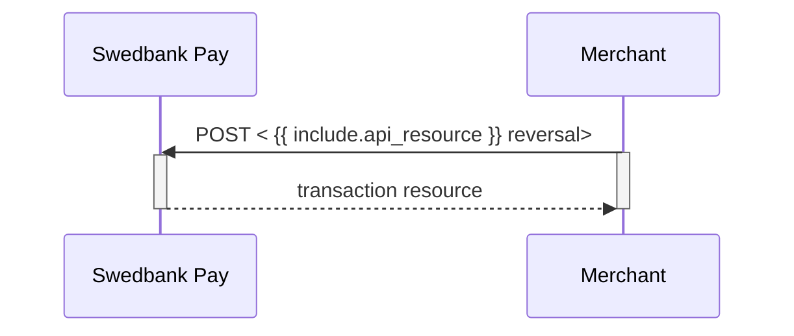






## Reversal

This transaction is used when a `Capture` or `Sale` payment needs to be
reversed.

Please note that you have a maximum of 5 **consecutive** failed attempts at a
reversal. The payment will be locked after this, and you need to contact us for
another attempt.

If the full amount of a **v3.1** sale transaction or a captured transaction is
reversed, The transaction will now have status `Reversed` instead of `Paid`
(which is used in earlier versions).

## Create Reversal Transaction

If we want to reverse a previously captured amount, we need to perform
`reversal` against the accompanying `href` returned in the
`operations` list.

## Reversal Request

POST /psp/paymentorders/{{ page.payment_order_id }}/reversals HTTP/1.1
Host: {{ page.api_host }}
Authorization: Bearer <AccessToken>
Content-Type: application/json;version=3.0/2.0      // Version optional for 3.0 and 2.0

{
    "transaction": {
        "description": "Reversal of captured transaction",
        "amount": 1500,
        "vatAmount": 375,
        "payeeReference": "ABC123",
        "receiptReference": "ABC122",
        "orderItems": [
            {
                "reference": "P1",
                "name": "Product1",
                "type": "PRODUCT",
                "class": "ProductGroup1",
                "itemUrl": "https://example.com/products/123",
                "imageUrl": "https://example.com/product123.jpg",
                "description": "Product 1 description",
                "discountDescription": "Volume discount",
                "quantity": 4,
                "quantityUnit": "pcs",
                "unitPrice": 300,
                "discountPrice": 200,
                "vatPercent": 2500,
                "amount": 1000,
                "vatAmount": 250
            },
            {
                "reference": "P2",
                "name": "Product2",
                "type": "PRODUCT",
                "class": "ProductGroup1",
                "description": "Product 2 description",
                "quantity": 1,
                "quantityUnit": "pcs",
                "unitPrice": 500,
                "vatPercent": 2500,
                "amount": 500,
                "vatAmount": 125
            }
        ]
    }
}









  

    
Field

    
Type

    
Required

  

  <!-- Root: transaction object (level 0, function 0) -->
  

    

      <i aria-hidden="true" class="chev swepay-icon-plus-add"></i>
      <code>object</code>
      
    

    

The transaction object.

    <!-- Children of transaction (level 1) -->
    

      <!-- amount -->
      

        

          <i aria-hidden="true" class="chev swepay-icon-plus-add"></i>
          <code>integer</code>
          
        

        

{{ amount_md | markdownify }}

      

      <!-- vatAmount -->
      

        

          <i aria-hidden="true" class="chev swepay-icon-plus-add"></i>
          <code>integer</code>
          
        

        

{{ vat_amount_md | markdownify }}

      

      <!-- payeeReference -->
      

        

          <i aria-hidden="true" class="chev swepay-icon-plus-add"></i>
          <code>string(30)</code>
          
        

        

{{ payee_reference_md | markdownify }}

      

      <!-- receiptReference (optional) -->
      

        

          <i aria-hidden="true" class="chev swepay-icon-plus-add"></i>
          <code>string(30)</code>
        

        

{{ receipt_reference_md | markdownify }}

      

      <!-- description -->
      

        

          <i aria-hidden="true" class="chev swepay-icon-plus-add"></i>
          <code>string</code>
          
        

        

Textual description of why the transaction is reversed.

      

      <!-- orderItems (array with children at level 2) -->
      

        

          <i aria-hidden="true" class="chev swepay-icon-plus-add"></i>
          <code>array</code>
          
        

        

{{ order_items_md | markdownify }}

        

          <!-- Children explicitly defined at level 2 in source -->
          

            

              <i aria-hidden="true" class="chev swepay-icon-plus-add"></i>
              <code>string</code>
              
            

            

A reference that identifies the order item.

          

          

            

              <i aria-hidden="true" class="chev swepay-icon-plus-add"></i>
              <code>string</code>
              
            

            

The name of the order item.

          

          

            

              <i aria-hidden="true" class="chev swepay-icon-plus-add"></i>
              <code>enum</code>
              
            

            

<code>PRODUCT</code>, <code>SERVICE</code>, <code>SHIPPING_FEE</code>, <code>PAYMENT_FEE</code>, <code>DISCOUNT</code>, <code>VALUE_CODE</code> or <code>OTHER</code>. The type of the order item.

          

          

            

              <i aria-hidden="true" class="chev swepay-icon-plus-add"></i>
              <code>string</code>
              
            

            

The classification of the order item. Can be used for assigning the order item to a specific product category, such as <code>MobilePhone</code>. Note that <code>class</code> cannot contain spaces and must follow the regex pattern <code>[\w-]*</code>. Swedbank Pay may use this field for statistics.

          

          

            

              <i aria-hidden="true" class="chev swepay-icon-plus-add"></i>
              <code>string</code>
            

            

The URL to a page that can display the purchased item, product or similar.

          

          

            

              <i aria-hidden="true" class="chev swepay-icon-plus-add"></i>
              <code>string</code>
            

            

The URL to an image of the order item.

          

          

            

              <i aria-hidden="true" class="chev swepay-icon-plus-add"></i>
              <code>string</code>
            

            

The human readable description of the order item.

          

          

            

              <i aria-hidden="true" class="chev swepay-icon-plus-add"></i>
              <code>string</code>
            

            

The human readable description of the possible discount.

          

          

            

              <i aria-hidden="true" class="chev swepay-icon-plus-add"></i>
              <code>number</code>
              
            

            

The 4 decimal precision quantity of order items being purchased.

          

          

            

              <i aria-hidden="true" class="chev swepay-icon-plus-add"></i>
              <code>string</code>
              
            

            

The unit of the quantity, such as <code>pcs</code>, <code>grams</code>, or similar. This is used for your own book keeping.

          

          

            

              <i aria-hidden="true" class="chev swepay-icon-plus-add"></i>
              <code>integer</code>
              
            

            

The price per unit of order item, including VAT.

          

          

            

              <i aria-hidden="true" class="chev swepay-icon-plus-add"></i>
              <code>integer</code>
            

            

If the order item is purchased at a discounted price. This field should contain that price, including VAT.

          

          

            

              <i aria-hidden="true" class="chev swepay-icon-plus-add"></i>
              <code>integer</code>
              
            

            

The percent value of the VAT multiplied by 100, so <code>25%</code> becomes <code>2500</code>.

          

          

            

              <i aria-hidden="true" class="chev swepay-icon-plus-add"></i>
              <code>integer</code>
              
            

            

The total amount including VAT to be paid for the specified quantity of this order item, in the lowest monetary unit of the currency. E.g. <code>10000</code> equals <code>100.00 SEK</code> and <code>5000</code> equals <code>50.00 SEK</code>.

          

          

            

              <i aria-hidden="true" class="chev swepay-icon-plus-add"></i>
              <code>integer</code>
              
            

            

The total amount of VAT to be paid for the specified quantity of this order item, in the lowest monetary unit of the currency. E.g. <code>10000</code> equals <code>100.00 SEK</code> and <code>5000</code> equals <code>50.00 SEK</code>.

          

        

      

    

  

## Reversal Response

If the reversal request succeeds, the response should be similar to the example below:

HTTP/1.1 200 OK
Content-Type: application/json; charset=utf-8; version=3.0/2.0
api-supported-versions: 3.0/2.0

{
    "payment": "/psp/creditcard/payments/{{ page.payment_order_id }}",
    "reversal": {
        "id": "/psp/creditcard/payments/{{ page.payment_order_id }}/reversals/{{ page.transaction_id }}",
        "transaction": {
            "id": "/psp/pcreditcard/payments/{{ page.payment_order_id }}/transactions/{{ page.transaction_id }}",
            "created": "2022-01-26T14:00:03.4725904Z",
            "updated": "2022-01-26T14:00:04.3851302Z",
            "type": "Reversal",
            "state": "Completed",
            "number": 71100730898,
            "amount": 1500,
            "vatAmount": 375,
            "description": "Reversing the capture amount",
            "payeeReference": "ABC123",
            "receiptReference": "ABC122"
            "isOperational": false,
            "reconciliationNumber": 738180,
            "operations": []
        }
    }
}












  

    
Field

    
Type

  

  <!-- Root level (0) -->
  

    

      <i aria-hidden="true" class="chev swepay-icon-plus-add"></i>
      <code>string</code>
    

    

The relative URL of the payment this reversal transaction belongs to.

  

  

    

      <i aria-hidden="true" class="chev swepay-icon-plus-add"></i>
      <code>object</code>
    

    

The reversal object, containing information about the reversal transaction.

    <!-- Children of reversals (level 1) -->
    

      

        

          <i aria-hidden="true" class="chev swepay-icon-plus-add"></i>
          <code>string</code>
        

        

The relative URL of the reversal transaction.

      

      

        

          <i aria-hidden="true" class="chev swepay-icon-plus-add"></i>
          <code>object</code>
        

        

{{ transaction_md | markdownify }}

        <!-- Children of transaction (level 2) -->
        

          

            

              <i aria-hidden="true" class="chev swepay-icon-plus-add"></i>
              <code>string</code>
            

            

The relative URL of the current <code>transaction</code> resource.

          

          

            

              <i aria-hidden="true" class="chev swepay-icon-plus-add"></i>
              <code>string</code>
            

            

The ISO-8601 date and time of when the transaction was created.

          

          

            

              <i aria-hidden="true" class="chev swepay-icon-plus-add"></i>
              <code>string</code>
            

            

The ISO-8601 date and time of when the transaction was updated.

          

          

            

              <i aria-hidden="true" class="chev swepay-icon-plus-add"></i>
              <code>string</code>
            

            

Indicates the transaction type.

          

          

            

              <i aria-hidden="true" class="chev swepay-icon-plus-add"></i>
              <code>string</code>
            

            

{{ state_md | markdownify }}

          

          

            

              <i aria-hidden="true" class="chev swepay-icon-plus-add"></i>
              <code>integer</code>
            

            

{{ number_md | markdownify }}

          

          

            

              <i aria-hidden="true" class="chev swepay-icon-plus-add"></i>
              <code>integer</code>
            

            

{{ amount_md | markdownify }}

          

          

            

              <i aria-hidden="true" class="chev swepay-icon-plus-add"></i>
              <code>integer</code>
            

            

{{ vat_amount_md | markdownify }}

          

          

            

              <i aria-hidden="true" class="chev swepay-icon-plus-add"></i>
              <code>string</code>
            

            

A human readable description of maximum 40 characters of the transaction.

          

          

            

              <i aria-hidden="true" class="chev swepay-icon-plus-add"></i>
              <code>string(30)</code>
            

            

{{ payee_reference_md | markdownify }}

          

          

            

              <i aria-hidden="true" class="chev swepay-icon-plus-add"></i>
              <code>string(30)</code>
            

            

{{ receipt_reference_md | markdownify }}

          

          

            

              <i aria-hidden="true" class="chev swepay-icon-plus-add"></i>
              <code>boolean</code>
            

            

<code>true</code>  if the transaction is operational; otherwise  <code>false</code>.

          

          

            

              <i aria-hidden="true" class="chev swepay-icon-plus-add"></i>
              <code>string</code>
            

            

The number of the reconciliation batch file where the transaction can be found.

          

          

            

              <i aria-hidden="true" class="chev swepay-icon-plus-add"></i>
              <code>array</code>
            

            

{{ operations_md | markdownify }}

          

        

      

    

  

## Reversal Request v3.1

POST /psp/paymentorders/{{ page.payment_order_id }}/reversals HTTP/1.1
Host: {{ page.api_host }}
Authorization: Bearer <AccessToken>
Content-Type: application/json;version=3.1

{
    "transaction": {
        "description": "Reversal of captured transaction",
        "amount": 1500,
        "vatAmount": 375,
        "payeeReference": "ABC123"
    }
}









  

    
Field

    
Type

    
Required

  

  <!-- Root: transaction object (level 0, function 0) -->
  

    

      <i aria-hidden="true" class="chev swepay-icon-plus-add"></i>
      <code>object</code>
      
    

    

The transaction object.

    <!-- Children of transaction (level 1) -->
    

      <!-- amount -->
      

        

          <i aria-hidden="true" class="chev swepay-icon-plus-add"></i>
          <code>integer</code>
          
        

        

{{ amount_md | markdownify }}

      

      <!-- vatAmount -->
      

        

          <i aria-hidden="true" class="chev swepay-icon-plus-add"></i>
          <code>integer</code>
          
        

        

{{ vat_amount_md | markdownify }}

      

      <!-- payeeReference -->
      

        

          <i aria-hidden="true" class="chev swepay-icon-plus-add"></i>
          <code>string(30)</code>
          
        

        

{{ payee_reference_md | markdownify }}

      

      <!-- receiptReference (optional) -->
      

        

          <i aria-hidden="true" class="chev swepay-icon-plus-add"></i>
          <code>string(30)</code>
        

        

{{ receipt_reference_md | markdownify }}

      

      <!-- description -->
      

        

          <i aria-hidden="true" class="chev swepay-icon-plus-add"></i>
          <code>string</code>
          
        

        

Textual description of why the transaction is reversed.

      

      <!-- orderItems (array with children at level 2) -->
      

        

          <i aria-hidden="true" class="chev swepay-icon-plus-add"></i>
          <code>array</code>
          
        

        

{{ order_items_md | markdownify }}

        

          <!-- Children explicitly defined at level 2 in source -->
          

            

              <i aria-hidden="true" class="chev swepay-icon-plus-add"></i>
              <code>string</code>
              
            

            

A reference that identifies the order item.

          

          

            

              <i aria-hidden="true" class="chev swepay-icon-plus-add"></i>
              <code>string</code>
              
            

            

The name of the order item.

          

          

            

              <i aria-hidden="true" class="chev swepay-icon-plus-add"></i>
              <code>enum</code>
              
            

            

<code>PRODUCT</code>, <code>SERVICE</code>, <code>SHIPPING_FEE</code>, <code>PAYMENT_FEE</code>, <code>DISCOUNT</code>, <code>VALUE_CODE</code> or <code>OTHER</code>. The type of the order item.

          

          

            

              <i aria-hidden="true" class="chev swepay-icon-plus-add"></i>
              <code>string</code>
              
            

            

The classification of the order item. Can be used for assigning the order item to a specific product category, such as <code>MobilePhone</code>. Note that <code>class</code> cannot contain spaces and must follow the regex pattern <code>[\w-]*</code>. Swedbank Pay may use this field for statistics.

          

          

            

              <i aria-hidden="true" class="chev swepay-icon-plus-add"></i>
              <code>string</code>
            

            

The URL to a page that can display the purchased item, product or similar.

          

          

            

              <i aria-hidden="true" class="chev swepay-icon-plus-add"></i>
              <code>string</code>
            

            

The URL to an image of the order item.

          

          

            

              <i aria-hidden="true" class="chev swepay-icon-plus-add"></i>
              <code>string</code>
            

            

The human readable description of the order item.

          

          

            

              <i aria-hidden="true" class="chev swepay-icon-plus-add"></i>
              <code>string</code>
            

            

The human readable description of the possible discount.

          

          

            

              <i aria-hidden="true" class="chev swepay-icon-plus-add"></i>
              <code>number</code>
              
            

            

The 4 decimal precision quantity of order items being purchased.

          

          

            

              <i aria-hidden="true" class="chev swepay-icon-plus-add"></i>
              <code>string</code>
              
            

            

The unit of the quantity, such as <code>pcs</code>, <code>grams</code>, or similar. This is used for your own book keeping.

          

          

            

              <i aria-hidden="true" class="chev swepay-icon-plus-add"></i>
              <code>integer</code>
              
            

            

The price per unit of order item, including VAT.

          

          

            

              <i aria-hidden="true" class="chev swepay-icon-plus-add"></i>
              <code>integer</code>
            

            

If the order item is purchased at a discounted price. This field should contain that price, including VAT.

          

          

            

              <i aria-hidden="true" class="chev swepay-icon-plus-add"></i>
              <code>integer</code>
              
            

            

The percent value of the VAT multiplied by 100, so <code>25%</code> becomes <code>2500</code>.

          

          

            

              <i aria-hidden="true" class="chev swepay-icon-plus-add"></i>
              <code>integer</code>
              
            

            

The total amount including VAT to be paid for the specified quantity of this order item, in the lowest monetary unit of the currency. E.g. <code>10000</code> equals <code>100.00 SEK</code> and <code>5000</code> equals <code>50.00 SEK</code>.

          

          

            

              <i aria-hidden="true" class="chev swepay-icon-plus-add"></i>
              <code>integer</code>
              
            

            

The total amount of VAT to be paid for the specified quantity of this order item, in the lowest monetary unit of the currency. E.g. <code>10000</code> equals <code>100.00 SEK</code> and <code>5000</code> equals <code>50.00 SEK</code>.

          

        

      

    

  

## Reversal Response v3.1

If the reversal request succeeds, the response should be similar to the example below:

HTTP/1.1 200 OK
Content-Type: application/json; charset=utf-8; version=3.1
api-supported-versions: 3.1

{
  "paymentOrder": {
    "id": "/psp/paymentorders/8be318c1-1caa-4db1-e2c6-08d7bf41224d",
    "created": "2020-03-03T07:19:27.5636519Z",
    "updated": "2020-03-03T07:21:00.5605905Z",
    "operation": "Purchase",
    "status": "Reversed",
    "currency": "SEK",
    "amount": 1500,
    "vatAmount": 375,
    "remainingCaptureAmount": 0, // Only present after a partial reversal
    "remainingReversalAmount": 0, // Only present after a partial reversal
    "description": "Test Purchase",
    "initiatingSystemUserAgent": "<should be set by the system calling POST:/psp/paymentorders>",
    "language": "sv-SE",
    "availableInstruments": [ "CreditCard", "Invoice-PayExFinancingSe", "Invoice-PayMonthlyInvoiceSe", "Swish", "CreditAccount", "Trustly" ],
    "implementation": "PaymentsOnly",
    "integration": "HostedView|Redirect",
    "instrumentMode": true,
    "guestMode": true,
    "orderItems": {
      "id": "/psp/paymentorders/8be318c1-1caa-4db1-e2c6-08d7bf41224d/orderitems"
    },
    "urls": {
      "id": "/psp/paymentorders/8be318c1-1caa-4db1-e2c6-08d7bf41224d/urls"
    },
    "payeeInfo": {
      "id": "/psp/paymentorders/8be318c1-1caa-4db1-e2c6-08d7bf41224d/payeeInfo"
    },
    "payer": {
      "id": "/psp/paymentorders/8be318c1-1caa-4db1-e2c6-08d7bf41224d/payers"
    },
    "history": {
      "id": "/psp/paymentorders/8be318c1-1caa-4db1-e2c6-08d7bf41224d/history"
    },
    "failed": {
      "id": "/psp/paymentorders/8be318c1-1caa-4db1-e2c6-08d7bf41224d/failed"
    },
    "aborted": {
      "id": "/psp/paymentorders/8be318c1-1caa-4db1-e2c6-08d7bf41224d/aborted"
    },
    "paid": {
      "id": "/psp/paymentorders/8be318c1-1caa-4db1-e2c6-08d7bf41224d/paid"
    },
    "cancelled": {
      "id": "/psp/paymentorders/8be318c1-1caa-4db1-e2c6-08d7bf41224d/cancelled"
    },
    "financialTransactions": {
      "id": "/psp/paymentorders/8be318c1-1caa-4db1-e2c6-08d7bf41224d/financialtransactions"
    },
    "failedAttempts": {
      "id": "/psp/paymentorders/8be318c1-1caa-4db1-e2c6-08d7bf41224d/failedattempts"
    },
    "postPurchaseFailedAttempts": {
      "id": "/psp/paymentorders/8be318c1-1caa-4db1-e2c6-08d7bf41224d/postpurchasefailedattempts"
    },
    "metadata": {
      "id": "/psp/paymentorders/8be318c1-1caa-4db1-e2c6-08d7bf41224d/metadata"
    }
  },
  "operations": [
  ]
}












  

    
Field

    
Type

  

  <!-- Root: paymentOrder (level 0) -->
  

    

      <i aria-hidden="true" class="chev swepay-icon-plus-add"></i>
      <code>string</code>
    

    

The relative URL of the payment order this capture transaction belongs to.

    <!-- Children of paymentOrder (level 1) -->
    

      

        

          <i aria-hidden="true" class="chev swepay-icon-plus-add"></i>
          <code>string</code>
        

        

The relative URL of the created capture transaction.

      

      

        

          <i aria-hidden="true" class="chev swepay-icon-plus-add"></i>
          <code>string</code>
        

        

The ISO-8601 date and time of when the transaction was created.

      

      

        

          <i aria-hidden="true" class="chev swepay-icon-plus-add"></i>
          <code>string</code>
        

        

The ISO-8601 date and time of when the transaction was updated.

      

      

        

          <i aria-hidden="true" class="chev swepay-icon-plus-add"></i>
          <code>string</code>
        

        

{{ operation_md | markdownify }}

      

      

        

          <i aria-hidden="true" class="chev swepay-icon-plus-add"></i>
          <code>string</code>
        

        

{{ status_md | markdownify }}

      

      

        

          <i aria-hidden="true" class="chev swepay-icon-plus-add"></i>
          <code>enum(string)</code>
        

        

The currency of the payment order in the ISO 4217 format (e.g. `EUR`, `DKK`, `NOK` or `SEK`). Some payment methods are only available with selected currencies..

      

      

        

          <i aria-hidden="true" class="chev swepay-icon-plus-add"></i>
          <code>integer</code>
        

        

{{ amount_md | markdownify }}

      

      

        

          <i aria-hidden="true" class="chev swepay-icon-plus-add"></i>
          <code>integer</code>
        

        

{{ vat_amount_md | markdownify }}

      

      

        

          <i aria-hidden="true" class="chev swepay-icon-plus-add"></i>
          <code>integer</code>
        

        

The remaining authorized amount that is still possible to capture. Only present after a partial reversal.

      

      

        

          <i aria-hidden="true" class="chev swepay-icon-plus-add"></i>
          <code>integer</code>
        

        

The remaining authorized amount that is still possible to cancel. Only present after a partial reversal.

      

      

        

          <i aria-hidden="true" class="chev swepay-icon-plus-add"></i>
          <code>integer</code>
        

        

The remaining captured amount that is still available for reversal. This field will not appear in the initial response if the payment method used was Swish. It will first appear if and when you do a GET on the payment.

      

      

        

          <i aria-hidden="true" class="chev swepay-icon-plus-add"></i>
          <code>string</code>
        

        

{{ description_md | markdownify }}

      

      

        

          <i aria-hidden="true" class="chev swepay-icon-plus-add"></i>
          <code>string</code>
        

        

{{ initiating_system_user_agent_md | markdownify }}

      

      

        

          <i aria-hidden="true" class="chev swepay-icon-plus-add"></i>
          <code>string</code>
        

        

{{ language_md | markdownify }}

      

      

        

          <i aria-hidden="true" class="chev swepay-icon-plus-add"></i>
          <code>string</code>
        

        

A list of payment methods available for this payment.

      

      

        

          <i aria-hidden="true" class="chev swepay-icon-plus-add"></i>
          <code>string</code>
        

        

The merchant's Online Payments implementation type. <code>Enterprise</code> or <code>PaymentsOnly</code>. We ask that you don't build logic around this field's response. It is mainly for information purposes, as the implementation types might be subject to name changes. If this should happen, updated information will be available in this table.

      

      

        

          <i aria-hidden="true" class="chev swepay-icon-plus-add"></i>
          <code>string</code>
        

        

The merchant's Online Payments integration type. <code>HostedView</code> (Seamless View) or <code>Redirect</code>. This field will not be populated until the payer has opened the payment UI, and the client script has identified if Swedbank Pay or another URI is hosting the container with the payment iframe. We ask that you don't build logic around this field's response. It is mainly for information purposes. as the integration types might be subject to name changes, If this should happen, updated information will be available in this table.

      

      

        

          <i aria-hidden="true" class="chev swepay-icon-plus-add"></i>
          <code>bool</code>
        

        

Set to <code>true</code> or <code>false</code>. Indicates if the payment is initialized with only one payment methods available.

      

      

        

          <i aria-hidden="true" class="chev swepay-icon-plus-add"></i>
          <code>bool</code>
        

        

Set to <code>true</code> or <code>false</code>. Indicates if the payer chose to pay as a guest or not. When using the Payments Only implementation, this is triggered by not including a <code>payerReference</code> in the original <code>paymentOrder</code> request.

      

      <!-- Links to related resources (children of paymentOrder) -->
      

        

          <i aria-hidden="true" class="chev swepay-icon-plus-add"></i>
          <code>id</code>
        

        

The URL to the <code>orderItems</code> resource where information about the order items can be retrieved.

      

      

        

          <i aria-hidden="true" class="chev swepay-icon-plus-add"></i>
          <code>id</code>
        

        

The URL to the <code>urls</code> resource where all URLs related to the payment order can be retrieved.

      

      

        

          <i aria-hidden="true" class="chev swepay-icon-plus-add"></i>
          <code>id</code>
        

        

The URL to the <code>payeeInfo</code> resource where information related to the payee can be retrieved.

      

      

        

          <i aria-hidden="true" class="chev swepay-icon-plus-add"></i>
          <code>id</code>
        

        

The URL to the <code>payer</code> resource where information about the payer can be retrieved.

      

      

        

          <i aria-hidden="true" class="chev swepay-icon-plus-add"></i>
          <code>id</code>
        

        

The URL to the <code>history</code> resource where information about the payment's history can be retrieved.

      

      

        

          <i aria-hidden="true" class="chev swepay-icon-plus-add"></i>
          <code>id</code>
        

        

The URL to the <code>failed</code> resource where information about the failed transactions can be retrieved.

      

      

        

          <i aria-hidden="true" class="chev swepay-icon-plus-add"></i>
          <code>id</code>
        

        

The URL to the <code>aborted</code> resource where information about the aborted transactions can be retrieved.

      

      

        

          <i aria-hidden="true" class="chev swepay-icon-plus-add"></i>
          <code>id</code>
        

        

The URL to the <code>paid</code> resource where information about the paid transactions can be retrieved.

      

      

        

          <i aria-hidden="true" class="chev swepay-icon-plus-add"></i>
          <code>id</code>
        

        

The URL to the <code>cancelled</code> resource where information about the cancelled transactions can be retrieved.

      

      

        

          <i aria-hidden="true" class="chev swepay-icon-plus-add"></i>
          <code>id</code>
        

        

The URL to the <code>financialTransactions</code> resource where information about the financial transactions can be retrieved.

      

      

        

          <i aria-hidden="true" class="chev swepay-icon-plus-add"></i>
          <code>id</code>
        

        

The URL to the <code>failedAttempts</code> resource where information about the failed attempts can be retrieved.

      

      

        

          <i aria-hidden="true" class="chev swepay-icon-plus-add"></i>
          <code>id</code>
        

        

The URL to the <code>postPurchaseFailedAttempts</code> resource where information about the failed capture, cancel or reversal attempts can be retrieved.

      

      

        

          <i aria-hidden="true" class="chev swepay-icon-plus-add"></i>
          <code>id</code>
        

        

The URL to the <code>metadata</code> resource where information about the metadata can be retrieved.

      

    

  

  

    

      <i aria-hidden="true" class="chev swepay-icon-plus-add"></i>
      <code>array</code>
    

    

{{ operations_md | markdownify }}

  

