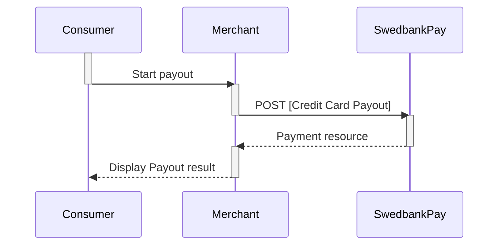

## Payout

> "Payout to Card" is an add-on service that enable you to deposit winnings
  directly to your end-users' credit cards. This without  the need to collect
  card details from the end-user a second time.

### Introduction

* Acquirer for this service is Swedbank. You require a separate Swedbank
  acquiring number to ensure that payout transactions and regular card
  transactions are kept separate.
* You need to have the 3-D Secure protocol enabled.
* The service is available through a Swedbank Pay hosted payment page.
* The current implementation is only available for gaming transactions (
  [MCC][mcc]: 7995).
* The payout service is not a part of Swedbank Pay Settlement Service.

### API requests

The API requests are displayed in the [payout flow](#payout-flow).  You create
a payout by performing a `POST` creditcard payments with key `operation` set to
`payout`.

{:.code-header}
**Request**

```http
POST /psp/creditcard/payments HTTP/1.1
Host: {{ page.api_host }}
Authorization: Bearer <AccessToken>
Content-Type: application/json

{
    "payment": {
        "operation": "Payout",
        "intent": "AutoCapture",
        "paymentToken": "{{ page.payment_id }}",
        "currency": "NOK",
        "amount": 1500,
        "vatAmount": 0,
        "description": "Test Payout",
        "userAgent": "Mozilla/5.0",
        "language": "nb-NO",
        "urls": {
            "callbackUrl": "https://example.com/payment-callback"
        },
        "payeeInfo": {
            "payeeId": "{{ page.merchant_id }}"
            "payeeReference": "CD1234",
            "payeeName": "Merchant1",
            "productCategory": "A123",
            "orderReference": "or-12456",
            "subsite": "MySubsite"
        }
    }
}
```

{:.code-header}
**Response**

```http
HTTP/1.1 200 OK
Content-Type: application/json

{
  "payment": {
    "id": "/psp/creditcard/payments/{{ page.payment_id }}",
    "number": 1234567890,
    "created": "2016-09-14T13:21:29.3182115Z",
    "updated": "2016-09-14T13:21:57.6627579Z",
    "state": "Ready",
    "operation": "Payout",
    "currency": "NOK",
    "amount": 1500,
    "remainingCaptureAmount": 1500,
    "remainingCancellationAmount": 1500,
    "remainingReversalAmount": 0,
    "description": "Test Recurrence",
    "initiatingSystemUserAgent": "PostmanRuntime/3.0.1",
    "userAgent": "Mozilla/5.0...",
    "language": "nb-NO",
    "paymentToken": "{{ page.payment_id }}",
    "prices": { "id": "/psp/creditcard/payments/{{ page.payment_id }}/prices" },
    "transactions": { "id": "/psp/creditcard/payments/{{ page.payment_id }}/transactions" },
    "authorizations": { "id": "/psp/creditcard/payments/{{ page.payment_id }}/authorizations" },
    "captures": { "id": "/psp/creditcard/payments/{{ page.payment_id }}/captures" },
    "reversals": { "id": "/psp/creditcard/payments/{{ page.payment_id }}/reversals" },
    "cancellations": { "id": "/psp/creditcard/payments/{{ page.payment_id }}/cancellations" },
    "urls" : { "id": "/psp/creditcard/payments/{{ page.payment_id }}/urls" },
    "payeeInfo" : { "id": "/psp/creditcard/payments/{{ page.payment_id }}/payeeInfo" },
    "settings": { "id": "/psp/creditcard/payments/{{ page.payment_id }}/settings" }
  }
}
```

### Payout flow

You must set `Operation` to `Payout` in the initial `POST` request.


