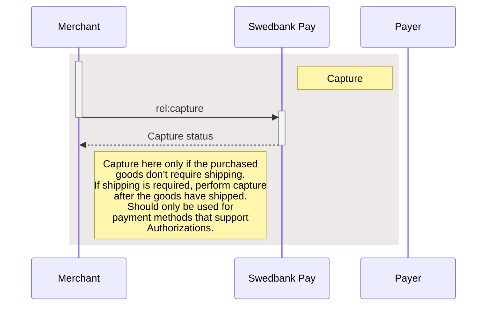
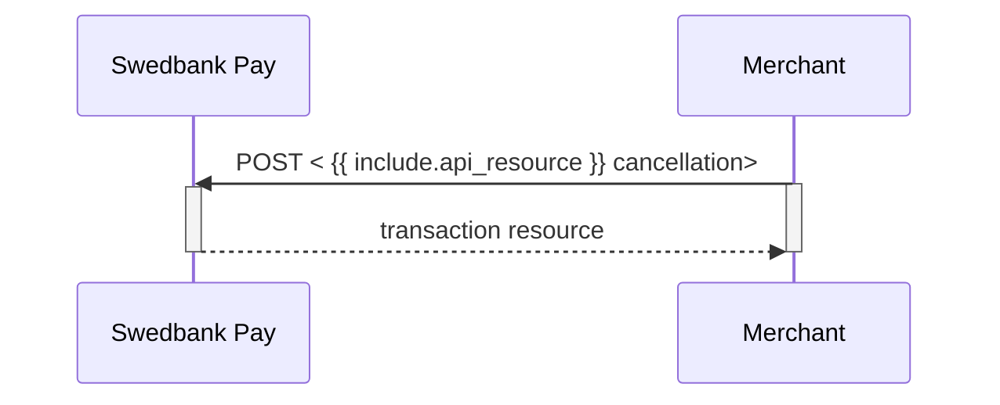



{: .h2 }

### Payment order v3.0

  <ul class="toc-list" role="navigation" aria-label="Article content">
    <li>
      <a href="#capture-v30">
        Capture
      </a>
      <ul>
        <li>
          <a href="#capture-request-v30">
            Capture Request
          </a>
        </li>
        <li>
          <a href="#capture-response-v30">
            Capture Response
          </a>
        </li>
        <li>
        <a href="#capture-sequence-diagram-v30">
            Capture Sequence Diagram
        </a>
        </li>
      </ul>
    </li>
    <li>
      <a href="#cancel-v30">
        Cancel
      </a>
      <ul>
        <li>
          <a href="#cancel-request-v30">
          Cancel Request
        </a>
        </li>
        <li>
          <a href="#cancel-response-v30">
          Cancel Response
          </a>
        </li>
        <li>
        <a href="#cancel-sequence-diagram-v30">
          Cancel Sequence Diagram
        </a>
        </li>
      </ul>
    </li>
    <li>
      <a href="#reversal-v30">
        Reversal
      </a>
      <ul>
        <li>
          <a href="#reversal-request-v30">
          Reversal Request
          </a>
        </li>
        <li>
          <a href="#reversal-response-v30">
          Reversal Response
          </a>
        </li>
      </ul>
    </li>
  </ul>





See examples of the `jsons` in the [problems section][problems].





{: .h2 }

### Capture v3.0

Captures are only possible when a payment has a successful `Authorization`
transaction, naturally excluding one-phase payment methods like Swish and
Trustly. They will be marked as a `Sale` transaction. Two-phase payment methods
like card and Vipps however, require a `Capture` to be completed.

Please note that you have a maximum of 5 **consecutive** failed attempts at a
capture. The payment will be locked after the fifth, and you need to contact us
for further attempts.

In addition to full captures, it is possible to do partial captures of the
authorized amount. You can do more captures on the same payment later, up to the
total authorized amount. A useful tool for when you have to split orders into
several shipments.

First off, you must request the order information from the server to get the
request link. With this, you can request the capture with the amount to capture,
and get the status back.

To capture the authorized payment, we need to perform `capture` against the
accompanying `href` returned in the `operations` list. See the abbreviated
request and response below:

{: .text-right}
[Top of page](#payment-order-v30)

{: .h3 }

#### Capture Request v3.0

POST /psp/paymentorders/{{ page.payment_order_id }}/captures HTTP/1.1
Host: {{ page.api_host }}
Authorization: Bearer <AccessToken>
Content-Type: application/json;version=3.0    // Version optional, can be set in `productName`

{
    "transaction": {
        "description": "Capturing the authorized payment",
        "amount": 1500,
        "vatAmount": 375,
        "payeeReference": "AB832",
        "receiptReference": "AB831",
        "orderItems": [
            {
                "reference": "P1",
                "name": "Product1",
                "type": "PRODUCT",
                "class": "ProductGroup1",
                "itemUrl": "https://example.com/products/123",
                "imageUrl": "https://example.com/product123.jpg",
                "description": "Product 1 description",
                "discountDescription": "Volume discount",
                "quantity": 4,
                "quantityUnit": "pcs",
                "unitPrice": 300,
                "discountPrice": 200,
                "vatPercent": 2500,
                "amount": 1000,
                "vatAmount": 250
            },
            {
                "reference": "P2",
                "name": "Product2",
                "type": "PRODUCT",
                "class": "ProductGroup1",
                "description": "Product 2 description",
                "quantity": 1,
                "quantityUnit": "pcs",
                "unitPrice": 500,
                "vatPercent": 2500,
                "amount": 500,
                "vatAmount": 125
            }
        ]
    }
}









  

    
Field

    
Type

    
Required

  

  <!-- Root: transaction (level 0) -->
  

    

      ▸
      <code>object</code>
      
    

    

The transaction object.

    

      <!-- description -->
      

        

          ▸
          <code>string</code>
          
        

        

The description of the capture transaction.

      

      <!-- amount -->
      

        

          ▸
          <code>integer</code>
          
        

        

{{ amount_md | markdownify }}

      

      <!-- vatAmount -->
      

        

          ▸
          <code>integer</code>
          
        

        

{{ vat_amount_md | markdownify }}

      

      <!-- payeeReference -->
      

        

          ▸
          <code>string(30)</code>
          
        

        

{{ payee_reference_md | markdownify }}

      

      <!-- receiptReference (optional) -->
      

        

          ▸
          <code>string(30)</code>
        

        

{{ receipt_reference_md | markdownify }}

      

      <!-- orderItems -->
      

        

          ▸
          <code>array</code>
          
        

        

{{ order_items_md | markdownify }}

        <!-- Children of orderItems (level 2) -->
        

          <!-- reference -->
          

            

              ▸
              <code>string</code>
              
            

            

A reference that identifies the order item.

          

          <!-- name -->
          

            

              ▸
              <code>string</code>
              
            

            

The name of the order item.

          

          <!-- type -->
          

            

              ▸
              <code>enum</code>
              
            

            

<code>PRODUCT</code>, <code>SERVICE</code>, <code>SHIPPING_FEE</code>, <code>PAYMENT_FEE</code>, <code>DISCOUNT</code>, <code>VALUE_CODE</code> or <code>OTHER</code>. The type of the order item.

          

          <!-- class -->
          

            

              ▸
              <code>string</code>
              
            

            

The classification of the order item. Can be used for assigning the order item to a specific product category, such as <code>MobilePhone</code>. Note that <code>class</code> cannot contain spaces and must follow the regex pattern <code>[\w-]*</code>. Swedbank Pay may use this field for statistics.

          

          <!-- itemUrl (optional) -->
          

            

              ▸
              <code>string</code>
            

            

The URL to a page that can display the purchased item, product or similar.

          

          <!-- imageUrl (optional) -->
          

            

              ▸
              <code>string</code>
            

            

The URL to an image of the order item.

          

          <!-- description (optional) -->
          

            

              ▸
              <code>string</code>
            

            

The human readable description of the order item.

          

          <!-- discountDescription (optional) -->
          

            

              ▸
              <code>string</code>
            

            

The human readable description of the possible discount.

          

          <!-- quantity -->
          

            

              ▸
              <code>number</code>
              
            

            

The 4 decimal precision quantity of order items being purchased.

          

          <!-- quantityUnit -->
          

            

              ▸
              <code>string</code>
              
            

            

The unit of the quantity, such as <code>pcs</code>, <code>grams</code>, or similar. This is used for your own book keeping.

          

          <!-- unitPrice -->
          

            

              ▸
              <code>integer</code>
              
            

            

The price per unit of order item, including VAT.

          

          <!-- discountPrice (optional) -->
          

            

              ▸
              <code>integer</code>
            

            

If the order item is purchased at a discounted price. This field should contain that price, including VAT.

          

          <!-- vatPercent -->
          

            

              ▸
              <code>integer</code>
              
            

            

The percent value of the VAT multiplied by 100, so <code>25%</code> becomes <code>2500</code>.

          

          <!-- amount (per item) -->
          

            

              ▸
              <code>integer</code>
              
            

            

The total amount including VAT to be paid for the specified quantity of this order item, in the lowest monetary unit of the currency. E.g. <code>10000</code> equals <code>100.00 SEK</code> and <code>5000</code> equals <code>50.00 SEK</code>.

          

          <!-- vatAmount (per item) -->
          

            

              ▸
              <code>integer</code>
              
            

            

The total amount of VAT to be paid for the specified quantity of this order item, in the lowest monetary unit of the currency. E.g. <code>10000</code> equals <code>100.00 SEK</code> and <code>5000</code> equals <code>50.00 SEK</code>.

          

        

      

    

  

{: .text-right .mt-3}

[Top of page](#payment-order-v30)

{: .h3 }

#### Capture Response v3.0

If the capture request succeeds, this should be the response:

HTTP/1.1 200 OK
Content-Type: application/json; charset=utf-8; version=3.0
api-supported-versions: 3.0

{
    "payment": "/psp/creditcard/payments/{{ page.payment_id }}",
    "capture": {
        "id": "/psp/creditcard/payments/{{ page.payment_id }}/captures/{{ page.transaction_id }}",
        "transaction": {
            "id": "/psp/creditcard/payments/{{ page.payment_id }}/transactions/{{ page.transaction_id }}",
            "created": "2020-06-22T10:56:56.2927632Z",
            "updated": "2020-06-22T10:56:56.4035291Z",
            "type": "Capture",
            "state": "Completed",
            "amount": 1500,
            "vatAmount": 375,
            "description": "Capturing the authorized payment",
            "payeeReference": "AB832",
            "receiptReference": "AB831"
        }
    }
}











  

    
Field

    
Type

  

  <!-- Root: payment (level 0) -->
  

    

      ▸
      <code>string</code>
    

    

The relative URL of the payment this capture transaction belongs to.

  

  <!-- Root: capture (level 0) -->
  

    

      ▸
      <code>object</code>
    

    

The capture object, containing the information about the capture transaction.

    <!-- Children of capture (level 1) -->
    

      <!-- capture.id -->
      

        

          ▸
          <code>string</code>
        

        

The relative URL of the created capture transaction.

      

      <!-- capture.transaction -->
      

        

          ▸
          <code>object</code>
        

        

{{ transaction_md | markdownify }}

        <!-- Children of capture.transaction (level 2) -->
        

          

            

              ▸
              <code>string</code>
            

            

The relative URL of the current <code>transaction</code> resource.

          

          

            

              ▸
              <code>string</code>
            

            

The ISO-8601 date and time of when the transaction was created.

          

          

            

              ▸
              <code>string</code>
            

            

The ISO-8601 date and time of when the transaction was updated.

          

          

            

              ▸
              <code>string</code>
            

            

Indicates the transaction type.

          

          

            

              ▸
              <code>string</code>
            

            

{{ state_md | markdownify }}

          

          

            

              ▸
              <code>integer</code>
            

            

{{ number_md | markdownify }}

          

          

            

              ▸
              <code>integer</code>
            

            

{{ amount_md | markdownify }}

          

          

            

              ▸
              <code>integer</code>
            

            

{{ vat_amount_md | markdownify }}

          

          

            

              ▸
              <code>string</code>
            

            

{{ description_md | markdownify }}

          

          

            

              ▸
              <code>string(30)</code>
            

            

{{ payee_reference_md | markdownify }}

          

          

            

              ▸
              <code>string(30)</code>
            

            

A unique reference from the merchant system. It is set per operation to ensure an exactly-once delivery of a transactional operation. It is used to supplement <code>payeeReference</code> as an additional receipt number.

          

        

      

    

  

{: .text-right .mt-3}
[Top of page](#payment-order-v30)

{: .h3 }

#### Capture Sequence Diagram v3.0

The purchase should now be complete. But what if the purchase is cancelled or

the payer wants to return goods? For these instances, we have `cancel` and
`reversal`.




{: .text-right}
[Top of page](#payment-order-v30)

{: .h2 }

### Cancel v3.0

The `cancellations` resource lists the cancellation transactions on a

specific payment.



To cancel a previously created payment, you must perform the `cancel` operation
against the accompanying `href` returned in the `operations` list. You can only
cancel a payment - or part of a payment - which has not been captured yet. There
must be funds left that are only authorized. If you cancel before any capture
has been done, no captures can be performed later.



To cancel a previously created payment, you must perform the
`create-paymentorder-cancel` operation against the accompanying `href` returned
in the `operations` list. You can only cancel a payment - or part of a payment -
which has not been captured yet. If you cancel before any capture has been done,
no captures can be performed later.



{: .text-right}
[Top of page](#payment-order-v30)

{: .h3 }

#### Cancel Request v3.0

POST /psp/paymentorders/{{ page.payment_order_id }}/cancellations HTTP/1.1
Host: {{ page.api_host }}
Authorization: Bearer <AccessToken>
Content-Type: application/json;version=3.0     // Version optional, can be set in `productName`

{
    "transaction": {
        "description": "Test Cancellation",
        "payeeReference": "ABC123"
    }
}





  

    
Field

    
Type

    
Required

  

  <!-- Root: transaction -->
  

    

      ▸
      <code>object</code>
      
    

    

The transaction object.

    

      <!-- description -->
      

        

          ▸
          <code>string</code>
          
        

        

A textual description of why the transaction is cancelled.

      

      <!-- payeeReference -->
      

        

          ▸
          <code>string(30)</code>
          
        

        

{{ payee_reference_md | markdownify }}

      

    

  

{: .text-right .mt-3}
[Top of page](#payment-order-v30)

{: .h3 }

#### Cancel Response v3.0

If the cancel request succeeds, the response should be similar to the
example below:

HTTP/1.1 200 OK
Content-Type: application/json; charset=utf-8; version=3.0
api-supported-versions: 3.0

{
    "payment": "/psp/creditcard/payments/{{ page.payment_id }}",
    "cancellation": {
        "id": "/psp/creditcard/payments/{{ page.payment_id }}/cancellations/{{ page.transaction_id }}",
        "transaction": {
            "id": "/psp/creditcard/payments/{{ page.payment_id }}/transactions/{{ page.transaction_id }}",
            "created": "2022-01-31T09:49:13.7567756Z",
            "updated": "2022-01-31T09:49:14.7374165Z",
            "type": "Cancellation",
            "state": "Completed",
            "number": 71100732065,
            "amount": 1500,
            "vatAmount": 375,
            "description": "Test Cancellation",
            "payeeReference": "AB123"
        }
    }
}









  

    
Field

    
Type

  

  <!-- Root: payment (level 0) -->
  

    

      ▸
      <code>string</code>
    

    

The relative URL of the payment this cancellation transaction belongs to.

  

  <!-- Root: cancellation (level 0) -->
  

    

      ▸
      <code>object</code>
    

    

The cancellation object, containing information about the cancellation transaction.

    

      <!-- cancellation.id (level 1) -->
      

        

          ▸
          <code>string</code>
        

        

The relative URL of the cancellation transaction.

      

      <!-- cancellation.transaction (level 1) -->
      

        

          ▸
          <code>object</code>
        

        

{{ transaction_md | markdownify }}

        <!-- Children of cancellation.transaction (level 2) -->
        

          

            

              ▸
              <code>string</code>
            

            

The relative URL of the current <code>transaction</code> resource.

          

          

            

              ▸
              <code>string</code>
            

            

The ISO-8601 date and time of when the transaction was created.

          

          

            

              ▸
              <code>string</code>
            

            

The ISO-8601 date and time of when the transaction was updated.

          

          

            

              ▸
              <code>string</code>
            

            

Indicates the transaction type.

          

          

            

              ▸
              <code>string</code>
            

            

<code>Initialized</code>, <code>Completed</code> or <code>Failed</code>. Indicates the state of the transaction.

          

          

            

              ▸
              <code>integer</code>
            

            

{{ number_md | markdownify }}

          

          

            

              ▸
              <code>integer</code>
            

            

{{ amount_md | markdownify }}

          

          

            

              ▸
              <code>integer</code>
            

            

{{ vat_amount_md | markdownify }}

          

          

            

              ▸
              <code>string</code>
            

            

A human readable description of maximum 40 characters of the transaction.

          

          

            

              ▸
              <code>string(30)</code>
            

            

{{ payee_reference_md | markdownify }}

          

        

      

    

  

{: .text-right .mt-3}
[Top of page](#payment-order-v30)

{: .h3 }

#### Cancel Sequence Diagram v3.0

Cancel can only be done on an authorized transaction. As a cancellation does not
have an amount associated with it, it will release the entire reserved amount.
If your intention is to make detailed handling, such as only capturing a partial
amount of the transaction, you must start with the capture of the desired amount
before performing a cancel for the remaining reserved funds.








{: .text-right}
[Top of page](#payment-order-v30)

{: .h2 }

### Reversal v3.0

This transaction is used when a `Capture` or `Sale` payment needs to be
reversed.

Please note that you have a maximum of 5 **consecutive** failed attempts at a
reversal. The payment will be locked after this, and you need to contact us for
another attempt.

If we want to reverse a previously captured amount, we need to perform
`reversal` against the accompanying `href` returned in the
`operations` list.

{: .text-right}
[Top of page](#payment-order-v30)

{: .h3 }

#### Reversal Request v3.0

POST /psp/paymentorders/{{ page.payment_order_id }}/reversals HTTP/1.1
Host: {{ page.api_host }}
Authorization: Bearer <AccessToken>
Content-Type: application/json;version=3.0     // Version optional, can be set in `productName`

{
    "transaction": {
        "description": "Reversal of captured transaction",
        "amount": 1500,
        "vatAmount": 375,
        "payeeReference": "ABC123",
        "receiptReference": "ABC122",
        "orderItems": [
            {
                "reference": "P1",
                "name": "Product1",
                "type": "PRODUCT",
                "class": "ProductGroup1",
                "itemUrl": "https://example.com/products/123",
                "imageUrl": "https://example.com/product123.jpg",
                "description": "Product 1 description",
                "discountDescription": "Volume discount",
                "quantity": 4,
                "quantityUnit": "pcs",
                "unitPrice": 300,
                "discountPrice": 200,
                "vatPercent": 2500,
                "amount": 1000,
                "vatAmount": 250
            },
            {
                "reference": "P2",
                "name": "Product2",
                "type": "PRODUCT",
                "class": "ProductGroup1",
                "description": "Product 2 description",
                "quantity": 1,
                "quantityUnit": "pcs",
                "unitPrice": 500,
                "vatPercent": 2500,
                "amount": 500,
                "vatAmount": 125
            }
        ]
    }
}









  

    
Field

    
Type

    
Required

  

  <!-- Root: transaction -->
  

    

      ▸
      <code>object</code>
      
    

    

The transaction object.

    

      <!-- amount -->
      

        

          ▸
          <code>integer</code>
          
        

        

{{ amount_md | markdownify }}

      

      <!-- vatAmount -->
      

        

          ▸
          <code>integer</code>
          
        

        

{{ vat_amount_md | markdownify }}

      

      <!-- payeeReference -->
      

        

          ▸
          <code>string(30)</code>
          
        

        

{{ payee_reference_md | markdownify }}

      

      <!-- receiptReference (optional) -->
      

        

          ▸
          <code>string(30)</code>
        

        

{{ receipt_reference_md | markdownify }}

      

      <!-- description -->
      

        

          ▸
          <code>string</code>
          
        

        

Textual description of why the transaction is reversed.

      

      <!-- orderItems -->
      

        

          ▸
          <code>array</code>
          
        

        

{{ order_items_md | markdownify }}

        

          <!-- reference -->
          

            

              ▸
              <code>string</code>
              
            

            

A reference that identifies the order item.

          

          <!-- name -->
          

            

              ▸
              <code>string</code>
              
            

            

The name of the order item.

          

          <!-- type -->
          

            

              ▸
              <code>enum</code>
              
            

            

<code>PRODUCT</code>, <code>SERVICE</code>, <code>SHIPPING_FEE</code>, <code>PAYMENT_FEE</code>, <code>DISCOUNT</code>, <code>VALUE_CODE</code> or <code>OTHER</code>. The type of the order item.

          

          <!-- class -->
          

            

              ▸
              <code>string</code>
              
            

            

The classification of the order item. Can be used for assigning the order item to a specific product category, such as <code>MobilePhone</code>. Note that <code>class</code> cannot contain spaces and must follow the regex pattern <code>[\\w-]*</code>. Swedbank Pay may use this field for statistics.

          

          <!-- itemUrl (optional) -->
          

            

              ▸
              <code>string</code>
            

            

The URL to a page that can display the purchased item, product or similar.

          

          <!-- imageUrl (optional) -->
          

            

              ▸
              <code>string</code>
            

            

The URL to an image of the order item.

          

          <!-- description (optional) -->
          

            

              ▸
              <code>string</code>
            

            

The human readable description of the order item.

          

          <!-- discountDescription (optional) -->
          

            

              ▸
              <code>string</code>
            

            

The human readable description of the possible discount.

          

          <!-- quantity -->
          

            

              ▸
              <code>number</code>
              
            

            

The 4 decimal precision quantity of order items being purchased.

          

          <!-- quantityUnit -->
          

            

              ▸
              <code>string</code>
              
            

            

The unit of the quantity, such as <code>pcs</code>, <code>grams</code>, or similar. This is used for your own book keeping.

          

          <!-- unitPrice -->
          

            

              ▸
              <code>integer</code>
              
            

            

The price per unit of order item, including VAT.

          

          <!-- discountPrice (optional) -->
          

            

              ▸
              <code>integer</code>
            

            

If the order item is purchased at a discounted price. This field should contain that price, including VAT.

          

          <!-- vatPercent -->
          

            

              ▸
              <code>integer</code>
              
            

            

The percent value of the VAT multiplied by 100, so <code>25%</code> becomes <code>2500</code>.

          

          <!-- amount (per item) -->
          

            

              ▸
              <code>integer</code>
              
            

            

The total amount including VAT to be paid for the specified quantity of this order item, in the lowest monetary unit of the currency. E.g. <code>10000</code> equals <code>100.00 SEK</code> and <code>5000</code> equals <code>50.00 SEK</code>.

          

          <!-- vatAmount (per item) -->
          

            

              ▸
              <code>integer</code>
              
            

            

The total amount of VAT to be paid for the specified quantity of this order item, in the lowest monetary unit of the currency. E.g. <code>10000</code> equals <code>100.00 SEK</code> and <code>5000</code> equals <code>50.00 SEK</code>.

          

        

      

    

  

{: .text-right .mt-3}
[Top of page](#payment-order-v30)

{: .h3 }

#### Reversal Response v3.0

If the reversal request succeeds, the response should be similar to the example below:

HTTP/1.1 200 OK
Content-Type: application/json; charset=utf-8; version=3.0
api-supported-versions: 3.0

{
    "payment": "/psp/creditcard/payments/{{ page.payment_order_id }}",
    "reversal": {
        "id": "/psp/creditcard/payments/{{ page.payment_order_id }}/reversals/{{ page.transaction_id }}",
        "transaction": {
            "id": "/psp/pcreditcard/payments/{{ page.payment_order_id }}/transactions/{{ page.transaction_id }}",
            "created": "2022-01-26T14:00:03.4725904Z",
            "updated": "2022-01-26T14:00:04.3851302Z",
            "type": "Reversal",
            "state": "Completed",
            "number": 71100730898,
            "amount": 1500,
            "vatAmount": 375,
            "description": "Reversing the capture amount",
            "payeeReference": "ABC123",
            "receiptReference": "ABC122"
            "isOperational": false,
            "reconciliationNumber": 738180,
            "operations": []
        }
    }
}












  

    
Field

    
Type

  

  <!-- Root: payment (level 0) -->
  

    

      ▸
      <code>string</code>
    

    

The relative URL of the payment this reversal transaction belongs to.

  

  <!-- Root: reversals (level 0) -->
  

    

      ▸
      <code>object</code>
    

    

The reversal object, containing information about the reversal transaction.

    

      <!-- reversals.id (level 1) -->
      

        

          ▸
          <code>string</code>
        

        

The relative URL of the reversal transaction.

      

      <!-- reversals.transaction (level 1) -->
      

        

          ▸
          <code>object</code>
        

        

{{ transaction_md | markdownify }}

        <!-- Children of reversals.transaction (level 2) -->
        

          

            

              ▸
              <code>string</code>
            

            

The relative URL of the current <code>transaction</code> resource.

          

          

            

              ▸
              <code>string</code>
            

            

The ISO-8601 date and time of when the transaction was created.

          

          

            

              ▸
              <code>string</code>
            

            

The ISO-8601 date and time of when the transaction was updated.

          

          

            

              ▸
              <code>string</code>
            

            

Indicates the transaction type.

          

          

            

              ▸
              <code>string</code>
            

            

{{ state_md | markdownify }}

          

          

            

              ▸
              <code>integer</code>
            

            

{{ number_md | markdownify }}

          

          

            

              ▸
              <code>integer</code>
            

            

{{ amount_md | markdownify }}

          

          

            

              ▸
              <code>integer</code>
            

            

{{ vat_amount_md | markdownify }}

          

          

            

              ▸
              <code>string</code>
            

            

A human readable description of maximum 40 characters of the transaction.

          

          

            

              ▸
              <code>string(30)</code>
            

            

{{ payee_reference_md | markdownify }}

          

          

            

              ▸
              <code>string(30)</code>
            

            

{{ receipt_reference_md | markdownify }}

          

          

            

              ▸
              <code>boolean</code>
            

            

<code>true</code> if the transaction is operational; otherwise <code>false</code>.

          

          

            

              ▸
              <code>string</code>
            

            

The number of the reconciliation batch file where the transaction can be found.

          

          

            

              ▸
              <code>array</code>
            

            

{{ operations_md | markdownify }}

          

        

      

    

  

### Done With The Basics

You have reached the final step of the basic payment implementation and should
be able to validate that everything works as intended, or maybe it's time for
[acceptance tests][acceptance-test]?

Some of our payment methods require a few additional steps before they can
be activated and become available in your payment UI. Read more about them
and what you need to do by clicking the cards below.

There are other features and capabilities you can add to tailor the payment
requests in order to meet your business needs. See what else we can offer by
clicking **Additional Request Options**.



{: .text-right .mt-3}
[Top of page](#payment-order-v30)



[problems]: /checkout-v3/technical-reference/problems
[acceptance-test]: /checkout-v3/get-started/#get-ready-to-go-live
