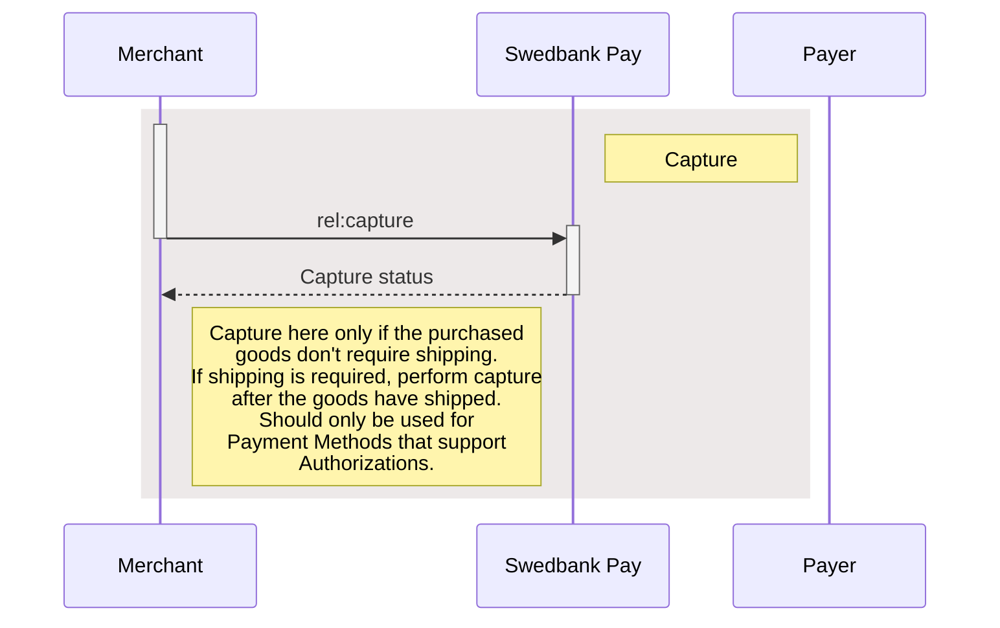
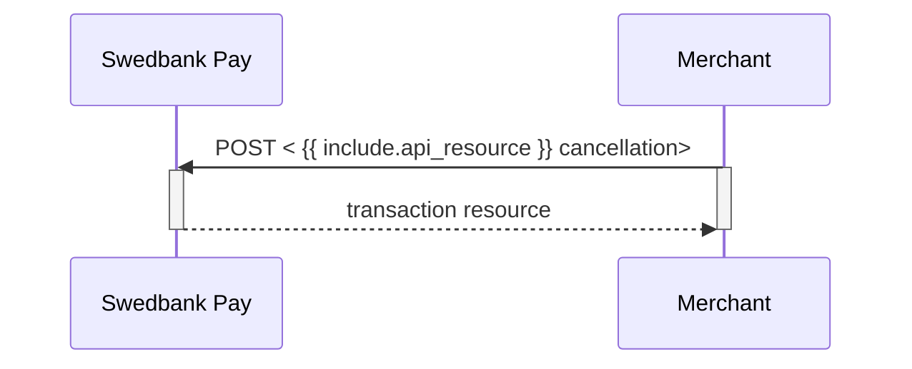



**Recommended version*

{: .h2 }

### Post-Purchase v3.1

  <ul class="toc-list" role="navigation" aria-label="Article content">
    <li>
      <a href="#capture-v31">
        Capture
      </a>
      <ul role="list">
        <li>
          <a href="#capture-request-v31">
            Capture Request
          </a>
        </li>
        <li>
          <a href="#capture-response-v31">
            Capture Response
            </a>
        </li>
        <li>
        <a href="#capture-sequence-diagram-v31">
          Capture Sequence Diagram
        </a>
        </li>
      </ul>
    </li>
    <li>
      <a href="#cancel-v31">
        Cancel
      </a>
      <ul role="list">
        <li>
          <a href="#cancel-request-v31">
            Cancel Request
          </a>
        </li>
        <li>
          <a href="#cancel-response-v31">
            Cancel Response
          </a>
        </li>
        <li>
        <a href="#cancel-sequence-diagram-v31">
          Cancel Sequence Diagram
        </a>
        </li>
      </ul>
    </li>
    <li>
      <a href="#reversal-v31">
        Reversal
      </a>
      <ul role="list">
        <li>
          <a href="#reversal-request-v31">
            Reversal Request
          </a>
        </li>
        <li>
          <a href="#reversal-response-v31">
            Reversal Response
          </a>
        </li>
      </ul>
    </li>
  </ul>





See examples of the `jsons` in the [problems section][problems].





{: .h2 }

### Capture v3.1

Captures are only possible when a payment has a successful `Authorization`
transaction, naturally excluding one-phase payment methods like Swish and
Trustly. They will be marked as a `Sale` transaction. Two-phase payment methods
like card and Vipps however, require a `Capture` to be completed.

Please note that you have a maximum of 5 **consecutive** failed attempts at a
capture. The payment will be locked after the fifth, and you need to contact us
for further attempts.

In addition to full captures, it is possible to do partial captures of the
authorized amount. You can do more captures on the same payment later, up to the
total authorized amount. A useful tool for when you have to split orders into
several shipments.

First off, you must request the order information from the server to get the
request link. With this, you can request the capture with the amount to capture,
and get the status back.

To capture the authorized payment, we need to perform `capture` against the
accompanying `href` returned in the `operations` list. See the abbreviated
request and response below:

{: .text-right}
[Top of page](#post-purchase-v31)

{: .h3 }

#### Capture Request v3.1

POST /psp/paymentorders/{{ page.payment_order_id }}/captures HTTP/1.1
Host: {{ page.api_host }}
Authorization: Bearer <AccessToken>
Content-Type: application/json;version=3.1

{
    "transaction": {
        "description": "Capturing the authorized payment",
        "amount": 1500,
        "vatAmount": 375,
        "payeeReference": "AB832",
        "receiptReference": "AB831"
    }
}









  

    
Field

    
Type

    
Required

  

  <!-- Root: transaction -->
  

    

      <i aria-hidden="true" class="chev swepay-icon-plus-add"></i>
      <code>object</code>
      
    

    

The transaction object.

    

      <!-- description -->
      

        

          <i aria-hidden="true" class="chev swepay-icon-plus-add"></i>
          <code>string</code>
          
        

        

Human-readable description for the capture. Shown in dashboard/logs.

      

      <!-- amount -->
      

        

          <i aria-hidden="true" class="chev swepay-icon-plus-add"></i>
          <code>integer</code>
          
        

        

{{ amount_md | markdownify }}

      

      <!-- vatAmount -->
      

        

          <i aria-hidden="true" class="chev swepay-icon-plus-add"></i>
          <code>integer</code>
          
        

        

{{ vat_amount_md | markdownify }}

      

      <!-- payeeReference -->
      

        

          <i aria-hidden="true" class="chev swepay-icon-plus-add"></i>
          <code>string(50)</code>
          
        

        

{{ payee_reference_md | markdownify }}

      

      <!-- receiptReference (optional) -->
      

        

          <i aria-hidden="true" class="chev swepay-icon-plus-add"></i>
          <code>string(50)</code>
        

        

{{ receipt_reference_md | markdownify }}

      

    

  

{: .text-right .mt-3}

[Top of page](#post-purchase-v31)

{: .h3 }

#### Capture Response v3.1

If the capture request succeeds, this should be the response:

HTTP/1.1 200 OK
Content-Type: application/json; charset=utf-8; version=3.1
api-supported-versions: 3.1

{
  "paymentOrder": {
    "id": "/psp/paymentorders/8be318c1-1caa-4db1-e2c6-08d7bf41224d",
    "created": "2020-03-03T07:19:27.5636519Z",
    "updated": "2020-03-03T07:21:00.5605905Z",
    "operation": "Purchase",
    "status": "Paid",
    "currency": "SEK",
    "amount": 1500,
    "vatAmount": 375,
    "remainingCaptureAmount": 0,
    "remainingCancellationAmount": 0,
    "remainingReversalAmount": 1500,
    "description": "Test Purchase",
    "initiatingSystemUserAgent": "<should be set by the system calling POST:/psp/paymentorders>",
    "language": "sv-SE",
    "availableInstruments": [ "CreditCard", "Invoice-PayExFinancingSe", "Invoice-PayMonthlyInvoiceSe", "Swish", "CreditAccount", "Trustly" ],
    "implementation": "PaymentsOnly",
    "integration": "HostedView|Redirect",
    "instrumentMode": false,
    "guestMode": true,
    "orderItems": {
      "id": "/psp/paymentorders/8be318c1-1caa-4db1-e2c6-08d7bf41224d/orderitems"
    },
    "urls": {
      "id": "/psp/paymentorders/8be318c1-1caa-4db1-e2c6-08d7bf41224d/urls"
    },
    "payeeInfo": {
      "id": "/psp/paymentorders/8be318c1-1caa-4db1-e2c6-08d7bf41224d/payeeInfo"
    },
    "payer": {
      "id": "/psp/paymentorders/8be318c1-1caa-4db1-e2c6-08d7bf41224d/payers"
    },
    "history": {
      "id": "/psp/paymentorders/8be318c1-1caa-4db1-e2c6-08d7bf41224d/history"
    },
    "failed": {
      "id": "/psp/paymentorders/8be318c1-1caa-4db1-e2c6-08d7bf41224d/failed"
    },
    "aborted": {
      "id": "/psp/paymentorders/8be318c1-1caa-4db1-e2c6-08d7bf41224d/aborted"
    },
    "paid": {
      "id": "/psp/paymentorders/8be318c1-1caa-4db1-e2c6-08d7bf41224d/paid"
    },
    "cancelled": {
      "id": "/psp/paymentorders/8be318c1-1caa-4db1-e2c6-08d7bf41224d/cancelled"
    },
    "reversed": {
      "id": "/psp/paymentorders/{{ page.payment_order_id }}/reversed"
    },
    "financialTransactions": {
      "id": "/psp/paymentorders/8be318c1-1caa-4db1-e2c6-08d7bf41224d/financialtransactions"
    },
    "failedAttempts": {
      "id": "/psp/paymentorders/8be318c1-1caa-4db1-e2c6-08d7bf41224d/failedattempts"
    },
    "postPurchaseFailedAttempts": {
      "id": "/psp/paymentorders/8be318c1-1caa-4db1-e2c6-08d7bf41224d/postpurchasefailedattempts"
    },
    "metadata": {
      "id": "/psp/paymentorders/8be318c1-1caa-4db1-e2c6-08d7bf41224d/metadata"
    }
  },
  "operations": [
    {
      "href": "https://api.payex.com/psp/paymentorders/222a50ca-b268-4b32-16fa-08d6d3b73224/reversals",
      "rel": "reversal",
      "method": "POST",
      "contentType": "application/json"
    },
  ]
}











  

    
Field

    
Type

  

  

    

      <i aria-hidden="true" class="chev swepay-icon-plus-add"></i>
      <code>object</code>
    

    

The relative URL of the payment order this capture transaction belongs to.

    

      <!-- children of paymentOrder -->
      

        

          <i aria-hidden="true" class="chev swepay-icon-plus-add"></i>
          <code>string</code>
        

        

The relative URL of the created capture transaction.

      

      

        

          <i aria-hidden="true" class="chev swepay-icon-plus-add"></i>
          <code>date(string)</code>
        

        

The <a href="https://en.wikipedia.org/wiki/ISO_8601">ISO 8601</a>{:target="_blank"} date and time when the transaction was created.

      

      

        

          <i aria-hidden="true" class="chev swepay-icon-plus-add"></i>
          <code>date(string)</code>
        

        

The <a href="https://en.wikipedia.org/wiki/ISO_8601">ISO 8601</a>{:target="_blank"} date and time when the transaction was updated.

      

      

        

          <i aria-hidden="true" class="chev swepay-icon-plus-add"></i>
          <code>string</code>
        

        

{{ operation_md | markdownify }}

      

      

        

          <i aria-hidden="true" class="chev swepay-icon-plus-add"></i>
          <code>string</code>
        

        

Indicates the payment order's current status.

      

      

        

          <i aria-hidden="true" class="chev swepay-icon-plus-add"></i>
          <code>enum(string)</code>
        

        

The currency of the payment order in the ISO 4217 format (e.g. <code>DKK</code>, <code>EUR</code>, <code>NOK</code> or <code>SEK</code>). Some payment methods are only available with selected currencies.

      

      

        

          <i aria-hidden="true" class="chev swepay-icon-plus-add"></i>
          <code>integer</code>
        

        

{{ amount_md | markdownify }}

      

      

        

          <i aria-hidden="true" class="chev swepay-icon-plus-add"></i>
          <code>integer</code>
        

        

{{ vat_amount_md | markdownify }}

      

      

        

          <i aria-hidden="true" class="chev swepay-icon-plus-add"></i>
          <code>string(40)</code>
        

        

{{ description_md | markdownify }}

      

      

        

          <i aria-hidden="true" class="chev swepay-icon-plus-add"></i>
          <code>integer</code>
        

        

The remaining authorized amount that is still possible to capture.

      

      

        

          <i aria-hidden="true" class="chev swepay-icon-plus-add"></i>
          <code>integer</code>
        

        

The remaining authorized amount that is still possible to cancel.

      

      

        

          <i aria-hidden="true" class="chev swepay-icon-plus-add"></i>
          <code>integer</code>
        

        

The remaining captured amount that is still available for reversal.

      

      

        

          <i aria-hidden="true" class="chev swepay-icon-plus-add"></i>
          <code>string</code>
        

        

{{ initiating_system_user_agent_md | markdownify }}

      

      

        

          <i aria-hidden="true" class="chev swepay-icon-plus-add"></i>
          <code>string</code>
        

        

{{ language_md | markdownify }}

      

      

        

          <i aria-hidden="true" class="chev swepay-icon-plus-add"></i>
          <code>array</code>
        

        

A list of payment methods available for this payment.

      

      

        

          <i aria-hidden="true" class="chev swepay-icon-plus-add"></i>
          <code>string</code>
        

        

The merchant's Online Payments implementation type. <code>Enterprise</code> or <code>PaymentsOnly</code>.

      

      

        

          <i aria-hidden="true" class="chev swepay-icon-plus-add"></i>
          <code>string</code>
        

        

The merchant's Online Payments integration type. <code>HostedView</code> (Seamless View) or <code>Redirect</code>.

      

      

        

          <i aria-hidden="true" class="chev swepay-icon-plus-add"></i>
          <code>bool</code>
        

        

Set to <code>true</code> or <code>false</code>. Indicates if the payment is initialized with only one payment method available.

      

      

        

          <i aria-hidden="true" class="chev swepay-icon-plus-add"></i>
          <code>bool</code>
        

        

Set to <code>true</code> or <code>false</code>. Indicates if the payer chose to pay as a guest or not.

      

      <!-- Link-type children -->
      

        

          <i aria-hidden="true" class="chev swepay-icon-plus-add"></i>
          <code>object</code>
        

        

The id for the <a href="https://developer.swedbankpay.com/checkout-v3/features/optional/order-items/">Order Items</a>resource where information about the order items can be retrieved.

      

      

        

          <i aria-hidden="true" class="chev swepay-icon-plus-add"></i>
          <code>object</code>
        

        

The id for the <a href="https://developer.swedbankpay.com/checkout-v3/technical-reference/urls/">urls</a> resource where all URLs related to the payment order can be retrieved.

      

      

        

          <i aria-hidden="true" class="chev swepay-icon-plus-add"></i>
          <code>object</code>
        

        

The id for the <a href="https://developer.swedbankpay.com/checkout-v3/technical-reference/payee-info/">payeeInfo</a> resource where information related to the payee can be retrieved.

      

      

        

          <i aria-hidden="true" class="chev swepay-icon-plus-add"></i>
          <code>object</code>
        

        

The id for the <a href="https://developer.swedbankpay.com/checkout-v3/technical-reference/resource-sub-models/#payer">payer</a>  resource where information about the payer can be retrieved.

      

      

        

          <i aria-hidden="true" class="chev swepay-icon-plus-add"></i>
          <code>object</code>
        

        

The id for the <a href="https://developer.swedbankpay.com/checkout-v3/technical-reference/resource-sub-models/#history">history</a> resource where information about the payment's history can be retrieved.

      

      

        

          <i aria-hidden="true" class="chev swepay-icon-plus-add"></i>
          <code>object</code>
        

        

The id for the <a href="https://developer.swedbankpay.com/checkout-v3/technical-reference/resource-sub-models/#failed">failed</a> resource where information about the failed transactions can be retrieved.

      

      

        

          <i aria-hidden="true" class="chev swepay-icon-plus-add"></i>
          <code>object</code>
        

        

The id for the <a href="https://developer.swedbankpay.com/checkout-v3/technical-reference/resource-sub-models/#aborted">aborted</a> resource where information about the aborted transactions can be retrieved.

      

      

        

          <i aria-hidden="true" class="chev swepay-icon-plus-add"></i>
          <code>object</code>
        

        

The id for the <a href="https://developer.swedbankpay.com/checkout-v3/technical-reference/resource-sub-models/#paid">paid</a> resource where information about the paid transactions can be retrieved.

      

      

        

          <i aria-hidden="true" class="chev swepay-icon-plus-add"></i>
          <code>object</code>
        

        

The id for the <a href="https://developer.swedbankpay.com/checkout-v3/technical-reference/resource-sub-models/#cancelled">cancelled</a> resource where information about the cancelled transactions can be retrieved.

      

      

        

          <i aria-hidden="true" class="chev swepay-icon-plus-add"></i>
          <code>object</code>
        

        

The id for the <a href="https://developer.swedbankpay.com/checkout-v3/technical-reference/resource-sub-models/#reversed">reversed</a> resource where information about the reversed transactions can be retrieved.

      

      

        

          <i aria-hidden="true" class="chev swepay-icon-plus-add"></i>
          <code>object</code>
        

        

The id for the <a href="https://developer.swedbankpay.com/checkout-v3/technical-reference/resource-sub-models/#financialtransactions">financialTransactions</a> resource where information about the financial transactions can be retrieved.

      

      

        

          <i aria-hidden="true" class="chev swepay-icon-plus-add"></i>
          <code>object</code>
        

        

The id for the <a href="https://developer.swedbankpay.com/checkout-v3/technical-reference/resource-sub-models/#failedattempts">failedAttempts</a> resource where information about the failed attempts can be retrieved.

      

      

        

          <i aria-hidden="true" class="chev swepay-icon-plus-add"></i>
          <code>object</code>
        

        

The id for the <a href="https://developer.swedbankpay.com/checkout-v3/technical-reference/resource-sub-models/#postpurchasefailedattempts">postPurchaseFailedAttempts</a> resource where information about the failed capture, cancel or reversal attempts can be retrieved.

      

      

        

          <i aria-hidden="true" class="chev swepay-icon-plus-add"></i>
          <code>object</code>
        

        

The id for the <a href="https://developer.swedbankpay.com/checkout-v3/technical-reference/metadata">metadata</a> resource where information about the metadata can be retrieved.

      

    

  

  

    

      <i aria-hidden="true" class="chev swepay-icon-plus-add"></i>
      <code>array</code>
    

    

{{ operations_md | markdownify }}

  

{: .text-right .mt-3}
[Top of page](#post-purchase-v31)

{: .h3 }

#### Capture Sequence Diagram v3.1

<!--lint disable final-definition -->

The purchase should now be complete. But what if the purchase is cancelled or
the payer wants to return goods? For these instances, we have `cancel` and
`reversal`.




{: .text-right}
[Top of page](#post-purchase-v31)

{: .h3 }

### Cancel v3.1

The `cancellations` resource lists the cancellation transactions on a
specific payment.

To cancel a previously created payment, you must perform the `cancel` operation
against the accompanying `href` returned in the `operations` list. You can only
cancel a payment - or part of a payment - which has not been captured yet. There
must be funds left that are only authorized. If you cancel before any capture
has been done, no captures can be performed later.

{: .text-right}
[Top of page](#post-purchase-v31)

{: .h3 }

#### Cancel Request v3.1

POST /psp/paymentorders/{{ page.payment_order_id }}/cancellations HTTP/1.1
Host: {{ page.api_host }}
Authorization: Bearer <AccessToken>
Content-Type: application/json;version=3.1

{
    "transaction": {
        "description": "Test Cancellation",
        "payeeReference": "ABC123"
    }
}





  

    
Field

    
Type

    
Required

  

  <!-- transaction (root) -->
  

    

      <i aria-hidden="true" class="chev swepay-icon-plus-add"></i>
      <code>object</code>
      
    

    

The transaction object.

    

      <!-- description -->
      

        

          <i aria-hidden="true" class="chev swepay-icon-plus-add"></i>
          <code>string(40)</code>
          
        

        

Human-readable description of why the transaction is cancelled. Shown in dashboard/logs.

      

      <!-- payeeReference -->
      

        

          <i aria-hidden="true" class="chev swepay-icon-plus-add"></i>
          <code>string(50)</code>
          
        

        

{{ payee_reference_md | markdownify }}

      

    

  

{: .text-right}
[Top of page](#post-purchase-v31)

{: .h3 }

#### Cancel Response v3.1

If the cancel request succeeds, the response should be similar to the
example below:

HTTP/1.1 200 OK
Content-Type: application/json; charset=utf-8; version=3.1
api-supported-versions: 3.1

{
  "paymentOrder": {
    "id": "/psp/paymentorders/8be318c1-1caa-4db1-e2c6-08d7bf41224d",
    "created": "2020-03-03T07:19:27.5636519Z",
    "updated": "2020-03-03T07:21:00.5605905Z",
    "operation": "Purchase",
    "status": "Cancelled",
    "currency": "SEK",
    "amount": 1500,
    "vatAmount": 375,
    "description": "Test Purchase",
    "initiatingSystemUserAgent": "<should be set by the system calling POST:/psp/paymentorders>",
    "language": "sv-SE",
    "availableInstruments": [ "CreditCard", "Invoice-PayExFinancingSe", "Invoice-PayMonthlyInvoiceSe", "Swish", "CreditAccount", "Trustly" ],
    "implementation": "PaymentsOnly",
    "integration": "HostedView|Redirect",
    "instrumentMode": true,
    "guestMode": true,
    "orderItems": {
      "id": "/psp/paymentorders/8be318c1-1caa-4db1-e2c6-08d7bf41224d/orderitems"
    },
    "urls": {
      "id": "/psp/paymentorders/8be318c1-1caa-4db1-e2c6-08d7bf41224d/urls"
    },
    "payeeInfo": {
      "id": "/psp/paymentorders/8be318c1-1caa-4db1-e2c6-08d7bf41224d/payeeInfo"
    },
    "payer": {
      "id": "/psp/paymentorders/8be318c1-1caa-4db1-e2c6-08d7bf41224d/payers"
    },
    "history": {
      "id": "/psp/paymentorders/8be318c1-1caa-4db1-e2c6-08d7bf41224d/history"
    },
    "failed": {
      "id": "/psp/paymentorders/8be318c1-1caa-4db1-e2c6-08d7bf41224d/failed"
    },
    "aborted": {
      "id": "/psp/paymentorders/8be318c1-1caa-4db1-e2c6-08d7bf41224d/aborted"
    },
    "paid": {
      "id": "/psp/paymentorders/8be318c1-1caa-4db1-e2c6-08d7bf41224d/paid"
    },
    "cancelled": {
      "id": "/psp/paymentorders/8be318c1-1caa-4db1-e2c6-08d7bf41224d/cancelled"
    },
    "reversed": {
      "id": "/psp/paymentorders/{{ page.payment_order_id }}/reversed"
    },
    "financialTransactions": {
      "id": "/psp/paymentorders/8be318c1-1caa-4db1-e2c6-08d7bf41224d/financialtransactions"
    },
    "failedAttempts": {
      "id": "/psp/paymentorders/8be318c1-1caa-4db1-e2c6-08d7bf41224d/failedattempts"
    },
    "postPurchaseFailedAttempts": {
      "id": "/psp/paymentorders/8be318c1-1caa-4db1-e2c6-08d7bf41224d/postpurchasefailedattempts"
    },
    "metadata": {
      "id": "/psp/paymentorders/8be318c1-1caa-4db1-e2c6-08d7bf41224d/metadata"
    }
  },
  "operations": [
  ]
}












  

    
Field

    
Type

  

  <!-- Root: paymentOrder -->
  

    

      <i aria-hidden="true" class="chev swepay-icon-plus-add"></i>
      <code>string</code>
    

    

The relative URL of the payment order this capture transaction belongs to.

    

      <!-- id -->
      

        

          <i aria-hidden="true" class="chev swepay-icon-plus-add"></i>
          <code>string</code>
        

        

The relative URL of the created capture transaction.

      

      <!-- created -->
      

        

          <i aria-hidden="true" class="chev swepay-icon-plus-add"></i>
          <code>date(string)</code>
        

        

The <a href="https://en.wikipedia.org/wiki/ISO_8601">ISO 8601</a>{:target="_blank"} date and time when the transaction was created.

      

      <!-- updated -->
      

        

          <i aria-hidden="true" class="chev swepay-icon-plus-add"></i>
          <code>date(string)</code>
        

        

The <a href="https://en.wikipedia.org/wiki/ISO_8601">ISO 8601</a>{:target="_blank"} date and time when the transaction was updated.

      

      <!-- operation -->
      

        

          <i aria-hidden="true" class="chev swepay-icon-plus-add"></i>
          <code>string</code>
        

        

{{ operation_md | markdownify }}

      

      <!-- status -->
      

        

          <i aria-hidden="true" class="chev swepay-icon-plus-add"></i>
          <code>string</code>
        

        

{{ status_md | markdownify }}

      

      <!-- currency -->
      

        

          <i aria-hidden="true" class="chev swepay-icon-plus-add"></i>
          <code>enum(string)</code>
        

        

The currency of the payment order in the ISO 4217 format (e.g. <code>DKK</code>, <code>EUR</code>, <code>NOK</code> or <code>SEK</code>). Some payment methods are only available with selected currencies.

      

      <!-- amount -->
      

        

          <i aria-hidden="true" class="chev swepay-icon-plus-add"></i>
          <code>integer</code>
        

        

{{ amount_md | markdownify }}

      

      <!-- vatAmount -->
      

        

          <i aria-hidden="true" class="chev swepay-icon-plus-add"></i>
          <code>integer</code>
        

        

{{ vat_amount_md | markdownify }}

      

      <!-- remainingCaptureAmount -->
      

        

          <i aria-hidden="true" class="chev swepay-icon-plus-add"></i>
          <code>integer</code>
        

        

The remaining authorized amount that is still possible to capture.

      

      <!-- remainingCancellationAmount -->
      

        

          <i aria-hidden="true" class="chev swepay-icon-plus-add"></i>
          <code>integer</code>
        

        

The remaining authorized amount that is still possible to cancel.

      

      <!-- remainingReversalAmount -->
      

        

          <i aria-hidden="true" class="chev swepay-icon-plus-add"></i>
          <code>integer</code>
        

        

The remaining captured amount that is still available for reversal.

      

      <!-- description -->
      

        

          <i aria-hidden="true" class="chev swepay-icon-plus-add"></i>
          <code>string(40)</code>
        

        

{{ description_md | markdownify }}

      

      <!-- initiatingSystemUserAgent -->
      

        

          <i aria-hidden="true" class="chev swepay-icon-plus-add"></i>
          <code>string</code>
        

        

{{ initiating_system_user_agent_md | markdownify }}

      

      <!-- language -->
      

        

          <i aria-hidden="true" class="chev swepay-icon-plus-add"></i>
          <code>string</code>
        

        

{{ language_md | markdownify }}

      

      <!-- availableInstruments -->
      

        

          <i aria-hidden="true" class="chev swepay-icon-plus-add"></i>
          <code>array</code>
        

        

A list of payment methods available for this payment.

      

      <!-- implementation -->
      

        

          <i aria-hidden="true" class="chev swepay-icon-plus-add"></i>
          <code>string</code>
        

        

The merchant's Online Payments implementation type. <code>Enterprise</code> or <code>PaymentsOnly</code>. We ask that you don't build logic around this field's response. It may be subject to name changes.

      

      <!-- integration -->
      

        

          <i aria-hidden="true" class="chev swepay-icon-plus-add"></i>
          <code>string</code>
        

        

The merchant's Online Payments integration type. <code>HostedView</code> (Seamless View) or <code>Redirect</code>. Population occurs after payer opens the payment UI.

      

      <!-- instrumentMode -->
      

        

          <i aria-hidden="true" class="chev swepay-icon-plus-add"></i>
          <code>bool</code>
        

        

Set to <code>true</code> or <code>false</code>. Indicates if the payment is initialized with only one payment method available.

      

      <!-- guestMode -->
      

        

          <i aria-hidden="true" class="chev swepay-icon-plus-add"></i>
          <code>bool</code>
        

        

Set to <code>true</code> or <code>false</code>. Indicates if the payer chose to pay as a guest or not.

      

      <!-- Links (IDs) -->
      

        

          <i aria-hidden="true" class="chev swepay-icon-plus-add"></i>
          <code>object</code>
        

        

The id for the <a href="https://developer.swedbankpay.com/checkout-v3/features/optional/order-items/">Order Items</a> resource where information about the order items can be retrieved.

      

      

        

          <i aria-hidden="true" class="chev swepay-icon-plus-add"></i>
          <code>object</code>
        

        

The id for the <a href="https://developer.swedbankpay.com/checkout-v3/technical-reference/urls/">urls</a> resource where all URLs related to the payment order can be retrieved.

      

      

        

          <i aria-hidden="true" class="chev swepay-icon-plus-add"></i>
          <code>object</code>
        

        

The id for the <a href="https://developer.swedbankpay.com/checkout-v3/technical-reference/payee-info/">payeeInfo</a> resource where information related to the payee can be retrieved.

      

      

        

          <i aria-hidden="true" class="chev swepay-icon-plus-add"></i>
          <code>object</code>
        

        

The id for the <a href="https://developer.swedbankpay.com/checkout-v3/technical-reference/resource-sub-models/#payer">payer</a> resource where information about the payer can be retrieved.

      

      

        

          <i aria-hidden="true" class="chev swepay-icon-plus-add"></i>
          <code>object</code>
        

        

The id for the <a href="https://developer.swedbankpay.com/checkout-v3/technical-reference/resource-sub-models/#history">history</a> resource where information about the payment's history can be retrieved.

      

      

        

          <i aria-hidden="true" class="chev swepay-icon-plus-add"></i>
          <code>object</code>
        

        

The id for the <a href="https://developer.swedbankpay.com/checkout-v3/technical-reference/resource-sub-models/#failed">failed</a> resource where information about the failed transactions can be retrieved.

      

      

        

          <i aria-hidden="true" class="chev swepay-icon-plus-add"></i>
          <code>object</code>
        

        

The id for the <a href="https://developer.swedbankpay.com/checkout-v3/technical-reference/resource-sub-models/#aborted">aborted</a> resource where information about the aborted transactions can be retrieved.

      

      

        

          <i aria-hidden="true" class="chev swepay-icon-plus-add"></i>
          <code>object</code>
        

        

The id for the <a href="https://developer.swedbankpay.com/checkout-v3/technical-reference/resource-sub-models/#paid">paid</a> resource where information about the paid transactions can be retrieved.

      

      

        

          <i aria-hidden="true" class="chev swepay-icon-plus-add"></i>
          <code>object</code>
        

        

The id for the <a href="https://developer.swedbankpay.com/checkout-v3/technical-reference/resource-sub-models/#cancelled">cancelled</a> resource where information about the cancelled transactions can be retrieved.

      

      

        

          <i aria-hidden="true" class="chev swepay-icon-plus-add"></i>
          <code>object</code>
        

        

The id for the <a href="https://developer.swedbankpay.com/checkout-v3/technical-reference/resource-sub-models/#reversed">reversed</a> resource where information about the reversed transactions can be retrieved.

      

      

        

          <i aria-hidden="true" class="chev swepay-icon-plus-add"></i>
          <code>object</code>
        

        

The id for the <a href="https://developer.swedbankpay.com/checkout-v3/technical-reference/resource-sub-models/#financialtransactions">financialTransactions</a> resource where information about the financial transactions can be retrieved.

      

      

        

          <i aria-hidden="true" class="chev swepay-icon-plus-add"></i>
          <code>object</code>
        

        

The id for the <a href="https://developer.swedbankpay.com/checkout-v3/technical-reference/resource-sub-models/#failedattempts">failedAttempts</a> resource where information about the failed attempts can be retrieved.

      

      

        

          <i aria-hidden="true" class="chev swepay-icon-plus-add"></i>
          <code>object</code>
        

        

The id for the <a href="https://developer.swedbankpay.com/checkout-v3/technical-reference/resource-sub-models/#postpurchasefailedattempts">postPurchaseFailedAttempts</a> resource where information about the failed capture, cancel or reversal attempts can be retrieved.

      

      

        

          <i aria-hidden="true" class="chev swepay-icon-plus-add"></i>
          <code>object</code>
        

        

The id for the <a href="https://developer.swedbankpay.com/checkout-v3/technical-reference/metadata">metadata</a> resource where information about the metadata can be retrieved.

      

    

  

  <!-- Root: operations -->
  

    

      <i aria-hidden="true" class="chev swepay-icon-plus-add"></i>
      <code>array</code>
    

    

      

        {{ operations_md | markdownify }}
        <a href="{{ techref_url }}/technical-reference/operations">See Operations for details</a>.
      

    

  

{: .text-right .mt-3}
[Top of page](#post-purchase-v31)

{: .h3 }

#### Cancel Sequence Diagram v3.1

Cancel can only be done on an authorized transaction. As a cancellation does not
have an amount associated with it, it will release the entire reserved amount.
If your intention is to make detailed handling, such as only capturing a partial
amount of the transaction, you must start with the capture of the desired amount
before performing a cancel for the remaining reserved funds.






{: .text-right}
[Top of page](#post-purchase-v31)

{: .h2 }

### Reversal v3.1

This transaction is used when a `Capture` or `Sale` payment needs to be
reversed.

Please note that you have a maximum of 5 **consecutive** failed attempts at a
reversal. The payment will be locked after this, and you need to contact us for
another attempt.

If the full amount of a sale transaction or a captured transaction is reversed,
The transaction will now have status `Reversed` instead of `Paid`.

If we want to reverse a previously captured amount, we need to perform
`reversal` against the accompanying `href` returned in the
`operations` list.

{: .text-right}
[Top of page](#post-purchase-v31)

{: .h3 }

#### Reversal Request v3.1

POST /psp/paymentorders/{{ page.payment_order_id }}/reversals HTTP/1.1
Host: {{ page.api_host }}
Authorization: Bearer <AccessToken>
Content-Type: application/json;version=3.1

{
    "transaction": {
        "description": "Reversal of captured transaction",
        "amount": 1500,
        "vatAmount": 375,
        "payeeReference": "ABC123"
    }
}









  

    
Field

    
Type

    
Required

  

  <!-- Root: transaction -->
  

    

      <i aria-hidden="true" class="chev swepay-icon-plus-add"></i>
      <code>object</code>
      
    

    

The transaction object.

    

      <!-- amount -->
      

        

          <i aria-hidden="true" class="chev swepay-icon-plus-add"></i>
          <code>integer</code>
          
        

        

{{ amount_md | markdownify }}

      

      <!-- vatAmount -->
      

        

          <i aria-hidden="true" class="chev swepay-icon-plus-add"></i>
          <code>integer</code>
          
        

        

{{ vat_amount_md | markdownify }}

      

      <!-- payeeReference -->
      

        

          <i aria-hidden="true" class="chev swepay-icon-plus-add"></i>
          <code>string(50)</code>
          
        

        

{{ payee_reference_md | markdownify }}

      

      <!-- receiptReference (optional) -->
      

        

          <i aria-hidden="true" class="chev swepay-icon-plus-add"></i>
          <code>string(50)</code>
        

        

{{ receipt_reference_md | markdownify }}

      

      <!-- description -->
      

        

          <i aria-hidden="true" class="chev swepay-icon-plus-add"></i>
          <code>string</code>
          
        

        

Human-readable description of why the transaction is reversed. Shown in dashboard/logs.

      

      <!-- orderItems -->
      

        

          <i aria-hidden="true" class="chev swepay-icon-plus-add"></i>
          <code>array</code>
          
        

        

{{ order_items_md | markdownify }}

        

          <!-- reference -->
          

            

              <i aria-hidden="true" class="chev swepay-icon-plus-add"></i>
              <code>string</code>
              
            

            

A reference that identifies the order item.

          

          <!-- name -->
          

            

              <i aria-hidden="true" class="chev swepay-icon-plus-add"></i>
              <code>string</code>
              
            

            

The name of the order item.

          

          <!-- type -->
          

            

              <i aria-hidden="true" class="chev swepay-icon-plus-add"></i>
              <code>enum</code>
              
            

            

<code>PRODUCT</code>, <code>SERVICE</code>, <code>SHIPPING_FEE</code>, <code>PAYMENT_FEE</code>, <code>DISCOUNT</code>, <code>VALUE_CODE</code> or <code>OTHER</code>. The type of the order item.

          

          <!-- class -->
          

            

              <i aria-hidden="true" class="chev swepay-icon-plus-add"></i>
              <code>string</code>
              
            

            

The classification of the order item. Can be used for assigning the order item to a specific product category, such as <code>MobilePhone</code>. Note that <code>class</code> cannot contain spaces and must follow the regex pattern <code>[\w-]*</code>. Swedbank Pay may use this field for statistics.

          

          <!-- itemUrl (optional) -->
          

            

              <i aria-hidden="true" class="chev swepay-icon-plus-add"></i>
              <code>string</code>
            

            

The URL to a page that can display the purchased item, product or similar.

          

          <!-- imageUrl (optional) -->
          

            

              <i aria-hidden="true" class="chev swepay-icon-plus-add"></i>
              <code>string</code>
            

            

The URL to an image of the order item.

          

          <!-- description (item) optional -->
          

            

              <i aria-hidden="true" class="chev swepay-icon-plus-add"></i>
              <code>string</code>
            

            

The human readable description of the order item.

          

          <!-- discountDescription (optional) -->
          

            

              <i aria-hidden="true" class="chev swepay-icon-plus-add"></i>
              <code>string</code>
            

            

The human readable description of the possible discount.

          

          <!-- quantity -->
          

            

              <i aria-hidden="true" class="chev swepay-icon-plus-add"></i>
              <code>number</code>
              
            

            

The 4 decimal precision quantity of order items being purchased.

          

          <!-- quantityUnit -->
          

            

              <i aria-hidden="true" class="chev swepay-icon-plus-add"></i>
              <code>string</code>
              
            

            

The unit of the quantity, such as <code>pcs</code>, <code>grams</code>, or similar. This is used for your own book keeping.

          

          <!-- unitPrice -->
          

            

              <i aria-hidden="true" class="chev swepay-icon-plus-add"></i>
              <code>integer</code>
              
            

            

The price per unit of order item, including VAT.

          

          <!-- discountPrice (optional) -->
          

            

              <i aria-hidden="true" class="chev swepay-icon-plus-add"></i>
              <code>integer</code>
            

            

If the order item is purchased at a discounted price. This field should contain that price, including VAT.

          

          <!-- vatPercent -->
          

            

              <i aria-hidden="true" class="chev swepay-icon-plus-add"></i>
              <code>integer</code>
              
            

            

The percent value of the VAT multiplied by 100, so <code>25%</code> becomes <code>2500</code>.

          

          <!-- amount (item) -->
          

            

              <i aria-hidden="true" class="chev swepay-icon-plus-add"></i>
              <code>integer</code>
              
            

            

The total amount including VAT to be paid for the specified quantity of this order item, in the lowest monetary unit of the currency. E.g. <code>10000</code> equals <code>100.00 SEK</code> and <code>5000</code> equals <code>50.00 SEK</code>.

          

          <!-- vatAmount (item) -->
          

            

              <i aria-hidden="true" class="chev swepay-icon-plus-add"></i>
              <code>integer</code>
              
            

            

The total amount of VAT to be paid for the specified quantity of this order item, in the lowest monetary unit of the currency. E.g. <code>10000</code> equals <code>100.00 SEK</code> and <code>5000</code> equals <code>50.00 SEK</code>.

          

        

      

    

  

{: .text-right .mt-3}
[Top of page](#post-purchase-v31)

{: .h3 }

#### Reversal Response v3.1

If the reversal request succeeds, the response should be similar to the example below:

HTTP/1.1 200 OK
Content-Type: application/json; charset=utf-8; version=3.1
api-supported-versions: 3.1

{
  "paymentOrder": {
    "id": "/psp/paymentorders/8be318c1-1caa-4db1-e2c6-08d7bf41224d",
    "created": "2020-03-03T07:19:27.5636519Z",
    "updated": "2020-03-03T07:21:00.5605905Z",
    "operation": "Purchase",
    "status": "Reversed",
    "currency": "SEK",
    "amount": 1500,
    "vatAmount": 375,
    "remainingCaptureAmount": 0,
    "remainingReversalAmount": 0,
    "description": "Test Purchase",
    "initiatingSystemUserAgent": "<should be set by the system calling POST:/psp/paymentorders>",
    "language": "sv-SE",
    "availableInstruments": [ "CreditCard", "Invoice-PayExFinancingSe", "Invoice-PayMonthlyInvoiceSe", "Swish", "CreditAccount", "Trustly" ],
    "implementation": "PaymentsOnly",
    "integration": "HostedView|Redirect",
    "instrumentMode": true,
    "guestMode": true,
    "orderItems": {
      "id": "/psp/paymentorders/8be318c1-1caa-4db1-e2c6-08d7bf41224d/orderitems"
    },
    "urls": {
      "id": "/psp/paymentorders/8be318c1-1caa-4db1-e2c6-08d7bf41224d/urls"
    },
    "payeeInfo": {
      "id": "/psp/paymentorders/8be318c1-1caa-4db1-e2c6-08d7bf41224d/payeeInfo"
    },
    "payer": {
      "id": "/psp/paymentorders/8be318c1-1caa-4db1-e2c6-08d7bf41224d/payers"
    },
    "history": {
      "id": "/psp/paymentorders/8be318c1-1caa-4db1-e2c6-08d7bf41224d/history"
    },
    "failed": {
      "id": "/psp/paymentorders/8be318c1-1caa-4db1-e2c6-08d7bf41224d/failed"
    },
    "aborted": {
      "id": "/psp/paymentorders/8be318c1-1caa-4db1-e2c6-08d7bf41224d/aborted"
    },
    "paid": {
      "id": "/psp/paymentorders/8be318c1-1caa-4db1-e2c6-08d7bf41224d/paid"
    },
    "cancelled": {
      "id": "/psp/paymentorders/8be318c1-1caa-4db1-e2c6-08d7bf41224d/cancelled"
    },
    "reversed": {
      "id": "/psp/paymentorders/{{ page.payment_order_id }}/reversed"
    },
    "financialTransactions": {
      "id": "/psp/paymentorders/8be318c1-1caa-4db1-e2c6-08d7bf41224d/financialtransactions"
    },
    "failedAttempts": {
      "id": "/psp/paymentorders/8be318c1-1caa-4db1-e2c6-08d7bf41224d/failedattempts"
    },
    "postPurchaseFailedAttempts": {
      "id": "/psp/paymentorders/8be318c1-1caa-4db1-e2c6-08d7bf41224d/postpurchasefailedattempts"
    },
    "metadata": {
      "id": "/psp/paymentorders/8be318c1-1caa-4db1-e2c6-08d7bf41224d/metadata"
    }
  },
  "operations": [
  ]
}












  

    
Field

    
Type

  

  <!-- Root: paymentOrder -->
  

    

      <i aria-hidden="true" class="chev swepay-icon-plus-add"></i>
      <code>string</code>
    

    

The relative URL of the payment order this capture transaction belongs to.

    

      <!-- id -->
      

        

          <i aria-hidden="true" class="chev swepay-icon-plus-add"></i>
          <code>string</code>
        

        

The relative URL of the created capture transaction.

      

      <!-- created -->
      

        

          <i aria-hidden="true" class="chev swepay-icon-plus-add"></i>
          <code>date(string)</code>
        

        

The <a href="https://en.wikipedia.org/wiki/ISO_8601">ISO 8601</a>{:target="_blank"} date and time when the transaction was created.

      

      <!-- updated -->
      

        

          <i aria-hidden="true" class="chev swepay-icon-plus-add"></i>
          <code>date(string)</code>
        

        

The <a href="https://en.wikipedia.org/wiki/ISO_8601">ISO 8601</a>{:target="_blank"} date and time when the transaction was updated.

      

      <!-- operation -->
      

        

          <i aria-hidden="true" class="chev swepay-icon-plus-add"></i>
          <code>string</code>
        

        

{{ operation_md | markdownify }}

      

      <!-- status -->
      

        

          <i aria-hidden="true" class="chev swepay-icon-plus-add"></i>
          <code>string</code>
        

        

{{ status_md | markdownify }}

      

      <!-- currency -->
      

        

          <i aria-hidden="true" class="chev swepay-icon-plus-add"></i>
          <code>enum(string)</code>
        

        

The currency of the payment order in the ISO 4217 format (e.g. <code>DKK</code>, <code>EUR</code>, <code>NOK</code> or <code>SEK</code>). Some payment methods are only available with selected currencies.

      

      <!-- amount -->
      

        

          <i aria-hidden="true" class="chev swepay-icon-plus-add"></i>
          <code>integer</code>
        

        

{{ amount_md | markdownify }}

      

      <!-- vatAmount -->
      

        

          <i aria-hidden="true" class="chev swepay-icon-plus-add"></i>
          <code>integer</code>
        

        

{{ vat_amount_md | markdownify }}

      

      <!-- remainingCaptureAmount -->
      

        

          <i aria-hidden="true" class="chev swepay-icon-plus-add"></i>
          <code>integer</code>
        

        

The remaining authorized amount that is still possible to capture. Only present after a partial reversal.

      

      <!-- remainingCancellationAmount -->
      

        

          <i aria-hidden="true" class="chev swepay-icon-plus-add"></i>
          <code>integer</code>
        

        

The remaining authorized amount that is still possible to cancel. Only present after a partial reversal.

      

      <!-- remainingReversalAmount -->
      

        

          <i aria-hidden="true" class="chev swepay-icon-plus-add"></i>
          <code>integer</code>
        

        

The remaining captured amount that is still available for reversal. This field will not appear in the initial response if the payment method used was Swish. It will first appear if and when you do a GET on the payment.

      

      <!-- description -->
      

        

          <i aria-hidden="true" class="chev swepay-icon-plus-add"></i>
          <code>string</code>
        

        

{{ description_md | markdownify }}

      

      <!-- initiatingSystemUserAgent -->
      

        

          <i aria-hidden="true" class="chev swepay-icon-plus-add"></i>
          <code>string</code>
        

        

{{ initiating_system_user_agent_md | markdownify }}

      

      <!-- language -->
      

        

          <i aria-hidden="true" class="chev swepay-icon-plus-add"></i>
          <code>string</code>
        

        

{{ language_md | markdownify }}

      

      <!-- availableInstruments -->
      

        

          <i aria-hidden="true" class="chev swepay-icon-plus-add"></i>
          <code>array</code>
        

        

A list of payment methods available for this payment.

      

      <!-- implementation -->
      

        

          <i aria-hidden="true" class="chev swepay-icon-plus-add"></i>
          <code>string</code>
        

        

The merchant's Online Payments implementation type. <code>Enterprise</code> or <code>PaymentsOnly</code>. We ask that you don't build logic around this field's response. It is mainly for information purposes, as the implementation types might be subject to name changes. If this should happen, updated information will be available in this table.

      

      <!-- integration -->
      

        

          <i aria-hidden="true" class="chev swepay-icon-plus-add"></i>
          <code>string</code>
        

        

The merchant's Online Payments integration type. <code>HostedView</code> (Seamless View) or <code>Redirect</code>. This field will not be populated until the payer has opened the payment UI, and the client script has identified if Swedbank Pay or another URI is hosting the container with the payment iframe. We ask that you don't build logic around this field's response. It is mainly for information purposes. as the integration types might be subject to name changes, If this should happen, updated information will be available in this table.

      

      <!-- instrumentMode -->
      

        

          <i aria-hidden="true" class="chev swepay-icon-plus-add"></i>
          <code>bool</code>
        

        

Set to <code>true</code> or <code>false</code>. Indicates if the payment is initialized with only one payment method available.

      

      <!-- guestMode -->
      

        

          <i aria-hidden="true" class="chev swepay-icon-plus-add"></i>
          <code>bool</code>
        

        

Set to <code>true</code> or <code>false</code>. Indicates if the payer chose to pay as a guest or not. When using the Payments Only implementation, this is triggered by not including a <code>payerReference</code> in the original <code>paymentOrder</code> request.

      

      <!-- orderItems link -->
      

        

          <i aria-hidden="true" class="chev swepay-icon-plus-add"></i>
          <code>object</code>
        

        

The id for the <a href="https://developer.swedbankpay.com/checkout-v3/features/optional/order-items/">Order Items</a> resource where information about the order items can be retrieved.

      

      <!-- urls link -->
      

        

          <i aria-hidden="true" class="chev swepay-icon-plus-add"></i>
          <code>object</code>
        

        

The id for the <a href="https://developer.swedbankpay.com/checkout-v3/technical-reference/urls/">urls</a> resource where all URLs related to the payment order can be retrieved.

      

      <!-- payeeInfo link -->
      

        

          <i aria-hidden="true" class="chev swepay-icon-plus-add"></i>
          <code>object</code>
        

        

The id for the <a href="https://developer.swedbankpay.com/checkout-v3/technical-reference/payee-info/">payeeInfo</a> resource where information related to the payee can be retrieved.

      

      <!-- payer link -->
      

        

          <i aria-hidden="true" class="chev swepay-icon-plus-add"></i>
          <code>object</code>
        

        

The id for the <a href="https://developer.swedbankpay.com/checkout-v3/technical-reference/resource-sub-models/#payer">payer</a> resource where information about the payer can be retrieved.

      

      <!-- history link -->
      

        

          <i aria-hidden="true" class="chev swepay-icon-plus-add"></i>
          <code>object</code>
        

        

The id for the <a href="https://developer.swedbankpay.com/checkout-v3/technical-reference/resource-sub-models/#history">history</a> resource where information about the payment's history can be retrieved.

      

      <!-- failed link -->
      

        

          <i aria-hidden="true" class="chev swepay-icon-plus-add"></i>
          <code>object</code>
        

        

The id for the <a href="https://developer.swedbankpay.com/checkout-v3/technical-reference/resource-sub-models/#failed">failed</a> resource where information about the failed transactions can be retrieved.

      

      <!-- aborted link -->
      

        

          <i aria-hidden="true" class="chev swepay-icon-plus-add"></i>
          <code>object</code>
        

        

The id for the <a href="https://developer.swedbankpay.com/checkout-v3/technical-reference/resource-sub-models/#aborted">aborted</a> resource where information about the aborted transactions can be retrieved.

      

      <!-- paid link -->
      

        

          <i aria-hidden="true" class="chev swepay-icon-plus-add"></i>
          <code>object</code>
        

        

The id for the <a href="https://developer.swedbankpay.com/checkout-v3/technical-reference/resource-sub-models/#paid">paid</a> resource where information about the paid transactions can be retrieved.

      

      <!-- cancelled link -->
      

        

          <i aria-hidden="true" class="chev swepay-icon-plus-add"></i>
          <code>object</code>
        

        

The id for the <a href="https://developer.swedbankpay.com/checkout-v3/technical-reference/resource-sub-models/#cancelled">cancelled</a> resource where information about the cancelled transactions can be retrieved.

      

      

        

          <i aria-hidden="true" class="chev swepay-icon-plus-add"></i>
          <code>object</code>
        

        

The id for the <a href="https://developer.swedbankpay.com/checkout-v3/technical-reference/resource-sub-models/#reversed">reversed</a> resource where information about the reversed transactions can be retrieved.

      

      <!-- financialTransactions link -->
      

        

          <i aria-hidden="true" class="chev swepay-icon-plus-add"></i>
          <code>object</code>
        

        

The id for the <a href="https://developer.swedbankpay.com/checkout-v3/technical-reference/resource-sub-models/#financialtransactions">financialTransactions</a> resource where information about the financial transactions can be retrieved.

      

      <!-- failedAttempts link -->
      

        

          <i aria-hidden="true" class="chev swepay-icon-plus-add"></i>
          <code>object</code>
        

        

The id for the <a href="https://developer.swedbankpay.com/checkout-v3/technical-reference/resource-sub-models/#failedattempts">failedAttempts</a> resource where information about the failed attempts can be retrieved.

      

      <!-- postPurchaseFailedAttempts link -->
      

        

          <i aria-hidden="true" class="chev swepay-icon-plus-add"></i>
          <code>object</code>
        

        

The id for the <a href="https://developer.swedbankpay.com/checkout-v3/technical-reference/resource-sub-models/#postpurchasefailedattempts">postPurchaseFailedAttempts</a> resource where information about the failed capture, cancel or reversal attempts can be retrieved.

      

      <!-- metadata link -->
      

        

          <i aria-hidden="true" class="chev swepay-icon-plus-add"></i>
          <code>object</code>
        

        

The id for the <a href="https://developer.swedbankpay.com/checkout-v3/technical-reference/metadata">metadata</a> resource where information about the metadata can be retrieved.

      

    

  

  <!-- operations (kept at root level only if you want it to be a sibling;
       remove this block or move inside api-children above if it should be a child) -->
  

    

      <i aria-hidden="true" class="chev swepay-icon-plus-add"></i>
      <code>array</code>
    

    

{{ operations_md | markdownify }}

  

### Done With The Basics

You have reached the final step of the basic payment implementation and should
be able to validate that everything works as intended, or maybe it's time for
[acceptance tests][acceptance-test]?

Some of our payment methods require a few additional steps before they can
be activated and become available in your payment UI. Read more about them
and what you need to do by clicking the cards below.

There are other features and capabilities you can add to tailor the payment
requests in order to meet your business needs. See what else we can offer by
clicking **Additional Request Options**.



{: .text-right .mt-3}
[Top of page](#post-purchase-v31)



[problems]: /checkout-v3/technical-reference/problems
[acceptance-test]: /checkout-v3/get-started/#get-ready-to-go-live
