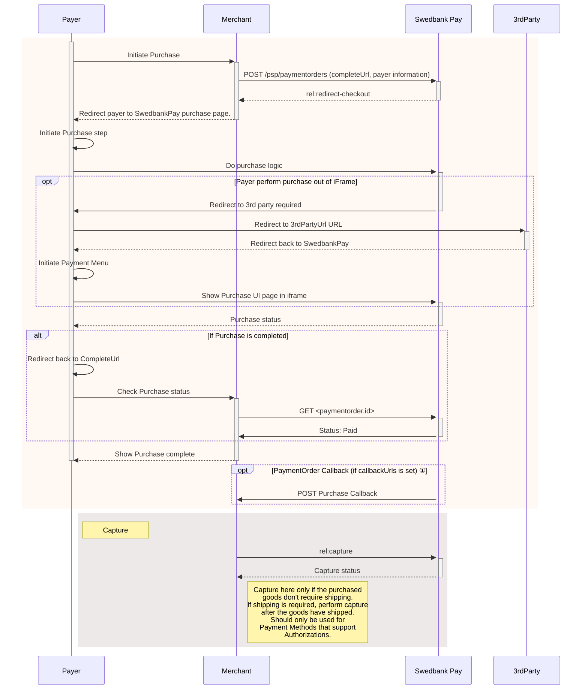

{: .h2 }

### Display Redirect

Among the operations in the POST `paymentOrder`s response, you will find
`redirect-checkout`. This is the one you need to display the payment UI.

{
    "paymentOrder": {}
    "operations": [
        {
            "method": "GET",
            "href": "https://ecom.externalintegration.payex.com/checkout/6445a0d8d9a7f80a37f4e46fc600a0534a832e4b6ec0dbb6768dd362d9401a8b?_tc_tid=30f2168171e142d38bcd4af2c3721959",
            "rel": "redirect-checkout",
            "contentType": "text/html"
        },
    ]
}

 

{: .h2 }

### How Redirect Looks



With the link, you only need to redirect the payer to the site to give them the
option to select their preferred payment method to pay with.

{:.text-center}
![screenshot of the merchant managed implementation redirect payment menu][redirect-payments-only-menu]

Once the payer has completed the purchase, you can perform a `GET` towards the
`paymentOrders` resource to see the purchase state.

[Top of page](#display-redirect)

{: .h2 }

### Redirect Sequence Diagram



*   ① Read more about [callback][payments-callback] handling in the technical reference.

{: .h2 }

### Next Steps

You are now ready to capture the funds. Follow the link below to read more about
capture and the other options you have after the purchase.

[Top of page](#display-redirect)



[redirect-payments-only-menu]: /assets/img/redirect-wcag.png
[payments-callback]: /checkout-v3/features/payment-operations/callback
