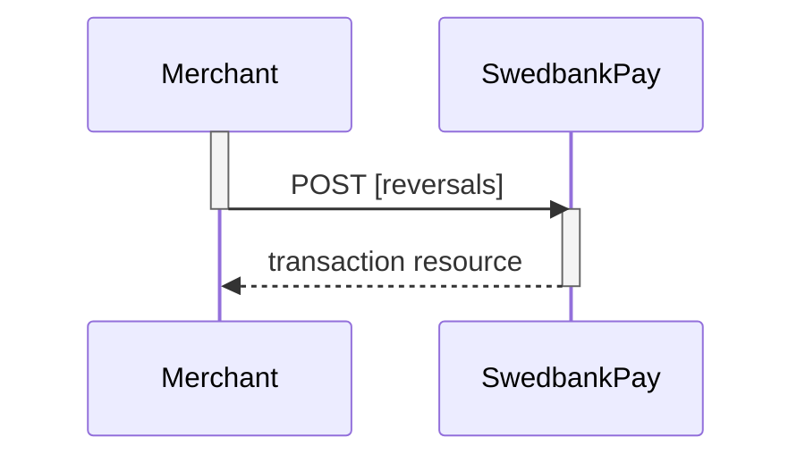






## Reversal

This transaction is used when a captured payment needs to be reversed.

Please note that you have a maximum of 5 **consecutive** failed attempts at a
reversal. The payment will be locked after this, and you need to contact us for
another attempt.

## Reversal Request



The `reversal` operation will reverse a previously captured payment.



The `create-reversal` operation will reverse a previously captured payment.



POST /psp/{{ include.api_resource }}/payments/{{ page.payment_id }}/reversals HTTP/1.1
Host: {{ page.api_host }}
Authorization: Bearer <AccessToken>
Content-Type: application/json

{
    "transaction": {
        "amount": 1500,
        "vatAmount": 0,
        "description": "Test Reversal",
        "payeeReference": "ABC123"
    }
}




{:.table .table-striped .mb-5}
|     Required     | Field                    | Type          | Description                                                                              |
| :--------------: | :----------------------- | :------------ | :--------------------------------------------------------------------------------------- | 
|  | `transaction`            | `object`      | The `object` representation of the generic transaction resource. | 
|  | `transaction`            | `object`      | The `object` representation of the generic [transaction resource]({{ transactions_url }}). | 
|  |          | `integer`     |                                                 |
|  |       | `integer`     |                                              |
|  |     | `string`      | A textual description of the `reversal`.                                                 |
|  |  | `string` |           |



## Reversal Response

The `reversal` resource contains information about the newly created reversal
transaction.

HTTP/1.1 200 OK
Content-Type: application/json

{
    "payment": "/psp/{{ include.api_resource }}/payments/{{ page.payment_id }}",
    "reversal": {
        "id": "/psp/{{ include.api_resource }}/payments/{{ page.payment_id }}/reversal/{{ page.transaction_id }}",
        "transaction": {
            "id": "/psp/{{ include.api_resource }}/payments/{{ page.payment_id }}/transactions/{{ page.transaction_id }}",
            "created": "2016-09-14T01:01:01.01Z",
            "updated": "2016-09-14T01:01:01.03Z",
            "type": "Reversal",
            "state": "Completed",
            "number": 1234567890,
            "amount": 1500,
            "vatAmount": 375,
            "description": "Test transaction",
            "payeeReference": "ABC123",
            "failedReason": "",
            "isOperational": false,
            "operations": []
        }
    }
}




{:.table .table-striped .mb-5}
| Property                  | Type      | Description                                                                                                                                                                                                  |
| :------------------------ | :-------- | :----------------------------------------------------------------------------------------------------------------------------------------------------------------------------------------------------------- |
|                  | `string`  | The relative URL of the payment this `reversal` transaction belongs to.                                                                                                                                      |
|                 | `object`  | The `reversal` resource contains information about the `reversal` transaction made against a card payment.                                                                                                    |
|               | `string`  | The relative URL of the created `reversal` transaction.                                                                                                                                                       |
|  | `transaction`            | `object`      | The `object` representation of the generic transaction resource. | 
|  | `transaction`            | `object`      | The `object` representation of the generic [transaction resource]({{ transactions_url }}). | 
|              | `string`  | The relative URL of the current  transaction  resource.                                                                                                                                                      |
|         | `string`  | The ISO-8601 date and time of when the transaction was created.                                                                                                                                              |
|         | `string`  | The ISO-8601 date and time of when the transaction was updated.                                                                                                                                              |
|            | `string`  | Indicates the transaction type.                                                                                                                                                                              |
|           | `string`  |         |
|          | `string`  | The transaction number, useful when there's need to reference the transaction in human communication. Not usable for programmatic identification of the transaction, where `id` should be used instead.      |
|          | `integer` |                                                                                                                                                                     |
|       | `integer` |                                                                                                                                                                  |
|     | `string`  |                                                                                                                                   |
|  | `string`  |                                                                                                                               |
|    | `string`  | The human readable explanation of why the payment failed.                                                                                                                                                    |
|   | `boolean` | `true`  if the transaction is operational; otherwise  `false` .                                                                                                                                              |
|      | `array`   |                                                                                                   |



## List Reversal Transactions

The `reversals` resource lists the reversal transactions (one or more) on a
specific payment.

GET /psp/{{ include.api_resource }}/payments/{{ page.payment_id }}/reversals HTTP/1.1
Host: {{ page.api_host }}
Authorization: Bearer <AccessToken>
Content-Type: application/json





## Reversal Sequence Diagram

