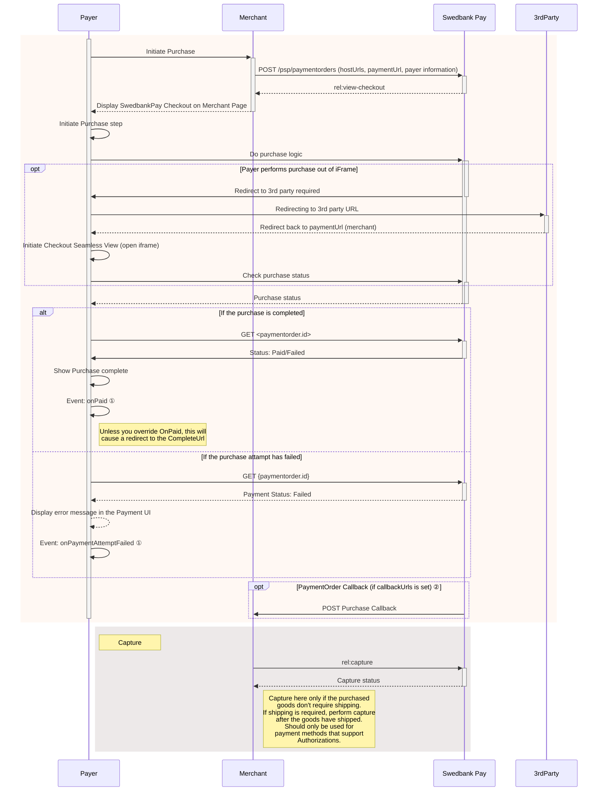

{: .h2 .pt-3 }

### Display Seamless View

<div class="slab mb-5">
  <ul class="toc-list" role="navigation" aria-label="Article content">
    <li>
      <a href="#load-the-seamless-view">
       Load the Seamless View
      </a>
    </li>
    <li>
      <a href="#how-seamless-view-looks">
        How Seamless View Looks
      </a>
    </li>
    <li>
      <a href="#seamless-view-events">
        Seamless View Events
      </a>
    </li>
    <li>
      <a href="#seamless-view-sequence-diagram">
        Seamless View Sequence Diagram
      </a>
    </li>
    <li>
      <a href="#change-from-seamless-view-to-redirect-ui">
        Change From Seamless View To Redirect UI
      </a>
      <ul role="list">
        <li>
          <a href="#use-redirect-operation">
          Use Redirect Operation
          </a>
        </li>
        <li>
          <a href="#remove-seamless-view-code">
          Remove Seamless View Code
          </a>
        </li>
        <li>
          <a href="#change-urls">
          Change URLs
          </a>
        </li>
      </ul>
    </li>
    <li>
      <a href="#monitoring-the-script-url">
        Monitoring The Script URL
      </a>
    </li>
    <li>
      <a href="#seamless-view---next-steps">
        Seamless View - Next Steps
      </a>
    </li>
  </ul>
</div>

Among the operations in the POST `paymentOrder` response, you will find the
`view-checkout`. This is the one you need to display the purchase module.

{
    "paymentOrder": {},
    "operations": [
        {
            "method": "GET",
            "href": "https://ecom.externalintegration.payex.com/checkout/client/1c168a5f971f0cacd00124d1b9ee13e5ecf6e3e74e59cb510035973b38c2c3b3?culture=sv-SE&_tc_tid=123a825592f2002942e5f13eee012b11",
            "rel": "view-checkout",
            "contentType": "application/javascript"
        },
    ]
}

 

{: .h2 }

### Load the Seamless View

To display the UI, we need to take the `href` from the `POST` request and add
it to a `script` element on the webpage. Once the script has loaded in, we can
then use the `payex.hostedView.checkout().open()` function on the clientscript
to show the menu.

There are a few parameters we can set to further customize the menu itself,
which are shown in the example below. This includes the place we want to
open up the menu (container), the language we want the menu to
display (culture), and any events we want to override.

To help customers using assistive technologies, we recommend that you mark the
DOM element where you host our seamless view window as either `<main>` or
`role="main"`. With this implemented, users can easily skip to the Payment UI if
their tools allows for it. This is advised by [WCAG v2.2][wcag]{:target="_blank"}
section **1.3.1** and **2.4.3**.

{:.code-view-header}
**JavaScript**

```js
// For this example, we'll be simply adding in the view-checkout link right in
// the script. In your own solution, it's recommended that your backend
// generates the payment and passes the operation to your frontend.
const url = new URL("https://ecom.externalintegration.payex.com/checkout/client/1c168a5f971f0cacd00124d1b9ee13e5ecf6e3e74e59cb510035973b38c2c3b3?culture=sv-SE&_tc_tid=123a825592f2002942e5f13eee012b11");

const script = document.createElement("script");
script.src = url.href;
script.type = "text/javascript";
script.id = "payex-checkout-script";
script.onload = function() {
    payex.hostedView.checkout({
        // The container is the ID of the HTML element you want to place
        // our solution inside of.
        container: {
            checkout: "payex-checkout"
        },
        culture: "sv-SE",
        // This is where you can add your own seamless events.
        // See the section "Events" down below for more information.
        onError: Function = (data) => console.error("onError", data),
        onEventNotification: Function = (data) => console.log("onEventNotification", data)
    }).open();
}
document.body.insertAdjacentElement("afterbegin", script);
```

{:.code-view-header}
**HTML**

```html
<!DOCTYPE html>
<html>
    <head>
        <title>Swedbank Pay Checkout is Awesome!</title>
    </head>
    <body>
        <div id="payex-checkout"></div>
        <!-- Here you can specify your own javascript file -->
        <script src="<Your-JavaScript-File-Here>"></script>
    </body>
</html>
```

{: .text-right}
[Top of page](#display-seamless-view)

{: .h2 }

### How Seamless View Looks

After opening up the client script, the menu itself will load inside of an
iframe in the container you provided us earlier. From here, the payer can select
their preferred payment method and pay.

{:.text-center}
![screenshot of the enterprise implementation seamless view payment menu][seamless-enterprise-menu]

Once the payer completes their purchase, you can then perform a GET towards the
`paymentOrders` resource to check the purchase state.

{: .text-right}
[Top of page](#display-seamless-view)

{: .h2 }

### Seamless View Events

When you integrate using the Seamless View implementation, you can override one
or more of our Seamless View events. This ranges from changing what happens
when the payer completes or cancels their payment, to when we resize the
payment menu itself. While optional, this gives you more flexibility and
control over the payment flow, during and after the payer completes and/or
cancels their payment attempt.

Events like `onPaid` allows you avoid redirecting to the `completeUrl` once
the payer completes or cancels the payment. This allows you to check the
payment, or just close the payment window and display a receipt on the same
page. Other events like `onPaymentAttemptFailed` can allow you to keep tabs on
the amount of failed attempts, for example if you want to show a warning or
a message if the payer is unable to complete a payment after several tries.

For the full list over the different events you can override, check out the
[Seamless View Events][seamless-view-events] page, also available in the
feature section.

{: .text-right}
[Top of page](#display-seamless-view)

{: .h2 }

### Seamless View Sequence Diagram





*   ① See [seamless view events][payments-seamless-view-events] for further information.
*   ② Read more about [callback][payments-callback] handling in the technical reference.

{: .text-right}
[Top of page](#display-seamless-view)

{: .h2 }

### Change From Seamless View To Redirect UI

As parts of the PCI-DSS best practice becomes requirements with
[PCI-DSS v4][pci]{:target="_blank"} active from April 2025, using the
**Seamless View** integration to display the payment UI will give
merchants more responsibilities than they currently have. This is because
Seamless View is hosted by you. As the **Redirect** integration is
hosted by Swedbank Pay, we also handle these responsibilities.

The updated requirements will include stricter controls and monitoring,
particularly around the security of your checkout process. Merchants are
responsible for ensuring the integrity of the HTML script used in their
integration, including monitoring what is loaded into or over it. Specifically,
Seamless View merchants must verify that the script URL embedded in their iframe
originates from Swedbank Pay or another trusted domain. It is important to note
that Swedbank Pay’s PCI responsibility is strictly limited to the content within
the payment iframe.

For further details, refer to section **4.6.3** and **11.6.1** in the linked
PCI-DSS document.

Please note that this only applies to payment methods that are affected by
PCI-DSS (Card and Click to Pay). If you only offer payment methods not affected
by PCI-DSS, no actions are necessary. If you want to add PCI-DSS affected
payment methods later, this is something you need to consider.

To learn more about how PCI-DSS affects you, we also have reading available
in [Danish][da]{:target="_blank"}, [Finnish][fi]{:target="_blank"},
[Norwegian][no]{:target="_blank"} and [Swedish][se]{:target="_blank"}.

If you currently have a Seamless View integration and don't want the new
responsibilities, switcing to Redirect is a very manageable task. Here's what
you need to do:

{: .text-right}
[Top of page](#display-seamless-view)

#### Use Redirect Operation

In the operations node of the [payment response][post-response], right next to
`view-checkout` which you should currently be using, you'll find
`redirect-checkout`. The corresponding `href` contains a url which leads to a
Swedbank Pay domain where the payment UI will be displayed and processed. All
you need to do is direct the Payer to this url and wait until one of the
functions are called (`completeUrl`, `cancelUrl` or `callbackUrl`) to proceed
with the payment process.

{
    "operations": [
        {
          "method": "GET",
          "href": "https://ecom.externalintegration.payex.com/payment/menu/b934d6f84a89a01852eea01190c2bbcc937ba29228ca7502df8592975ee3bb0d?_tc_tid=30f2168171e142d38bcd4af2c3721959",
          "rel": "redirect-checkout",
          "contentType": "text/html"
        },
    ]
}

 

{: .text-right}
[Top of page](#display-seamless-view)

#### Remove Seamless View Code

You can remove all code related to the `<script>` element used to load the
Seamless View.

{: .text-right}
[Top of page](#display-seamless-view)

#### Change URLs

Finally, you need to do some changes to the `urls` node in your
[payment request][post-request]. The `paymentUrl` field is specific to Seamless
View and can be **removed**.

The url you need to **add** is the `cancelUrl`, so we know where to redirect the
payer if they chose to cancel, or you chose to abort the payment.

If you have permission to [add your own logo][custom-logo] in the payment UI and
want to add one, you also need to include a `logoUrl`. Follow the guidelines in
the section linked above. If no `logoUrl` is added, Swedbank Pay's logo will be
shown by default.

The `completeUrl`, `hostUrls` and `callbackUrl` is universal and must be
included regardless of your UI choice.

{
        "urls": {
            "paymentUrl": "https://example.com/perform-payment"
        }
}



{
        "urls": {
            "cancelUrl": "https://example.com/payment-cancelled",
            "logoUrl": "https://example.com/logo.png" //Optional
        }
}



{: .text-right}
[Top of page](#display-seamless-view)

{: .h2 }

### Monitoring The Script URL

If you choose to stay with Seamless View, please take the following under
advisement.

To ensure compliance, we recommend implementing Content Security
Policy rules to monitor and authorize scripts.

Merchants must whitelist the following domains to restrict browser content
retrieval to approved sources. While https://*.payex.com and
https://*.swedbankpay.com cover most payment methods, digital wallets such as
Apple Pay, Click to Pay, and Google Pay are delivered via Payair. Alongside the
Payair URL, these wallets may also generate URLs from Apple, Google, MasterCard,
and Visa. See the table below for more information.

When it comes to ACS URLs, nothing is loaded from the ACS domain in the
merchant’s end. It will either happen within Swedbank Pay’s domain or as a
redirect, which will repeal the merchant’s CSP.

The list below includes important URLs, but may not be exhaustive. Merchants
need to stay up to date in case of URL changes, or if you need to whitelist URLs
not listed here.

For further details, refer to section 4.6.3 and 11.6.1 in this [PCI-DSS document][pci-url].

{:.table .table-striped}
| URL                       | Description                                                                                                  |
| :------------------------ | :----------------------------------------------------------------------------------------------------------- |
| https://*.cdn-apple.com   | URL needed for Apple Pay.                                                                                    |
| https://*.google.com      | URL needed for Google Pay.                                                                                   |
| https://*.gstatic.com     | Domain used by Google that hosts images, CSS, and javascript code to reduce bandwidth usage online.          |
| https://*.mastercard.com  | URL needed for Click to Pay.                                                                                 |
| https://*.payair.com      | URL for the digital wallets Apple Pay, Click to Pay and Google Pay.                                          |
| https://*.payex.com       | Universal URL for all payment methods except the digital wallets Apple Pay, Click to Pay and Google Pay.     |
| https://*.swedbankpay.com | Universal URL for all payment methods except the digital wallets Apple Pay, Click to Pay and Google Pay.     |
| https://*.visa.com        | URL needed for Click to Pay.                                                                                 |

{: .text-right}
[Top of page](#display-seamless-view)

{: .h2 }

### Seamless View - Next Steps

You are now ready to validate the payment's status. Follow the link below to
read more about how this is done.

{: .text-right}
[Top of page](#display-seamless-view)



[seamless-view-events]: /checkout-v3/technical-reference/seamless-view-events
[seamless-enterprise-menu]: /assets/img/wcag-seamless.png
[payments-callback]: /checkout-v3/features/payment-operations/callback
[payments-seamless-view-events]: /checkout-v3/technical-reference/seamless-view-events
[custom-logo]: /checkout-v3/features/customize-ui/custom-logo/
[post-response]: /checkout-v3/get-started/payment-request/#payment-order-response-v31
[post-request]: /checkout-v3/get-started/payment-request/#payment-order-request-v31
[pci]: /assets/documents/PCI-DSS-v4-0-1-SAQ-A.pdf
[pci-url]: /assets/documents/guidance-for-pci-dss-points.pdf
[da]: https://www.swedbankpay.dk/risiko-og-sikkerhed/pci-sadan-bliver-du-pavirket
[fi]: https://www.swedbankpay.fi/riskit-ja-turvallisuus/nain-pci-vaikuttaa-sinuun
[no]: https://www.swedbankpay.no/risiko-og-sikkerhet/pci-slik-pavirkes-du
[se]: https://www.swedbankpay.se/risk-och-sakerhet/pci-sa-paverkas-du
[wcag]: https://www.w3.org/WAI/WCAG22/quickref/
