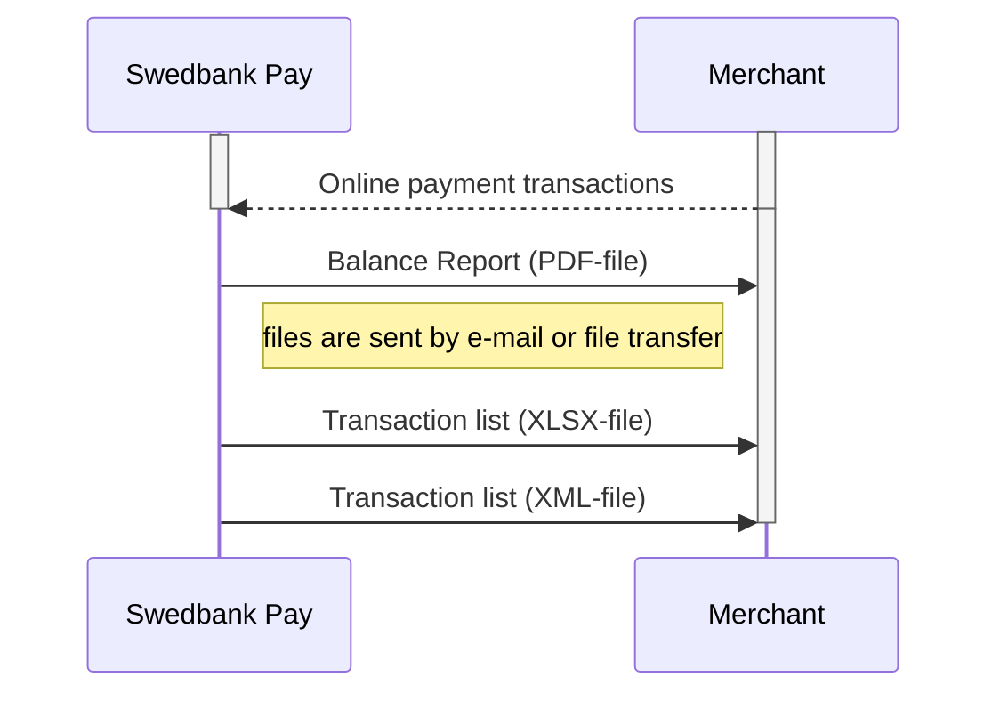






## Settlement And Reconciliation



The information needed to reconcile captured funds - the balance report and
transactions list - are available for all merchants using Swedbank Pay.

*   By default, the settlement files will be sent to you by via e-mail.
*   We also have the option to send it via SFTP as well. If this is something
    you'd like, please inform your sales representative. They will in turn let
    the setup team know.
*   The settlement frequency is defined in your agreement, but the default is
*   monthly or weekly.
*   You do not need to subscribe, the files will be delivered by default.

Please contact [kundsupport@swedbankpay.se][omni-client-email] for further
inquiries regarding this.

## Settlement

There are two main alternatives for settlement - either we handle the settlement
process for you, or you handle the process yourself:

### If Swedbank Pay Handles The Settlement Process

Swedbank Pay handles the settlement process on your behalf, (_called
“Redovisningsservice”_). Swedbank Pay transfers the net amount to you directly.



When choosing [Swedbank Pay Checkout][checkout-v3] we will always handle the
settlement process for you, gathering all your eCommerce payments in one place.
Straighforward and time efficient.



When choosing [Swedbank Pay Checkout][checkout-v2] we will always handle the
settlement process for you, gathering all your eCommerce payments in one place.
Straighforward and time efficient.



### You Handle The Settlement Process Yourself

If you will handle the settlement yourself, then Swedbank Pay will send you an
invoice with the relevant fees, in addition to the report and transactions
lists. Your acquirer will transfer settled funds to you.

## Balance Report

The Balance Report (a _.pdf file_) specifies the total sales for a specific
period, including fees and VAT. The report contains three parts: a payment
summary and specifications for sales and for fees.

Two versions of the balance report are currently in production, **v1** and
**v2**. **All new customers are set up with v2**, so if you are a new
customer or have joined us within the last year, the v2 sections should be your
focus. **V1 will be phased out during 2023.**

The main differences are in the [transaction list][transaction-list].

### Payment Summary

Provides a summary of the `Amount` sold, `Fees` and `VAT`. **If Swedbank Pay**
**handles the settlement process**, the `Transferred amount` shown in the
balance report summary is equivalent to the disbursement on the bank statement
(the remaining total amount after fees).

### Sales Specification

Provides a specification over sales for the given period. The sales total is
specified per payment area (`CreditCard`, `Invoice`) and underlying payment
instruments. Each sales row specify Quantity, Sum sales and Amount to pay out,
the last one is only eligble **if Swedbank Pay handles the Settlement process**.

A summary of payments through the last date of the report is also provided.

### Fees Specification

Provides a specification of the fees in the given period. The fees total is
specified per payment area (`CreditCard`, `Invoice`) and underlying payment
instruments. Each fees row specify `Quantity` (sales), `Amount` (sales),
`Unit price`, `Provision` and `fee Amount`. **If you handle the settlement**
**process yourself, you will receive a separate invoice for fees**.

## Transaction List

The Transaction List (also called Sales Accounted Transactions) is provided in
`.xlsx` and `.xml` formats and specifies all transactions for a specific period,
including a summary of transactions grouped by payment instrument. Both formats
contain the same information, but the xml file is meant for computer processing,
while the excel workbook is meant for human interaction.

The first row contains the name of the Swedbank Pay company (e.g. Swedbank Pay
Solutions AB) that the merchant has the contract with, and the balance report
number. The header fields contain a summary of the transactions displayed in the
body.

As with the Balance Report there are two versions of the Transaction List, and
**v1 will be phased out during 2023**.

## V1 Header Fields

{:.table .table-striped}
| Field         | Type       | Description                                                                |
| :------------ | :--------- | :------------------------------------------------------------------------- |
| `Prefix`      | `string`   | The `Prefix` used for transactions, only eligible if merchant uses prefix. |
| `Currency`    | `ISO 4217` | Settlement currency (e.g. `SEK, NOK, EUR`).                                |
| `ServiceType` | `string`   | The service type of the service used (e.g. `Creditcard`).                  |
| `Service`     | `string`   | The service used (e.g. `Creditcard`).                                      |
| `NoOfDebet`   | `Decimal`  | Total number of debit transactions for the given service.                  |
| `NoOfCredit`  | `Decimal`  | Total number of credit transactions for the given service.                 |
| `Amount`      | `Decimal`  | Total amount for the given service (e.g 100.00).                           |
| `FromDate`    | `ISO 8601` | The earliest transaction date, `YYYY-MM-DD`.                               |
| `ToDate`      | `ISO 8601` | The latest transaction date, `YYYY-MM-DD`.                                 |

## V1 Body Fields

{:.table .table-striped}
| Field                           | Type       | Description                                                                                                                                               |
| :------------------------------ | :--------- | :-------------------------------------------------------------------------------------------------------------------------------------------------------- |
| `Swedbank Pay Batch Number`     | `Decimal`  | A batch number common to all types of transactions processed by Swedbank Pay.                                                                             |
| `Transaction Number`            | `Decimal`  | A unique identifier of the transaction, can be traced in the Merchant Portal user interface.                                                               |
| `Order id`                      | `string`   | A unique identifier of the order, as sent from the merchant to Swedbank Pay. Transactions that are related to the same order are associated with this ID. |
| `Date Created`                  | `ISO 8601` | Transaction capture date/time. YYYY-MM-DD hh:mm:ss.                                                                                                       |
| `Date Modified`                 | `ISO 8601` | Transaction settle date/time. YYYY-MM-DD hh:mm:ss.                                                                                                        |
| `Provider`                      | `string`   | The service provider (e.g. Babs, Swedbank).                                                                                                               |
| `Type`                          | `string`   | The service type of the related transaction (e.g. `Creditcard`).                                                                                          |
| `Amount`                        | `Decimal`  | Total amount of the related transaction (e.g 100.00).                                                                                                     |
| `Currency`                      | `ISO 4217` | Settlement currency (e.g. `SEK, NOK, EUR`).                                                                                                               |
| `Product Number`                | `string`   | A product number, as sent by merchant to Swedbank Pay.                                                                                                    |
| `Description`                   | `string`   | A textual description of the transaction, as sent by merchant to Swedbank Pay.                                                                            |
| `VAT Amount`                    | `Decimal`  | VAT Amount for the given transaction (e.g 100.00).                                                                                                        |
| `VAT Percentage`                | `Decimal`  | VAT Percentage for the given transaction.                                                                                                                 |
| `Credit Card Batch Number`      | `Decimal`  | The reference number from the credit card processor.                                                                                                      |
| `Reference`                     | `Decimal`  | The transaction reference from processor.                                                                                                                 |
| `Swedbank Pay Account Number`   | `Decimal`  | The Account number given, shown in the Merchant Portal.                                                                                                    |
| `Referenced Transaction Number` | `Decimal`  | Transaction number for the Authoriation transaction for a two-stage transaction or the number of the debit transaction if it is a credit transaction.     |
| `Sales Channel`                 | `string`   | The channel through which the transaction was sent to Swedbank Pay (e.g Transaction via eCommerce APIs).                                                  |
| `Brand`                         | `string`   | If eligible, Branding information as sent by merchant to Swedbank Pay.                                                                                    |
| `Point Of Sale`                 | `string`   | If eligible, POS information as sent by merchant to Swedbank Pay.                                                                                         |

## V2 Header Fields

{:.table .table-striped}
| Field                     | Type       | Description                                                                  |
| :-------------------------| :--------- | :--------------------------------------------------------------------------- |
| `Subsite`                 | `string`   | The `Subsite` used for transactions, only eligible if merchant uses subsite. |
| `SubsiteDescription`      | `string`   | Description of the `Subsite`, only eligible if merchant uses subsite.        |
| `Currency`                | `ISO 4217` | Settlement currency (e.g. `SEK, NOK, EUR`).                                  |
| `ServiceType`             | `string`   | The service type of the service used (e.g. `Creditcard`).                    |
| `ServiceName`             | `string`   | The service used (e.g. `Corporate Cards EU`).                                |
| `NoOfDebet`               | `Decimal`  | Total number of debit transactions for the given service.                    |
| `NoOfCredit`              | `Decimal`  | Total number of credit transactions for the given service.                   |
| `Amount`                  | `Decimal`  | Total amount for the given service (e.g 100.00).                             |
| `FromDate`                | `ISO 8601` | The earliest transaction date, `YYYY-MM-DD`.                                 |
| `ToDate`                  | `ISO 8601` | The latest transaction date, `YYYY-MM-DD`.                                   |

## V2 Body Fields

{:.table .table-striped}
| Field                           | Type       | Description                                                                                                                                               |
| :------------------------------ | :--------- | :-------------------------------------------------------------------------------------------------------------------------------------------------------- |
| `PayExAccountNo`                | `Decimal`  | The Account number given, shown the Merchant Portal..                                                                             |
| `OrderIdentity`                 | `string`   | A unique identifier of the order, as sent from the merchant to Swedbank Pay. Transactions that are related to the same order are associated with this ID. |
| `TransactionIdentity`           | `string`   | A unique guid identifier of the transaction, can be traced in the Merchant Portal user interface.                                                          |
| `Amount`                        | `Decimal`  | Total amount of the related transaction (e.g 100.00).                                                                                                     |
| `Currency`                      | `ISO 4217` | Settlement currency (e.g. `SEK, NOK, EUR`).                                                                                                               |
| `VAT Amount`                    | `Decimal`  | VAT Amount for the given transaction (e.g 100.00).                                                                                                        |
| `VAT Percentage`                | `Decimal`  | VAT Percentage for the given transaction.                                                                                                                 |
| `Date Created`                  | `ISO 8601` | Transaction capture date/time. YYYY-MM-DD hh:mm:ss.                                                                                                       |
| `Date Modified`                 | `ISO 8601` | Transaction settle date/time. YYYY-MM-DD hh:mm:ss.                                                                                                        |
| `ServiceName`                   | `string`   | The service used (e.g. `Corporate Cards EU`).                                                                                                             |
| `Provider`                      | `string`   | The service provider (e.g. Swedbank Pay, PayEx, Swish).                                                                                                   |
| `PayExTransactionNo`            | `Decimal`  | A unique identifier of the transaction, can be traced in the Merchant Portal user interface.                                                               |
| `PayExBatchNo`                  | `Decimal`  | A batch number common to all types of transactions processed by Swedbank Pay.                                                                             |
| `Subsite`                       | `string`   | The `Subsite` used for transactions, only eligible if merchant uses subsite.                                                                              |
| `SubsiteDescription`            | `string`   | Description of the `Subsite`, only eligible if merchant uses subsite.                                                                                     |
| `ReferencedTransaction`         | `Decimal`  | Transaction number for the authorization transaction for a two-stage transaction, or the number of the debit transaction if it is a credit transaction.   |
| `ExternalTransactionReference`  | `Decimal`  | The transaction reference from processor.   |
| `CreditCardBatchNo`             | `Decimal`  | The reference number from the credit card processor.                                                                                                      |
| `Description`                   | `string`   | A textual description of the transaction, as sent by merchant to Swedbank Pay.                                                                            |
| `ProductCategory`               | `string`   | A product number, as sent by merchant to Swedbank Pay.                                                                                                    |
| `Sales Channel`                 | `string`   | The channel through which the transaction was sent to Swedbank Pay (e.g Transaction via eCommerce APIs).                                                  |
| `Brand`                         | `string`   | If eligible, Branding information as sent by merchant to Swedbank Pay.                                                                                    |
| `Point Of Sale`                 | `string`   | If eligible, POS information as sent by merchant to Swedbank Pay.                                                                                         |

## Reconciliation

To do the reconciliation, you need to match the information in your system
against the information provided by Swedbank Pay in the balance report and
transaction list. Below is a sequence diagram detailing the interaction.

## Reconciliation Sequence Diagram



**There are two ways** for you to match the information from your system with
the information given in the reconciliation files from Swedbank Pay:

1.  You can use information **generated by your** system (you will have to set a
    unique payeeReference when you make the transaction), or
2.  You can use the transaction number **generated by Swedbank Pay** (this is
    called transaction number and is returned from Swedbank Pay after you have
    created the transaction).

A credit card transaction is made when you either make a capture or a reversal.
In the input data for making a capture, you will set the `payeeReference`. The
unique value of this field is the same as the field called `OrderID` in the
reconciliation file.

```json
{
    "transaction": {
        "amount": 1500,
        "vatAmount": 0,
        "description": "Test Reversal",
        "payeeReference": "ABC123"
    }
}
```

When you receive the response from Swedbank Pay, the response will include
`transaction.number`. This is the same as the field called `TransactionNo` in
the reconciliation file.

```json
{
    "payment": "/psp/{{ api_resource }}/payments/{{ page.payment_id }}",
    "capture": {
        "id": "/psp/{{ api_resource }}/payments/{{ page.payment_id }}/captures/{{ page.transaction_id }}",
        "transaction": {
            "id": "/psp/{{ api_resource }}/payments/{{ page.payment_id }}/transactions/{{ page.transaction_id }}",
            "created": "2016-09-14T01:01:01.01Z",
            "updated": "2016-09-14T01:01:01.03Z",
            "type": "Capture",
            "state": "Initialized",
            "number": 1234567890,
            "amount": 1500,
            "vatAmount": 250,
            "description": "Test Capture",
            "payeeReference": "ABC123",
            "failedReason": "",
            "isOperational": false,
            "operations": []
        }
    }
}
```

*   `payeeReference` sent to Swedbank Pay is equal to `OrderId` in the
    reconciliation file.
*   `capture.transaction.number` returned from Swedbank Pay is equal to
    `TransactionNo` in reconciliation file.

Below you will see the API mapping tables to the fields in the settlement
report for
`Sale`  `Capture` 
and `Reversal`.








## Report Samples

The content of the files depends on the type of agreement you have made with
Swedbank Pay. For some payment instruments, only option A is available, while
for other payment instruments, only option B is available. The sample files can
be downloaded below. **Make sure that you choose the examples from your**
**current version of the balance report (v1 or v2).**

### V1 Option A: Swedbank Pay Handles The Settlement Process

*   [PDF Balance Report][balance-report-sbp-pdf]
*   [XLSX Transaction List][trans-list-sbp-xlsx]
*   [XML Transaction List][trans-list-sbp-xml]

### V1 Option B: You Handle The Settlement Process Yourself

*   [PDF Balance Report][balance-report-pdf]
*   [XLSX Transaction List][trans-list-xlsx]
*   [XML Transaction List][trans-list-xml]

### V2 Option A: Swedbank Pay Handles The Settlement Process

*   [PDF Balance Report][v2-balance-report-sbp-pdf]
*   [XLSX Transaction List][v2-trans-list-sbp-xlsx]
*   [XML Transaction List][v2-trans-list-sbp-xml]

### V2 Option B: You Handle The Settlement Process Yourself

*   [PDF Balance Report][v2-balance-report-pdf]
*   [XLSX Transaction List][v2-trans-list-xlsx]
*   [XML Transaction List][v2-trans-list-xml]

## Split Settlement

The split settlement feature is an easy way of doing settlements for companies
with multiple sub-merchants. With only a few steps, the settlement process
becomes more efficient with regards to invoicing, payouts and setup for both
your sub-merchants and yourself.

In short, it is a settlement feature where a company with a website or an app
can attach specific subsite numbers to sub-merchants selling their goods or
services through the company. The subsite number is used to match the
transactions with the correct sub-merchant, so the settlement is automatically
split between them. If you run a site selling tickets to concerts, theaters,
sporting events etc., each venue gets its own subsite number. If you run a
funeral home, the sub-merchants can be everything from flower shops to
charities.

## What We Need From You As A Company

*   Submit a KYC (Know Your Customer) form for each sub-merchant you want to
    include. We will also do a KYC check on your sub-merchants, providing extra
    security for both of us.
*   Give every sub-merchant who sells goods/services through your website or in
    your app a unique subsite number. It must be in the format of `A-Za-z0-9`.
    This must be included in the KYC form. We recommend using the same customer
    number they have in your system.
*   Attach the subsite number to all the goods/services the sub-merchant
    sells through your website or app, so the goods/services can be matched
    to the correct merchant in our back office system.
*   A partner agreement is needed for automatic deduction of revenue cuts
    and fees.

## How It Works

1.  We set up the sub-merchant subsite number in our system.
2.  You add the number in the request's subsite field when you create the
    payment for the goods or service.
3.  The customer selects a payment instrument and completes the payment.
4.  The payment goes into a client funds account.
5.  Swedbank Pay matches the transaction with the sub-merchant using the subsite
    number.
6.  The settlement is split and connected to the correct sub-merchant.
7.  Revenue cuts for the super merchant and fees from Swedbank Pay are deducted
    automatically.
8.  Payout to the sub-merchant is done.

## The Upsides Of Split Settlement

Connecting sub-merchants to Swedbank Pay through the super merchant instead of
having separate setups has a lot of pros:

*   You only need one agreement for each payment instrument (credit card, Vipps,
    Swish, MobilePay Online, invoice) and payment gateway.
*   You only need one acquiring agreement.
*   You only need one Vipps or Swish certificate.
*   You can add more payment instruments easily, as it only has to be done once.
*   New sub-merchants can be set up quickly, as the only thing needed is a KYC
    form and a subsite number. This shortens the setup time to a matter of hours
    for both you and us.
*   The automatic settlement split and deduction of fees and revenue cuts
    minimizes the work for your accounting department, as you won't have to
    invoice your sub-merchants.
*   The subsite split is available for all payment instruments we offer on
    our eCom platform.

## Split Settlement Admin Functions

With regards to admin functions, we offer a full integration towards our
Merchant Portal system. This way, you do not have to log in to the Merchant
Portal to perform these operations.

## Capture And Cancel

Captures and cancels are done by the super merchant the same way as all other
flows.

## Reversal

In cases where you need to do reversals, this will be performed by the super
merchant. The reversal amount will be charged from the sub-merchants subsite
number. If the sub-merchants balance is 0 (zero), the super merchant will be
invoiced. The super merchant will in turn have to invoice this amount to the sub
merchant.

[balance-report-sbp-pdf]: /assets/documents/r1234-0001-redov.service.pdf
[checkout-v2]: /old-implementations/{{ checkout_version }}
[checkout-v3]: /{{ checkout_version }}
[trans-list-sbp-xlsx]: /assets/documents/transaktionsstatistik-redovisningsservice.xlsx
[trans-list-sbp-xml]: /assets/documents/transaktionsstatistik-redovisningsservice.xml
[transaction-list]: #transaction-list
[balance-report-pdf]: /assets/documents/balance-report.pdf
[trans-list-xlsx]: /assets/documents/transaction-list.xlsx
[trans-list-xml]: /assets/documents/transaction-list.xml
[omni-client-email]: mailto:kundsupport@swedbankpay.se
[v2-balance-report-sbp-pdf]: /assets/documents/R1234-0001-Redovisningsservice.pdf
[v2-trans-list-sbp-xlsx]: /assets/documents/R1234-0001-Redovisningsservice.xlsx
[v2-trans-list-sbp-xml]: /assets/documents/R1234-0001-Redovisningsservice.xml
[v2-balance-report-pdf]: /assets/documents/R1234-0002-Eget-konto.pdf
[v2-trans-list-xlsx]: /assets/documents/R1234-0002-Eget-konto.xlsx
[v2-trans-list-xml]: /assets/documents/R1234-0002-Eget-konto.xml
