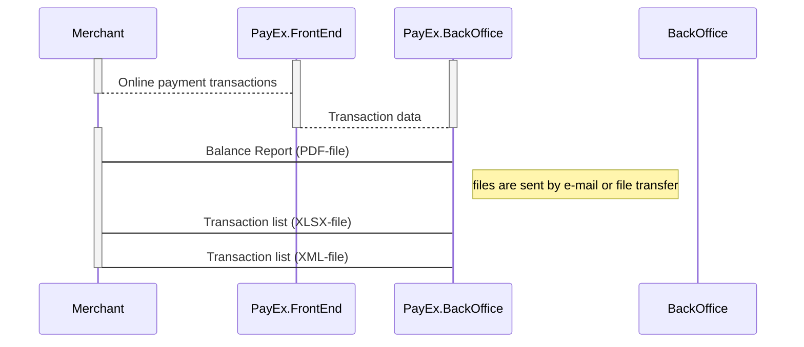

## Settlement and Reconcilliation



The information needed to reconcile captured funds - the balance report and transactions list - are available for all merchants using PayEx. By default you receive these files by e-mail, but it is also possible to get them via FTP access. Contact [omni.client@payex.com][omni-client-email] for further inquiries regarding this. The settlement frequency is defined in the agreement and you will receive a report for each payout and/or invoice.

### Settlement

There are two main alternatives for settlement - either we handle the settlement process for you, or you handle the process yourself :

#### PayEx handles the settlement process 

PayEx handles the settlement process on your behalf, (_called “Redovisningsservice”_). PayEx transfers the net amount to you directly.

##### PayEx Checkout

When choosing [PayEx Checkout][payex-checkout] we always handle the settlement process for you, gathering all your eCommerce payments in one place. Straighforward and time efficient.  

#### You handle the settlement process yourself

If you will handle the settlement yourself, then PayEx will send you an invoice with the relevant fees, in addition to the report and transactions lists. Your acquirer will transfer settled funds to you.

#### Balance Report

The Balance Report (a _.pdf file_) specifies the total sales for a specific period, including fees and VAT. The report contains three parts: a payment summary and specifications for sales and for fees.

##### Payment Summary

Provides a summary of the `Amount` sold, `Fees` and `VAT`. **If PayEx handles the settlement process**, the `Transfered``amount` - shown in the balance report summary is equivalent to the disbursement on the bank statement (the remaining total amount after fees).

##### Sales specification

Provides a specification over sales for the given period. The sales total is specified per payment area (`CreditCard, Direct Debit, Factoring`) and underlying payment instruments. Each sales row specify Quantity, Sum sales and Amount to pay out, the last one is only eligble **if PayEx handles the Settlement process**.

##### Fees specification

Provides a specification over fees for the given period. The fees total is specified per payment area (`CreditCard, Direct Debit, Factoring`) and underlying payment instruments. Each fees row specify `Quantity` (sales), `Amount` (sales), `Unit price`, `Provision` and `fee Amount`. **If you handle the settlement process yourselves you will receive a separat invoice for fees**.

#### Transactions List

The Transaction List (provided in `.xlsx` and `.xml` formats) specifies all transactions for a specific period, including a summary of transactions grouped by payment method. Both formats contain the same information, but the xml file is meant for computer processing while the excel workbook is meant for human interaction.

The first row contains the name of the PayEx company (e.g. PayEx Solutions AB) that the merchant has the contract with, and the balance report number. The header fields contain a summary of the transactions displayed in the body. 

{:.code-header}
**Header fields**

{:.table .table-striped}
|**Field**|**Type**|**Description**
| Prefix |String|ThePrefix## used for transactions, only eligible if merchant uses prefix.
| Currency |ISO 4217|Settlement currency (e.g. `SEK, NOK, EUR`).
| ServiceType |String|The service type of the service used (e.g. `Creditcard, Direct debit`).
| Service |String|The service used (e.g. `Creditcard, Direct debit`).
| NoOfDebet |Decimal|Total number of debit transactions for the given service.
| NoOfCredit |Decimal|Total number of credit transactions for the given service.
| Amount |Decimal|Total amount for the given service (e.g 100.00).
| FromDate |ISO 8601|The earlistest transaction date, `YYYY-MM-DD`.
| ToDate |ISO 8601|The latest transaction date, `YYYY-MM-DD`.

{:.code-header}
**Body fields**

{:.table .table-striped}
|**Field**|**Type**|**Description**
| PayEx Batch Number |Decimal|A batch number common to all types of transactions processed by PayEx.
| Transaction Number |Decimal|A unique identifier of the transaction, can be traced in PayEx Admin user interface.
| Order id |String|A unique identifier of the order, as sent from the merchant to PayEx. Transactions that are related to the same order are associated with this ID.
| Date Created |ISO 8601|Transaction capture date/time. YYYY-MM-DD hh:mm:ss.
| Date Modified |ISO 8601|Transaction settle date/time. YYYY-MM-DD hh:mm:ss.
| Provider |String|The service provider (e.g. Babs, Swedbank).
|Type|String|The service type of the related transaction (e.g. `Creditcard, Direct debit`).
| Amount |Decimal|Total amount of the related transaction (e.g 100.00).
| Currency |ISO 4217|Settlement currency (e.g. `SEK, NOK, EUR`).
| Product Number |String|A product number, as sent by merchant to PayEx.
| Description |String|A textual description of the transaction, as sent by merchant to PayEx.
|VAT Amount|Decimal|VAT Amount for the given transaction (e.g 100.00).
|VAT Percentage|Decimal|VAT Percentage for the given transaction.
|Credit Card Batch Number|Decimal|The reference number from the credit card processor.
|Direct Debit Bank Reference|Decimal|The reference number from the processing bank.
|Reference|Decimal|The transaction reference from processor.
|PayEx Account Number|Decimal|The Account number given, shown in PayEx admin. 
|Referenced Transaction Number|Decimal|Transaction number for the Authoriation transaction for a two-stage transaction or the number of the debit transaction if it is a credit transaction.
|Sales Channel|String|The channel through which the transaction was sent to PayEx (e.g Transaction via eCommerce APIs).
|Brand|String|If eligible, Branding information as sent by merchant to PayEx.
|Point Of Sale |String|If eligible, POS information as sent by merchant to PayEx.

### Reconciliation

To do the reconciliation, you need to match the information in your system against the information provided by PayEx in the balance report and transaction list. Below is a sequence diagram detailing the interaction.



**There are two ways** for you to match the information from your system with the information given in the reconciliation files from PayEx:

1. You can use information **generated by your** system (you will have to set a unique payeeReference when you make the transaction), or
2. You can use the transaction number **generated by PayEx** (this is called transaction number and is returned from PayEx after you have created the transaction).

A credit card transaction is made when you either make a capture or a reversal. In the input data for making a capture, you will set the `payeeReference`. The unique value of this field is the same as the field called `OrderID` in the reconciliation file.

```JS
{
    "transaction": {
        "amount": 1500,
        "vatAmount": 0,
        "description": "Test Reversal",
        "payeeReference": "ABC123"
    }
}
```

When you receive the response from PayEx, the response will includetransaction.number##. This is the same as the field `calledTransactionNo` in the reconciliation file.

```JS
{
    "payment": "/psp/creditcard/payments/5adc265f-f87f-4313-577e-08d3dca1a26c",
    "capture": {
        "id": "/psp/creditcard/payments/5adc265f-f87f-4313-577e-08d3dca1a26c/captures/12345678-1234-1234-1234-123456789012",
        "transaction": {
            "id": "/psp/creditcard/payments/5adc265f-f87f-4313-577e-08d3dca1a26c/transactions/12345678-1234-1234-1234-123456789012",
            "created": "2016-09-14T01:01:01.01Z",
            "updated": "2016-09-14T01:01:01.03Z",
            "type": "Capture",
            "state": "Initialized",
            "number": 1234567890,
            "amount": 1500,
            "vatAmount": 250,
            "description": "Test Capture",
            "payeeReference": "ABC123",
            "failedReason": "",
            "isOperational": false,
            "operations": []
        }
    }
}
```

* `payeeReference` sent to PayEx is equal to `OrderId` in the reconciliation file.
* `capture.transaction.number` returned from PayEx is equal to `TransactionNo` in reconciliation file.

### Samples

The content of the files depends on the type of agreement you have made with PayEx. For some payment methods, only option A is available, while for other payment methods, only option B is available. The sample files can be downloaded below.

#### Option A: PayEx handles the settlement process

* **[PDF Balance Report for PayEx Checkout][attachement-1]**
* [PDF Balance Report][attachement-2]
* [XLSX Transaction List][attachement-3]
* [XML Transaction List][attachement-4]

#### Option B: You will handle the settlement process yourself

* [PDF Balance Report][attachement-5]
* [XLSX Transaction List][attachement-6]
* [XML Transaction List][attachement-7]

[payex-checkout]: /checkout
[attachement-1]: /assets/documents/testredovisning-payexcheckout.pdf
[attachement-2]: /assets/documents/R1234-0001 redov.service.pdf
[attachement-3]: /assets/documents/Transaktionsstatistik Redovisningsservice.xlsx
[attachement-4]: /assets/documents/Transaktionsstatistik Redovisningsservice.xml
[attachement-5]: /assets/documents/R1234-0001 eget konto.pdf
[attachement-6]: /assets/documents/R1234-0001 eget konto.pdf
[attachement-7]: /assets/documents/Testredovisning Eget konto.xml
[omni-client-email]: mailto:omni.client@payex.com