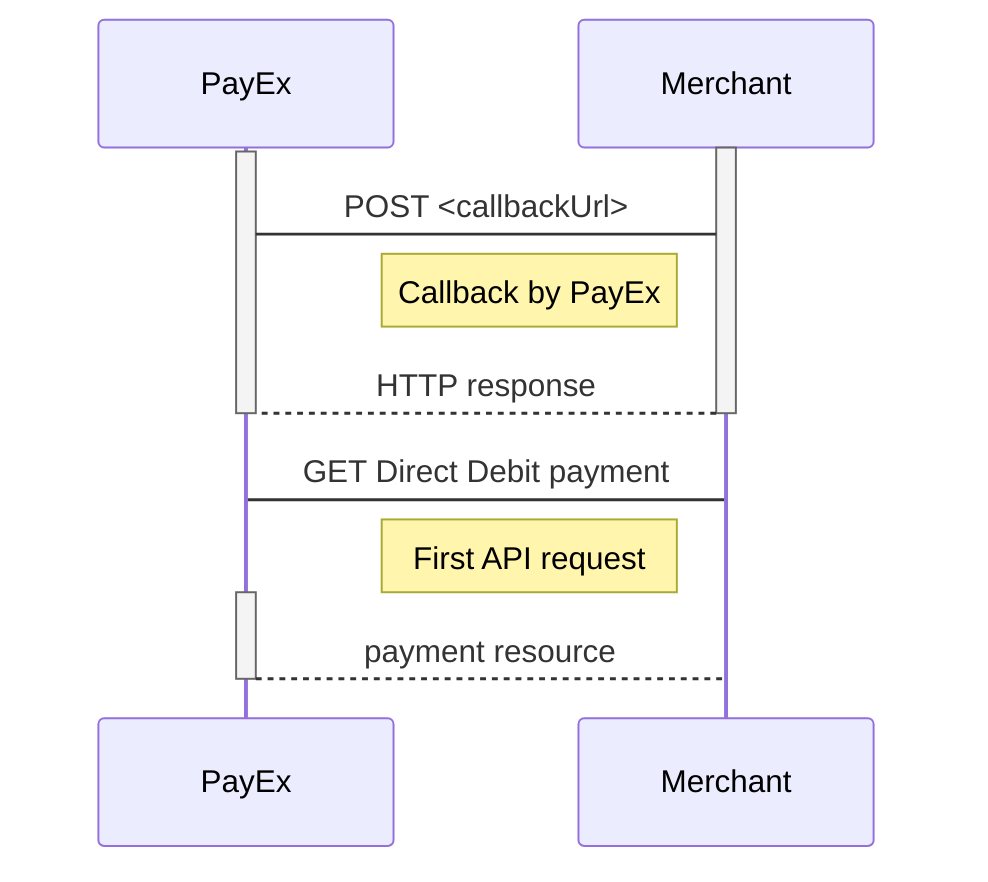

## Subsite

### Create Payment

To create a Direct Debit payment, you perform an HTTP `POST` against the
`/psp/directdebit/payments` resource.

An example of a payment creation request is provided below.
Each individual Property of the JSON document is described in the
following section.

{:.code-header}
**Request**

```HTTP
POST /psp/directdebit/payments HTTP/1.1
Host: api.externalintegration.payex.com
Authorization: Bearer <MerchantToken>
Content-Type: application/json

{
    "payment": {
        "operation": "Purchase",
        "intent": "Sale",
        "currency": "EUR",
        "prices": [
            {
                "type": "NordeaFi",
                "amount": 1500,
                "vatAmount": 0
            }
        ],
        "description": "Test Purchase",
        "payerReference": "AB1234",
        "userAgent": "Mozilla/5.0...",
        "language": "sv-SE",
        "urls": {
            "completeUrl": "http://test-dummy.net/payment-completed",
            "cancelUrl": "http://test-dummy.net/payment-canceled",
            "callbackUrl": "http://test-dummy.net/payment-callback",
            "logoUrl": "https://example.com/logo.png",
            "termsOfServiceUrl": "https://example.com/terms.pdf"
        },
        "payeeInfo": {
            "payeeId": "12345678-1234-1234-1234-123456789012",
            "payeeReference": "PR123",
            "payeeName": "Merchant1",
            "productCategory": "PC1233",
            "orderReference": "or-12456",
            "subsite": "MySubsite"
        }
    }
}
```

{:.table .table-striped}
| Property | Type                           | Description |
| :------: | :----------------------------- | :---------- | :---------------------------------------------------------------------------------------------------------------------------------------------------------------------------------------------------------------------------------------------------- |
|    ✔︎    | payment.operation              | string      | `Purchase` is the only type used for direct debit payments.                                                                                                                                                                                           |
|    ✔︎    | payment.intent                 | string      | `Sale` is the only type used for direct debit payments                                                                                                                                                                                                |
|    ✔︎    | payment.currency               | string      | The currency used.                                                                                                                                                                                                                                    |
|    ✔︎    | payment.prices.type            | string      | (((Use the generic type `Directdebit` if you want to enable all bank types supported by merchant contract, otherwise specify a specific bank type. [See the Prices object types for more information][core-payment-resources-pPrices-objecttypes].))) |
|    ✔︎    | payment.prices.amount          | integer     | Amount is entered in the lowest momentary units of the selected currency. E.g. `10000` `100.00 SEK` `5000` `50.00 SEK`.                                                                                                                               |
|    ✔︎    | payment.prices.vatAmount       | integer     | If the amount given includes VAT, this may be displayed for the user in the payment page (redirect only). Set to 0 (zero) if this is not relevant.                                                                                                    |
|    ✔︎    | payment.description            | string(40)  | A textual description max 40 characters of the purchase.                                                                                                                                                                                              |
|          | payment.payerReference         | string      | The reference to the payer (consumer/end-user) from the merchant system, like mobile number, customer number etc.                                                                                                                                     |
|    ✔︎    | payment.userAgent              | string      | The user agent reference of the consumer's browser - [see user agent definition][user-agent]                                                                                                                                                          |
|    ✔︎    | payment.language               | string      | nb-NO, sv-SE or en-US.                                                                                                                                                                                                                                |
|    ✔︎    | payment.urls.completeUrl       | string      | The URI that Swedbank Pay will redirect back to when the payment is followed through.                                                                                                                                                                 |
|    ✔︎    | payment.urls.cancelUrl         | string      | The URI that Swedbank Pay will redirect back to when the user presses the cancel button in the payment page.                                                                                                                                          |
|          | payment.urls.callbackUrl       | string      | The URI that Swedbank Pay will perform an HTTP POST against every time a transaction is created on the payment. See [callback][technical-reference-callback] for details.                                                                             |
|          | payment.urls.logoUrl           | string      | The URI that will be used for showing the customer logo. Must be a picture with at most 50px height and 400px width. **Requires https**.                                                                                                              |
|          | payment.urls.termsOfServiceUrl | string      | A URI that contains your terms and conditions for the payment, to be linked on the payment page. **Requires https**.                                                                                                                                  |
|    ✔︎    | payeeInfo.payeeId              | string      | This is the unique id that identifies this payee (like merchant) set by PayEx.                                                                                                                                                                        |
|    ✔︎    | payeeInfo.payeeReference       | string(35)  | A unique reference from the merchant system. It is set per operation to ensure an exactly-once delivery of a transactional operation. See [payeeReference][technical-reference-payeereference] for details.                                           |
|          | payeeInfo.payeeName            | string      | The payee name (like merchant name) that will be displayed to consumer when redirected to PayEx.                                                                                                                                                      |
|          | payeeInfo.productCategory      | string      | A product category or number sent in from the payee/merchant. This is not validated by PayEx, but will be passed through the payment process and may be used in the settlement process.                                                               |
|          | payeeInfo.orderReference       | string(50)  | The order reference should reflect the order reference found in the merchant's systems.                                                                                                                                                               |
|          | payeeInfo.subsite              | String(40)  | The subsite field can be used to perform split settlement on the payment. The subsites must be resolved with Swedbank Pay reconciliation before being used.                                                                                           |

{:.code-header}
**Response**

```HTTP
HTTP/1.1 200 OK
Content-Type: application/json

{
    "payment": {
        "id": "/psp/directdebit/payments/5adc265f-f87f-4313-577e-08d3dca1a26c",
        "number": 1234567890,
        "instrument": "DirectDebit",
        "created": "2018-10-09T13:01:01Z",
        "updated": "2018-10-09T13:01:01Z",
        "state": "Ready",
        "operation": "Purchase",
        "intent": "Sale",
        "currency": "EUR",
        "amount": 1500,
        "remainingReversalAmount": 0,
        "description": "Test Purchase",
        "userAgent": "Mozilla/5.0...",
        "language": "nb-NO",
        "prices": { "id": "/psp/directdebit/payments/5adc265f-f87f-4313-577e-08d3dca1a26c/prices" },
        "transactions": { "id": "/psp/directdebit/payments/5adc265f-f87f-4313-577e-08d3dca1a26c/transactions" },
        "sales": { "id": "/psp/directdebit/payments/5adc265f-f87f-4313-577e-08d3dca1a26c/sales" },
        "reversals": { "id": "/psp/directdebit/payments/5adc265f-f87f-4313-577e-08d3dca1a26c/reversals" },
        "payeeInfo" : { "id": "/psp/directdebit/payments/5adc265f-f87f-4313-577e-08d3dca1a26c/payeeInfo" },
        "urls" : { "id": "/psp/directdebit/payments/5adc265f-f87f-4313-577e-08d3dca1a26c/urls" },
        "settings": { "id": "/psp/directdebit/payments/5adc265f-f87f-4313-577e-08d3dca1a26c/settings" }
  },
    "operations": [
        {
            "href": "https://api.externalintegration.payex.com/psp/directdebit/payments/<paymentId>/sales",
            "rel": "redirect-sale",
            "method": "POST"
        },
        {
            "href": "http://api.externalintegration.payex.com/psp/directdebit/payments/<paymentId>",
            "rel": "update-payment-abort",
            "method": "PATCH"
        }
    ]
}
```

### Operations

A payment resource has a set of operations that can be performed on it,
from its creation to its end.
The operations available at any given time vary between payment methods and
depends on the current state of the payment resource.
A list of possible operations for Direct Debit Payments
and their explanation is given below.

{:.code-header}
**Operations**

```JS
{
    "operations": [
        {
            "method": "PATCH",
            "href": "https://api.externalintegration.payex.com/psp/directdebit/payments/3648fa94-7fd8-4e32-a14b-08d608f884ff",
            "rel": "update-payment-abort"
        },
        {
            "method": "GET",
            "href": "https://ecom.externalintegration.payex.com/directdebit/payments/sales/993b479653da83671c074316c7455da05fced9d634431edbb64f3c5f80a863f0",
            "rel": "redirect-sale"
        }
    ]
}
```

{:.table .table-striped}
| Property | Description                                                         |
| :------- | :------------------------------------------------------------------ |
| `href`   | The target URI to perform the operation against.                    |
| `rel`    | The name of the relation the operation has to the current resource. |
| `method` | The HTTP method to use when performing the operation.               |

The operations should be performed as described in each response and not as
described here in the documentation.
Always use the `href` and `method` as specified in the response by finding
the appropriate operation based on its `rel` value.
The only thing that should be hard coded in the client is the value of the
`rel` and the request that will be sent in the HTTP body of the request for
the given operation.

{:.table .table-striped}
| Operation            | Description                                                                                                                         |
| :------------------- | :---------------------------------------------------------------------------------------------------------------------------------- |
| update-payment-abort | Aborts the payment before any financial transactions are performed.                                                                 |
| redirect-sale        | Contains the redirect-URI that redirects the consumer to a Swedbank Pay hosted payments page prior to creating a sales transaction. |

### Direct Debit transactions

All Direct Debit specific transactions are described below.

#### Sales

The `Sales` resource lists the sales transactions (one or more) on
a specific payment.

{:.code-header}
**Request**

```HTTP
GET /psp/directdebit/payments/5adc265f-f87f-4313-577e-08d3dca1a26c/sales HTTP/1.1
Host: api.externalintegration.payex.com
Authorization: Bearer <MerchantToken>
Content-Type: application/json
```

{:.code-header}
**Response**

```HTTP
HTTP/1.1 200 OK
Content-Type: application/json

{
    "payment": "/psp/directdebit/payments/5adc265f-f87f-4313-577e-08d3dca1a26c",
    "sales": {
        "id": "/psp/directdebit/payments/5adc265f-f87f-4313-577e-08d3dca1a26c/sales",
        "salesList": [
            {
                "id": "/psp/directdebit/payments/5adc265f-f87f-4313-577e-08d3dca1a26c/sales/12345678-1234-1234-1234-123456789012",
                "selectedBank": "NordeaFI",
                "deviceIsMobile": "TRUE|FALSE",
                "transaction": {
                    "id": "/psp/directdebit/payments/5adc265f-f87f-4313-577e-08d3dca1a26c/transactions/12345678-1234-1234-1234-123456789012",
                    "created": "2018-09-14T01:01:01.01Z",
                    "updated": "2018-09-14T01:01:01.03Z",
                    "type": "Sale",
                    "state": "Initialized|Completed|Failed",
                    "number": 1234567890,
                    "amount": 1000,
                    "vatAmount": 250,
                    "description": "Test transaction",
                    "payeeReference": "AH123456",
                    "failedReason": "",
                    "failedActivityName": "",
                    "failedErrorCode": "",
                    "failedErrorDescription": "",
                    "isOperational": "TRUE|FALSE",
                    "operations": [
                    ]
                }
            },
            {
                "id": "/psp/directdebit/payments/5adc265f-f87f-4313-577e-08d3dca1a26c/sales/12345678-1234-1234-1234-123456789013",
                "selectedBank": "NordeaFI|...",
                "deviceIsMobile": "TRUE|FALSE",
                "transaction": {
                    "id": "/psp/directdebit/payments/5adc265f-f87f-4313-577e-08d3dca1a26c/transactions/12345678-1234-1234-1234-123456789013",
                    "created": "2018-09-14T01:01:01.01Z",
                    "updated": "2018-09-14T01:01:01.03Z",
                    "type": "Sale",
                    "state": "Initialized|Completed|Failed",
                    "number": 1234567890,
                    "amount": 1000,
                    "vatAmount": 250,
                    "description": "Test transaction",
                    "payeeReference": "AH123456",
                    "failedReason": "",
                    "failedActivityName": "",
                    "failedErrorCode": "",
                    "failedErrorDescription": "",
                    "isOperational": "TRUE|FALSE",
                    "operations": [
                        {
                            "href": "https://api.externalintegration.payex.com/psp/directdebit/payments/5adc265f-f87f-4313-577e-08d3dca1a26c",
                            "rel": "edit-sale",
                            "method": "PATCH"
                        }
                    ]
                }
            }
        ]
    }
}
```

#### Reversals

The `Reversals` resource list the reversals transactions
(one or more) on a specific payment.

{:.code-header}
**Request**

```HTTP
GET /psp/directdebit/payments/5adc265f-f87f-4313-577e-08d3dca1a26c/reversals HTTP/1.1
Host: api.externalintegration.payex.com
Authorization: Bearer <MerchantToken>
Content-Type: application/json
```

{:.code-header}
**Response**

```HTTP
HTTP/1.1 200 OK
Content-Type: application/json

{
    "payment": "/psp/directdebit/payments/5adc265f-f87f-4313-577e-08d3dca1a26c",
    "reversals": {
        "id": "/psp/directdebit/payments/5adc265f-f87f-4313-577e-08d3dca1a26c/reversals",
        "reversalList": [
            {
                "id": "/psp/directdebit/payments/5adc265f-f87f-4313-577e-08d3dca1a26c/reversals/12345678-1234-1234-1234-123456789012",
                "transaction": {
                    "id": "/psp/directdebit/payments/5adc265f-f87f-4313-577e-08d3dca1a26c/transactions/12345678-1234-1234-1234-123456789012",
                    "created": "2016-09-14T01:01:01.01Z",
                    "updated": "2016-09-14T01:01:01.03Z",
                    "type": "Reversal",
                    "state": "Initialized|Completed|Failed",
                    "number": 1234567890,
                    "amount": 1000,
                    "vatAmount": 250,
                    "description": "Test transaction",
                    "payeeReference": "AH123456",
                    "isOperational": "TRUE|FALSE",
                    "operations": []
                }
            }
        ]
    }
}
```

{:.table .table-striped}
| Property       | Type   | Description                                                                                          |
| :------------- | :----- | :--------------------------------------------------------------------------------------------------- |
| payment        | string | The relative URI of the payment that the reversal transactions belong to.                            |
| reversalList   | array  | The array of reversal transaction objects.                                                           |
| reversalList[] | object | The reversal transaction object representation of the reversal transaction resource described below. |

##### Create Reversal transaction

You can create a reversal transaction against a completed sales
transaction by adding that transaction's `payeeReference` in the request body.
A callback request will follow from PayEx.

{:.code-header}
**Request**

```HTTP
POST /psp/directdebit/payments/5adc265f-f87f-4313-577e-08d3dca1a26c/reversals HTTP/1.1
Host: api.externalintegration.payex.com
Authorization: Bearer <MerchantToken>
Content-Type: application/json

{
    "transaction": {
        "amount": 1500,
        "vatAmount": 0,
        "description" : "Test Reversal",
        "payeeReference": "ABC123"
    }
}
```

{:.table .table-striped}
| Required | Property                   | Type       | Description                                                                                                                                                                |
| :------: | :------------------------- | :--------- | :------------------------------------------------------------------------------------------------------------------------------------------------------------------------- |
|    ✔︎    | transaction.amount         | integer    | Amount Entered in the lowest momentary units of the selected currency. E.g. `10000` `100.00 SEK`, `5000` `50.00 SEK`.                                                      |
|    ✔︎    | transaction.vatAmount      | integer    | Amount Entered in the lowest momentary units of the selected currency. E.g. `10000` `100.00 SEK`, `5000` `50.00 SEK`.                                                      |
|    ✔︎    | transaction.description    | string     | A textual description of the capture                                                                                                                                       |
|    ✔︎    | transaction.payeeReference | string(35) | A  reference that must match the  ##payeeReference## of the sales transaction you want to reverse. See [`payeeReference`][technical-reference-payeereference] for details. |

{:.code-header}
**Response**

```HTTP
HTTP/1.1 200 OK
Content-Type: application/json

{
    "payment": "/psp/directdebit/payments/5adc265f-f87f-4313-577e-08d3dca1a26c",
    "reversal": {
        "id": "/psp/directdebit/payments/5adc265f-f87f-4313-577e-08d3dca1a26c/reversals/12345678-1234-1234-1234-123456789012",
        "transaction": {
            "id": "/psp/directdebit/payments/5adc265f-f87f-4313-577e-08d3dca1a26c/transactions/12345678-1234-1234-1234-123456789012",
            "created": "2016-09-14T01:01:01.01Z",
            "updated": "2016-09-14T01:01:01.03Z",
            "type": "Reversal",
            "state": "Initialized|Completed|Failed",
            "number": 1234567890,
            "amount": 1000,
            "vatAmount": 250,
            "description": "Test transaction",
            "payeeReference": "AH123456",
            "isOperational": "TRUE|FALSE",
            "operations": []
        }
    }
}
```

{:.table .table-striped}
| Property             | Type   | Description                                                           |
| :------------------- | :----- | :-------------------------------------------------------------------- |
| payment              | string | The relative URI of the payment this capture transaction belongs to.  |
| reversal.id          | string | The relative URI of the created capture transaction.                  |
| reversal.transaction | object | The object representation of the generic [transaction][reversal-get]. |

### Callback

When a change or update from the back-end system are made on a payment or
transaction, Swedbank Pay will perform a callback to inform the payee
(merchant) about this update.
Callback functionality is explaned in more detail
[here][technical-reference-callback].



------------------------------------
[core-payment-resources-pPrices-objecttypes]: #prices
[reversal-get]: #reversals
[technical-reference-callback]: #callback
[technical-reference-payeereference]: #payee-reference
[user-agent]: https://en.wikipedia.org/wiki/User_agent
