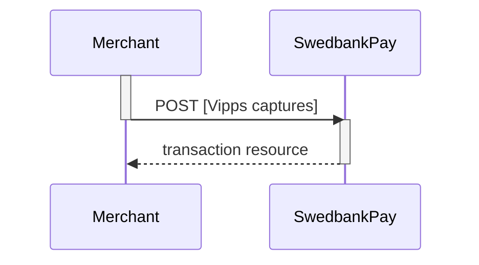

## Capture

The capture transaction is where you ensure that the funds are charged from
the payer. This step usually takes place when the product has exchanged
possession. You must first do a `GET` request on the payment to find the
`create-capture` operation.

### Create capture transaction

To create a `capture` transaction to withdraw money from the payer's Vipps 
account, you need to perform the `create-capture` operation.

{:.code-header}
**Request**

```http
POST /psp/vipps/payments/{{ page.payment_id }}/captures HTTP/1.1
Host: {{ page.api_host }}
Authorization: Bearer <AccessToken>
Content-Type: application/json

{
    "transaction": {
        "amount": 1500,
        "vatAmount": 250,
        "payeeReference": "cpttimestamp",
        "description" : "description for transaction"
    }
}
```

{:.table .table-striped}
|     Required     | Field                    | Type          | Description                                                                                                   |
| :--------------: | :----------------------- | :------------ | :------------------------------------------------------------------------------------------------------------ |
|  | `transaction`            | `object`      | The object representation of the generic [transaction resource][transaction-resource].                        |
|  | └➔&nbsp;`amount`         | `integer`     | Amount Entered in the lowest momentary units of the selected currency. E.g. 10000 100.00 NOK, 5000 50.00 SEK. |
|  | └➔&nbsp;`vatAmount`      | `integer`     | Amount Entered in the lowest momentary units of the selected currency. E.g. 10000 100.00 NOK, 5000 50.00 SEK. |
|  | └➔&nbsp;`description`    | `string`      | A textual description of the capture transaction.                                                             |
|  | └➔&nbsp;`payeeReference` | `string(30*)` |                                |



The `captures` resource lists the capture transactions (one or more) on a
specific payment.

{:.code-header}
**Request**

```http
GET /psp/vipps/vipps/{{ page.payment_id }}/captures HTTP/1.1
Host: {{ page.api_host }}
Authorization: Bearer <AccessToken>
Content-Type: application/json
```



### Capture Sequence

`Capture` can only be done on an authorized transaction. It is possible to do a
partial capture where you only capture a part of the authorized amount. You can
do more captures on the same payment up to the total authorization amount later.



[transaction-resource]: /payment-instruments/vipps/other-features#transactions
