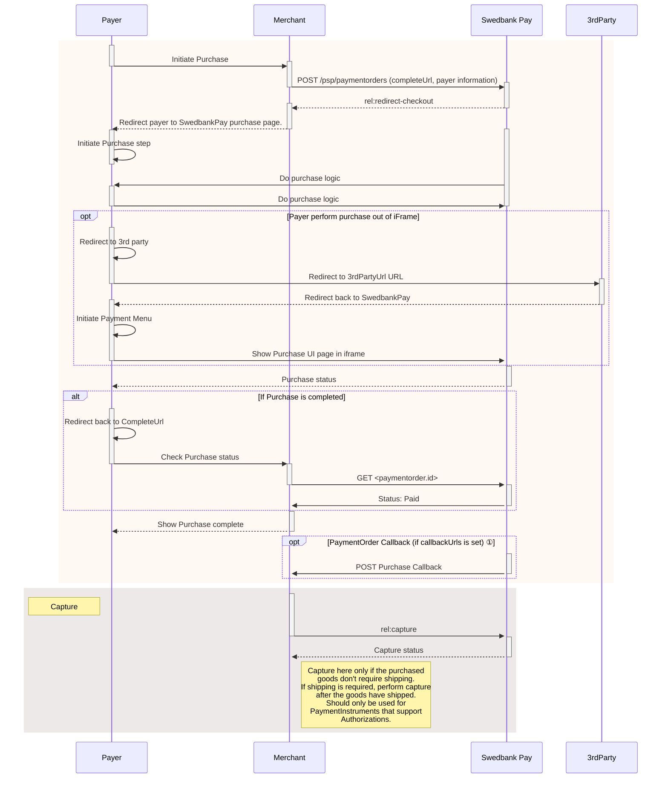

## Step 2: Display Redirect

There are a couple of decisions to be made when you are presenting your payment
UI. You have the choice between a payment menu with all the payment instruments
you want to offer, or to present the `paymentOrder` with a single available
payment instrument using instrument mode.

Regardless of the number of instruments available to the payer, you also need to
choose between `Redirect` and `Seamless View`.

With `Redirect`, the payer is sent to a Swedbank Pay page where we handle the
purchase process. The payer is redirected back to you when the purchase is
completed or if the payer aborts the purchase. The page will be styled by
Swedbank Pay.

With `Seamless View`, the payer stays at your site and you initiate the
Swedbank Pay purchase module in an iframe. The purchase component will be styled
by Swedbank Pay.

Among the operations in the POST `paymentOrder`s response, you will find the
`redirect-checkout`. This is the one you need to display payment menu.

{:.code-view-header}
**Response**

```json
{
    "paymentOrder": {
    "operations": [
        {
            "method": "GET",
            "href": "https://ecom.externalintegration.payex.com/payment/menu/b934d6f84a89a01852eea01190c2bbcc937ba29228ca7502df8592975ee3bb0d?_tc_tid=30f2168171e142d38bcd4af2c3721959",
            "rel": "redirect-checkout",
            "contentType": "text/html"
        },
    ]
}
```

## How Redirect Looks

The redirect link opens the payment menu on a new page with the payer
information displayed above the menu. The payer can select their preferred
payment instrument and pay.

{:.text-center}
![screenshot of the merchant managed implementation redirect payment menu][redirect-payments-only-menu]

Once the payer has completed the purchase, you can perform a `GET` towards the
`paymentOrders` resource to see the purchase state.

You are now ready to capture the funds. Follow the link below to read more about
capture and the other options you have after the purchase.

## Redirect Sequence Diagram





*   ① Read more about [callback][payments-callback] handling in the technical reference.



[redirect-payments-only-menu]: /assets/img/checkout/checkout-v3-redirect-menu.png
[payments-callback]: /checkout-v3/features/core/callback
