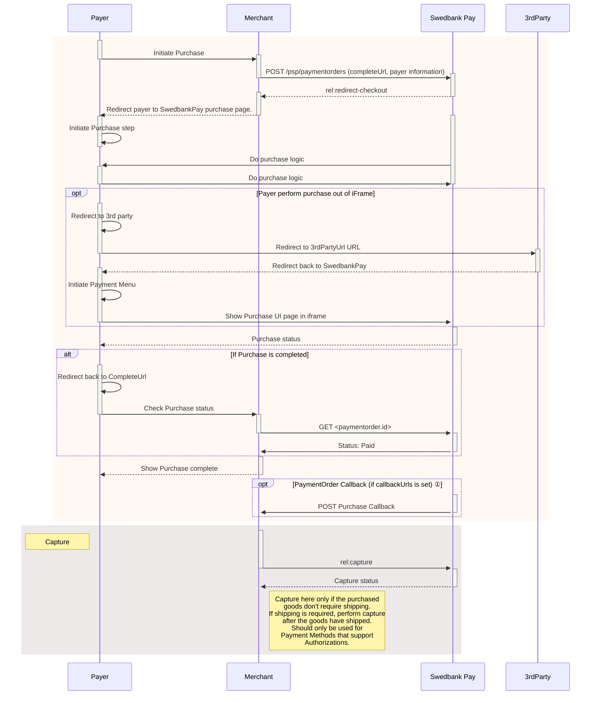

## Display Redirect

Among the operations in the POST `paymentOrder`s response, you will find
`redirect-checkout`. This is the one you need to display the payment UI.

{
    "paymentOrder": {
    "operations": [
        {
            "method": "GET",
            "href": "https://ecom.externalintegration.payex.com/payment/menu/b934d6f84a89a01852eea01190c2bbcc937ba29228ca7502df8592975ee3bb0d?_tc_tid=30f2168171e142d38bcd4af2c3721959",
            "rel": "redirect-checkout",
            "contentType": "text/html"
        },
    ]
}

 

## How Redirect Looks

The redirect link opens the payment menu in a new page where the payer can
select their preferred payment method and pay.

{:.text-center}
![screenshot of the merchant managed implementation redirect payment menu][redirect-payments-only-menu]

Once the payer has completed the purchase, you can perform a `GET` towards the
`paymentOrders` resource to see the purchase state.

You are now ready to capture the funds. Follow the link below to read more about
capture and the other options you have after the purchase.

## Redirect Sequence Diagram



*   ① Read more about [callback][payments-callback] handling in the technical reference.




[redirect-payments-only-menu]: /assets/img/redirect-wcag.png
[payments-callback]: /checkout-v3/features/payment-operations/callback
