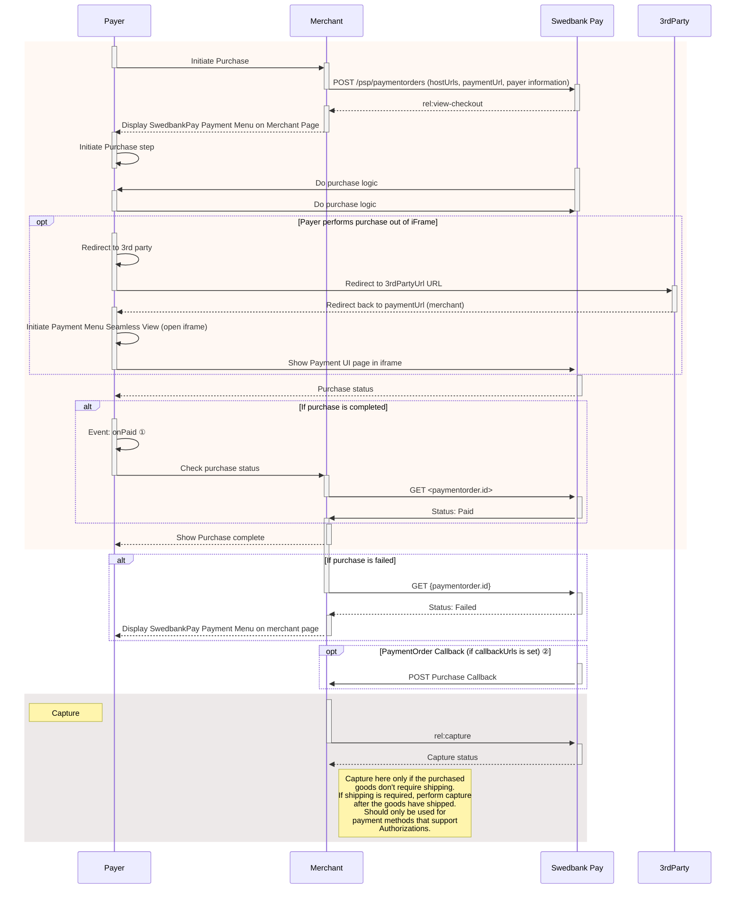

## Display Seamless View

Among the operations in the POST `paymentOrders` response, you will find the
`view-checkout`. This is the one you need to display the purchase module.

{
    "paymentOrder": {
    "operations": [
        {
            "method": "GET",
            "href": "https://ecom.externalintegration.payex.com/payment/core/js/px.payment.client.js?token=dd728a47e3ec7be442c98eafcfd9b0207377ce04c793407eb36d07faa69a32df&culture=sv-SE&_tc_tid=30f2168171e142d38bcd4af2c3721959",
            "rel": "view-checkout",
            "contentType": "application/javascript"
        },
    ]
}

 

## Load The Seamless View

Embed the `href` in a `<script>` element. That script will then load the
Seamless View.

To load the Checkout from the JavaScript URL obtained in the backend API
response, it needs to be set as a script element’s `src` attribute. You can
cause a page reload and do this with static HTML, or you can avoid the page
refresh by invoking the POST to create the payment order through Ajax, and then
create the script element with JavaScript. The HTML code will be unchanged in
this example.

{:.code-view-header}
**JavaScript**

```js
var request = new XMLHttpRequest();
request.addEventListener('load', function () {
    response = JSON.parse(this.responseText);
    var script = document.createElement('script');
    var operation = response.operations.find(function (o) {
        return o.rel === 'view-checkout';
    });
    script.setAttribute('src', operation.href);
    script.onload = function () {
        // When the 'view-checkout' script is loaded, we can initialize the
        // Payment Menu inside 'checkout-container'.
        payex.hostedView.checkout({
            container: {
                checkout: "checkout-container"
            },
            culture: 'nb-No',
        }).open();
    };
    // Append the Checkout script to the <head>
    var head = document.getElementsByTagName('head')[0];
    head.appendChild(script);
});
// Like before, you should replace the address here with
// your own endpoint.
request.open('GET', '<Your-Backend-Endpoint-Here>', true);
request.setRequestHeader('Content-Type', 'application/json; charset=utf-8');
request.send();
```

{:.code-view-header}
**HTML**

```html
<!DOCTYPE html>
  <html>
      <head>
          <title>Swedbank Pay Checkout is Awesome!</title>
      </head>
      <body>
          <div id="checkout-container"></div>
          <!-- Here you can specify your own javascript file -->
          <script src="<Your-JavaScript-File-Here>"></script>
      </body>
  </html>
```

## How Seamless View Looks

The payment UI should appear in the iframe on your page, so the payer can
select their preferred payment method and pay.

{:.text-center}
![screenshot of the enterprise implementation seamless view payment menu][seamless-enterprise-menu]

Once the payer has completed the purchase, you can perform a GET towards the
`paymentOrders` resource to see the purchase state.

## Monitoring The Script URL

With the [PCI-DSS v4][pci] changes taking effect on March 31st 2025, merchants
are responsible for ensuring the integrity of the HTML script used in their
integration, including monitoring what is loaded into or over it. Specifically,
Seamless View merchants must verify that the script URL embedded in their iframe
originates from Swedbank Pay or another trusted domain. It is important to note
that Swedbank Pay’s PCI responsibility is strictly limited to the content within
the payment iframe. For further details, refer to section 4.6.3 in the linked
document.

To ensure compliance, we recommend implementing [Content Security Policy][csp]
rules to monitor and authorize scripts.

Merchants must whitelist the following domains to restrict browser content
retrieval to approved sources. While `https://*.payex.com` and
`https://*.swedbankpay.com` cover most payment methods, digital wallets such as
Apple Pay, Click to Pay, and Google Pay are delivered via Payair. Alongside the
Payair URL, these wallets may also generate URLs from Apple, Google, MasterCard,
and Visa. See the table below for more information.

When it comes to ACS URLs, nothing is loaded from the ACS domain in the
merchant's end. It will either happen within Swedbank Pay's domain or as a
redirect, which will repeal the merchant's CSP.



{:.table .table-striped}
| URL    | Description             |
| :------ | :--------------- |
| https://*.cdn-apple.com | URL needed for Apple Pay.     |
| https://*.google.com | URL needed for Google Pay.     |
| https://*.gstatic.com | Domain used by Google that hosts images, CSS, and javascript code to reduce bandwidth usage online.     |
| https://*.mastercard.com | URL needed for Click to Pay.     |
| https://*.payair.com | URL for the digital wallets Apple Pay, Click to Pay and Google Pay.     |
| https://*.payex.com    | Universal URL for all payment methods except the digital wallets Apple Pay, Click to Pay and Google Pay.     |
| https://*.swedbankpay.com | Universal URL for all payment methods except the digital wallets Apple Pay, Click to Pay and Google Pay.     |
| https://*.visa.com | URL needed for Click to Pay.     |

### Events

When integrating Seamless View we strongly recommend that you implement the
`onPaid` event, which will give you the best setup. Even with this implemented,
you need to check the payment status towards our APIs, as the payer can make
changes in the browser at any time.

You can read more about the different
[Seamless View Events][seamless-view-events] available in the feature section.

You are now ready to capture the funds. Follow the link below to read more about
capture and the other options you have after the purchase.

## Seamless View Sequence Diagram





*   ① See [seamless view events][payments-seamless-view-events] for further information.
*   ② Read more about [callback][payments-callback] handling in the technical reference.




[csp]: https://www.w3.org/TR/CSP2/
[seamless-view-events]: /checkout-v3/features/technical-reference/seamless-view-events
[seamless-enterprise-menu]: /assets/img/wcag-seamless.png
[payments-callback]: /checkout-v3/features/payment-operations/callback
[payments-seamless-view-events]: /checkout-v3/features/technical-reference/seamless-view-events
[pci]: https://www.swedbankpay.se/globalassets/global-documents/risk-and-security/pci-dss-v4-0-saq-a-r2.pdf
