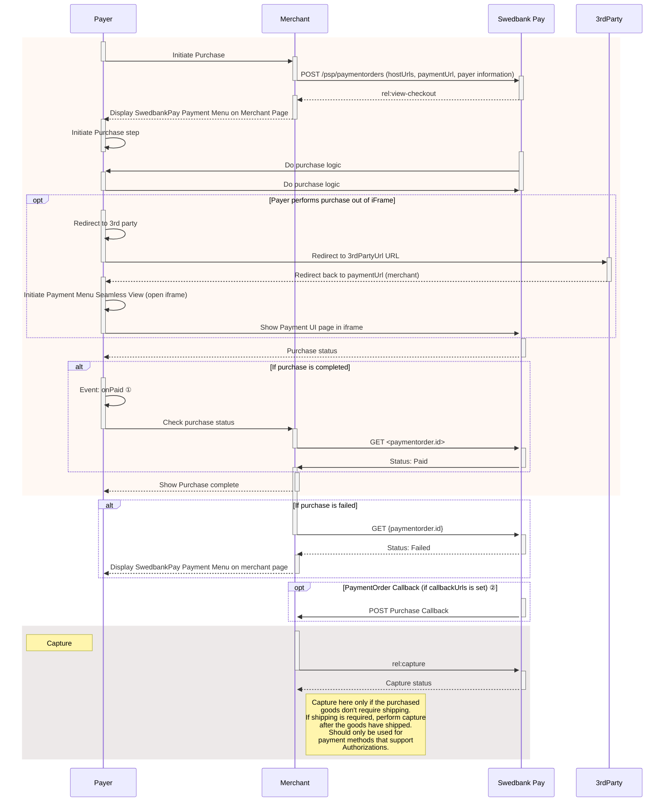

## Display Seamless View

Among the operations in the POST `paymentOrders` response, you will find the
`view-checkout`. This is the one you need to display the purchase module.

{
    "paymentOrder": {
    "operations": [
        {
            "method": "GET",
            "href": "https://ecom.externalintegration.payex.com/checkout/client/1c168a5f971f0cacd00124d1b9ee13e5ecf6e3e74e59cb510035973b38c2c3b3?culture=sv-SE&_tc_tid=123a825592f2002942e5f13eee012b11",
            "rel": "view-checkout",
            "contentType": "application/javascript"
        },
    ]
}

 

## Load The Seamless View

Embed the `href` in a `<script>` element. That script will then load the
Seamless View.

To load the Checkout from the JavaScript URL obtained in the backend API
response, it needs to be set as a script element’s `src` attribute. You can
cause a page reload and do this with static HTML, or you can avoid the page
refresh by invoking the POST to create the payment order through Ajax, and then
create the script element with JavaScript. The HTML code will be unchanged in
this example.

{:.code-view-header}
**JavaScript**

```js
// For this example, we'll be simply adding in the view-checkout link right in
// the script. In your own solution, it's recommended that your backend
// generates the payment and passes the operation to your frontend.
const url = new URL("https://ecom.externalintegration.payex.com/checkout/client/1c168a5f971f0cacd00124d1b9ee13e5ecf6e3e74e59cb510035973b38c2c3b3?culture=sv-SE&_tc_tid=123a825592f2002942e5f13eee012b11");

const script = document.createElement("script");
script.src = url.href;
script.type = "text/javascript";
script.id = "payex-checkout-script";
script.onload = function() {
    payex.hostedView.checkout({
        // The container is the ID of the HTML element you want to place
        // our solution inside of.
        container: {
            checkout: "payex-checkout"
        },
        culture: "sv-SE",
        // This is where you can add your own seamless events.
        // See the section "Events" down below for more information.
        onError: Function = (data) => console.log("onError", data)
    }).open();
}
document.body.insertAdjacentElement("afterbegin", script);
```

{:.code-view-header}
**HTML**

```html
<!DOCTYPE html>
  <html>
      <head>
          <title>Swedbank Pay Checkout is Awesome!</title>
      </head>
      <body>
          <div id="payex-checkout"></div>
          <!-- Here you can specify your own javascript file -->
          <script src="<Your-JavaScript-File-Here>"></script>
      </body>
  </html>
```

## How Seamless View Looks

The payment UI should appear in the iframe on your page, so the payer can
select their preferred payment method and pay.

{:.text-center}
![screenshot of the enterprise implementation seamless view payment menu][seamless-enterprise-menu]

Once the payer has completed the purchase, you can perform a GET towards the
`paymentOrders` resource to see the purchase state.

## Monitoring The Script URL

You must confirm that your site is not susceptible to attacks from scripts that
could affect the merchant’s e-commerce system(s).

### Events

When integrating Seamless View we strongly recommend that you implement the
`onPaid` event, which will give you the best setup. Even with this implemented,
you need to check the payment status towards our APIs, as the payer can make
changes in the browser at any time.

You can read more about the different
[Seamless View Events][seamless-view-events] available in the feature section.

You are now ready to capture the funds. Follow the link below to read more about
capture and the other options you have after the purchase.

## Seamless View Sequence Diagram





*   ① See [seamless view events][payments-seamless-view-events] for further information.
*   ② Read more about [callback][payments-callback] handling in the technical reference.



[seamless-view-events]: /checkout-v3/features/technical-reference/seamless-view-events
[seamless-enterprise-menu]: /assets/img/wcag-seamless.png
[payments-callback]: /checkout-v3/features/payment-operations/callback
[payments-seamless-view-events]: /checkout-v3/features/technical-reference/seamless-view-events
