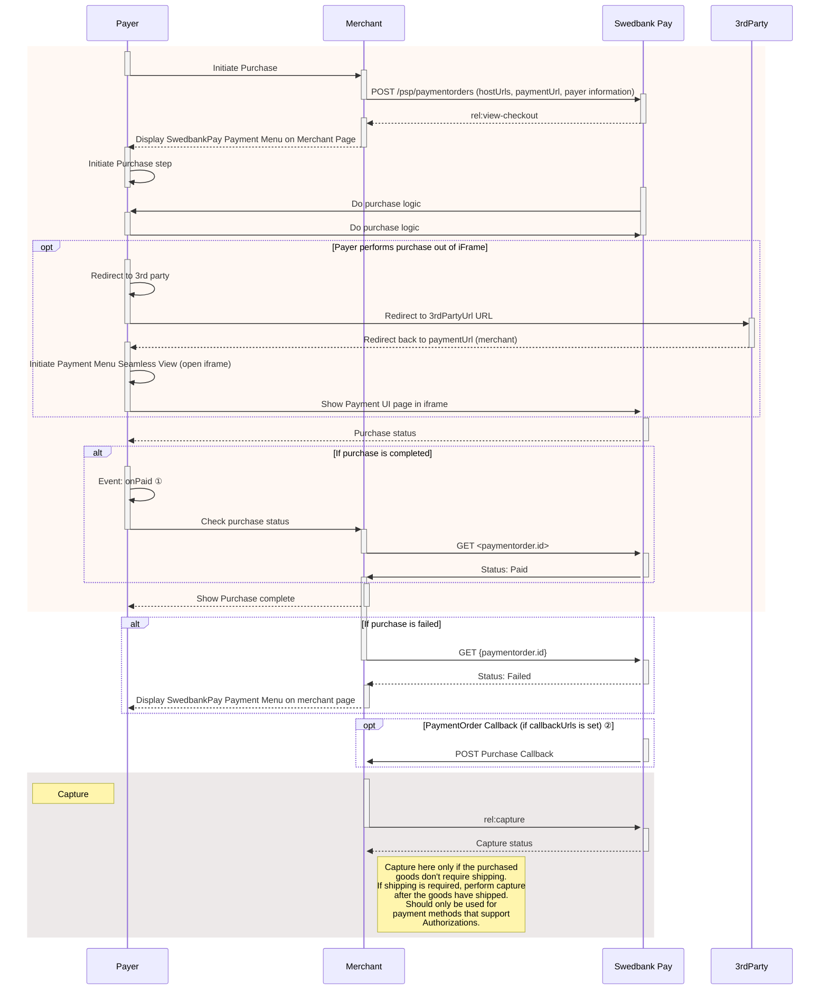

## Display Seamless View

Among the operations in the POST `paymentOrders` response, you will find the
`view-checkout`. This is the one you need to display the purchase module.

{
    "paymentOrder": {},
    "operations": [
        {
            "method": "GET",
            "href": "https://ecom.externalintegration.payex.com/checkout/client/1c168a5f971f0cacd00124d1b9ee13e5ecf6e3e74e59cb510035973b38c2c3b3?culture=sv-SE&_tc_tid=123a825592f2002942e5f13eee012b11",
            "rel": "view-checkout",
            "contentType": "application/javascript"
        },
    ]
}

 

## Load The Seamless View

To display the UI, we need to take the `href` from the `POST` request and add
it to a `script` element on the webpage. Once the script has loaded in, we can
then use the `payex.hostedView.checkout().open()` function on the clientscript
to show the menu.

There are a few parameters we can set to further customize the menu itself,
which are shown in the example below. This includes the place we want to
open up the menu (container), the language we want the menu to
display (culture), and any events we want to override.

{:.code-view-header}
**JavaScript**

```js
// For this example, we'll be simply adding in the view-checkout link right in
// the script. In your own solution, it's recommended that your backend
// generates the payment and passes the operation to your frontend.
const url = new URL("https://ecom.externalintegration.payex.com/checkout/client/1c168a5f971f0cacd00124d1b9ee13e5ecf6e3e74e59cb510035973b38c2c3b3?culture=sv-SE&_tc_tid=123a825592f2002942e5f13eee012b11");

const script = document.createElement("script");
script.src = url.href;
script.type = "text/javascript";
script.id = "payex-checkout-script";
script.onload = function() {
    payex.hostedView.checkout({
        // The container is the ID of the HTML element you want to place
        // our solution inside of.
        container: {
            checkout: "payex-checkout"
        },
        culture: "sv-SE",
        // This is where you can add your own seamless events.
        // See the section "Events" down below for more information.
        onError: Function = (data) => console.log("onError", data)
    }).open();
}
document.body.insertAdjacentElement("afterbegin", script);
```

{:.code-view-header}
**HTML**

```html
<!DOCTYPE html>
  <html>
      <head>
          <title>Swedbank Pay Checkout is Awesome!</title>
      </head>
      <body>
          <div id="payex-checkout"></div>
          <!-- Here you can specify your own javascript file -->
          <script src="<Your-JavaScript-File-Here>"></script>
      </body>
  </html>
```

## How Seamless View Looks

After opening up the client script, the menu itself will load inside of an
iframe in the container you provided us earlier. From here, the payer can select
their preferred payment method and pay.

{:.text-center}
![screenshot of the enterprise implementation seamless view payment menu][seamless-enterprise-menu]

Once the payer completes their purchase, you can then perform a GET towards the
`paymentOrders` resource to check the purchase state.

## Monitoring The Script URL

You must confirm that your site is not susceptible to attacks from scripts that
could affect the merchant’s e-commerce system(s).

## Events

When you integrate using the Seamless View implementation, you can override one
or more of our Seamless View events. This ranges from changing what happens
when the payer completes or cancels their payment, to when we resize the
payment menu itself. While optional, this gives you more flexibility and
control over the payment flow, during and after the payer completes and/or
cancels their payment attempt.

Events like `onPaid` allows you avoid redirecting to the `completeUrl` once
the payer completes or cancels the payment. This allows you to check the
payment, or just close the payment window and display a receipt on the same
page. Other events like `onPaymentAttemptFailed` can allow you to keep tabs on
the amount of failed attempts, for example if you want to show a warning or
a message if the payer is unable to complete a payment after several tries.

For the full list over the different events you can override, check out the
[Seamless View Events][seamless-view-events] page, also available in the
feature section.

## Seamless View Sequence Diagram





*   ① See [seamless view events][payments-seamless-view-events] for further information.
*   ② Read more about [callback][payments-callback] handling in the technical reference.

## Next Steps

Once the payer has finished the payment, you're now ready to capture the funds.
Follow the link below for more details on how to perform the capture and for
more details on the other options you have, following a purchase.



[seamless-view-events]: /checkout-v3/features/technical-reference/seamless-view-events
[seamless-enterprise-menu]: /assets/img/wcag-seamless.png
[payments-callback]: /checkout-v3/features/payment-operations/callback
[payments-seamless-view-events]: /checkout-v3/features/technical-reference/seamless-view-events
