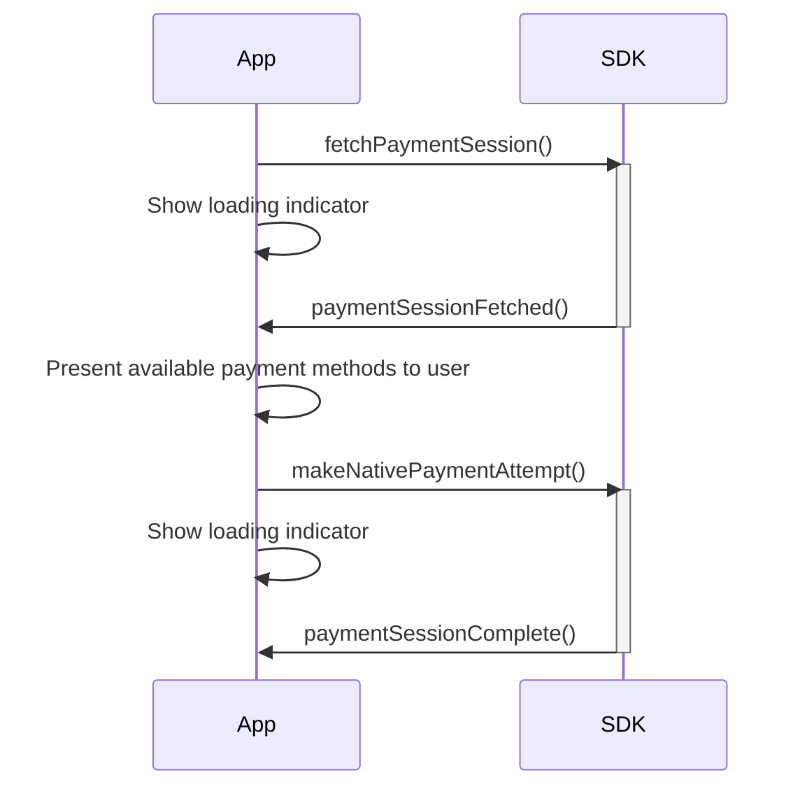
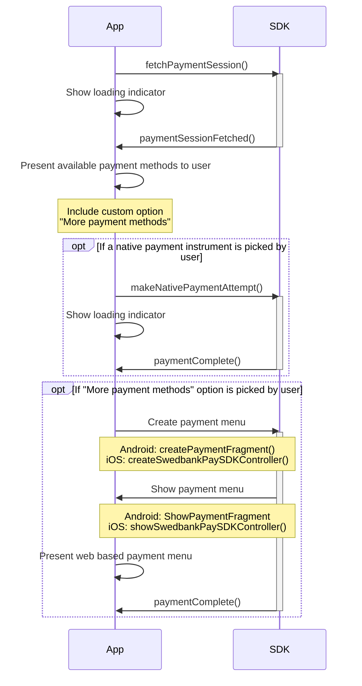
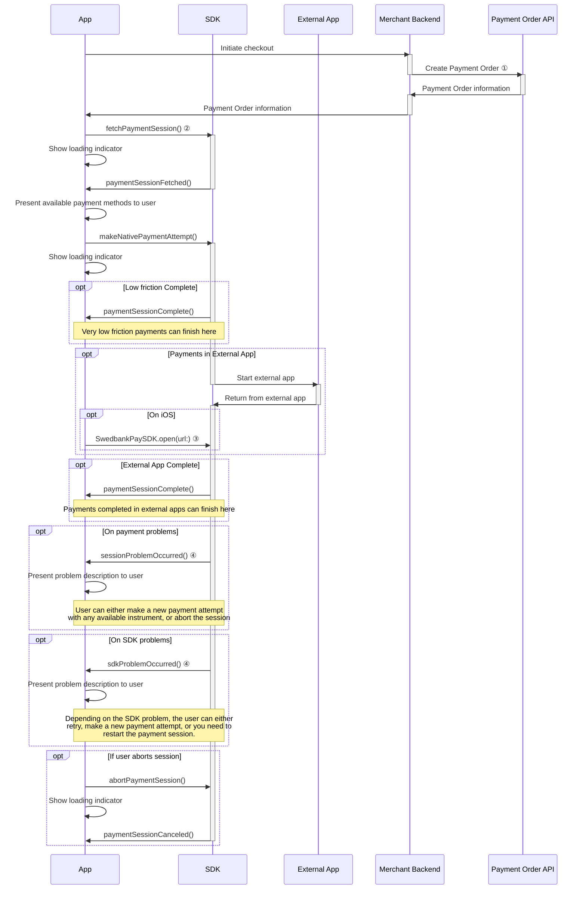
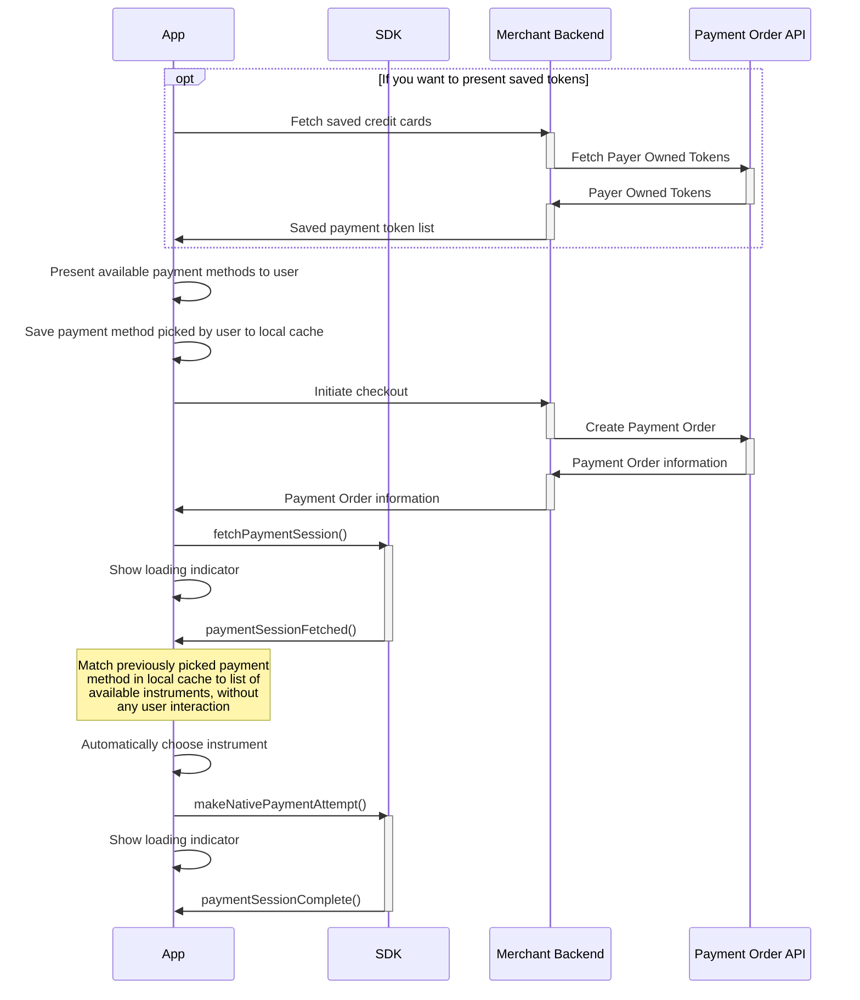

In this chapter we demonstrate how the Native Payments feature can be used to
create a custom checkout experience for your customers, directly integrated into
your own app UI. The Native Payments feature does not provide any interface
components, but instead gives you the full ability to control the look and feel
of your checkout, seamless and quick payments.

Currently, the following payment methods are supported by the Native Payments
feature:

*   Swish
*   Credit cards
*   Apple Pay
*   Google Pay

## Usage

The Native Payments feature consists of a set of SDK methods and callbacks that
are used to control the flow of a payment session, including making multiple
payment attempts in case attempts are failed or canceled. The Swedbank Pay
Mobile SDKs automatically handle the routines for communicating with the payment
session APIs, querying and providing payment methods compatible with the mobile
device, launches external apps (such as Swish local start) as well as providing
detailed event logging to ease troubleshooting.

In a nutshell, the payment flow for Native Payments is very simple. A best case
happy flow would look like this:



We will expand on this further with more
[detailed usage flows][detailed-usage-flows] below.

## The Session URL

For native payments, we need the `href` for the `view-paymentsession` operation
of a payment order. If you have already implemented web view based payments, you
will find the Session URL next to the previously used `view-checkout` operation
`href` of a payment order.

```json
{
  "paymentOrder": { ... }
  "operations": [
    {
      "method": "GET",
      "href": "{{ page.front_end_url }}/psp/paymentsessions/{{ page.payment_token }}?_tc_tid=30f2168171e142d38bcd4af2c3721959",
      "rel": "view-paymentsession",
      "contentType": "application/javascript"
    },
    ...
  ]
}
```

The `href` from the operation is used in the Android and iOS implementations
below.

## Android

For this documentation, we're assuming a basic setup is done for the Android
SDK. You can achieve this by following the steps
[Android Setup][android-bare-minimum-setup] and
[Android SDK Payment Session][android-bare-minimum-payment-session] of the Bare
Minimum Implementation chapter.

You need to listen to some state updates from the Native Payment session,
updating your UI and informing the user according to the events. You do this
by observing the `PaymentSession.paymentSessionState` LiveData. In the
following example, we implement the five base payment states. Note that the
actions to perform in these callbacks are completely dependent on the checkout
user experience of your application.

```kotlin
PaymentSession.paymentSessionState.observe(viewLifecycleOwner) { paymentState ->
    when (paymentState) {
        is PaymentSessionState.PaymentSessionFetched -> {
            Log.d("SwedbankPay", "Payment Session Fetched")
        }

        is PaymentSessionState.PaymentSessionComplete -> {
            Log.d("SwedbankPay", "Payment Session Complete")
        }

        is PaymentSessionState.PaymentSessionCanceled -> {
            Log.d("SwedbankPay", "Payment Session Canceled")
        }

        is PaymentSessionState.SessionProblemOccurred -> {
            Log.d("SwedbankPay", "Payment Session Problem Occurred")
        }

        is PaymentSessionState.SdkProblemOccurred -> {
            Log.d("SwedbankPay", "SDK Problem Occurred")
        }

        else -> {}
    }
}
```

The main component for Native Payments in the Android SDK is the class
`PaymentSession`, a helper class that makes it possible to start
and interact with a native payment session. To start a native payment session,
simply create a `PaymentSession` and call the `fetchPaymentSession()` method.
Provide the `view-paymentsession` operation `href` in the `sessionURL`
parameter.

```kotlin
val paymentSession = PaymentSession()

paymentSession.fetchPaymentSession(sessionURL = "{{ page.front_end_url }}/psp/paymentsessions/{{ page.payment_token }}?_tc_tid=30f2168171e142d38bcd4af2c3721959")
```

This will fetch the session information and initiate the Native Payment routine.
It is advisable to present a loading indicator at this stage. As a next step,
you can expect the `PaymentSessionFetched` state to be called with the
payment methods available to use.

```kotlin
PaymentSession.paymentSessionState.observe(viewLifecycleOwner) { paymentState ->
    when (paymentState) {
        is PaymentSessionState.PaymentSessionFetched -> {
            // TODO: Present `paymentState.availableInstruments` list to user
        }

        else -> {}
    }
}
```

After receiving the available payment methods and presenting these to the user
in your own app UI, the user is able to pick the method to use. You then call
`makePaymentAttempt()` and provide a `PaymentAttemptInstrument` configured for
the users choice. In the following example, we assume the user wish to do a
local Swish payment on the same device (for which you need to provide the
application `context`).

```kotlin
paymentSession.makeNativePaymentAttempt(instrument = PaymentAttemptInstrument.Swish(localStartContext = context))
```

You should once again show indication of loading in the app. Calling the method
with these parameters will start a Swish payment attempt and automatically
launch the Swish app. After the user is sent back to your app, you will receive
`PaymentComplete` or `SessionProblemOccurred` depending on the
result of the payment attempt.

```kotlin
PaymentSession.paymentSessionState.observe(viewLifecycleOwner) { paymentState ->
    when (paymentState) {
        is PaymentSessionState.PaymentSessionComplete -> {
            // TODO: Continue checkout flow
        }

        is PaymentSessionState.SessionProblemOccurred -> {
            // TODO: Inform user of problem details for `paymentState.problem.type`, give option to make new payment attempt or cancel
        }

        else -> {}
    }
}
```

If there was a problem, you should inform the user and give them the ability to
either make a new attempt (with any available payment method) or to abort the
whole payment session.

```kotlin
paymentSession.abortPaymentSession()
```

```kotlin
PaymentSession.paymentSessionStatenativePaymentState.observe(viewLifecycleOwner) { paymentState ->
    when (paymentState) {
        is PaymentSessionState.PaymentSessionCanceled -> {
            // TODO: Return to cart
        }

        else -> {}
    }
}
```

## Android Payment methods

The `AvailableInstrumentsFetched` state contains a list of `AvailableInstrument`
on the `availableInstruments` parameter. This list of payment methods that
can be used for payments. These instrument object also contain saved payment
method data. This could be saved credit cards or known MSISDN for the user.

## Swish

The Swish payment method is represented as an available instrument through
`AvailableInstrument.Swish(prefills)`. The `prefills` contains `SwishPrefill`
that can give you the known MSISDN for the user.

To make a Swish payment attempt, you use `PaymentAttemptInstrument.Swish` and
either provide a `context` as `localStartContext` to start Swish locally on the
users device, or set to an MSISDN as `msisdn` for the Swish payment to be
started on another device.

```kotlin
// Local start of the Swish app on the users device
paymentSession.makeNativePaymentAttempt(instrument = PaymentAttemptInstrument.Swish(localStartContext = context))

// Start on another device using a specific MSISDN
paymentSession.makeNativePaymentAttempt(instrument = PaymentAttemptInstrument.Swish(msisdn =  "+46739000001"))
```

If you are starting the payment on another device, you need to specify the
MSISDN starting with `+` and include the country code. The string must not
contain any whitespace. If you choose to let your users specify their MSISDN
without country code (and instead have a leading zero), it's up to you to modify
the MSISDN string before making the native Swish payment attempt.

When requesting local start, the SDK will automatically launch the Swish app on
the local device. If an error occurred when starting the app, your app will be
informed by the problem by receiving the `SessionProblemOccurred` payment state,
where the `problem` parameter will have the `type` value
`"https://api.payex.com/psp/errordetail/paymentorders/clientapplaunchfailed"`.

## Saved Credit Cards

If you have created your payment order as
[payer aware][payer-aware-payment-menu] by providing a `payerReference` value,
the payment session might contain previously saved payment cards belonging to
the user. The saved credit cards payment method is represented as an available
instrument through `AvailableInstrument.CreditCard(prefills)`.
The `prefills` contains `CreditCardPrefill` that represents the users
saved cards. You should present these saved cards to the user, so that they can
pick what card to pay with.

To make a saved credit card payment, you use
`PaymentAttemptInstrument.CreditCard` and provide `prefill` for the credit
card picked by the user.

```kotlin
// Start saved credit card paymnent
paymentSession.makeNativePaymentAttempt(PaymentAttemptInstrument.CreditCard(prefill = pickedCard, localStartContext = context))
```

After starting a saved credit card payment, there is a possibility that the user
will have to identify themselves in a SCA (Strong Customer Authentication) 3D
Secure process. Since 3D Secure is partly handled by the card issuers, and the
actual UI and UX of the process varies, the user completes the process in a web
view provided by the SDK.

Your app will be informed by the SCA process by receiving the
`Show3DSecureFragment` payment state. In this example we will be
using Appcompat `FragmentManager` via `supportFragmentManager` to present the
3D Secure web view fragment, meaning this code is implemented in an `Activity`
of the app.

```kotlin
PaymentSession.paymentSessionState.observe(viewLifecycleOwner) { paymentState ->
    when (paymentState) {
        is PaymentSessionState.Show3DSecureFragment -> {
            val containerViewId = R.id.sdk_3d_secure_fragment // Specify a container ID for the fragment
            supportFragmentManager.beginTransaction()
                .add(containerViewId, paymentState.fragment, "3DSecureFragment")
                .commit()
            Log.d("SwedbankPay", "Show 3D Secure Fragment")
        }

        else -> {}
    }
}
```

When the SCA process has completed, you will receive the
`Dismiss3DSecureFragment` payment state, informing your app that
the view can be closed. In the following example, we remove the web view
fragment from the screen after the SCA process is finalized (again, in this
example we’re accessing the Appcompat FragmentManager via
supportFragmentManager, so we're removing the payment view in a fragment
transaction to close it.

```kotlin
PaymentSession.paymentSessionState.observe(viewLifecycleOwner) { paymentState ->
    when (paymentState) {
        is PaymentSessionState.Dismiss3DSecureFragment -> {
            val paymentFragment = supportFragmentManager.findFragmentByTag("3DSecureFragment")
            if (paymentFragment != null) {
                supportFragmentManager.beginTransaction()
                    .remove(paymentFragment)
                    .commit()
            }
            Log.d("SwedbankPay", "Dismiss 3D Secure Fragment")
        }

        else -> {}
    }
}
```

We also need to be on the lookout for problems loading the 3D Secure view (for
example due to poor internet connectivity). If the web view fails to load the 3D
Secure content, you will receive the `SdkProblemOccurred` payment state where
the `problem` parameter will be
`PaymentSessionProblem.PaymentSession3DSecureFragmentLoadFailed`. The `retry`
parameter is a callback function that you can call
to retry the  underlying web view request. You should inform the user of the
error and give the option to either abort the payment session or retry the
request.

```kotlin
PaymentSession.paymentSessionState.observe(viewLifecycleOwner) { paymentState ->
    when (paymentState) {
        is PaymentSessionState.SdkProblemOccurred -> {
            when (paymentState.problem) {
                is PaymentSessionProblem.PaymentSession3DSecureFragmentLoadFailed -> {
                   val error = (paymentState.problem as PaymentSessionProblem.PaymentSession3DSecureFragmentLoadFailed).error
                   val retry = (paymentState.problem as PaymentSessionProblem.PaymentSession3DSecureFragmentLoadFailed).retry

                   // TODO: Inform user of an error loading the 3D Secure view and provide the option to retry or cancel
                   Log.d("SwedbankPay", "3D Secure Fragment Load Failed")
                }

                else -> {}
            }
        }

        else -> {}
    }
}
```

## New Credit Card

Apart from saved credit cards, you can also give the user the option to enter
new credit card details to perform the payment. There are several scenarios
where this is relevant:

*   When you want to give a user (with or without existing saved credit cards)
    the option to perform the payment with a "New Credit Card", and give them
    the option to save the new card for future payments.
*   For [verify][verify-payments] payment orders.
*   If you haven't created your payment order as
    [payer aware][payer-aware-payment-menu] and want to offer credit card
    "guest" payments, without the option to save the card for future payments.

The new credit card payment method is represented as an available instrument
through `AvailableInstrument.NewCreditCard`, and to make a new
credit card payment, you use `PaymentAttemptInstrument.NewCreditCard`.
You also provide `enabledPaymentDetailsConsentCheckbox` parameter controls if
the consent checkbox for storing the card for future payments is shown or not.
If you specify `false` in this parameter, it is up to you to collect consent
from the user directly in your app. Hiding the consent checkbox places the
responsibility on you to specify if the payment should generate a card payment
token or not, you can read more about
[Store details and toggle consent checkbox][one-click-consent-checkbox].

```kotlin
// Start new credit card paymnent, showing the consent checkbox
paymentSession.makeNativePaymentAttempt(PaymentAttemptInstrument.NewCreditCard(enabledPaymentDetailsConsentCheckbox = true))

// Start new credit card paymnent, hiding the consent checkbox and using the Payment Order `generatePaymentToken` parameter instead
paymentSession.makeNativePaymentAttempt(PaymentAttemptInstrument.NewCreditCard(enabledPaymentDetailsConsentCheckbox = false))
```

To simplify PCI-DSS compliance, the collection of credit card details is
managed completely by the Swedbank Pay Mobile SDK. At this time, this is done
with a web view, where the same UI as the regular web based payment menu is
used. After making a payment attempt with `AvailableInstrument.NewCreditCard`,
you will receive the `ShowPaymentFragment` state, and you are responsible for
presenting it to the user. In this example we will be using Appcompat
`FragmentManager` via `supportFragmentManager` to present the payment fragment,
meaning this code is implemented in an `Activity` of the app. Don't forget to
dismiss the payment fragment when the payment ends.

```kotlin
PaymentSession.paymentSessionState.observe(viewLifecycleOwner) { paymentState ->
    when (paymentState) {
        is PaymentSessionState.ShowPaymentFragment -> {
            Log.d("SwedbankPay", "Show Payment Fragment")

            val containerViewId = R.id.sdk_payment_fragment // Specify a container ID for the fragment
            supportFragmentManager.beginTransaction()
                .add(containerViewId, paymentState.fragment, "PaymentFragment")
                .commit()
        }

        is PaymentSessionState.PaymentSessionComplete,
        is PaymentSessionState.PaymentSessionCanceled -> {
            Log.d("SwedbankPay", "Payment Session Complete / Canceled")

            val paymentFragment = supportFragmentManager.findFragmentByTag("PaymentFragment")
            if (paymentFragment != null) {
                supportFragmentManager.beginTransaction()
                    .remove(paymentFragment)
                    .commit()
            }
        }

        else -> {}
    }
}
```

Note that if a SCA 3D Secure process is required, it will be completed directly
inside the `PaymentFragment`. So the 3D Secure fragment states will not be sent,
as they are when making payment attempts with saved credit cards.

## Google Pay

The Google Pay payment method is represented as an available instrument through
`AvailableInstrument.GooglePay`.

Before making Google Pay payments, you need to enable the Android Wallet API in
your `AndroidManifest.xml` file.

```xml
<meta-data
    android:name="com.google.android.gms.wallet.api.enabled"
    android:value="true" />
````

To make an Google Pay payment attempt, you use
`PaymentAttemptInstrument.GooglePay`. You need to specify `activity` as a
parameter, that represents the activity where the Google Pay payment overlay UI
should be shown.

```kotlin
// Start Google Pay payment
paymentSession.makeNativePaymentAttempt(instrument = PaymentAttemptInstrument.GooglePay(activity = activity))
```

The Google Pay interface will automatically be shown over your application UI,
where the user can choose credit card.

One important note is that after starting a Google Pay payment, there is a
possibility that the user will have to identify themselves in a SCA (Strong
Customer Authentication) 3D Secure process. This means that you have to be ready
to possibly show a web view fragment containing the 3D Secure process. For SCA
on Google Pay payments, the process in the SDK is identical to when paying with
[Saved Credit Cards][android-saved-credit-cards].

For Google Pay payments in test environments, you need to follow the
[Google Test Card suite guidelines][google-pay-test]. This involves
adding the email of your Google Account that is logged in on your Android test
device to the [test card suite group][google-pay-test-group] and using one of
the Mock test cards that are automatically available when performing payments.
When testing Google Pay, you must use a the Mock test cards. Production Google
Pay cards will not work and you should never use production credit cards in
testing environments.

## iOS

For this documentation, we're assuming a basic setup is done for the iOS SDK.
You can achieve this by following the steps [iOS Setup][ios-bare-minimum-setup]
and [iOS SDK Payment Session][ios-bare-minimum-payment-session] of the Bare
Minimum Implementation chapter.

You need to listen to some state updates from the Payment session, updating your
UI and informing the user according to the events. You do this by implementing
the `SwedbankPaySDKPaymentSessionDelegate` protocol. In the following example,
we implement the delegate protocol and the eight required methods. Note that the
actions to perform in these callbacks are completely dependent on the checkout
user experience of your application.

```swift
func paymentSessionFetched(availableInstruments: [SwedbankPaySDK.AvailableInstrument]) {
    print("Available Instruments Fetched")
}

func sessionProblemOccurred(problem: SwedbankPaySDK.ProblemDetails) {
    print("Session Problem Occurred")
}

func sdkProblemOccurred(problem: SwedbankPaySDK.PaymentSessionProblem) {
    print("SDK Problem Occurred")
}

func paymentSessionComplete() {
    print("Payment Session Complete")
}

func paymentSessionCanceled() {
    print("Payment Session Canceled")
}

func showSwedbankPaySDKController(viewController: SwedbankPaySDKController) {
    print("Show Swedbank Pay SDK Controller")
}

func show3DSecureViewController(viewController: UIViewController) {
    print("Show 3D Secure View Controller")
}

func dismiss3DSecureViewController() {
    print("Dismiss 3D Secure View Controller")
}
```

The main component for Native Payments in the iOS SDK is the class
`SwedbankPaySDK.SwedbankPayPaymentSession`, a helper class that makes it
possible to start and interact with a native payment session. To start a native
payment session, simply create a `SwedbankPaySDK.SwedbankPayPaymentSession`, set
a `delegate` and call the `fetchPaymentSession(sessionURL:)` method. Provide the
`view-paymentsession` operation `href` in the `sessionURL` parameter.

```swift
let paymentSession = SwedbankPaySDK.SwedbankPayPaymentSession()

paymentSession.delegate = self

paymentSession.fetchPaymentSession(sessionURL: URL(string: "{{ page.front_end_url }}/psp/paymentsessions/{{ page.payment_token }}?_tc_tid=30f2168171e142d38bcd4af2c3721959")!)
```

This will fetch the session information and initiate the Native Payment routine.
It is advisable to present a loading indicator at this stage. As a next step,
you can expect the `paymentSessionFetched(_:)` delegate method to be
called with the payment methods available to use.

```swift
func paymentSessionFetched(availableInstruments: [SwedbankPaySDK.AvailableInstrument]) {
    // TODO: Present `availableInstruments` array to user
}
```

After receiving the available payment methods and presenting these to the user
in your own app UI, the user is able to pick the method to use. You then call
`makeNativePaymentAttempt(instrument:)` and provide a
`SwedbankPaySDK.PaymentAttemptInstrument` configured for the users choice. In
the following example, we assume the user wish to do a local Swish payment on
the same device.

```swift
paymentSession.makeNativePaymentAttempt(instrument: .swish(msisdn: nil))
```

You should once again show indication of loading in the app. Calling the method
with these parameters will start a Swish payment attempt and automatically
launch the Swish app. After the user is sent back to your app, you will receive
`paymentComplete()` or `sessionProblemOccurred(problem:)` depending on the
result of the payment attempt.

```swift
func paymentSessionComplete() {
    // TODO: Continue checkout flow
}

func sessionProblemOccurred(problem: SwedbankPaySDK.ProblemDetails) {
    // TODO: Inform user of problem details for `problem`, give option to make new payment attempt or cancel
}
```

If there was a problem, you should inform the user and give them the ability to
either make a new attempt (with any available payment method) or to abort the
whole payment session.

```swift
paymentSession.abortPaymentSession()
```

```swift
func paymentSessionCanceled() {
    // TODO: Return to cart
}
```

## iOS Payment methods

The `availableInstruments` array provided in the
`paymentSessionFetched(_:)` delegate method is an array of
`SwedbankPaySDK.AvailableInstrument` with information of payment methods that
can be used for payments. These instrument object also contain saved payment
method data. This could be saved credit cards or known MSISDN for the user.

## Swish

The Swish payment method is represented as an available instrument through
`SwedbankPaySDK.AvailableInstrument.swish(prefills:)`. The `prefills` contains
`SwishMethodPrefillModel` that can give you the known MSISDN for the user.

To make a Swish payment attempt, you use
`SwedbankPaySDK.PaymentAttemptInstrument.swish(msisdn:)` where `msisdn` can be
set to `nil` to start the Swish app locally on the users device, or set to an
MSISDN for the Swish payment to be started on another device.

```swift
// Start Swish payment with local start of the Swish app on the users device
paymentSession.makeNativePaymentAttempt(instrument: .swish(msisdn: nil))

// Start Swish payment with the Swish app on another device using a specific MSISDN
paymentSession.makeNativePaymentAttempt(instrument: .swish(msisdn: "+46739000001"))
```

If you are starting the payment on another device, you need to specify the
MSISDN starting with `+` and include the country code. The string must not
contain any whitespace. If you choose to let your users specify their MSISDN
without country code (and instead have a leading zero), it's up to you to modify
the MSISDN string before making the native Swish payment attempt.

When requesting local start, the SDK will automatically launch the Swish app on
the local device. If an error occurred when starting the app, the SDK will call
the `sessionProblemOccurred(problem:)` delegate method, and provide a problem
with type `type` parameter set to
`"https://api.payex.com/psp/errordetail/paymentorders/clientapplaunchfailed"`.

## Saved Credit Cards

If you have created your payment order as
[payer aware][payer-aware-payment-menu] by providing a `payerReference` value,
the payment session might contain previously saved payment cards belonging to
the user. The saved credit cards payment method is represented as an available
instrument through `SwedbankPaySDK.AvailableInstrument.creditCard(prefills:)`.
The `prefills` contains `CreditCardMethodPrefillModel` that represents the users
saved cards. You should present these saved cards to the user, so that they can
pick what card to pay with.

To make a saved credit card payment, you use
`SwedbankPaySDK.PaymentAttemptInstrument.creditCard(prefill:)` where `prefill`
must be set to the credit card picked by the user.

```swift
// Start saved credit card paymnent
paymentSession.makeNativePaymentAttempt(instrument: .creditCard(prefill: pickedCard))
```

After starting a saved credit card payment, there is a possibility that the user
will have to identify themselves in a SCA (Strong Customer Authentication) 3D
Secure process. Since 3D Secure is partly handled by the card issuers, and the
actual UI and UX of the process varies, the user completes the process in a web
view provided by the SDK.

Your app will be informed by the SCA process via the
`show3DSecureViewController(viewController:)` delegate method. In the example
code below, we simply present the 3D Secure web view controller modally, but you
can choose freely how to present the view.

```swift
func show3DSecureViewController(viewController: UIViewController) {
    present(viewController, animated: true)
    print("Show 3D Secure View Controller")
}
```

When the SCA process has completed, the `dismiss3DSecureViewController()`
delegate method is called, informing your app that the view can be closed. Since
we presented the view controller modally in this example, we can simply dismiss
it.

```swift
func dismiss3DSecureViewController() {
    dismiss(animated: true)
    print("Dismiss 3D Secure View Controller")
}
```

We also need to be on the lookout for problems loading the 3D Secure view (for
example due to poor internet connectivity). If the web view fails to load the 3D
Secure content, the `sdkProblemOccurred(problem:)` delegate method will be
called. In this case, the `problem` parameter will be of the type
`PaymentSession3DSecureFragmentLoadFailed`. The problem instance will in turn
contain an `error` parameter that indicates the underlying loading error. There
is also a `retry` parameter, in the form of a closure that you can call to retry
the underlying web view request. You should inform the user of the error and
give the option to either abort the payment session or retry the request.

```swift
func sdkProblemOccurred(problem: SwedbankPaySDK.PaymentSessionProblem) {
    if case .paymentSession3DSecureViewControllerLoadFailed(let error, let retry) = problem {
        // TODO: Inform user of an error loading the 3D Secure view and provide the option to retry or cancel
        print("3D Secure View Controller Load Failed")
    }
}
```

## New Credit Card

Apart from saved credit cards, you can also give the user the option to enter
new credit card details to perform the payment. There are several scenarios
where this is relevant:

*   When you want to give a user (with or without existing saved credit cards)
    the option to perform the payment with a "New Credit Card", and give them
    the option to save the new card for future payments.
*   For [verify][verify-payments] payment orders.
*   If you haven't created your payment order as
    [payer aware][payer-aware-payment-menu] and want to offer credit card
    "guest" payments, without the option to save the card for future payments.

The new credit card payment method is represented as an available instrument
through `SwedbankPaySDK.AvailableInstrument.newCreditCard()`, and to make a new
credit card payment, you use
`SwedbankPaySDK.PaymentAttemptInstrument.newCreditCard(enabledPaymentDetailsConsentCheckbox:)`.
The `enabledPaymentDetailsConsentCheckbox` parameter controls if the consent
checkbox for storing the card for future payments is shown or not. If you
specify `false` in this parameter, it is up to you to collect consent from the
user directly in your app. Hiding the consent checkbox places the responsibility
on you to specify if the payment should generate a card payment token or not,
you can read more about
[Store details and toggle consent checkbox][one-click-consent-checkbox].

```swift
// Start new credit card paymnent, showing the consent checkbox
paymentSession.makeNativePaymentAttempt(instrument: .newCreditCard(enabledPaymentDetailsConsentCheckbox: true))

// Start new credit card paymnent, hiding the consent checkbox and using the Payment Order `generatePaymentToken` parameter instead
paymentSession.makeNativePaymentAttempt(instrument: .newCreditCard(enabledPaymentDetailsConsentCheckbox: false))
```

To simplify PCI-DSS compliance, the collection of credit card details is
managed completely by the Swedbank Pay Mobile SDK. At this time, this is done
with a web view, where the same UI as the regular web based payment menu is
used. After making a payment attempt with
`SwedbankPaySDK.PaymentAttemptInstrument.newCreditCard()`, you will receive the
`showSwedbankPaySDKController(viewController:)` delegate method, and you are
responsible for presenting it to the user. In this example, we'll simply present
the view controller modally. Don't forget to dismiss it when the payment ends.

```swift
func showSwedbankPaySDKController(viewController: SwedbankPaySDKController) {
    present(viewController, animated: true)
    print("Show Swedbank Pay SDK Controller")
}

func paymentSessionComplete() {
    dismiss(animated: true)
    print("Payment Session Complete")
}

func paymentSessionCanceled() {
    dismiss(animated: true)
    print("Payment Session Canceled")
}
```

Note that if a SCA 3D Secure process is required, it will be completed directly
inside the `SwedbankPaySDKController`. So the 3D Secure view controller delegate
methods will not be called, as they are when making payment attempts with saved
credit cards.

## Apple Pay

The Apple Pay payment method is represented as an available instrument through
`SwedbankPaySDK.AvailableInstrument.applePay`.

Before making Apple Pay payments, you need to set up an Apple Pay Merchant ID
and connect it to your application. You should follow
[Apples documentation][apple-pay-setup]{:target="_blank"} for this, but the base
steps are as follows:

1.  Create a Merchant Identifier in the Certificates, Identifiers & Profiles
    part of the Apple developer portal. This will generally be a reverse URL
    identifier, for example `merchant.com.swedbankpay.exampleapp`. Note that you
    need separate merchant IDs for testing and production (one Apple Pay
    Merchant ID for every Swedbank Pay Merchant you want to use).
2.  Upload the payment processing certificate signing request to Apple and
    download the certificate issued by Apple. You need to contact Swedbank Pay
    for further instructions and the files needed.
3.  Enable the Apple Pay capability in Xcode and add your Apple Pay Merchant
    IDs. Note, that when updating app capabilities, there might be a need to
    generate new provisioning profiles for your app signing process.

To make an Apple Pay payment attempt, you use
`SwedbankPaySDK.PaymentAttemptInstrument.applePay(merchantIdentifier:)`. The
`merchantIdentifier` parameter should be specified to the Apple Pay Merchant
ID to use for the payment. Note, that in an upcoming version of the Swedbank
Pay iOS Mobile SDK, this value will be automatically grabbed from the payment
session.

```swift
// Start Apple Pay payment
paymentSession.makeNativePaymentAttempt(instrument: .applePay(merchantIdentifier: "merchant.com.swedbankpay.exampleapp"))
```

The Apple Pay interface will automatically be shown over your application UI,
where the user can choose credit card.

For Apple Pay payments in test environments, you need to follow the
[Apple Guidelines for Sandbox Testing][apple-pay-sandbox]. This involves
creating a Sandbox Tester Apple ID Account, signing in on that Apple ID on your
iOS test device and finally adding one or more of the available Test Card
Numbers in the Wallet app of the device. When testing Apple Pay, you must use a
Sandbox Apple ID and Test Cards. Production Apple Pay Cards will not work and
you should never use production credit cards in testing environments.

## Problem handling

There are two categories of problems that can occur during a payment session,
Session problems and local SDK problems.

Session problems are problems with payment attempts, and contain information
from the payment order specific to the payment attempt instrument in question.
An index and further description of problems can be found in the [Technical
Reference][problem-technical-reference]. Session problems are communicated via
the `sessionProblemOccurred(problem:)` delegate method on iOS and via the
`SessionProblemOccurred` state on Android. The `problem` parameter contains
problem information, consisting of `type`, `title`, `status` and `detail`.

Local SDK problems are either inconsistency errors or communication errors
occurring inside the SDK. These problems are communicated via the
`sdkProblemOccurred(problem:)` delegate method on iOS and via the
`SdkProblemOccurred` state on Android. The `problem` parameters is
a `SwedbankPaySDK.PaymentSessionProblem` enum value on iOS and a
`PaymentSessionProblem` class on Android. The different SDK problems should be
handled in the following ways:

*   `PaymentSessionAPIRequestFailed` indicates a problem with the underlying API
    communication. This is most likely due to network errors, such as poor cell
    phone coverage. The SDK will automatically attempt retries of failing API
    calls up to a point, where it finally gives up and informs you via this
    value. The `error` parameter contains the underlying Swift `Error` object
    received from the system. The `retry` parameter is a closure on iOS and a
    callback function on Android that you can call to retry the underlying API
    call. You should inform the user of the error and give the option to either
    abort the payment session or retry the call.
*   `InternalInconsistencyError` is the result of an logic inconsistency problem
    in the SDK. An example of this would be to call `abortPaymentSession()`
    before `startPaymentSession()`. If you receive this error during
    development, you should make sure that you follow the [usage flow][usage]
    correctly. If you get this error in your production app, you should inform
    the user of a generic technical error and restart the checkout process.
*   `PaymentSessionEndReached` is the result of a native payment session that
    has reached a state that isn't supported by the SDK. Since payment orders
    can be consumed either on the web, as a web based mobile app payment or as
    an app native payment, you could theoretically modify the state of a payment
    order on two different devices at the same time, or start on one device and
    try to continue on another.

    If you get this error during development, you should make sure that you
follow the [usage flow][usage] correctly, and that you are always starting
native payment sessions on a newly created payment order that is only consumed
in your app. You should also make sure that you've correctly configured the SDK
with the same `completeURL`, `cancelURL` and `paymentURL` as you are creating
the payment order with on your backend.

    If you get this error in your production app, you should inform the user of
a generic technical error and restart the checkout process.

## Alternative checkout flows

Depending on the checkout flow in your app, there might be a need to implement
the Native Payment feature slightly different.

### Payment menu fallback

You might want to give the user an option to make payments in the regular, web
view based, payment menu using the SDK. You can easily achieve this by reusing
the same session and present the web view based SDK UI as a fallback depending
on the user choice. You can also use this functionality to directly present one
specific instrument for the user in the web view. This supports all instruments,
including the instruments not supported as native payments, such as Invoice
payments.

In the `availableInstruments` array you receive from the session, you will find
instruments indicated as "Web Based". These don't have a corresponding
`PaymentAttemptInstrument`, and can therefore not be used to make native payment
attempts. They can instead be used to configure the web view based SDK UI.

An example flow for presenting a "More payment methods" for the user:



You request a web view based payment menu, and specify the mode, using the SDK
with an ongoing session. This web based payment can be presented in three ways:

1.  As a payment menu, displaying all available instruments for the payment
    order.
2.  As a payment menu, restricting the instruments to a specific subset of the
    available instruments for the payment order.
3.  As instrument mode, displaying only one specific instrument.

#### Payment menu

For a payment menu with all available instruments for the payment order, we
specify the `mode` to `menu` and `restrictedToInstruments` to an empty value.

```swift
paymentSession.createSwedbankPaySDKController(mode: .menu(restrictedToInstruments: nil))
```

```kotlin
paymentSession.createPaymentFragment(mode = SwedbankPayPaymentSessionSDKControllerMode.Menu(null))
```

#### Payment menu, restricted to instruments

For a payment menu restricted to specific instruments, we specify the `mode` to
`menu` and `restrictedToInstruments` to an array with the instruments that you
want to show in the menu. In the example below, we filter out so that only the
purely web based instruments are shown, but you are free to specify any logic.
You are free to include both instruments that are web based and those that can
be performed as native payments.

```swift
let restrictedToInstruments = availableInstruments.filter {
    if case .webBased = $0 {
        return true
    }

    return false
}
paymentSession.createSwedbankPaySDKController(mode: .menu(restrictedToInstruments: restrictedToInstruments))
```


```kotlin
val restrictedToInstruments = availableInstruments.filterIsInstance<AvailableInstrument.WebBased>()
paymentSession.createPaymentFragment(mode = SwedbankPayPaymentSessionSDKControllerMode.Menu(restrictedToInstruments = restrictedToInstruments))
```

#### Instrument mode

For instrument mode, we specify `mode` to `instrumentMode` and `instrument` to
the specific instrument that was picked by the user. Note that the SDK exposes
the instrument `paymentMethod` identifiers as strings, and it's up to you to
identify the relevant instrument from the list of available instruments. In the
example below, we explicitly look for the `Invoice-PayExFinancingSe` instrument.

```swift
if let instrument = availableInstruments.first(where: { $0.paymentMethod == "Invoice-PayExFinancingSe" }) {
    paymentSession.createSwedbankPaySDKController(mode: .instrumentMode(instrument: instrument))
}
```

```kotlin
availableInstruments.firstOrNull { it.paymentMethod == "Invoice-PayExFinancingSe" }?.let { instrument ->
    paymentSession.createPaymentFragment(SwedbankPayPaymentSessionSDKControllerMode.InstrumentMode(instrument = instrument))
}
```

## Detailed usage flows

To expand on the simple happy flow, there are a few more possible scenarios when
making Native Payments. Below you can find a more complete flow with notes and
multiple outcomes:



*   ① Just as with regular non-native payments in the Swedbank Pay Mobile SDK,
    there is no option to create payment orders directly. You need to create
    your payment orders with your own backend.
*   ② Starting a Native Session in the SDK requires a
    [Session URL][session-url].
*   ③ Just as with non-native payments, the `SwedbankPaySDK.open(url:)` method
    needs to be called from the App Delegate, see
    [iOS Setup][ios-bare-minimum-setup]. This is not needed on Android.
*   ④ See [Problem handling][problem-handling] for different considerations and
    outcomes.

#### Present methods before payment order creation

There might be scenarios where you want to presenting payment methods to your
user before creating your payment order. This could be because you have payment
methods not using Swedbank Pay, or because you need to create your payment order
in different ways depending on the choice of payment method by the user. You can
achieve this by simply presenting available payment methods to the user in your
UI and saving the picked method to a local cache. When the SDK callback
`paymentSessionFetched()` is called, you match the available instruments
to the saved cache and make a payment attempt on that instrument, without any
user interaction.

You can combine this with [One-Click Payment tokens][one-click-payments] for
credit card where you can fetch the users saved payment tokens before creating
your payment order.





[android-bare-minimum-setup]: /checkout-v3/modules-sdks/mobile-sdk/bare-minimum-implementation/#android-setup
[android-bare-minimum-payment-session]: /checkout-v3/modules-sdks/mobile-sdk/bare-minimum-implementation/#android-sdk-payment-session
[ios-bare-minimum-setup]: /checkout-v3/modules-sdks/mobile-sdk/bare-minimum-implementation/#ios-setup
[ios-bare-minimum-payment-session]: /checkout-v3/modules-sdks/mobile-sdk/bare-minimum-implementation/#ios-sdk-payment-session
[problem-technical-reference]: /checkout-v3/technical-reference/problems/
[usage]: /checkout-v3/modules-sdks/mobile-sdk/native-payments/#usage
[android-saved-credit-cards]: /checkout-v3/modules-sdks/mobile-sdk/native-payments/#saved-credit-cards
[detailed-usage-flows]: /checkout-v3/modules-sdks/mobile-sdk/native-payments/#detailed-usage-flows
[problem-handling]: /checkout-v3/modules-sdks/mobile-sdk/native-payments/#problem-handling
[session-url]: /checkout-v3/modules-sdks/mobile-sdk/native-payments/#the-session-url
[one-click-payments]: /checkout-v3/features/optional/one-click-payments/
[one-click-consent-checkbox]: /checkout-v3/features/optional/one-click-payments/#disable-store-details-and-toggle-consent-checkbox
[payer-aware-payment-menu]: /checkout-v3/features/optional/payer-aware-payment-menu
[verify-payments]: /checkout-v3/features/optional/verify
[google-pay-test]: https://developers.google.com/pay/api/android/guides/resources/test-card-suite
[google-pay-test-group]: https://groups.google.com/g/googlepay-test-mode-stub-data
[apple-pay-setup]: https://developer.apple.com/documentation/passkit_apple_pay_and_wallet/apple_pay/setting_up_apple_pay
[apple-pay-sandbox]: https://developer.apple.com/apple-pay/sandbox-testing/
