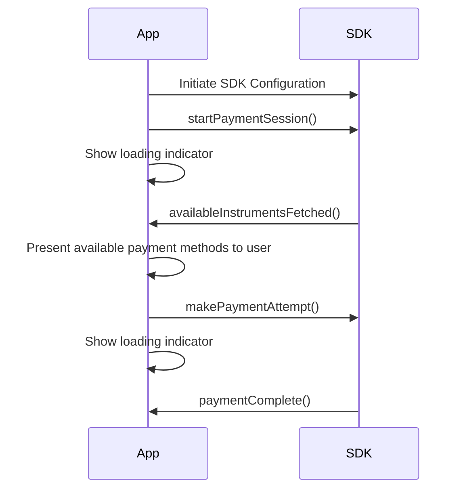
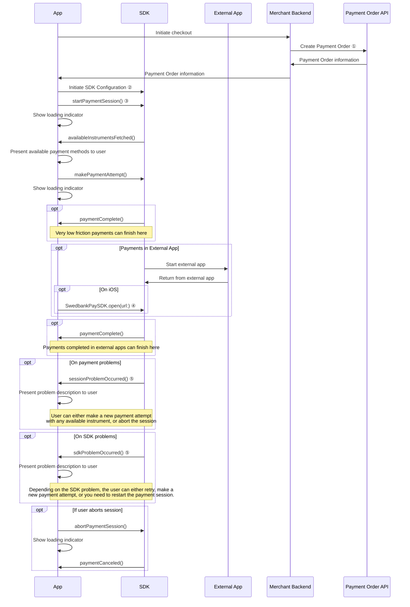
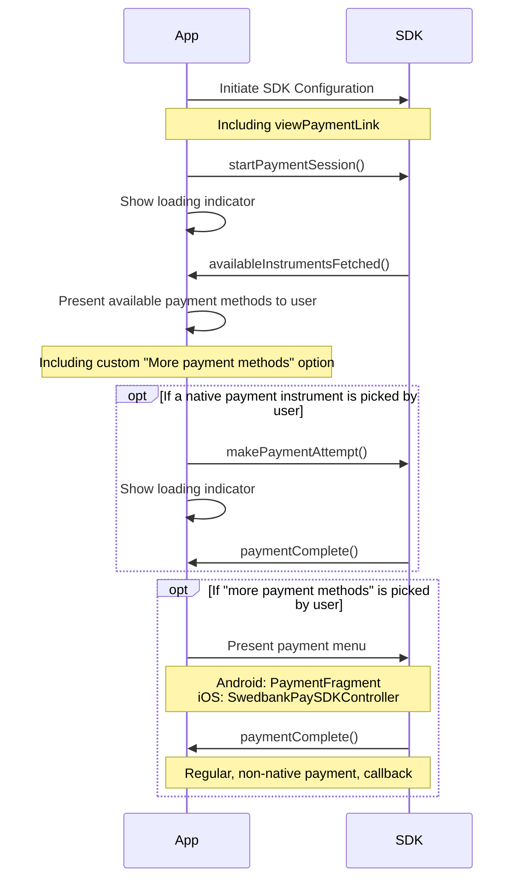
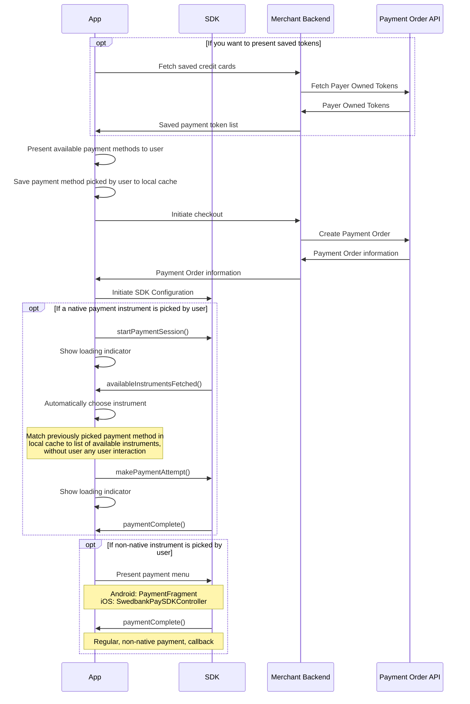

In this chapter we demonstrate how the Native Payments feature can be used to
create a custom checkout experience for your customers, directly integrated into
your own app UI. The Native Payments feature does not provide any interface
components, but instead gives you the full ability to control the look and feel
of your checkout, seamless and quick payments.


Native Payments are under ongoing development and are not feature complete yet.
We're currently adding new payment methods compatible with the feature.




Currently, the following payment methods are supported by the Native Payments
feature:

* Swish
* _Payment cards – Under development_
* _Apple Pay – Under development_
* _Google Pay – Under development_

## Usage

The Native Payments feature consists of a set of SDK methods and callbacks that
are used to control the flow of a payment session, including making multiple
payment attempts in case attempts are failed or canceled. The Swedbank Pay
Mobile SDKs automatically handle the routines for communicating with the payment
session APIs, querying and providing payment methods compatible with the mobile
device, launches external apps (such as Swish local start) as well as providing
detailed event logging to ease troubleshooting.

In a nutshell, the payment flow for Native Payments is very simple. A best case
happy flow would look like this:



We will expand on this further with more [detailed usage flows][detailed-usage-flows]
below.

## The Session URL

When implementing regular Payment Menu based payments (contained in a web view),
we're using the using the `view-checkout` operation `href` of a payment order
(configuring the SDK via the `viewPaymentLink` parameter of
`ViewPaymentOrderInfo`). For native payments, we also need the `href` for the
`view-paymentsession` operation.

```json
{
  "paymentOrder": { ... }
  "operations": [
    {
      "method": "GET",
      "href": "{{ page.front_end_url }}/psp/paymentsessions/{{ page.payment_token }}?_tc_tid=30f2168171e142d38bcd4af2c3721959",
      "rel": "view-paymentsession",
      "contentType": "application/javascript"
    },
    ...
  ]
}
```

The `href` from the operation is used in the Android and iOS implementations
below.

## Android

For this documentation, we're assuming a basic setup is done for the Android
SDK. You can achieve this by following the steps 
[Android Setup][android-bare-minimum-setup] and
[Android SDK Configuration][android-bare-minimum-configuration] of the Bare
Minimum Implementation chapter.

You need to listen to some state updates from the Native Payment session,
updating your UI and informing the user according to the events. You do this
by observing the `NativePayment.nativePaymentState` LiveData. In the
following example, we implement the five payment states. Note that the actions
to perform in these callbacks are completely dependent on the checkout user
experience of your application.

```kotlin
NativePayment.nativePaymentState.observe(viewLifecycleOwner) { paymentState ->
    when (paymentState) {
        is NativePaymentState.AvailableInstrumentsFetched -> {
            Log.d("SwedbankPay", "Available Instruments Fetched")
        }

        is NativePaymentState.PaymentComplete -> {
            Log.d("SwedbankPay", "Payment Complete")
        }

        is NativePaymentState.PaymentCanceled -> {
            Log.d("SwedbankPay", "Payment Canceled")
        }

        is NativePaymentState.SessionProblemOccurred -> {
            Log.d("SwedbankPay", "Native Session Problem Occurred")
        }

        is NativePaymentState.SdkProblemOccurred -> {
            Log.d("SwedbankPay", "SDK Problem Occurred")
        }

        else -> {}
    }
}
```

The main component for Native Payments in the Android SDK is the class
`NativePayment`, a helper class that makes it possible to start
and interact with a native payment session. To start a native payment session,
simply create a `NativePayment` and call the `startPaymentSession()` method.
Provide the `view-paymentsession` operation `href` in the `sessionURL`
parameter.

```kotlin
val configuration = TestConfiguration()
val nativePayment = NativePayment(configuration.orderInfo)

nativePayment.startPaymentSession(sessionURL = "{{ page.front_end_url }}/psp/paymentsessions/{{ page.payment_token }}?_tc_tid=30f2168171e142d38bcd4af2c3721959")
```

This will fetch the session information and initiate the Native Payment routine.
It is advisable to present a loading indicator at this stage. As a next step,
you can expect the `AvailableInstrumentsFetched` state to be called with the
payment methods available to use.

After receiving the available payment methods and presenting these to the user
in your own app UI, the user is able to pick the method to use. You then call
`makePaymentAttempt()` and provide a `PaymentAttemptInstrument` configured for
the users choice. In the following example, we assume the user wish to do a
local Swish payment on the same device (for which you need to provide the
application `context`).

```kotlin
nativePayment.makePaymentAttempt(instrument = PaymentAttemptInstrument.Swish(localStartContext = context))
```

You should once again show indication of loading in the app. Calling the method
with these parameters will start a Swish payment attempt and automatically
launch the Swish app. After the user is sent back to your app, you will receive
`PaymentComplete` or `SessionProblemOccurred` depending on the
result of the payment attempt. If there was a problem, you should inform the
user and give them the ability to either make a new attempt (with any available
payment method) or to abort the whole payment session.

```kotlin
nativePayment.abortPaymentSession()
```

### Payment methods

The `AvailableInstrumentsFetched` state contains a list of `AvailableInstrument`
on the `availableInstruments` parameter. This list of payment methods that
can be used for native payments. These instrument object also contain saved
payment method data. This could be saved payment cards or known MSISDN for the
user.

### Swish

The Swish payment method is represented as an available instrument through
`AvailableInstrument.Swish(prefills)`. The `prefills` contains `SwishPrefill`
that can give you the known MSISDN for the user.

To make a Swish payment attempt, you use `PaymentAttemptInstrument.Swish` and
either provide a `context` as `localStartContext` to start Swish locally on the
users device, or set to an MSISDN as `msisdn` for the Swish payment to be
started on another device.

```kotlin
// Local start of the Swish app on the users device
nativePayment.makePaymentAttempt(instrument = PaymentAttemptInstrument.Swish(localStartContext = context))

// Start on another device using a specific MSISDN
nativePayment.makePaymentAttempt(instrument = PaymentAttemptInstrument.Swish(msisdn = "+46739000001"))
```

## iOS

For this documentation, we're assuming a basic setup is done for the iOS SDK.
You can achieve this by following the steps [iOS Setup][ios-bare-minimum-setup]
and [iOS SDK Configuration][ios-bare-minimum-configuration] of the Bare Minimum
Implementation chapter.

You need to listen to some state updates from the Native Payment session,
updating your UI and informing the user according to the events. You do this
by implementing the `SwedbankPaySDKNativePaymentDelegate` protocol. In the
following example, we implement the delegate protocol and the five required
methods. Note that the actions to perform in these callbacks are completely
dependent on the checkout user experience of your application.

```swift
func availableInstrumentsFetched(_ availableInstruments: [SwedbankPaySDK.AvailableInstrument]) {
    print("Available Instruments Fetched")
}

func sessionProblemOccurred(problem: SwedbankPaySDK.ProblemDetails) {
    print("Native Session Problem Occurred")
}

func sdkProblemOccurred(problem: SwedbankPaySDK.NativePaymentProblem) {
    print("SDK Problem Occurred")
}

func paymentComplete() {
    print("Payment Complete")
}

func paymentCanceled() {
    print("Payment Canceled")
}
```

The main component for Native Payments in the iOS SDK is the class
`SwedbankPaySDK.NativePayment`, a helper class that makes it possible to start
and interact with a native payment session. To start a native payment session,
simply create a `SwedbankPaySDK.NativePayment`, set a `delegate` and call the
`startPaymentSession(sessionURL:)` method. Provide the `view-paymentsession`
operation `href` in the `sessionURL` parameter.

```swift
let configuration = TestConfiguration()
let nativePayment = SwedbankPaySDK.NativePayment(orderInfo: configuration.orderInfo)

nativePayment.delegate = self

nativePayment.startPaymentSession(sessionURL: URL(string: "{{ page.front_end_url }}/psp/paymentsessions/{{ page.payment_token }}?_tc_tid=30f2168171e142d38bcd4af2c3721959")!)
```

This will fetch the session information and initiate the Native Payment routine.
It is advisable to present a loading indicator at this stage. As a next step,
you can expect the `availableInstrumentsFetched(_:)` delegate method to be
called with the payment methods available to use.

After receiving the available payment methods and presenting these to the user
in your own app UI, the user is able to pick the method to use. You then call
`makePaymentAttempt(instrument:)` and provide a
`SwedbankPaySDK.PaymentAttemptInstrument` configured for the users choice. In
the following example, we assume the user wish to do a local Swish payment on
the same device.

```swift
nativePayment.makePaymentAttempt(with: .swish(msisdn: nil))
```

You should once again show indication of loading in the app. Calling the moethod
with these parameters will start a Swish payment attempt and automatically
launch the Swish app. After the user is sent back to your app, you will receive
`paymentComplete()` or `sessionProblemOccurred(problem:)` depending on the
result of the payment attempt. If there was a problem, you should inform the
user and give them the ability to either make a new attempt (with any available
payment method) or to abort the whole payment session.

```swift
nativePayment.abortPaymentSession()
```

### Payment methods

The `availableInstruments` array provided in the
`availableInstrumentsFetched(_:)` delegate method is an array of
`SwedbankPaySDK.AvailableInstrument` with information of payment methods that
can be used for native payments. These instrument object also contain saved
payment method data. This could be saved payment cards or known MSISDN for the
user.

### Swish

The Swish payment method is represented as an available instrument through
`SwedbankPaySDK.AvailableInstrument.swish(prefills:)`. The `prefills` contains
`SwishMethodPrefillModel` that can give you the known MSISDN for the user.

To make a Swish payment attempt, you use
`SwedbankPaySDK.PaymentAttemptInstrument.swish(msisdn:)` where `msisdn` can be
set to `nil` to start Swish locally on the users device, or set to an MSISDN
for the Swish payment to be started on another device.

```swift
// Local start of the Swish app on the users device
nativePayment.makePaymentAttempt(with: .swish(msisdn: nil))

// Start on another device using a specific MSISDN
nativePayment.makePaymentAttempt(with: .swish(msisdn: "+46739000001"))
```

## Problem handling

There are two categories of problems that can occur during a payment session,
Session problems and local SDK problems.

Session problems are problems with payment attempts, and contain information
from the payment order specific to the payment attempt instrument in question.
An index and further description of problems can be found in the [Technical
Reference][problem-technical-reference]. Session problems are communicated via
the `sessionProblemOccurred(problem:)` delegate method on iOS and via the
`SessionProblemOccurred` state on Android. The `problem` parameter contains
problem information, consisting of `type`, `title`, `status` and `detail`.

Local SDK problems are either inconsistency errors or communication errors
occurring inside the SDK. These problems are communicated via the
`sdkProblemOccurred(problem:)` delegate method on iOS and via the 
`SdkProblemOccurred` state on Android. The `problem` parameters is
a `SwedbankPaySDK.NativePaymentProblem` enum value on iOS and a
`NativePaymentProblem` class on Andorid. The different SDK problems should be
handled in the following ways:

* `PaymentSessionAPIRequestFailed` indicates a problem with the
underlying API communication. This is most likely due to network errors, such as
poor cell phone coverage. The SDK will automatically attempt retries of failing
API calls up to a point, where it finally gives up and informs you via this
value. The `error` parameter contains the underlying Swift `Error` object
received from the system. The `retry` parameter is a closure on iOS and a
callback function on Android that you can call to retry the underlying API call.
You should inform the user of the error and give the option to either abort the
payment session or retry the call.
* `ClientAppLaunchFailed` informs you that the SDK have attempted to launch an
external app (such as Swish) and that it failed to do so. You should inform the
user of the problem and give them the option to either make a new attempt (with
any available payment method) or to abort the whole payment session.
* `InternalInconsistencyError` is the result of an logic inconsistency problem
in the SDK. An example of this would be to call `abortPaymentSession()` before
`startPaymentSession()`. If you receive this error during development, you
should make sure that you follow the [usage flow][usage] correctly. If you get
this error in your production app, you should inform the user of a generic
technical error and restart the checkout process.
* `PaymentSessionEndReached` is the result of a native payment session that has
reached a state that isn't supported by the SDK. Since payment orders can be
consumed either on the web, as a web based mobile app payment or as an app
native payment, you could theoretically modify the state of a payment order on
two different devices at the same time, or start on one device and try to
continue on another.

    If you get this error during development, you should make sure that you
follow the [usage flow][usage] correctly, and that you are always starting
native payment sessions on a newly created payment order that is only consumed
in your app. You should also make sure that you've correctly configured the SDK
with the same `completeURL`, `cancelURL` and `paymentURL` as you are creating
the payment order with on your backend.

    If you get this error in your production app, you should inform the user of
a generic technical error and restart the checkout process.

## Detailed usage flows

To expand on the simple happy flow, there are a few more possible scenarios when
making Native Payments. Below you can find a more complete flow with notes and
multiple outcomes:



* ① Just as with regular non-native payments in the Swedbank Pay Mobile SDK,
there is no option to create payment orders directly. You need to create your
payment orders with your own backend.
* ② The SDK is configured as usual, with the regular required parameters such
as `paymentURL`, `completeURL` and `cancelURL`.
* ③ Starting a Native Session in the SDK requires a [Session URL][session-url].
* ④ Just as with non-native payments, the `SwedbankPaySDK.open(url:)` method
needs to be called from the App Delegate, see [iOS Setup][ios-bare-minimum-setup].
This is not needed on Android.
* ⑤ See [Problem handling][problem-handling] for different considerations and
outcomes.

### Alternative checkout flows

Depending on the checkout flow in your app, there might be a need to implement
the Native Payment feature slightly different.

#### Payment menu fallback

You might want to give the user an option to use the regular, web view based,
payment menu in the SDK. One simple way to achieve this is to reuse the same
payment order and present the regular SDK UI depending on the user choice:



#### Present methods before payment order creation

There might be scenarios where you want to presenting payment methods to your
user before creating your payment order. This could be because you have payment
methods not using Swedbank Pay, or because you need to create your payment order
in different ways depending on the choice of payment method by the user. You can
achieve this by simply presenting available payment methods to the user in your
UI and saving the picked method to a local cache. When the SDK callback
`availableInstrumentsFetched()` is called, you match the available instruments
to the saved cache and makes a payment attempt on that instrument without right
away.

You can combine this with [Network Tokenization][network-tokenization] for
credit card where you can fetch the users saved payment tokens before creating
your payment order.



#### "New credit card" payment method

In the scenario that you present custom payment methods outside the instruments
in the `availableInstruments` array, you might want to give the user the option
to pay with a new credit card. The Native Payments SDK gives no option for you
to collect credit card details (such as card number, expiry date and
verification code), so your only option is to present the regular web view based
payment menu. You should preferably combine this with the option to create a
instrument mode payment order and configure
[Store details and toggle consent checkbox][one-click-consent-checkbox].




[android-bare-minimum-setup]: /checkout-v3/modules-sdks/mobile-sdk/bare-minimum-implementation/#android-setup
[android-bare-minimum-configuration]: /checkout-v3/modules-sdks/mobile-sdk/bare-minimum-implementation/#android-sdk-configuration
[ios-bare-minimum-setup]: /checkout-v3/modules-sdks/mobile-sdk/bare-minimum-implementation/#ios-setup
[ios-bare-minimum-configuration]: /checkout-v3/modules-sdks/mobile-sdk/bare-minimum-implementation/#ios-sdk-configuration
[problem-technical-reference]: /checkout-v3/features/technical-reference/problems/
[usage]: /checkout-v3/modules-sdks/mobile-sdk/native-payments/#usage
[detailed-usage-flows]: /checkout-v3/modules-sdks/mobile-sdk/native-payments/#detailed-usage-flows
[problem-handling]: /checkout-v3/modules-sdks/mobile-sdk/native-payments/#problem-handling
[session-url]: /checkout-v3/modules-sdks/mobile-sdk/native-payments/#the-session-url
[network-tokenization]: /checkout-v3/features/optional/network-tokenization/
[one-click-consent-checkbox]: /checkout-v3/features/optional/one-click-payments/#disable-store-details-and-toggle-consent-checkbox
