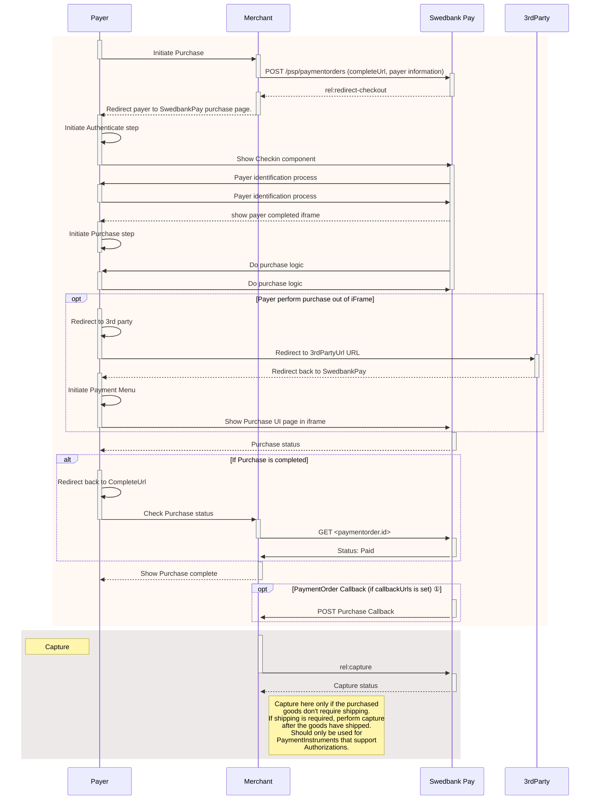
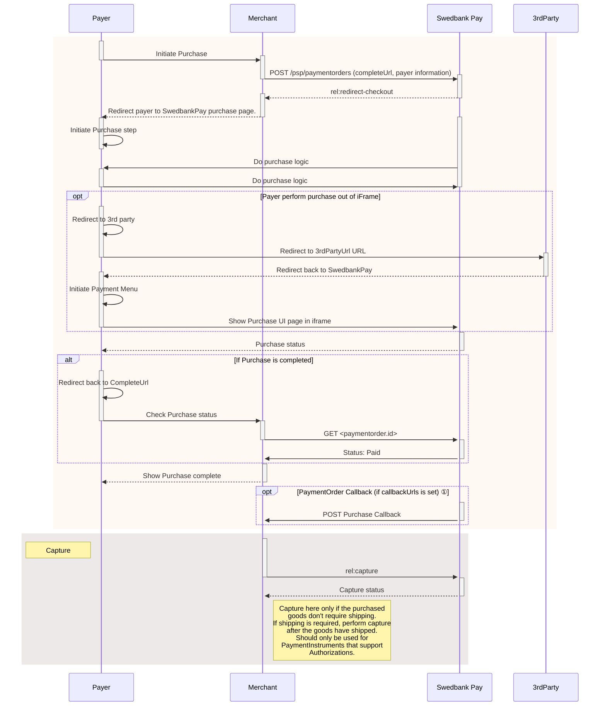
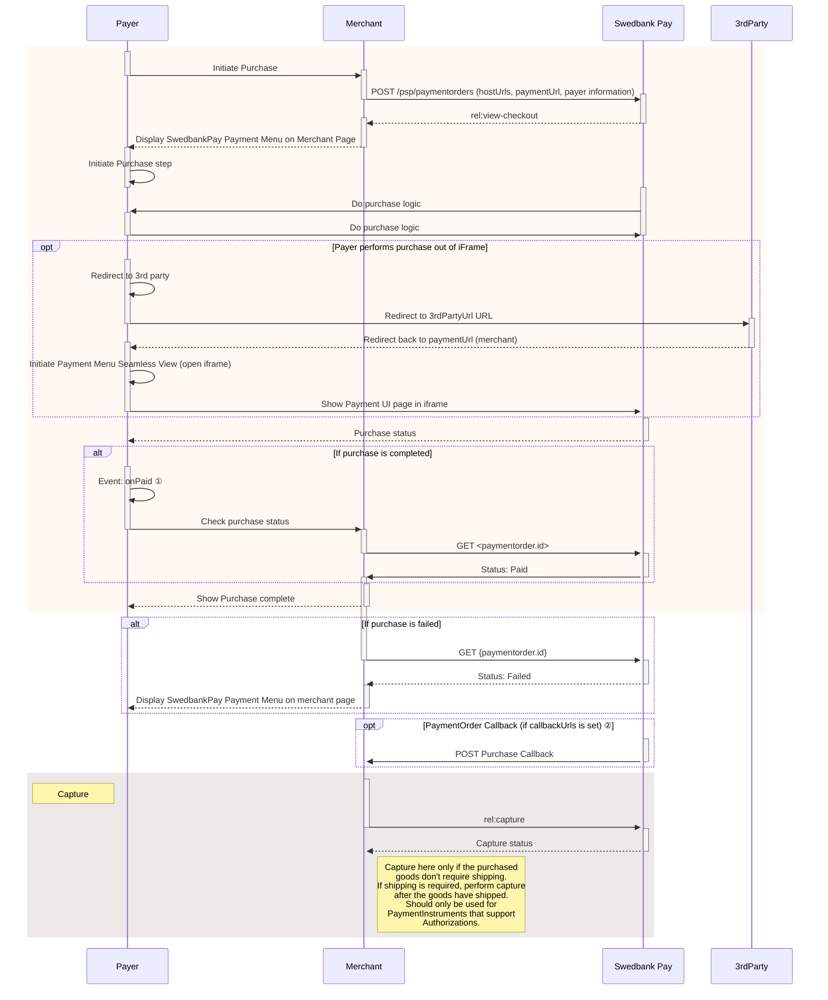
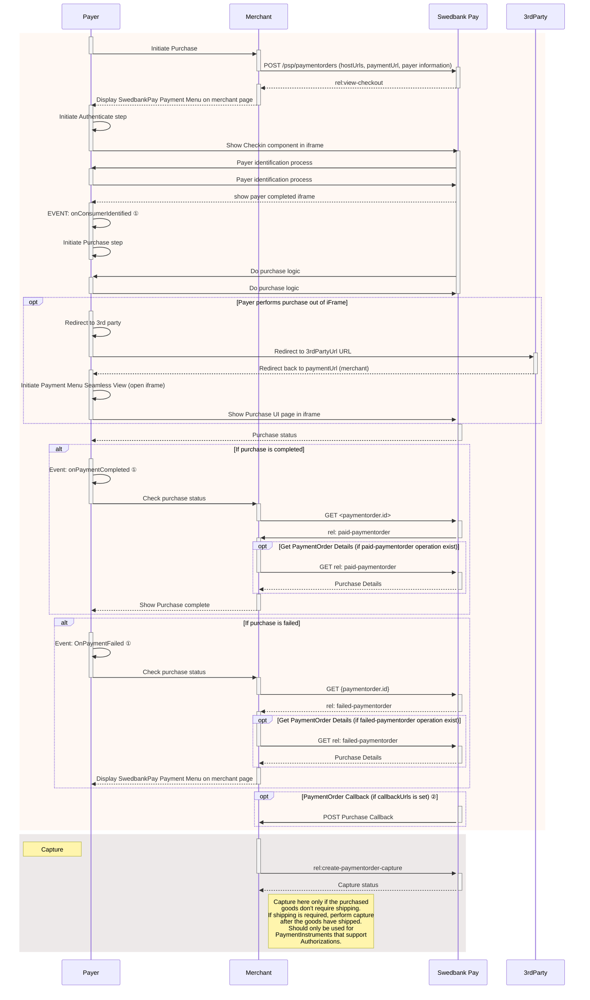

## Business Redirect





*   ① Read more about [callback][callback] handling in the technical reference.

<br/>

## Business Seamless View



```mermaid
sequenceDiagram
    participant Payer
    participant Merchant
    participant SwedbankPay as Swedbank Pay
    participant 3rdParty

        rect rgba(238, 112, 35, 0.05)
            activate Payer
            Payer ->>+ Merchant: Initiate Purchase
            deactivate Payer
            Merchant ->>+ SwedbankPay: POST /psp/paymentorders (hostUrls, paymentUrl, payer information)
            deactivate Merchant
            SwedbankPay -->>+ Merchant: rel:view-checkout
            deactivate SwedbankPay
            Merchant -->>- Payer: Display SwedbankPay Payment Menu on merchant page
            activate Payer
            Payer ->> Payer: Initiate Authenticate step
               Payer ->> SwedbankPay: Show Checkin component in iframe
    deactivate Payer
    activate SwedbankPay
    SwedbankPay ->> Payer: Payer identification process
    activate Payer
    Payer ->> SwedbankPay: Payer identification process
    deactivate Payer
    SwedbankPay -->> Payer: show payer completed iframe
    activate Payer
    Payer ->> Payer: EVENT: onPayerIdentified ①
    Payer ->> Payer: Initiate Purchase step
    deactivate Payer
    SwedbankPay ->>+ Payer: Do purchase logic
    Payer ->> SwedbankPay: Do purchase logic
    deactivate Payer
    deactivate SwedbankPay

                    opt Payer performs purchase out of iFrame
                    activate Payer
                    Payer ->> Payer: Redirect to 3rd party
                    Payer ->>+ 3rdParty: Redirect to 3rdPartyUrl URL
                    deactivate Payer
                    3rdParty -->>+ Payer: Redirect back to paymentUrl (merchant)
                    deactivate 3rdParty
                    Payer ->> Payer: Initiate Payment Menu Seamless View (open iframe)
                    Payer ->>+ SwedbankPay: Show Purchase UI page in iframe
                    deactivate Payer
                end

                activate SwedbankPay
                SwedbankPay -->> Payer: Purchase status
                deactivate SwedbankPay

            alt If purchase is completed
            activate Payer
            Payer ->> Payer: Event: OnPaid ①
            Payer ->>+ Merchant: Check purchase status
            deactivate Payer
            Merchant ->>+ SwedbankPay: GET <paymentorder.id>
            deactivate Merchant
            SwedbankPay ->>+ Merchant: Status: Paid
            deactivate SwedbankPay
            end
                        activate Merchant
Merchant -->>- Payer: Show Purchase complete
            end

                alt If purchase is failed
                Merchant ->>+ SwedbankPay: GET {paymentorder.id}
                deactivate Merchant
                SwedbankPay -->>+ Merchant: Status: Failed
                deactivate SwedbankPay
                activate Merchant
                Merchant -->>- Payer: Display SwedbankPay Payment Menu on merchant page
                end

         opt PaymentOrder Callback (if callbackUrls is set) ②
                activate SwedbankPay
                SwedbankPay ->> Merchant: POST Purchase Callback
                deactivate SwedbankPay
         end
         end

    rect rgba(81,43,43,0.1)
        activate Merchant
        note left of Payer: Capture
        Merchant ->>+ SwedbankPay: rel:capture
        deactivate Merchant
        SwedbankPay -->>- Merchant: Capture status
        note right of Merchant: Capture here only if the purchased<br/>goods don't require shipping.<br/>If shipping is required, perform capture<br/>after the goods have shipped.<br>Should only be used for <br>PaymentInstruments that support <br>Authorizations.
        end
```

*   ① See [seamless view events][seamless-view-events] for further information.
*   ② Read more about [callback][callback] handling in the technical reference.

<br/>

## Enterprise Redirect





*   ① Read more about [callback][enterprise-callback] handling in the technical reference.

<br/>

## Enterprise Seamless View




*   ① See [seamless view events][enterprise-seamless-view-events] for further information.
*   ② Read more about [callback][enterprise-callback] handling in the technical reference.



## Payments Only Redirect




*   ① Read more about [callback][payments-callback] handling in the technical reference.

<br/>

## Payments Only Seamless View





*   ① See [seamless view events][payments-seamless-view-events] for further information.
*   ② Read more about [callback][payments-callback] handling in the technical reference.



## Starter Seamless View





*   ① See [seamless view events][starter-seamless-view-events] for further information.
*   ② Read more about [callback][starter-callback] handling in the technical reference.



[callback]: /checkout-v3/business/features/technical-reference/callback
[enterprise-callback]: /checkout-v3/enterprise/features/technical-reference/callback
[payments-callback]: /checkout-v3/payments-only/features/technical-reference/callback
[starter-callback]: /checkout-v3/starter/features/technical-reference/callback
[seamless-view-events]: /checkout-v3/business/features/technical-reference/seamless-view-events
[enterprise-seamless-view-events]: /checkout-v3/enterprise/features/technical-reference/seamless-view-events
[payments-seamless-view-events]: /checkout-v3/payments-only/features/technical-reference/seamless-view-events
[starter-seamless-view-events]: /checkout-v3/starter/features/technical-reference/seamless-view-events
