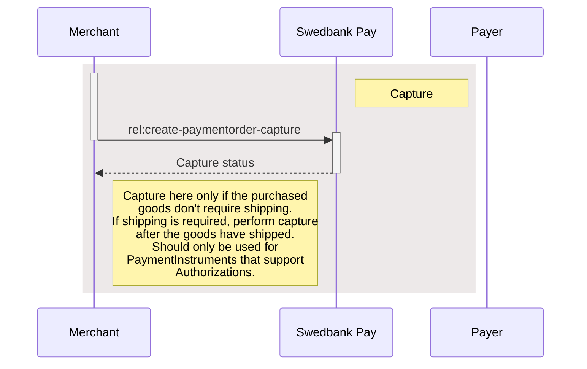



## Introduction

Below is the final part of the sequence diagram illustrating how a capture
operation is performed.



## Operations

Most payment instruments are two-phase payments –
in which a successful payment order will result in an authorized transaction –
that must be followed up by a capture or cancellation transaction in a later
stage. One-phase payments like Swish are settled directly without the option to
capture or cancel. For a full list of the available operations, see the
[techincal reference][payment-order-operations].

{:.table .table-striped}
| Operation                      | Description                                                                                                                                                                                                                                                                    |
| :----------------------------- | :----------------------------------------------------------------------------------------------------------------------------------------------------------------------------------------------------------------------------------------------------------------------------- |
| `create-paymentorder-capture`  | The second part of a two-phase transaction where the authorized amount is sent from the payer to the payee. It is possible to do a part-capture on a subset of the authorized amount. Several captures on the same payment are possible, up to the total authorization amount. |
| `create-paymentorder-cancel`   | Used to cancel authorized and not yet captured transactions. If a cancellation is performed after doing a part-capture, it will only affect the not yet captured authorization amount.                                                                                         |
| `create-paymentorder-reversal` | Used to reverse a payment. It is only possible to reverse a payment that has been captured and not yet reversed.                                                                                                                                                               |

To identify the operations that are available we need to do a `GET` request
against the URI of `paymentorder.id`:

{:.code-header}
**Request**

```http
GET /psp/paymentorders/{{ page.payment_order_id }} HTTP/1.1
Authorization: Bearer <AccessToken>
```

The (abbreviated) response containing an `updateorder`, `capture`,
`cancellation`, and `reversal` operation should look similar to the response
below:

{:.code-header}
**Response**

```http
HTTP/1.1 200 OK
Content-Type: application/json

{
    "paymentOrder": {
        "id": "/psp/paymentorders/{{ page.payment_order_id }}"
    },
    "operations": [
        {
            "method": "PATCH",
            "href": "{{ page.api_url }}/psp/paymentorders/{{ page.payment_order_id }}",
            "rel": "update-paymentorder-updateorder",
            "contentType": "application/json"
        },
        {
            "method": "POST",
            "href": "{{ page.api_url }}/psp/paymentorders/{{ page.payment_order_id }}/captures",
            "rel": "create-paymentorder-capture",
            "contentType": "application/json"
        },
        {
            "method": "POST",
            "href": "{{ page.api_url }}/psp/paymentorders/{{ page.payment_order_id }}/cancellations",
            "rel": "create-paymentorder-cancel",
            "contentType": "application/json"
        },
        {
            "method": "POST",
            "href": "{{ page.api_url }}/psp/paymentorders/{{ page.payment_order_id }}/reversals",
            "rel": "create-paymentorder-reversal",
            "contentType": "application/json"
        }
    ]
}
```

{:.table .table-striped}
| Field       | Type     | Description                                                                        |
| :------------- | :------- | :--------------------------------------------------------------------------------- |
| `paymentorder` | `object` | The payment order object.                                                          |
| └➔&nbsp;`id`   | `string` |                       |
| `operations`   | `array`  | The array of possible operations to perform, given the state of the payment order. |

## Cancel



## Reversal







[https]: /#connection-and-protocol
[msisdn]: https://en.wikipedia.org/wiki/MSISDN
[payee-reference]: /checkout/other-features#payeereference
[payment-order-operations]: /checkout/other-features#operations
[payment-menu-back-end]: /payment#payment-menu-back-end
[payment-menu-front-end]: /payment#payment-menu-front-end
