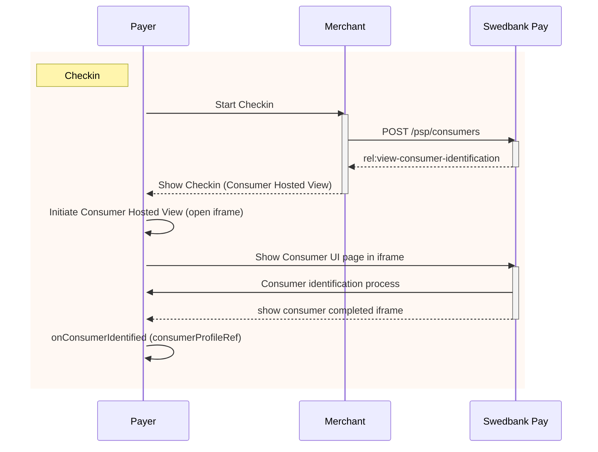





## Introduction

An overview of how the process of identifying the payer through Checkin is
illustrated in the below sequence diagram.



## Checkin Back End

The payer will be identified with the `consumers` resource and will be
persisted to streamline future Payment Menu processes. Payer identification
is done through the `initiate-consumer-session` operation. In the request body,
most properties are optional. However, the more information that is provided,
the easier the identification process becomes for the payer.

{:.code-header}
**Request**

```http
POST /psp/consumers HTTP/1.1
Host: api.externalintegration.payex.com
Authorization: Bearer <MerchantToken>
Content-Type: application/json

{
    "operation": "initiate-consumer-session",
    "msisdn": "+46739000001",
    "email": "leia.ahlstrom@example.com",
    "consumerCountryCode": "SE",
    "nationalIdentifier": {
        "socialSecurityNumber": "199710202392",
        "countryCode": "SE"
    }
}
```

{:.table .table-striped}
| ✔︎︎︎︎︎ **(Required)** | **Property**              | **Type** | **Description**                                                                                                                           |
| :-------------------- | :------------------------ | :------- | :---------------------------------------------------------------------------------------------------------------------------------------- |
| ✔︎︎︎︎︎                | `operation`               | `string` | `initiate-consumer-session`, the operation to perform.                                                                                    |
|                       | `msisdn`                  | `string` | The [MSISDN][msisdn] (mobile phone number) of the payer. Format Sweden: `+46707777777`. Format Norway: `+4799999999`.                     |
|                       | `email`                   | `string` | The e-mail address of the payer.                                                                                                          |
| ✔︎︎︎︎︎                | `consumerCountryCode`     | `string` | Payers country of residence. Used by the consumerUi for validation on all input fields.                                                   |
|                       | `nationalIdentifier`      | `object` | The object containing information about the national identifier of the payer.                                                             |
|                       | └➔ `socialSecurityNumber` | `string` | The social security number of the payer. Format: Norway `DDMMYYXXXXX`, Sweden: `YYYYMMDDXXXX`.                                            |
|                       | └➔ `countryCode`          | `string` | The country code, denoting the origin of the issued social security number. Required if `nationalIdentifier.socialSecurityNumber` is set. |

When the request has been sent, a response containing an array of operations that can be acted upon will be returned:

{:.code-header}
**Response**

```http
HTTP/1.1 200 OK
Content-Type: application/json

{
    "token": "7e380fbb3196ea76cc45814c1d99d59b66db918ce2131b61f585645eff364871",
    "operations": [
        {
            "method": "GET",
            "rel": "redirect-consumer-identification",
            "href": "https://ecom.stage.payex.com/consumers/sessions/7e380fbb3196ea76cc45814c1d99d59b66db918ce2131b61f585645eff364871",
            "contentType": "text/html"
        },
        {
            "method": "GET",
            "rel": "view-consumer-identification",
            "href": "https://ecom.externalintegration.payex.com/consumers/core/scripts/client/px.consumer.client.js?token=7e380fbb3196ea76cc45814c1d99d59b66db918ce2131b61f585645eff364871",
            "contentType": "application/javascript",
        }
    ]
}
```

{:.table .table-striped}
| Property              | Type     | Description                                                                                                                                       |
| :-------------------- | :------- | :------------------------------------------------------------------------------------------------------------------------------------------------ |
| `token`               | `string` | A session token used to initiate Checkout UI.                                                                                                     |
| `operations`          | `array`  | The array of operation objects to choose from, described in detail in the table below.                                                            |
| └➔&nbsp;`rel`         | `string` | The relational name of the operation, used as a programmatic identifier to find the correct operation given the current state of the application. |
| └➔&nbsp;`method`      | `string` | The HTTP method to use when performing the operation.                                                                                             |
| └➔&nbsp;`contentType` | `string` | The HTTP content type of the target URI. Indicates what sort of resource is to be found at the URI, how it is expected to be used and behave.     |
| └➔&nbsp;`href`        | `string` | The target URI of the operation.                                                                                                                  |

## Checkin Front End

The response from the `POST` of consumer information contains a few operations.
The combination of `rel`, `method` and `contentType` should give you a clue how
the operation should be performed.
The `view-consumer-identification` operation
and its `application/javascript` content type gives us a clue that the
operation is meant to be embedded in a `<script>` element in an HTML document.



{:.code-header}
**HTML**

```html
<!DOCTYPE html>
<html>
    <head>
        <title>Swedbank Pay Checkout is Awesome!</title>
        <!-- Here you can specify your own javascript file -->
        <script src=<YourJavaScriptFileHere></script>
    </head>
    <body>
        <div id="checkin"></div>
        <div id="payment-menu"></div>
    </body>
</html>
```

In the HTML, you only need to add two `<div>` elements to place the
check-in and payment menu inside of. The JavaScript will handle the rest when
it comes to handling the check-in and payment menu.

{:.code-header}
**JavaScript**

```JS
window.onload = function () {
    var request = new XMLHttpRequest();
    request.addEventListener('load', function () {
        // We will assume that our own backend returns the
        // exact same as what SwedbankPay returns.
        response = JSON.parse(this.responseText);
        var script = document.createElement('script');
        // This assumes that the operations from the response of the POST from the
        // payment order is returned verbatim from the server to the Ajax:
        var operation = response.operations.find(function (o) {
            return o.rel === 'view-consumer-identification';
        });
        script.setAttribute('src', operation.href);
        script.onload = function () {
            payex.hostedView.consumer({
                // The container specifies which id the script will look for
                // to host the checkin component
                container: "checkin",
                onConsumerIdentified: function onConsumerIdentified(consumerIdentifiedEvent) {
                    // consumerIdentifiedEvent.consumerProfileRef contains the reference
                    // to the identified consumer which we need to pass on to the
                    // Payment Order to initialize a personalized Payment Menu.
                    console.log(consumerIdentifiedEvent);
                },
                onShippingDetailsAvailable: function onShippingDetailsAvailable(shippingDetailsAvailableEvent) {
                    console.log(shippingDetailsAvailableEvent);
                }
            }).open();
        };
        // Appending the script to the head
        var head = document.getElementsByTagName('head')[0];
        head.appendChild(script);
    });
    // Place in your own API endpoint here.
    request.open('POST', <Your-Endpoint-Here>, true);
    request.setRequestHeader('Content-Type', 'application/json; charset=utf-8');
    // In this example we'll send in all of the information mentioned
    // before in the request to the endpoint.
    request.send(JSON.stringify({
        operation: 'initiate-consumer-session',
        msisdn: '+46739000001',
        email: 'leia.ahlstrom@example.com',
        consumerCountryCode: 'SE',
        nationalIdentifer: {
            socialSecurityNumber: '199710202392',
            countryCode: "SE"
        }
    }));
};
```

**Notice** that we attach the `<script>` element to the head,
but use `window.onload` to ensure everything has loaded in properly
before accessing the page.
With the scripts loading in after the entire page is loaded, we can access the
`<div>` container that the Checkin will be hosted in.
After that has all loaded, you should see something like this:

{:.text-center}
![Consumer UI][checkin-image]{:width="564" height="293"}

As you can see, the payer's information is pre-filled as provided by the
initial `POST`. When the payer completes the checkin, the events
`onConsumerIdentified` and `onShippingDetailsAvailable` will be raised with
the following argument objects:

{:.code-header}
**Consumer Identified Event Argument Object**

```JS
{
    "actionType": "OnConsumerIdentified",
    "consumerProfileRef": "7d5788219e5bc43350e75ac633e0480ab30ad20f96797a12b96e54da869714c4"
}
```

{:.code-header}
**Shipping Details Available Event Argument Object**

```JS
{
    "actionType": "OnShippingDetailsAvailable",
    "url": "https://api.externalintegration.payex.com/psp/consumers/<consumerProfileRef>/shipping-details"
}
```

With a `consumerProfileRef` safely tucked into our pocket, the Checkin is
complete and we can move on to [payment menu][payment-menu].




[capture-operation]: /checkout/after-payment#capture
[checkin-image]: /assets/img/checkout/your-information.png
[consumer-reference]: /checkout/other-features#payeereference
[initiate-consumer-session]: /checkout/checkin#checkin-back-end
[msisdn]: https://en.wikipedia.org/wiki/MSISDN
[operations]: /checkout/other-features#operations
[order-items]: #order-items
[payee-reference]: /checkout/other-features#payeereference
[payment-menu-image]: /assets/img/checkout/payment-methods.png
[payment-menu]: #payment-menu
[payment-order-capture]: /checkout/after-payment#capture
[payment-order-operations]: /checkout/after-payment#operations
[payment-order]: #payment-orders
[paymentorder-items]: #items
[technical-reference-onconsumer-identified]: /checkout/payment-menu-front-end
[urls]: /checkout/other-features#urls-resource
[user-agent]: https://en.wikipedia.org/wiki/User_agent
[payment-menu]: payment-menu
