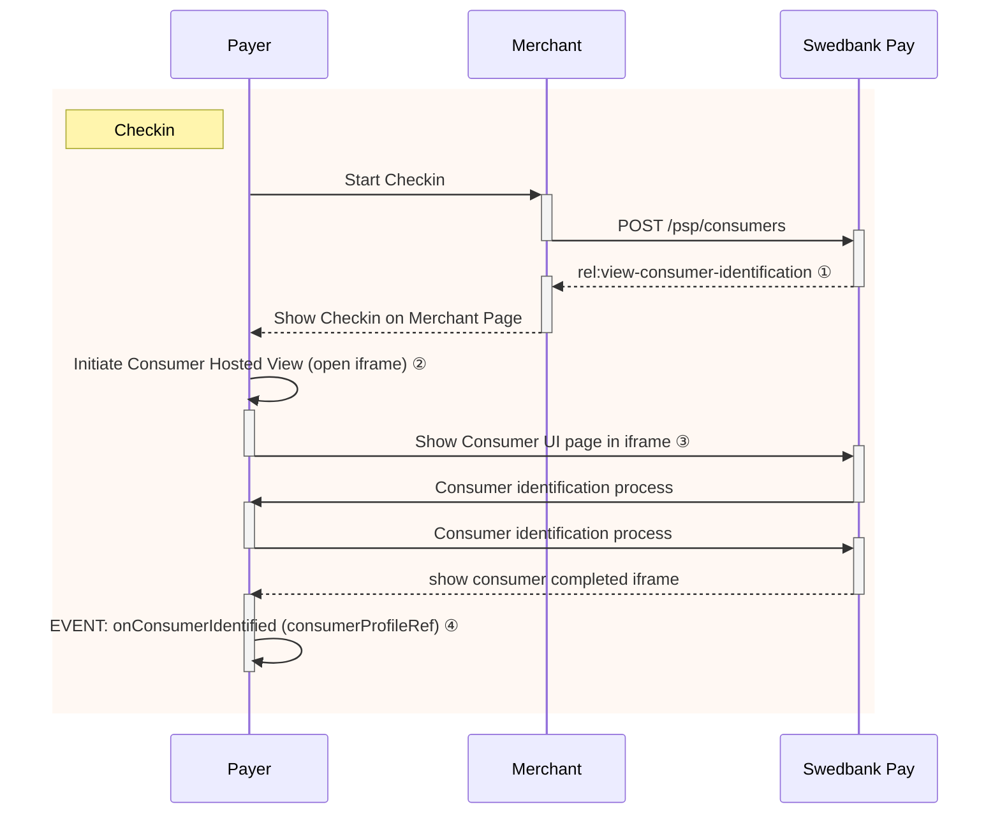



## Introduction

An overview of how the process of identifying the payer through Checkin is
illustrated in the below sequence diagram.



## Checkin Back End

The payer will be identified with the `consumers` resource and will be
persisted to streamline future Payment Menu processes. Payer identification
is done through the `initiate-consumer-session` operation.

{:.code-header}
**Request**

```http
POST /psp/consumers HTTP/1.1
Host: {{ page.apiHost }}
Authorization: Bearer <AccessToken>
Content-Type: application/json

{
    "operation": "initiate-consumer-session",
    "language": "sv-SE",
    "shippingAddressRestrictedToCountryCodes" : ["NO", "SE", "DK"]
}
```

{:.table .table-striped}
| Required | Property                                  | Type     | Description                                                                                |
| :------: | :---------------------------------------- | :------- | :----------------------------------------------------------------------------------------- |
|  ✔︎︎︎︎︎  | `operation`                               | `string` | `initiate-consumer-session`, the operation to perform.                                     |
|  ✔︎︎︎︎︎  | `language`                                | `string` | Selected language to be used in Checkin. Supported values are `nb-NO`, `sv-SE` and `en-US` |
|  ✔︎︎︎︎︎  | `shippingAddressRestrictedToCountryCodes` | `string` | List of supported shipping countries for merchant. Using ISO-3166 standard.                |

When the request has been sent, a response containing an array of operations that can be acted upon will be returned:

{:.code-header}
**Response**

```http
HTTP/1.1 200 OK
Content-Type: application/json

{
    "token": "7e380fbb3196ea76cc45814c1d99d59b66db918ce2131b61f585645eff364871",
    "operations": [
        {
            "method": "GET",
            "rel": "redirect-consumer-identification",
            "href": "{{ page.frontEndUrl }}/consumers/sessions/7e380fbb3196ea76cc45814c1d99d59b66db918ce2131b61f585645eff364871",
            "contentType": "text/html"
        },
        {
            "method": "GET",
            "rel": "view-consumer-identification",
            "href": "{{ page.frontEndUrl }}/consumers/core/scripts/client/px.consumer.client.js?token={{ page.paymentToken }}",
            "contentType": "application/javascript"
        }
    ]
}
```

{:.table .table-striped}
| Property              | Type     | Description                                                                                                                                       |
| :-------------------- | :------- | :------------------------------------------------------------------------------------------------------------------------------------------------ |
| `token`               | `string` | A session token used to initiate Checkout UI.                                                                                                     |
| `operations`          | `array`  | The array of operation objects to choose from, described in detail in the table below.                                                            |
| └➔&nbsp;`rel`         | `string` | The relational name of the operation, used as a programmatic identifier to find the correct operation given the current state of the application. |
| └➔&nbsp;`method`      | `string` | The HTTP method to use when performing the operation.                                                                                             |
| └➔&nbsp;`contentType` | `string` | The HTTP content type of the target URI. Indicates what sort of resource is to be found at the URI, how it is expected to be used and behave.     |
| └➔&nbsp;`href`        | `string` | The target URI of the operation.                                                                                                                  |

## Checkin Front End

The response from the `POST` of consumer information contains a few operations.
The combination of `rel`, `method` and `contentType` should give you a clue how
the operation should be performed.
The `view-consumer-identification` operation
and its `application/javascript` content type gives us a clue that the
operation is meant to be embedded in a `<script>` element in an HTML document.

{% include alert.html type="warning"
                      icon="warning"
                      header=""
                      body="In our example we will focus on using the
                      `view-consumer-identification` solution.
                      The `redirect-consumer-identification` method redirects
                      the user to Swedbank's own site to handle the checkin
                      and is used in other implementations.
                      `redirect-consumer-identification` **should only be used in
                      test enviroments**. It is not suitable for the production
                      environment as there is no simple way of retrieving the
                      `consumerProfileRef`."%}

{:.code-header}
**HTML**

```html
<!DOCTYPE html>
<html>
    <head>
        <title>Swedbank Pay Checkout is Awesome!</title>
        <!-- Here you can specify your own javascript file -->
        <script src=<YourJavaScriptFileHere></script>
    </head>
    <body>
        <div id="checkin"></div>
        <div id="payment-menu"></div>
    </body>
</html>
```

In the HTML, you only need to add two `<div>` elements to place the
check-in and payment menu inside of. The JavaScript will handle the rest when
it comes to handling the check-in and payment menu.

{:.code-header}
**JavaScript**

```js
window.onload = function () {
    var request = new XMLHttpRequest();
    request.addEventListener('load', function () {
        // We will assume that our own backend returns the
        // exact same as what SwedbankPay returns.
        response = JSON.parse(this.responseText);
        var script = document.createElement('script');
        // This assumes that the operations from the response of the POST from the
        // payment order is returned verbatim from the server to the Ajax:
        var operation = response.operations.find(function (o) {
            return o.rel === 'view-consumer-identification';
        });
        script.setAttribute('src', operation.href);
        script.onload = function () {
            payex.hostedView.consumer({
                // The container specifies which id the script will look for
                // to host the checkin component
                container: "checkin",
                onConsumerIdentified: function onConsumerIdentified(consumerIdentifiedEvent) {
                    // consumerIdentifiedEvent.consumerProfileRef contains the reference
                    // to the identified consumer which we need to pass on to the
                    // Payment Order to initialize a personalized Payment Menu.
                    console.log(consumerIdentifiedEvent);
                },
                onShippingDetailsAvailable: function onShippingDetailsAvailable(shippingDetailsAvailableEvent) {
                    console.log(shippingDetailsAvailableEvent);
                }
            }).open();
        };
        // Appending the script to the head
        var head = document.getElementsByTagName('head')[0];
        head.appendChild(script);
    });
    // Place in your own API endpoint here.
    request.open('POST', <Your-Endpoint-Here>, true);
    request.setRequestHeader('Content-Type', 'application/json; charset=utf-8');
    // In this example we'll send in all of the information mentioned
    // before in the request to the endpoint.
    request.send(JSON.stringify({
        operation: 'initiate-consumer-session',
        language: 'sv-SE',
        shippingAddressRestrictedToCountryCodes : ['NO', 'SE']
        }
    }));
};
```



With the scripts loading in after the entire page is loaded, we can access the
`<div>` container that the Checkin will be hosted in.
After that has all loaded, you should see something like this:

{:.text-center}
![Consumer UI][checkin-image]{:width="564" height="293"}

As you can see, the payer's information is pre-filled as provided by the
initial `POST`. During and on completion of Checkin, the events
`onConsumerIdentified`, `onShippingDetailsAvailable` and `onBillingDetailsAvailable` may be raised with
the following argument objects:

{:.code-header}
**Consumer Identified Event Argument Object**

```js
{
    "actionType": "OnConsumerIdentified",
    "consumerProfileRef": "{{ page.paymentToken }}"
}
```

{:.code-header}
**Shipping Details Available Event Argument Object**

```js
{
    "actionType": "OnShippingDetailsAvailable",
    "url": "{{ page.apiUrl }}/psp/consumers/{{ page.paymentToken }}/shipping-details"
}
```

{:.code-header}
**Billing Details Available Event Argument Object**

```js
{
    "actionType": "OnBillingDetailsAvailable",
    "url": "{{ page.apiUrl }}/psp/consumers/{{ page.paymentToken }}/billing-details"
}
```

Here is an example of what a `GET` request towards the `url` provided in the event might return:

{:.code-header}
**Response**

```js
{
    "email": "olivia.nyhuus@payex.com",
    "msisdn": "+4798765432",
    "billingAddress": {
        "addressee": "Olivia Nyhus",
        "coAddress": "",
        "email": "olivia.nyhuus@payex.com",
        "msisdn": "+4798765432",
        "streetAddress": "Saltnestoppen 43",
        "zipCode": "1642",
        "city": "Saltnes",
        "countryCode": "NO"
    }
}
```

With a `consumerProfileRef` safely tucked into our pocket, the Checkin is
complete and we can move on to [payment menu][payment-menu].

### Note on consumer data

During this stage some consumer data is stored.
Read more about our [Data Protection Policy][data-protection] for details on which
information we store and its duration.



[capture-operation]: /checkout/after-payment#capture
[checkin-image]: /assets/img/checkout/your-information.png
[consumer-reference]: /checkout/other-features#payeereference
[data-protection]: /resources/data-protection#paymentorder-consumer-data
[initiate-consumer-session]: /checkout/checkin#checkin-back-end
[msisdn]: https://en.wikipedia.org/wiki/MSISDN
[operations]: /checkout/other-features#operations
[order-items]: #order-items
[payee-reference]: /checkout/other-features#payeereference
[payment-menu-image]: /assets/img/checkout/payment-methods.png
[payment-menu]: #payment-menu
[payment-menu]: payment-menu
[payment-order-capture]: /checkout/after-payment#capture
[payment-order-operations]: /checkout/after-payment#operations
[payment-order]: #payment-orders
[paymentorder-items]: #items
[technical-reference-onconsumer-identified]: /checkout/payment-menu-front-end
[urls]: /checkout/other-features#urls-resource
[user-agent]: https://en.wikipedia.org/wiki/User_agent
