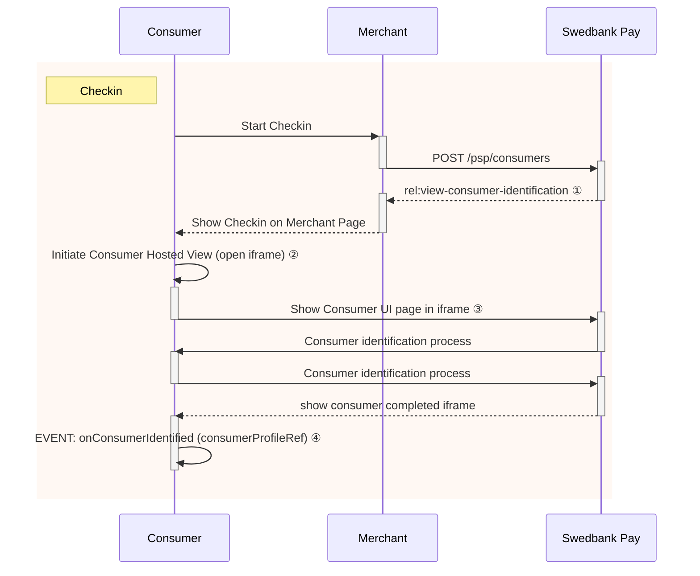

## Step 1: Initiate session for consumer identification

The payer will be identified with the `consumers` resource and will be
persisted to streamline future Payment Menu processes. Payer identification
is done through the `initiate-consumer-session` operation.



{:.code-view-header}
**Request**

```http
POST /psp/consumers HTTP/1.1
Host: {{ page.api_host }}
Authorization: Bearer <AccessToken>
Content-Type: application/json

{
    "operation": "initiate-consumer-session",
    "language": "sv-SE",
    "shippingAddressRestrictedToCountryCodes" : ["NO", "SE", "DK"],
    "requireShippingAddress": true
}
```

{:.table .table-striped}
|     Required     | Field                                     | Type     | Description                                                                                                                            |
| :--------------: | :---------------------------------------- | :------- | :------------------------------------------------------------------------------------------------------------------------------------- |
|  | `operation`                               | `string` | `initiate-consumer-session`, the operation to perform.                                                                                 |
|  | `language`                                | `string` | Selected language to be used in Checkin. Supported values are  |
|                  | `shippingAddressRestrictedToCountryCodes` | `string` | List of supported shipping countries for merchant. Using [ISO-3166] standard. This is required unless `requireShippingAddress` is set to false.                                                           |
|                  | `requireShippingAddress` | `bool` | Defaults to true. If set to false we will not collect a shipping address from the consumer.                                                            |

When the request has been sent, a response containing an array of operations that can be acted upon will be returned:

{:.code-view-header}
**Response**

```jsonc
{
    "token": "7e380fbb3196ea76cc45814c1d99d59b66db918ce2131b61f585645eff364871",
    "operations": [
        {   // Deprecated operation. Do not use!
            "method": "GET",
            "rel": "redirect-consumer-identification",
            "href": "{{ page.front_end_url }}/consumers/sessions/7e380fbb3196ea76cc45814c1d99d59b66db918ce2131b61f585645eff364871",
            "contentType": "text/html"
        },
        {
            "method": "GET",
            "rel": "view-consumer-identification",
            "href": "{{ page.front_end_url }}/consumers/core/scripts/client/px.consumer.client.js?token={{ page.payment_token }}",
            "contentType": "application/javascript"
        }
    ]
}
```

{:.table .table-striped}
| Field                 | Type     | Description                                                                                                                                       |
| :-------------------- | :------- | :------------------------------------------------------------------------------------------------------------------------------------------------ |
| `token`               | `string` | A session token used to initiate Checkout UI.                                                                                                     |
| `operations`          | `array`  | The array of operation objects to choose from, described in detail in the table below.                                                            |
| └➔&nbsp;`rel`         | `string` | The relational name of the operation, used as a programmatic identifier to find the correct operation given the current state of the application. |
| └➔&nbsp;`method`      | `string` | The HTTP method to use when performing the operation.                                                                                             |
| └➔&nbsp;`contentType` | `string` | The HTTP content type of the target URI. Indicates what sort of resource is to be found at the URI, how it is expected to be used and behave.     |
| └➔&nbsp;`href`        | `string` | The target URI of the operation.                                                                                                                  |

## Step 2: Display Swedbank Pay Checkin module

The response from the `POST` of consumer information contains a few operations.
The combination of `rel`, `method` and `contentType` should give you a clue how
the operation should be performed.
The `view-consumer-identification` operation
and its `application/javascript` content type gives us a clue that the
operation is meant to be embedded in a `<script>` element in an HTML document.

{% include alert.html type="warning"
                    icon="warning"
                    header=""
                    body="In our example we will focus on using the
                    `view-consumer-identification` solution.
                    The `redirect-consumer-identification` method redirects
                    the user to Swedbank's own site to handle the checkin
                    and is used in other implementations.
                    `redirect-consumer-identification` **should only be used in
                    test enviroments**. It is not suitable for the production
                    environment as there is no simple way of retrieving the
                    `consumerProfileRef`."%}

{:.code-view-header}
**HTML**

```html
<!DOCTYPE html>
<html>
    <head>
        <title>Swedbank Pay Checkout is Awesome!</title>
    </head>
    <body>
        <div id="checkin"></div>
        <div id="payment-menu"></div>
        <!-- Here you can specify your own javascript file -->
        <script src="<Your-JavaScript-File-Here>"></script>
    </body>
</html>
```



In the HTML, you only need to add two `<div>` elements to place the
check-in and payment menu inside of. The JavaScript will handle the rest when
it comes to handling the check-in and payment menu.

{:.code-view-header}
**JavaScript**

```js
var request = new XMLHttpRequest();

request.addEventListener('load', function () {
    // We will assume that our own backend returns the
    // exact same as what SwedbankPay returns.
    var response = JSON.parse(this.responseText);
    var script = document.createElement('script');
    // This assumes that the operations from the response of the POST from the
    // payment order is returned verbatim from the server to the Ajax:
    var operation = response.operations.find(function (o) {
        return o.rel === 'view-consumer-identification';
    });

    script.setAttribute('src', operation.href);
    script.onload = function () {
        payex.hostedView.consumer({
            // The container specifies which id the script will look for
            // to host the checkin component
            container: 'checkin',
            onConsumerIdentified: function onConsumerIdentified(consumerIdentifiedEvent) {
                // consumerIdentifiedEvent.consumerProfileRef contains the reference
                // to the identified consumer which we need to pass on to the
                // Payment Order to initialize a personalized Payment Menu.
                console.log(consumerIdentifiedEvent);
            },
            onShippingDetailsAvailable: function onShippingDetailsAvailable(shippingDetailsAvailableEvent) {
                console.log(shippingDetailsAvailableEvent);
            }
        }).open();
    };
    // Appending the script to the head
    var head = document.getElementsByTagName('head')[0];
    head.appendChild(script);
});

// Place in your own API endpoint here.
request.open('POST', '<Your-Backend-Endpoint-Here>', true);
request.setRequestHeader('Content-Type', 'application/json; charset=utf-8');
// In this example we'll send in all of the information mentioned before,
// in the request to the endpoint.
request.send(JSON.stringify({
    operation: 'initiate-consumer-session',
    language: 'sv-SE',
    shippingAddressRestrictedToCountryCodes: ['NO', 'SE']
}));
```



With the scripts loading in after the entire page is loaded, we can access the
`<div>` container that the Checkin will be hosted in.
After that has all loaded, you should see something like this:

{:.text-center}
![Consumer UI Start Page][checkin-start]{:width="425" height="275"}

As you can see, the payer's information is pre-filled as provided by the
initial `POST`.

From here, there are a three ways forward, depending on the consumer. If he or
she is already registered with a profile at Swedbank Pay, the information
already provided will be sufficient. The consumer can simply click proceed, and
the profile will appear on the page (with sensitive data masked).

If Swedbank Pay detects that the consumer hasn't registered any personal
details, two options are provided: Store details for future purchases or proceed
without storing details.

{:.text-center}
![Consumer UI New Consumer Options][checkin-options]{:width="425" height="475"}

If he or she chooses to store details, the next step is to enter their SSN.

{:.text-center}
![Consumer UI SSN][checkin-ssn]{:width="425" height="250"}

Once a valid SSN has been provided, a page for address details appears. When the
consumer has entered their address, the profile box shown above will be
displayed.

{:.text-center}
![Consumer UI Address][checkin-address]{:width="425" height="675"}

If the consumer opts out of storing their details, they will be sent directly to
the page for address details to enter their shipping address. This info is not
stored for future purchases. Please note that this is **not** the same as
shopping as a guest.

With a `consumerProfileRef` safely tucked into our pocket,
the Checkin is complete and we can move on to [Payment Menu][payment-menu].

A complete overview of how the process of identifying the payer through Checkin
is illustrated in the sequence diagram below.



If a browser refresh is performed after the payer has checked in, the payment
menu must be shown even though `onConsumerIdentified` is not invoked.

Additional events during Checkin  can also be implemented in the `configuration`
object, such as `onConsumerIdentified`, `onShippingDetailsAvailable`and
`onBillingDetailsAvailable`. Read more about these in the [Checkin
events][checkin-events] section.

### Note on consumer data

During this stage, some consumer data is stored. Read more about our [Data
Protection Policy][data-protection] for details on which information we store
and its duration.



[checkin-address]: /assets/img/checkout/checkin-address.png
[checkin-start]: /assets/img/checkout/checkin-email-msisdn.png
[checkin-options]: /assets/img/checkout/checkin-options.png
[checkin-ssn]: /assets/img/checkout/checkin-ssn.png
[checkin-events]: /checkout/other-features#checkin-events
[data-protection]: /resources/data-protection#paymentorder-consumer-data
[payment-menu]: payment-menu
[iso-3166]: https://www.iso.org/iso-3166-country-codes.html
