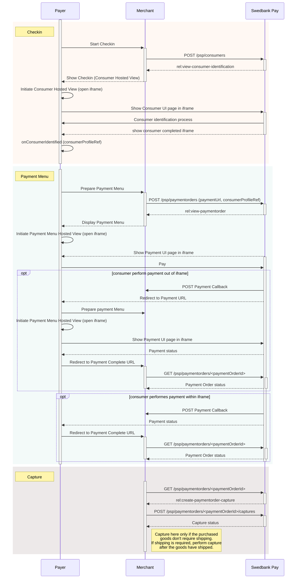





Swedbank Pay Checkout allows your customers to be identified with Swedbank Pay,
enabling existing Swedbank Pay Checkout users to pay with their favorite payment
methods in just a few simple steps.

## Prerequisites

To start integrating Swedbank Pay Checkout, you need the following:

* [HTTPS][https] enabled web server
* Agreement that includes Swedbank Pay Checkout
* Obtained credentials (merchant Access Token) from Swedbank Pay through
  Swedbank Pay Admin. Please observe that Swedbank Pay Checkout encompass
  both the **`consumer`** and **`paymentmenu`** scope

## Introduction

To get started with Swedbank Pay Checkout, you should learn about its different
components and how they work together. Swedbank Pay Checkout consists of two related,
but disconnected concepts: **Checkin** and **Payment Menu**. Checkin identifies
the consumer in our Consumer API and Payment Menu completes the payment with
our Payment Menu API. Connect the two concepts and you have Swedbank Pay Checkout.



[https]: /#connection-and-protocol
[payment-order]: /checkout/payment#payment-orders
