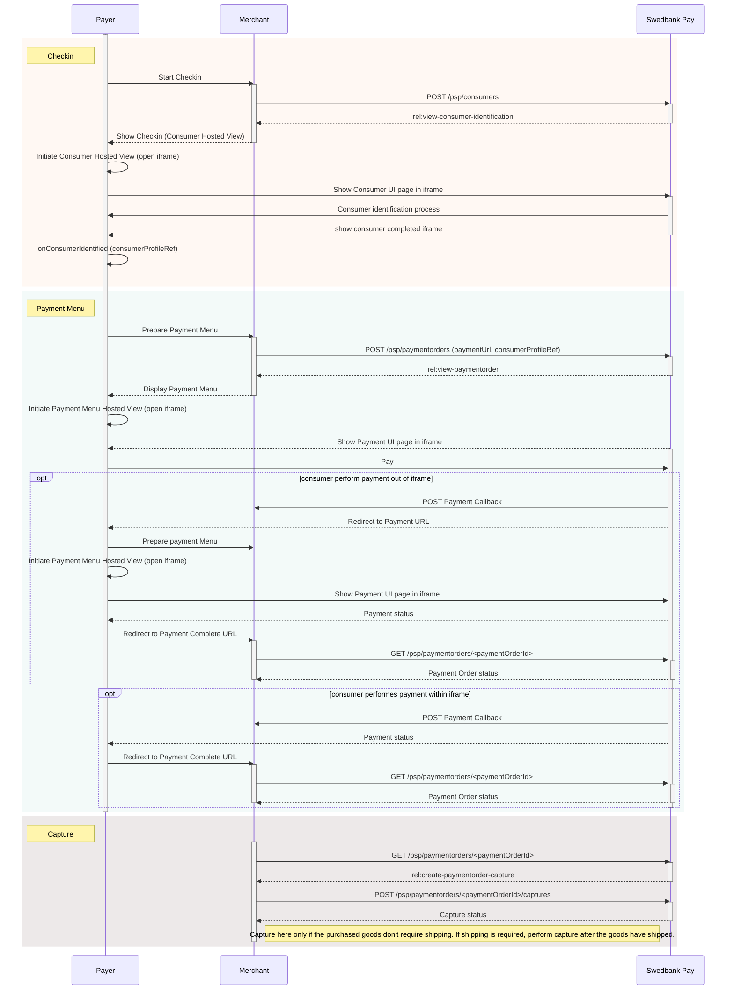





Swedbank Pay Checkout allows your customers to be identified with Swedbank Pay,
enabling existing Swedbank Pay Checkout users to pay with their favorite payment
methods in just a few simple steps.

## Prerequisites

To start integrating Swedbank Pay Checkout, you need the following:

* [HTTPS][https] enabled web server
* Agreement that includes Swedbank Pay Checkout
* Obtained credentials (merchant Access Token) from Swedbank Pay through
  Swedbank Pay Admin. Please observe that Swedbank Pay Checkout encompass
  both the **`consumer`** and **`paymentmenu`** scope.

## Introduction

To get started with Swedbank Pay Checkout, you should learn about its different
components and how they work together. Swedbank Pay Checkout consists of two related,
but disconnected concepts: **Checkin** and **Payment Menu**. Checkin identifies
the consumer in our Consumer API and Payment Menu completes the payment with
our Payment Menu API. Connect the two concepts and you have Swedbank Pay Checkout.



### Payment Url

For our hosted views solution in Checkout (using
[Payment Order][payment-order]), we have a URL property called `paymentUrl`
that will be used if the consumer is redirected out of the hosted view
(the `iframe`). The consumer is redirected out of `iframe` when selecting
payment methods Vipps or in the 3D secure verification for credit card
payments.

The URL should represent the page of where the payment hosted view was hosted
originally, such as the checkout page, shopping cart page, or similar.
Basically, `paymentUrl` should be set to the same URL as that of the page
where the JavaScript for the hosted payment view was added to in order to
initiate the payment. Please note that the `paymentUrl` must be able to invoke
the same JavaScript URL from the same Payment or Payment Order as the one that
initiated the payment originally, so it should include some sort of state
identifier in the URL. The state identifier is the ID of the order, shopping
cart or similar that has the URL of the Payment or Payment Order stored.

If `paymentUrl` is not supplied, retry of payments will not be possible in
[Payment Order][payment-order], which makes it more tedious to retry payment
as the whole process including the creation of the payment order needs to
be performed again.

With `paymentUrl` in place, the retry process becomes much more convenient for
both the integration and the payer.

## Checkin

As mentioned, Swedbank Pay Checkout consists of two parts: **Checkin** and
**Payment Menu**. In the sections that follow you'll find examples of the
HTTP requests, responses and HTML code you will need to implement in order to
complete the Swedbank Pay Checkout integration. Before Checkout you have to
Checkin. Obviously! To check in, the payer needs to be identified.

### Checkin Back End

The payer will be identified with the `consumers` resource and will be
persisted to streamline future Payment Menu processes. Payer identification
is done through the `initiate-consumer-session` operation. In the request body,
all properties are optional. The more information that is provided, the easier
the identification process becomes for the payer.
[See the technical reference for details][initiate-consumer-session].

{:.code-header}
**Request**

```http
POST /psp/consumers HTTP/1.1
Host: api.externalintegration.payex.com
Authorization: Bearer <MerchantToken>
Content-Type: application/json

{
    "operation": "initiate-consumer-session",
    "msisdn": "+4798765432",
    "email": "olivia.nyhuus@example.com",
    "consumerCountryCode": "NO",
    "nationalIdentifier": {
        "socialSecurityNumber": "26026708248",
        "countryCode": "NO"
    }
}
```

{:.table .table-striped}
| ✔︎︎︎︎︎ | Property             | Type     |  Description |
|:-:|:----------------------|----------|:-------------|
| ✔︎︎︎︎︎ | `operation`          | `string` | `initiate-consumer-session`, the operation to perform.
|   | `msisdn`              | `string` | The [MSISDN][msisdn] (mobile phone number) of the payer. Format Sweden: `+46707777777`. Format Norway: `+4799999999`.
|   | `email`               | `string` | The e-mail address of the payer.
|   | `consumerCountryCode` | `string` | Consumers country of residence. Used by the consumerUi for validation on all input fields.
|   | `nationalIdentifier`  | `object` | The object containing information about the national identifier of the consumer.
|   | ↳ `socialSecurityNumber` | `string` | The social security number of the payer. Format: Norway `DDMMYYXXXXX`, Sweden: `YYYYMMDDXXXX`.
|   | ↳ `countryCode`          | `string` | The country code, denoting the origin of the issued social security number. Required if `nationalIdentifier.socialSecurityNumber` is set.

When the request has been sent, a response containing an array of operations that can be acted upon will be returned.

{:.code-header}
**Response**

```http
HTTP/1.1 200 OK
Content-Type: application/json

{
    "token": "7e380fbb3196ea76cc45814c1d99d59b66db918ce2131b61f585645eff364871",
    "operations": [
        {
            "rel": "view-consumer-identification",
            "method": "GET",
            "contentType": "application/javascript",
            "href": "https://ecom.externalintegration.payex.com/consumers/core/scripts/client/px.consumer.client.js?token=7e380fbb3196ea76cc45814c1d99d59b66db918ce2131b61f585645eff364871",
        }
    ]
}
```

{:.table .table-striped}
| Property             | Type     |  Description |
|:---------------------|----------|:-------------|
| `token`              | `string` | A session token used to initiate Checkout UI.
| `operations`         | `array`  | The array of operation objects to choose from, described in detail in the table below.

**`operations` Object Properties**

{:.table .table-striped}
| Property      | Type     |  Description |
|:--------------|----------|:-------------|
| `rel`         | `string` | The relational name of the operation, used as a programmatic identifier to find the correct operation given the current state of the application.
| `method`      | `string` | The HTTP method to use when performing the operation.
| `contentType` | `string` | The HTTP content type of the target URI. Indicates what sort of resource is to be found at the URI, how it is expected to be used and behave.
| `href`        | `string` | The target URI of the operation.

### Checkin Front End

The response from the `POST` of consumer information contains a few operations.
The combination of `rel`, `method` and `contentType` should give you a clue how
the operation should be performed. The `view-consumer-identification` operation
and its `application/javascript` content type gives us a clue that the
operation is meant to be embedded in a `<script>` element in an HTML document.
[See the technical reference for details][view-consumer-identification].

{:.code-header}
**HTML**

```html
<!DOCTYPE html>
<html>
    <head>
        <title>Swedbank Pay Checkout is Awesome!</title>
    </head>
    <body>
        <div id="checkin"></div>
        <div id="payment-menu"></div>
        <script src="https://ecom.externalintegration.payex.com/consumers/core/scripts/client/px.consumer.client.js?token=7e380fbb3196ea76cc45814c1d99d59b66db918ce2131b61f585645eff364871"></script>
        <script language="javascript">
            payex.hostedView.consumer({
                container: "checkin",
                onConsumerIdentified: function(consumerIdentifiedEvent) {
                    // consumerIdentifiedEvent.consumerProfileRef contains the reference
                    // to the identified consumer which we need to pass on to the
                    // Payment Order to initialize a personalized Payment Menu.
                    console.log(consumerIdentifiedEvent);
                },
                onShippingDetailsAvailable: function(shippingDetailsAvailableEvent) {
                    console.log(shippingDetailsAvailableEvent);
                }
            }).open();
        </script>
    </body>
</html>
```

Note that the `<script>` element is added after the `<div>` container the
Checkin will be hosted in. When this is set up, something along the
following should appear:

(% style="text-align:center" %)
[[image:Consumer.PNG||alt="Consumer UI"]]

As you can see, the payer's information is pre-filled as provided by the
initial `POST`. When the payer completes the checkin, the events
`onConsumerIdentified` and `onShippingDetailsAvailable` will be raised with
the following argument objects:

{:.code-header}
**Consumer Identified Event Argument Object**

```json
{
    "actionType": "OnConsumerIdentified",
    "consumerProfileRef": "7d5788219e5bc43350e75ac633e0480ab30ad20f96797a12b96e54da869714c4"
}
```

{:.code-header}
**Shipping Details Available Event Argument Object**

```json
{
    "actionType": "OnShippingDetailsAvailable",
    "url": "https://api.externalintegration.payex.com/psp/consumers/<consumerProfileRef>/shipping-details"
}
```

With a `consumerProfileRef` safely tucked into our pocket, the Checkin is
complete and we can move on to checkout.

## Payment Menu

Payment Menu begins where checkin left off, in much the same way that the
checkin process progressed.

### Payment Menu Back End

We start by performing a `POST` request towards the `paymentorder` resource
with the `consumerProfileRef` we obtained in the checkin process described
above. [See the technical reference for details][payment-order].

{:.code-header}
**Request**

```http
POST /psp/paymentorders HTTP/1.1
Host: api.externalintegration.payex.com
Authorization: Bearer <MerchantToken>
Content-Type: application/json

{
    "paymentorder": {
        "operation": "Purchase",
        "currency": "NOK",
        "amount": 15610,
        "vatAmount": 3122,
        "description": "Test Purchase",
        "userAgent": "Mozilla/5.0...",
        "language": "nb-NO",
        "urls": {
            "hostUrls": ["https://example.com", "https://example.net"],
            "completeUrl": "https://example.com/payment-completed",
            "cancelUrl": "https://example.com/payment-canceled",
            "paymentUrl": "https://example.com/perform-payment",
            "callbackUrl": "https://api.example.com/payment-callback",
            "termsOfServiceUrl": "https://example.com/termsandconditoons.pdf"
        },
        "payeeInfo": {
            "payeeId": "12345678-1234-1234-1234-123456789012",
            "payeeReference": "CD1234",
            "payeeName": "Merchant1",
            "productCategory": "A123",
            "orderReference" : "or-123456"
        },
        "payer": {
            "consumerProfileRef": "7d5788219e5bc43350e75ac633e0480ab30ad20f96797a12b96e54da869714c4"
        },
        "orderItems": [
            {
                "reference": "P1",
                "name": "Product1",
                "type": "PRODUCT",
                "class": "ProductGroup1",
                "itemUrl": "https://example.com/products/123",
                "imageUrl": "https://example.com/product123.jpg",
                "description": "Product 1 description",
                "discountDescription": "Volume discount",
                "quantity": 4,
                "quantityUnit": "pcs",
                "unitPrice": 300,
                "discountPrice": 200,
                "vatPercent": 2500,
                "amount": 1000,
                "vatAmount": 250
            },
            {
                "reference": "P2",
                "name": "Product2",
                "type": "PRODUCT",
                "class": "ProductGroup1",
                "description": "Product 2 description",
                "quantity": 1,
                "quantityUnit": "pcs",
                "unitPrice": 500,
                "vatPercent": 2500,
                "amount": 500,
                "vatAmount": 125
            }
        ]
    }
}
```

(% class="table-bordered table-striped" %)
|=Property|=Type|=(% style="text-align:center" %)Required|=Description
|`paymentorder`|`object`|(% style="text-align:center" %)Y|The payment order object.
|`paymentorder.operation`|`string`|(% style="text-align:center" %)Y|The operation that the payment order is supposed to perform.
|`paymentorder.currency`|`string`|(% style="text-align:center" %)Y|The currency of the payment.
|`paymentorder.amount`|`integer`|(% style="text-align:center" %)Y|The amount including VAT in the lowest monetary unit of the currency. E.g. `10000` equals 100.00 NOK and `5000` equals 50.00 NOK.
|`paymentorder.vatAmount`|`integer`|(% style="text-align:center" %)Y|The amount of VAT in the lowest monetary unit of the currency. E.g. `10000` equals 100.00 NOK and `5000` equals 50.00 NOK.
|`paymentorder.description`|`string`|(% style="text-align:center" %)Y|The description of the payment order.
|`paymentorder.userAgent`|`string`|(% style="text-align:center" %)Y|The user agent of the payer.
|`paymentorder.language`|`string`|(% style="text-align:center" %)Y|The language of the payer.
|`paymentorder.urls.hostUrls`|`array`|(% style="text-align:center" %)Y|The array of URIs valid for embedding of Swedbank Pay Hosted Views.
|`paymentorder.urls.completeUrl`|`string`|(% style="text-align:center" %)Y|The URI to redirect the payer to once the payment is completed.
|`paymentorder.urls.cancelUrl`|`string`|(% style="text-align:center" %)N|The URI to redirect the payer to if the payment is canceled. Only used in redirect scenarios. Can not be used simultaneously with `paymentUrl`; only `cancelUrl` or `paymentUrl` can be used, not both.
|`paymentorder.urls.paymentUrl`|`string`|(% style="text-align:center" %)N|The URI that Swedbank Pay will redirect back to when the payment menu needs to be loaded, to inspect and act on the current status of the payment. Only used in hosted views. Can not be used simultaneously with `cancelUrl`; only `cancelUrl` or `paymentUrl` can be used, not both.
|`paymentorder.urls.callbackUrl`|`string`|(% style="text-align:center" %)N|The URI to the API endpoint receiving `POST` requests on transaction activity related to the payment order.
|`paymentorder.urls.termsOfServiceUrl`|`string`|(% style="text-align:center" %)Y|The URI to the terms of service document the payer must accept in order to complete the payment. Requires `https`.
|`paymentorder.payeeInfo.payeeId`|`string`|(% style="text-align:center" %)Y|The ID of the payee, usually the merchant ID.
|`paymentorder.payeeInfo.payeeReference`|`string(30)`|(% style="text-align:center" %)Y|A unique reference from the merchant system. It is set per operation to ensure an exactly-once delivery of a transactional operation. See [[payeeReference>>doc:Main.ecommerce.technical-reference.WebHome||anchor="HPayeeReference"]] for details.
|`paymentorder.payeeInfo.payeeName`|`string`|(% style="text-align:center" %)N|The name of the payee, usually the name of the merchant.
|`paymentorder.payeeInfo.productCategory`|`string`|(% style="text-align:center" %)N|A product category or number sent in from the payee/merchant. This is not validated by Swedbank Pay, but will be passed through the payment process and may be used in the settlement process.
|`paymentorder.payeeInfo.orderReference`|`string(50)`|(% style="text-align:center" %)N|The order reference should reflect the order reference found in the merchant's systems.
|`paymentorder.payer.consumerProfileRef`|`string`|(% style="text-align:center" %)N|The consumer profile reference as obtained through the [[Consumers>>doc:Main.ecommerce.technical-reference.consumers-resource.WebHome]] API.
|`paymentorder.orderItems`|`array`|(% style="text-align:center" %)N|The array of items being purchased with the order. Used to print on invoices if the payer chooses to pay with invoice, among other things
|`paymentorder.orderItems[].reference`|`string`|(% style="text-align:center" %)Y|A reference that identifies the order item.
|`paymentorder.orderItems[].name`|`string`|(% style="text-align:center" %)Y|The name of the order item.
|`paymentorder.orderItems[].type`|`string`|(% style="text-align:center" %)Y|`PRODUCT`, `SERVICE`, `SHIPPING_FEE`, `DISCOUNT`, `VALUE_CODE` or `OTHER`. The type of the order item.
|`paymentorder.orderItems[].class`|`string`|(% style="text-align:center" %)Y|The classification of the order item. Can be used for assigning the order item to a specific product category, for instance. Swedbank Pay has no use for this value itself, but it's useful for some payment instruments and integrations.
|`paymentorder.orderItems[].itemUrl`|`string`|(% style="text-align:center" %)N|The URL to a page that contains a human readable description of the order item, or similar.
|`paymentorder.orderItems[].imageUrl`|`string`|(% style="text-align:center" %)N|The URL to an image of the order item.
|`paymentorder.orderItems[].description`|`string`|(% style="text-align:center" %)N|The human readable description of the order item.
|`paymentorder.orderItems[].discountDescription`|`string`|(% style="text-align:center" %)N|The human readable description of the possible discount.
|`paymentorder.orderItems[].quantity`|`integer`|(% style="text-align:center" %)Y|The quantity of order items being purchased.
|`paymentorder.orderItems[].quantityUnit`|`string`|(% style="text-align:center" %)Y|The unit of the quantity, such as `pcs`, `grams`, or similar.
|`paymentorder.orderItems[].unitPrice`|`integer`|(% style="text-align:center" %)Y|The price per unit of order item.
|`paymentorder.orderItems[].discountPrice`|`integer`|(% style="text-align:center" %)N|If the order item is purchased at a discounted price, this property should contain that price.
|`paymentorder.orderItems[].vatPercent`|`integer`|(% style="text-align:center" %)Y|The percent value of the VAT multiplied by 100, so `25%` becomes `2500`.
|`paymentorder.orderItems[].amount`|`integer`|(% style="text-align:center" %)Y|The total amount including VAT to be paid for the specified quantity of this order item, in the lowest monetary unit of the currency. E.g. `10000` equals `100.00 NOK` and `500`0 equals `50.00 NOK`.
|`paymentorder.oredrItems[].vatAmount`|`integer`|(% style="text-align:center" %)Y|The total amount of VAT to be paid for the specified quantity of this order item, in the lowest monetary unit of the currency. E.g. `10000` equals `100.00 NOK` and `500`0 equals `50.00 NOK`.

The response back should look something like this (abbreviated for brevity):

{:.code-header}
**Response**
```http
HTTP/1.1 201 Created
Content-Type: application/json

{
    "paymentorder": {
      "id": "/psp/paymentorders/b80be381-b572-4f1e-9691-08d5dd095bc4"
    },
    "operations": [
        {
            "href": "https://ecom.externalintegration.payex.com/paymentmenu/core/scripts/client/px.paymentmenu.client.js?token=38540e86bd78e885fba2ef054ef9792512b1c9c5975cbd6fd450ef9aa15b1844&culture=nb-NO",
            "rel": "view-paymentorder",
            "method": "GET",
            "contentType": "application/javascript"
        }
    ]
}
```

**Response Properties**

(% class="table-bordered table-striped" %)
|=Property|=Type|=Description|=
|`paymentorder`|`object`|The payment order object.|
|`paymentorder.id`|`string`|The relative URI to the payment order.|
|`paymentorder.operations`|`array`|(((
The array of possible operations to perform, given the state of the payment order.
)))

The `paymentorder` object is abbreviated since it's just the `id` and `operations` we are interested in. Store the `id` of the Payment Order in your system to look up status on the completed payment later.

Then find the `view-paymentorder` operation and embed its `href` a `<script>`. That script will then load the hosted view for the Payment Menu. We will look into how to hook that up next.

=== Payment Menu Front End ===

To load the payment menu from the JavaScript URL obtained in the back end API response, it needs to be set as a `script` element's `src` attribute. You can cause a page reload and do this with static HTML or you can avoid the page refresh by invoking the POST to create the payment order through Ajax and then create the script element with JavaScript, all inside the event handler for `onConsumerIdentified`. [[See the technical reference for details>>doc:Main.ecommerce.payex-checkout-main.payex-checkout-standard-setup.technical-reference.WebHome||anchor="HViewPaymentOrder"]].

You also can [[customize the styling>>doc:Main.ecommerce.technical-reference.payment-orders-resource.WebHome||anchor="HPaymentMenuStyling"]] of the Payment Menu by adding style properties to the JavaScript function call.

{:.code-header}
**HTML**
```html
<!DOCTYPE html>
<html>
    <head>
        <title>Swedbank Pay Checkout is Awesome!</title>
    </head>
    <body>
        <div id="checkin"></div>
        <div id="payment-menu"></div>
        <script src="https://ecom.externalintegration.payex.com/consumers/core/scripts/client/px.consumer.client.js?token=7e380fbb3196ea76cc45814c1d99d59b66db918ce2131b61f585645eff364871"></script>
        <script language="javascript">
                payex.hostedView.consumer({
                    container: 'checkin',
                    culture: 'nb-NO',
                    onConsumerIdentified: function(consumerIdentifiedEvent) {
                        // When the consumer is identified, we need to perform an AJAX request
                        // to our server to forward the consumerProfileRef in a server-to-server
                        // POST request to the Payment Orders resource in order to initialize
                        // the Payment Menu.
                        var request = new XMLHttpRequest();
                        request.addEventListener('load', function() {
                            response = JSON.parse(this.responseText);

                            var script = document.createElement('script');
                            // This assumses the operations from the response of the POST of the
                            // payment order is returned verbatim from the server to the Ajax:
                            var operation = response.operations.find(function(o) { o.rel === 'view-paymentorder' });
                            script.setAttribute('src', operation.href);
                            script.onload = function() {
                                // When the 'view-paymentorder' script is loaded, we can initialize the
                                // Payment Menu inside our 'payment-menu' container.
                                payex.hostedView.paymentMenu({
                                    container: 'payment-menu',
                                    culture: 'nb-NO'
                                }).open();
                            };
                            // Append the Payment Menu script to the <head>
                            var head = document.getElementsByTagName('head')[0];
                            head.appendChild(script);
                        });
                        // This example just performs the POST request of the Consumer Identified
                        // Event Argument to the same URL as the current one.
                        request.open('POST', window.location.href, true);
                        request.setRequestHeader('Content-Type', 'application/json; charset=utf-8');
                        // In this example, we send the entire Consumer Identified Event Argument
                        // Object as JSON to the server, as it contains the consumerProfileRef.
                        request.send(JSON.stringify(consumerIdentifiedEvent));
                    }
                }).open();
        </script>
    </body>
</html>
```

This should bring up the Payment Menu in a hosted view, looking something like this:

(% style="text-align:center" %)
[[image:1551693185782-957.png||width="458" height="629"]]


When the consumer completes the payment, the Payment Menu script will be signalled and a full redirect to the `completeUrl` sent in with the Payment Order will be performed. When the `completeUrl` on your server is hit, you can inspect the status on the stored `paymentorder.id` on the server, and perform capture – unless the goods are sent physically to the payer; then you should await capture until after the goods have been sent.

You may open and close the payment menu using `.open()` and `.close()` functions. You can also invoke `.refresh()` to [[update the Payment Menu>>doc:Main.ecommerce.technical-reference.payment-orders-resource.WebHome||anchor="HOperations"]] after any changes to the order.

== Operations ==

When a payment order is created and especially after the payment is complete on the consumer's end, you need to implement the relevant order management operations in your order system. Most payment methods are two-phase payments - in which a successful paymentorder will result in an authorized transaction, that must be followed up by a capture or cancellation transaction in a later stage. One-phase payments like Swish are settled directly without the option to capture or cancel. For a full list of the available operations, see the [[techincal reference>>doc:Main.ecommerce.technical-reference.payment-orders-resource.WebHome||anchor="HOperations"]].

(% class="table-bordered table-striped" %)
|**Operation**|**Description**
|`update-paymentorder-updateorder`|[[Updates the order>>.||anchor="HUpdateOrder"]] with a change in the `amount` and/or `vatAmount`.
|`create-paymentorder-capture`|The second part of a two-phase transaction where the authorized amount is sent from the payer to the payee. It is possible to do a part-capture on a subset of the authorized amount. Several captures on the same payment are possible, up to the total authorization amount.
|`create-paymentorder-cancellation`|Used to cancel authorized and not yet captured transactions. If a cancellation is performed after doing a part-capture, it will only affect the not yet captured authorization amount.
|`create-paymentorder-reversal`|Used to reverse a payment. It is only possible to reverse a payment that has been captured and not yet reversed.

To identify the operations that are available we need to do a `GET` request against the URL of `paymentorder.id`:

{{code language="http" title="**Request**" cssClass="http"}}
GET /psp/paymentorders/b80be381-b572-4f1e-9691-08d5dd095bc4 HTTP/1.1
Authorization: Bearer <MerchantToken>
```

The (abbreviated) response containing an `updateorder`, `capture`, `cancellation`, and `reversal` operation should look similar to the response below:

{:.code-header}
**Response**
```http
HTTP/1.1 200 OK
Content-Type: application/json

{
    "paymentOrder": {
        "id": "/psp/paymentorders/b80be381-b572-4f1e-9691-08d5dd095bc4",
    },
    "operations": [
        {
            "method": "PATCH",
            "href": "https://api.externalintegration.payex.com/psp/paymentorders/b80be381-b572-4f1e-9691-08d5dd095bc4",
            "rel": "update-paymentorder-updateorder",
            "contentType": "application/json"
        },
        {
            "method": "POST",
            "href": "https://api.externalintegration.payex.com/psp/paymentorders/b80be381-b572-4f1e-9691-08d5dd095bc4/captures",
            "rel": "create-paymentorder-capture",
            "contentType": "application/json"
        },
        {
            "method": "POST",
            "href": "https://api.externalintegration.payex.com/psp/paymentorders/b80be381-b572-4f1e-9691-08d5dd095bc4/cancellations",
            "rel": "create-paymentorder-cancellation",
            "contentType": "application/json"
        },
        {
            "method": "POST",
            "href": "https://api.externalintegration.payex.com/psp/paymentorders/b80be381-b572-4f1e-9691-08d5dd095bc4/reversals",
            "rel": "create-paymentorder-reversal",
            "contentType": "application/json"
        }
    ]
}

```

**Response Properties**

(% class="table-bordered table-striped" %)
|=Property|=Type|=Description
|`paymentorder`|`object`|The payment order object.
|`paymentorder.id`|`string`|The relative URI to the payment order.
|`paymentorder.operations`|`array`|The array of possible operations to perform, given the state of the payment order.

=== Update Order ===

Change amount and vat amount on a payment order. If you implement `updateorder` **you need to `refresh()`** the [[Payment Menu front end>>doc:Main.ecommerce.payex-checkout-main.payex-checkout-standard-setup.WebHome||anchor="HPaymentMenuFrontEnd"]] so the new amount is shown to the end customer.

{:.code-header}
**Request**
```http
PATCH /psp/paymentorders/b80be381-b572-4f1e-9691-08d5dd095bc4 HTTP/1.1
Authorization: Bearer <MerchantToken>
Content-Type: application/json

{
    "paymentorder": {
        "operation": "UpdateOrder",
        "amount": 2500,
        "vatAmount": 120
    }
}
```

**Response**

The response given when changing a payment order is equivalent to a {{code}}GET``` request towards the {{code}}paymentorders``` resource, [[as displayed above>>doc:Main.ecommerce.technical-reference.payment-orders-resource.WebHome||anchor="HPaymentOrders"]]. Remember to call .refresh() on the Payment Menu in JavaScript

=== Capture ===

Capture can only be done on a payment with a successful authorized transaction. It is possible to do a part-capture where you only capture a smaller amount than the authorized amount. You can later do more captures on the same payment up to the total authorization amount.

To capture the authorized payment, we need to perform `create-paymentorder-capture `against the accompanying href returned in the` operations `list. See the abbreviated request and response below:

{:.code-header}
**Request**
```http
POST /psp/paymentorders/b80be381-b572-4f1e-9691-08d5dd095bc4/captures HTTP/1.1
Host: api.externalintegration.payex.com
Authorization: Bearer <MerchantToken>
Content-Type: application/json

{
    "transaction": {
        "description": "Capturing the authorized payment",
        "amount": 15610,
        "vatAmount": 3122,
        "payeeReference": "AB832"
    }
}
```

**Request Properties**

(% class="table-bordered table-striped" %)
|=Property|=Type|=(% style="text-align:center" %)Required|=Description
|`transaction`|`object`|(% style="text-align:center" %)Y|The transaction object.
|`transaction.description`|`string`|(% style="text-align:center" %)Y|The description of the capture transaction.
|`transaction.amount`|`integer`|(% style="text-align:center" %)Y|The amount including VAT in the lowest monetary unit of the currency. E.g. `10000` equals 100.00 NOK and `5000` equals 50.00 NOK.
|`transaction.vatAmount`|`integer`|(% style="text-align:center" %)Y|The amount of VAT in the lowest monetary unit of the currency. E.g. `10000` equals 100.00 NOK and `5000` equals 50.00 NOK.
|`transaction.payeeReference`|`string(30)`|(% style="text-align:center" %)Y|A unique reference from the merchant system. It is set per operation to ensure an exactly-once delivery of a transactional operation. See [[payeeReference>>doc:Main.ecommerce.technical-reference.WebHome||anchor="HPayeeReference"]] for details.
|`transaction.vatSummary`|`array`|(% style="text-align:center" %)Y|The array of VAT summaries to be printed on an invoice if the payer chooses to pay with invoice. One VAT summary object per VAT rate should be supplied.
|`transaction.vatSummary[].amount`|`integer`|(% style="text-align:center" %)Y|The total amount for all items having the VAT rate specified in `vatPercent`, including VAT in the lowest monetary unit of the currency.
|`transaction.vatSummary[].vatAmount`|`integer`|(% style="text-align:center" %)Y|The total amount of VAT for all items having the VAT rate specified in `vatPercent`, in the lowest monetary unit of the currency.
|`transaction.vatSummary[].vatPercent`|`integer`|(% style="text-align:center" %)Y|The VAT rate specified as an integer; e.g. `2500` equals 25%.

If the capture succeeds, it should respond with something like the following:

{:.code-header}
**Response**
```http
HTTP/1.1 200 OK
Content-Type: application/json

{
    "payment": "/psp/creditcard/payments/d34bceb7-2b19-488a-cbf2-08d5df73b251",
    "capture": {
        "id": "/psp/creditcard/payments/d34bceb7-2b19-488a-cbf2-08d5df73b251/captures/af43be30-8dfa-4458-2222-08d5df73b9f1",
        "transaction": {
            "id": "/psp/creditcard/payments/d34bceb7-2b19-488a-cbf2-08d5df73b251/transactions/af43be30-8dfa-4458-2222-08d5df73b9f1",
            "type": "Capture",
            "state": "Completed",
            "amount": 15610,
            "vatAmount": 3122,
            "description": "Capturing the authorized payment",
            "payeeReference": "AB832",
        }
    }
}
```

**Response Properties**

(% class="table-bordered table-striped" %)
|=Property|=Data type|=Description
|`payment`|`string`|The relative URI of the payment this capture transaction belongs to.
|`capture.id`|`string`|The relative URI of the created capture transaction.
|`capture.transaction`|`object`|The object representation of the generic [[`transaction` resource>>doc:Main.ecommerce.technical-reference.core-payment-resources.WebHome||anchor="HTransactions"]].

(% class="wikigeneratedid" %)
**Et voilà! **Checkout should now be complete, the payment should be secure and everyone should be happy. But, sometimes you also need to implement the cancellation and reversal operations described below.

=== Cancel ===

If we want to cancel up to the total authorized (not captured) amount, we need to perform `create-paymentorder-cancel `against the accompanying href returned in the` operations `list. See the abbreviated request and response below:

{:.code-header}
**Request**
```http
POST /psp/paymentorders/b80be381-b572-4f1e-9691-08d5dd095bc4/cancellations HTTP/1.1
Host: api.externalintegration.payex.com
Authorization: Bearer <MerchantToken>
Content-Type: application/json

{
    "transaction": {
        "payeeReference": "ABC123",
        "description": "Cancelling parts of the total amount"
    }
}
```

**Request Properties**

(% class="table-bordered table-striped" %)
|=Property|=Type|=(% style="text-align:center" %)Required|=Description
|`transaction.payeeReference`|`string(30)`|(% style="text-align:center" %)Y|A unique reference from the merchant system. It is set per operation to ensure an exactly-once delivery of a transactional operation. See [[payeeReference>>doc:Main.ecommerce.technical-reference.WebHome||anchor="HPayeeReference"]] for details.
|`transaction.description`|`string`|(% style="text-align:center" %)Y|A textual description of why the transaction is cancelled.

If the cancellation request succeeds, the response should be similar to the example below:

{:.code-header}
**Response**
```http
HTTP/1.1 200 OK
Content-Type: application/json

{
    "payment": "/psp/creditcard/payments/d34bceb7-2b19-488a-cbf2-08d5df73b251",
    "cancellation": {
        "id": "/psp/creditcard/payments/d34bceb7-2b19-488a-cbf2-08d5df73b251/cancellations/af43be30-8dfa-4458-2222-08d5df73b9f1",
        "transaction": {
            "id": "/psp/creditcard/payments/d34bceb7-2b19-488a-cbf2-08d5df73b251/transactions/af43be30-8dfa-4458-2222-08d5df73b9f1",
            "type": "Cancel",
            "state": "Completed",
            "amount": 5610,
            "vatAmount": 1122,
            "description": "Cancelling parts of the authorized payment",
            "payeeReference": "AB832",
        }
    }
}
```

**Response Properties**

(% class="table-bordered table-striped" %)
|=Property|=Data type|=Description
|`payment`|`string`|The relative URI of the payment this capture transaction belongs to.
|`cancellation.id`|`string`|The relative URI of the created capture transaction.
|`cancellation.transaction`|`object`|The object representation of the generic [[`transaction` resource>>doc:Main.ecommerce.technical-reference.core-payment-resources.WebHome||anchor="HTransactions"]].

=== Reversal ===

If we want to reverse a previously captured amount, we need to perform `create-paymentorder-reversal `against the accompanying href returned in the` operations `list. See the abbreviated request and response below:

{:.code-header}
**Request**
```http
POST /psp/paymentorders/b80be381-b572-4f1e-9691-08d5dd095bc4/reversals HTTP/1.1
Host: api.externalintegration.payex.com
Authorization: Bearer <MerchantToken>
Content-Type: application/json

{
    "transaction": {
        "amount": 15610,
        "vatAmount": 3122,
        "payeeReference": "ABC123",
        "description": "description for transaction"
    }
}
```

**Request Properties**

(% class="table-bordered table-striped" %)
|=Property|=Type|=(% style="text-align:center" %)Required|=Description
|`transaction.amount`|`integer`|(% style="text-align:center" %)Y|The amount including VAT in the lowest monetary unit of the currency. E.g. `10000` equals 100.00 NOK and `5000` equals 50.00 NOK.
|`transaction.vatAmount`|`integer`|(% style="text-align:center" %)Y|The amount of VAT in the lowest monetary unit of the currency. E.g. `10000` equals 100.00 NOK and `5000` equals 50.00 NOK.
|`transaction.payeeReference`|`string(30)`|(% style="text-align:center" %)Y|A unique reference from the merchant system. It is set per operation to ensure an exactly-once delivery of a transactional operation. See [[payeeReference>>doc:Main.ecommerce.technical-reference.WebHome||anchor="HPayeeReference"]] for details.
|`transaction.description`|`string`|(% style="text-align:center" %)Y|Textual description of why the transaction is reversed.

If the reversal request succeeds, the response should be similar to the example below:

{:.code-header}
**Response**
```http
HTTP/1.1 200 OK
Content-Type: application/json

{
    "payment": "/psp/creditcard/payments/d34bceb7-2b19-488a-cbf2-08d5df73b251",
    "reversals": {
        "id": "/psp/creditcard/payments/d34bceb7-2b19-488a-cbf2-08d5df73b251/cancellations/af43be30-8dfa-4458-2222-08d5df73b9f1",
        "transaction": {
            "id": "/psp/creditcard/payments/d34bceb7-2b19-488a-cbf2-08d5df73b251/transactions/af43be30-8dfa-4458-2222-08d5df73b9f1",
            "type": "Reversal",
            "state": "Completed",
            "amount": 5610,
            "vatAmount": 1122,
            "description": "Reversing the capture amount",
            "payeeReference": "ABC987",
        }
    }
}
```

**Response Properties**

(% class="table-bordered table-striped" %)
|=Property|=Data type|=Description
|`payment`|`string`|The relative URI of the payment this reversal transaction belongs to.
|`reversal.id`|`string`|The relative URI of the created reversal transaction.
|`reversal.transaction`|`object`|The object representation of the generic [[`transaction` resource>>doc:Main.ecommerce.technical-reference.core-payment-resources.WebHome||anchor="HTransactions"]].

== Best Practices ==

A completed integration against Swedbank Pay Checkout standard setup should adhere to a set of best practice criteria in order to successfully go through Swedbank Pay' integration validation procedure.

=== Must Haves ===

* The Checkin and Payment Menu components (the two `<iframe>` elements) must be separate (one must not replace the other).
* The Checkin must be completed before any shipping details are finalized, as the Checkin component provides shipping address via the `onShippingDetailsAvailable` event.
* A button in the webshop or merchant web site needs to exist that allows the user to not perform Checkin ("Shop anonymously"). See [[Anonymous Payments>>Main.ecommerce.payex-checkout-main.payex-checkout-anonymous-payments.WebHome]] for details.
* If a browser refresh is performed after the payer has checked in, the payment menu must be shown even though `onConsumerIdentified` is not invoked.
* The `consumerProfileRef` returned in the response from the `POST` request to the `consumers` resource must be included in the `POST` request to the `paymentorders` resource.
* When the contents of the shopping cart changes or anything else that affects the amount occurs, the `paymentorder` must be updated and the Payment Menu must be `refresh`ed.
* Features not described on this page must not be used, although they are available in the API. Flags that can be turned to `true` must be kept `false` as described in this standard setup documentation.
* When the payer is checked in, he or she must be identified appropriately in the Payment Menu (stored credit cards must be visible for the credit card payment instrument, for instance).
* `orderReference` must be sent as a part of the `POST` request to `paymentorders` and must represent the order ID of the webshop or merchant website.
* The integration needs to handle both one and two phase purchases correctly.
* All of the operations `Cancel`, `Capture` and `Reversal` must be implemented.
* The [[transaction callback>>doc:Main.ecommerce.technical-reference.WebHome||anchor="HCallback"]] must be handled appropriately.
* [[Proplems>>doc:Main.ecommerce.technical-reference.WebHome||anchor="HProblems"]] that may occur in Swedbank Pay' API must be handled appropriately.
* Your integration must be resilient to change. Properties, operations, headers, etc., that aren't understood in any response **must be ignored**. Failing due to a something occurring in a response that your implementation haven't seen before is a major malfunction of your integration and must be fixed.

  [https]: /#connection-and-protocol
  [payment-order]: #
  [initiate-consumer-session]: #
  [view-consumer-identification]: #
  [msisdn]: https://en.wikipedia.org/wiki/MSISDN