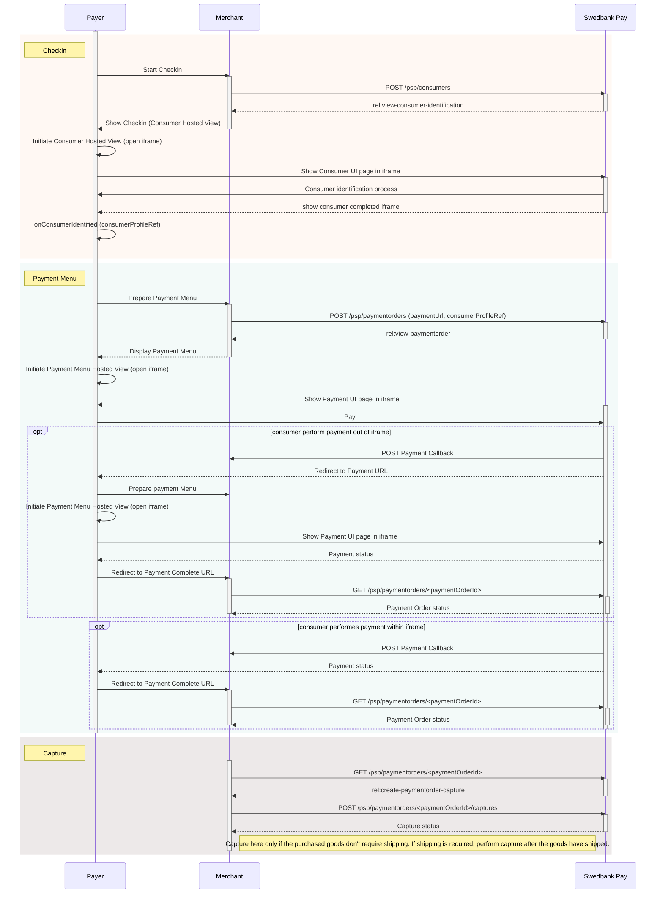





Swedbank Pay Checkout allows your customers to be identified with Swedbank Pay,
enabling existing Swedbank Pay Checkout users to pay with their favorite payment
methods in just a few simple steps.

## Prerequisites

To start integrating Swedbank Pay Checkout, you need the following:

* [HTTPS][https] enabled web server
* Agreement that includes Swedbank Pay Checkout
* Obtained credentials (merchant Access Token) from Swedbank Pay through
  Swedbank Pay Admin. Please observe that Swedbank Pay Checkout encompass
  both the **`consumer`** and **`paymentmenu`** scope.

## Introduction

To get started with Swedbank Pay Checkout, you should learn about its different
components and how they work together. Swedbank Pay Checkout consists of two related,
but disconnected concepts: **Checkin** and **Payment Menu**. Checkin identifies
the consumer in our Consumer API and Payment Menu completes the payment with
our Payment Menu API. Connect the two concepts and you have Swedbank Pay Checkout.

### Payment Url

For our hosted views solution in Checkout (using
[Payment Order][payment-order]), we have a URL property called `paymentUrl`
that will be used if the consumer is redirected out of the hosted view
(the `iframe`). The consumer is redirected out of `iframe` when selecting
payment methods Vipps or in the 3D secure verification for credit card
payments.

The URL should represent the page of where the payment hosted view was hosted
originally, such as the checkout page, shopping cart page, or similar.
Basically, `paymentUrl` should be set to the same URL as that of the page
where the JavaScript for the hosted payment view was added to in order to
initiate the payment. Please note that the `paymentUrl` must be able to invoke
the same JavaScript URL from the same Payment or Payment Order as the one that
initiated the payment originally, so it should include some sort of state
identifier in the URL. The state identifier is the ID of the order, shopping
cart or similar that has the URL of the Payment or Payment Order stored.

If `paymentUrl` is not supplied, retry of payments will not be possible in
[Payment Order][payment-order], which makes it more tedious to retry payment
as the whole process including the creation of the payment order needs to
be performed again.

With `paymentUrl` in place, the retry process becomes much more convenient for
both the integration and the payer.

[https]: /#connection-and-protocol
[payment-order]: #
